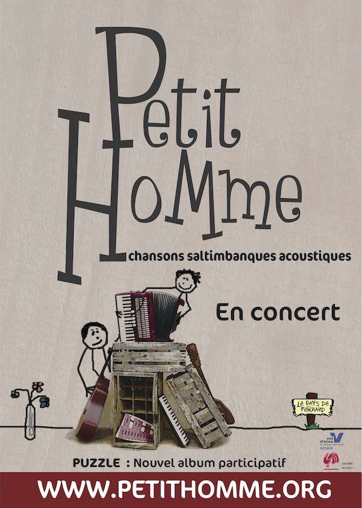
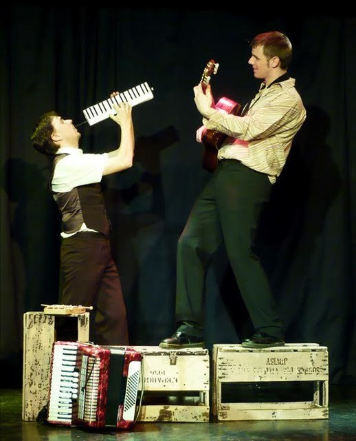

+++
type = "post"
titre = "Petit Homme à l&rsquo;Espace Jemmapes (18 septembre 2009)"
title = "Petit Homme à l'Espace Jemmapes (18 septembre 2009)"
url = "/petit-homme-espace-jemmapes"
date = "2009-09-19T02:10:54"
Lastmod = "2009-09-19T09:31:51"
cover = ""
categorie = [ "À voir… en live" ]
tag = [ "Chanson française", "Concert", "Espace Jemmapes" ]
annee = [ "2009" ]
weight = 2009
pays = [ "France" ]

+++

Je n&rsquo;ai encore jamais eu l&rsquo;occasion de parler de <a href="http://petithomme.org/index.php">Petit Homme</a> ici, mais cette erreur sera vite comblée. Et je commence d&rsquo;ailleurs avec le concert qu&rsquo;ils ont donné à l&rsquo;occasion de la sortie de <em>Puzzle</em>, leur second album — j&rsquo;aurai l&rsquo;occasion d&rsquo;en reparler —, à l&rsquo;espace Jemmapes à Paris.

Petit Homme est un duo composé de Damien, chanteur/guitariste et de Fred, homme à tout faire, tantôt accordéoniste, tantôt flutiste et même rappeur. À l&rsquo;origine, le groupe était composé d&rsquo;un batteur et d&rsquo;un bassiste, mais la formation fonctionne très bien dans cette configuration. La complicité entre les deux hommes est évidente, et fait plaisir à voir. Ils sont manifestement contents d&rsquo;être là, et partagent ce plaisir avec les spectateurs.

Devant un parterre constitué essentiellement de fans et de famille, le groupe paraît assez décontracté, fait des blagues sur des connaissances dans la salle quand ce n&rsquo;est pas le père du chanteur qui se lève pour réclamer une chanson, faute de quoi il serait définitivement renié de la famille. Bref, une bonne ambiance façon famille qui est, là aussi, plutôt agréable.

Petit Homme se définit comme un groupe de &laquo;&nbsp;chansons saltimbanques acoustiques&nbsp;&raquo;. À dire vrai, la musique du groupe n&rsquo;est pas toujours évidente à situer, ce qui fait son intérêt à mes yeux (enfin, surtout mes oreilles). Sur certains titres, le côté chanson française traditionnelle avec le couple guitare sèche/accordéon est sans conteste présent. Mais si les morceaux respectent généralement la structure type couplet/refrain, on note quelques libertés bienvenues, surtout sur scène. Certains morceaux s&rsquo;étirent en longueur pour faire place à une chorégraphie par exemple.

Musicalement, le groupe tient parfaitement la route. Il ne s&rsquo;agit vraiment pas d&rsquo;un groupe amateur, du genre qui pullule lors de la fête de la musique, mais bien d&rsquo;un groupe professionnel. Les chants sont justes, les instruments sans fausse note et l&rsquo;espace sonore bien occupé malgré les faibles moyens mis en œuvre. Néanmoins, il reste l&rsquo;ambiance bonne enfant signalée précédemment, quand Damien peste contre les fils qui s&rsquo;emmêlent ou nous expliquent qu&rsquo;il n&rsquo;a aucune idée de la chanson suivante et qu&rsquo;il a un pense-bête collé à terre.

Un concert de Petit Homme est aussi très visuel. La mise en scène est très simple, mais originale et efficace. Ainsi, quelques caisses sont disposées sur la scène et en permanence éclairées par des LED. On trouve aussi un vase avec une rose quasiment fanée. Rien de complexe donc, mais de quoi donner une identité au groupe. Les deux compères ne sont pas en reste et ils bougent sur scène, le temps d&rsquo;une impressionnante chorégraphie ou d&rsquo;un improbable morceau de rap à la guitare classique. Le groupe a fait appel à un metteur en scène, et le résultat est probant.

Sans doute suis-je influencé par le fait que je connais depuis quelques années déjà Fred, mais je crois vraiment que Petit Homme devrait être vu par plus que les amis et la famille. Certes, ils ne créent pas un genre radicalement nouveau, mais après tout cela se saurait si on pouvait constamment réinventer les choses. Les chansons de Petit Homme sont dotées d&rsquo;une pointe d&rsquo;originalité qui en fait tout le charme, avec des textes souvent amusants. En outre, leur volonté d&rsquo;innover dans le domaine de la musique avec <em>Puzzle</em>, leur dernier album, doit être saluée. Je reviendrai sur le sujet à l&rsquo;occasion d&rsquo;un autre billet&#8230;

Un mot quand même sur la première partie, <a href="http://www.myspace.com/3minutessurmer">3 minutes sur mer</a>. C&rsquo;est, là encore, un duo, mais assez atypique. Leur partie a commencé très classiquement, guitare et accordéon, et je me suis dit que l&rsquo;on allait avoir un groupe fort classique, dans la veine chanson française traditionnelle. Et peu à peu, le groupe s&rsquo;est révélé. Le chanteur est fascinant, il est parcouru de mimiques et petits gestes. Son acolyte à la guitare joue des boucles pour composer des bandes sonores qui portent le chant. La musique est originale, parfois carrément timbrée, à l&rsquo;image des textes d&rsquo;ailleurs. On pense à Nosfell pour le duo et le côté dansant, mais aussi, pour le chant, à Louise Attaque parfois et Noir Désir d&rsquo;autres fois. Autant de références qui m&rsquo;ont conduit à acheter leurs deux premiers EP. Un groupe à suivre de très près à mon avis&#8230;

