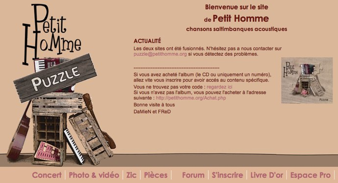
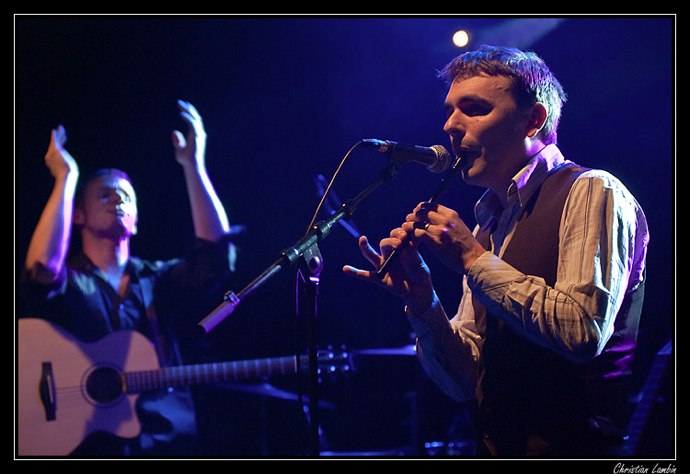
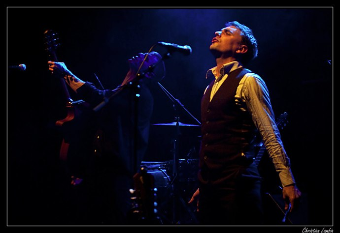
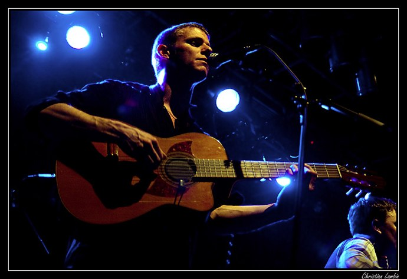

+++
type = "post"
titre = "Petit Homme, la musique participative"
title = "Petit Homme, la musique participative"
url = "/petit-homme-musique-participative"
date = "2010-04-10T00:59:14"
Lastmod = "2010-04-10T01:10:52"
cover = "petit-homme.jpg"
categorie = [ "Musique" ]
tag = [ "Chanson française", "Dématérialisation", "Interview" ]
annee = [ "2010" ]
weight = 2010
pays = [ "France" ]

+++

Combien de fois a-t-on annoncé la mort du CD ? Pourtant, les albums ont la vie dure et force est de constater que les CD continuent tranquillement leur existence. Pourtant, il ne faudrait pas nier qu&rsquo;il subit de sérieux revers depuis de nombreuses années. Je ne veux pas évoquer ici le piratage, mais la dématérialisation avance effectivement à grands pas et elle remet en cause le concept même de l&rsquo;objet. À quoi bon un bout de plastique fragile et rayable qu&rsquo;il faut sortir pour acheter, ou attendre de recevoir par le courrier, quand Internet offre instantanément des fichiers utilisables immédiatement sur les lecteurs de musique ou téléphones modernes. La facilité d&rsquo;utilisation et la rapidité expliquent sans doute en grande part l&rsquo;extraordinaire succès qu&rsquo;a connu iTunes, premier disquaire aux États-Unis, devant Amazon, et ce, <a href="http://arstechnica.com/apple/news/2008/04/apple-passes-wal-mart-now-1-music-retailer-in-us.ars">depuis déjà deux ans</a> (gageons que l&rsquo;écart s&rsquo;est creusé depuis).

Certains artistes ont d&rsquo;ores et déjà annoncé la mort du CD en tant qu&rsquo;objet physique même si, à l&rsquo;image de Radiohead, ils finissent souvent par y revenir, le succès aidant. Mais d&rsquo;autres continuent de croire au CD, et au-delà à l&rsquo;album. <a href="http://puzzle.petithomme.org/index.php">Petit Homme</a>, groupe de chanson française que je suis depuis de nombreuses années et que j&rsquo;avais eu l&rsquo;occasion de défendre au détour d&rsquo;<a href="/2009/09/19/petit-homme-espace-jemmapes/">un concert</a>, propose une voie alternative. Leur second album se nomme <em>Puzzle</em>, c&rsquo;est un CD bien réel, dans une pochette en carton, avec un vrai livret en papier. Mais le disque ne contient à l&rsquo;achat que cinq titres et sur la galette se trouve une petite zone à gratter qui révèle un code.

Ce code permet de télécharger la suite de l&rsquo;album. <em>Puzzle</em> n&rsquo;est pas un EP, c&rsquo;est un vrai album, mais un album en devenir, comme un puzzle incomplet. Les pièces manquantes peuvent se télécharger sur le site officiel, après avoir obtenu un code, récupéré sur un CD ou <a href="http://puzzle.petithomme.org/Achat.php">acheté directement</a> sur le site officiel. Après inscription sur le site, vous pouvez accéder à la partie &laquo;&nbsp;Pièces&nbsp;&raquo; où se trouvent tous les morceaux de l&rsquo;album actuellement disponibles. Pour l&rsquo;heure, les cinq titres du CD sont disponibles au téléchargement, mais aussi un titre supplémentaire, &laquo;&nbsp;De la Poupe&nbsp;&raquo;, sixième titre de l&rsquo;album. D&rsquo;autres sont en train d&rsquo;être enregistrés ou sont prévus, et le groupe profite de ses concerts pour améliorer les morceaux. Les titres sont disponibles au téléchargement en MP3, en WAVE et même sous forme de tablatures accompagnées de paroles pour les guitaristes en herbe.

Connaissant un des membres du duo qui compose Petit Homme, je me suis dit que je pourrais leur faire un peu de place ici pour qu&rsquo;ils expriment sur <em>Puzzle</em> et sur le concept de participation qu&rsquo;ils ont imaginé pour cet album…

<h4 style="text-align: justify;">Moi : <em>Puzzle</em> se veut le premier album évolutif. Pour cet album la liste complète des titres est déjà connue, on en trouve les paroles sur le livret. Est-ce que vous envisagez de faire néanmoins évoluer cette liste ?</h4>

<strong>Petit Homme</strong> : La liste complète n’est connue que de nous-mêmes. Il reste néanmoins quelques surprises. Nous ne dévoilons actuellement sur scène ou sur le livret que 80 % du <em>Puzzle</em>. Par exemple, certains morceaux du livret ne sont pas encore joués en public ou inversement. Depuis la sortie de septembre, un titre supplémentaire est déjà disponible au téléchargement et deux autres le seront dans quelques semaines (le mixage est en cours).

<h4 style="text-align: justify;">Pouvez-vous expliquer le principe de la participation ?</h4>

Elle sera double. Tout d’abord sur la partie financière, l’achat de l’album permet d’avoir les titres déjà enregistrés, mais aussi de participer financièrement aux enregistrements futurs. Pour la partie relationnelle, le public sera sollicité pour de nombreux choix pour la suite du puzzle comme l’ordre d’enregistrement, le type (live ou studio), la proposition d’intervenants, entres autres. Le but est d’investir les gens dans la production de <em>Puzzle</em> et sa promotion. Nous garderons bien sûr les choix artistiques. Les deux derniers titres enregistrés (&laquo;&nbsp;monsieur&nbsp;&raquo; et &laquo;&nbsp;tête de piaf&nbsp;&raquo;) ont été, par exemple, choisis par la communauté puzzle quinze jours avant de rentrer en studio.

<h4 style="text-align: justify;">On voit des groupes annoncer l&rsquo;arrêt des CD d&rsquo;autres s&rsquo;y tenir, mais on n&rsquo;avait jamais vu un groupe sortir une partie d&rsquo;un CD et promettre aux acheteurs la suite. Pourquoi avoir choisi cette formule originale ?</h4>

Nos choix de productions ont toujours été liés à notre vision du marché musical. Nous avons proposé à l’époque en téléchargement gratuit notre précédent album tout en le vendant au concert. Nous sommes les uniques détenteurs d’un contrat SACEM spécifique nous permettant de conserver nos droits sur Internet. Nous avons donc décidé de produire <em>Puzzle</em> en réponse aux difficultés liées à l’autoproduction (financement, temps) et pour créer un véritable lien avec notre public.

<h4 style="text-align: justify;">Croyez-vous toujours à l&rsquo;album ?</h4>

L’album permet de marquer une époque pour un groupe. On se souvient tous de l’époque du <em>Black Album</em> de Metallica ou de <em>666.667 Club</em> de Noir Désir. L’album a aussi un réel intérêt lorsque les titres appartiennent au même ensemble comme l&rsquo;avant-dernier album de Tété ou les derniers de Dionysos ou –M–. Mais l’idée de faire des albums de cinq titres peut aussi se justifier. Nos premières expériences sur notre album nous montrent une légère réticence sur cinq titres. Le public n’est pas encore habitué à un format court. Mais bon, la nouvelle n’a pas tué le roman.

<h4 style="text-align: justify;">Avez-vous ressenti la mort du CD prévue à droite ou à gauche à travers cette première expérience ?</h4>

Nous voyons surtout l’attachement du public à un support physique, mais un vrai support physique artistique, pas une clef USB avec des MP3 dessus.

<h4 style="text-align: justify;">Que pensez-vous de l&rsquo;idée d&rsquo;Apple et des majors de relancer les ventes d&rsquo;albums grâce à du contenu additionnel sous la forme des <a href="http://www.igen.fr/itunes/itunes-lp-les-albums-reinventes-8950">iTunes LP</a> ? Est-ce que vous envisageriez de faire autant pour Petit Homme ? En terme de contenu, vous proposez déjà les paroles et vous avez l&rsquo;habitude de présenter de nombreuses vidéos sur Internet.</h4>

De la même manière qu’un album a un intérêt s’il est construit en temps que tel, iTunes LP n’apportera quelque chose que si le contenu fait partie intégrante de l’album. Il est donc intéressant, mais ne doit pas être systématique. Pour notre part, iTunes LP n’apporterait aucune plus value à notre travail, car nous proposons déjà de nombreux bonus. Par exemple, trois vidéos des séances d’enregistrements des cinq premiers titres de <em>Puzzle</em> sont disponibles.

<h4 style="text-align: justify;">Le groupe avait essayé des idées originales de distribution, notamment par le biais de <a href="http://www.jamendo.com/fr/">Jamendo</a>. Ce système n&rsquo;était pas viable ?</h4>

Le public n’est pas prêt à contribuer financièrement au téléchargement d’un album sur Internet. Le pourcentage de personne ayant payé notre album est de moins de 1 %. En dehors d’un groupe médiatisé comme Radiohead, le don libre est encore à ses débuts.

Difficile d&rsquo;établir dès maintenant un bilan de cette expérience que je trouve à tout le moins intéressante. Sans compter que la musique de Petit Homme est l&rsquo;une des rares dans le genre de la chanson française plus &laquo;&nbsp;traditionnelle&nbsp;&raquo; que j&rsquo;apprécie autant, et je ne dis pas ça parce que je connais l&rsquo;accordéoniste/multi-instrumentiste<a href="#footnote_0_3165" id="identifier_0_3165" class="footnote-link footnote-identifier-link" title="M&ecirc;me si, je dois l&rsquo;avouer, je lui ai demand&eacute; une pile d&rsquo;autographes, pour les revendre sur eBay le jour o&ugrave; ils seront devenus c&eacute;l&egrave;bres. Ah ben il faut &ecirc;tre pr&eacute;voyant dans la vie&hellip;">1</a> ! Sur disque, on apprécie leurs chansons vivantes, souvent joyeuses et dotées de textes qu&rsquo;ils qualifient eux-mêmes d&rsquo;épicés. Mais c&rsquo;est sur scène que le groupe se révèle vraiment : la complicité entre les deux est communicative et on en sort le sourire aux lèvres.

D&rsquo;ailleurs, pour vous en convaincre, le groupe monte sur scène samedi prochain, le 17 avril, pour enregistrer une nouvelle pièce du <em>Puzzle</em>, entre autres ! Le concert aura lieu à 21 heures sur la péniche El Alamein, au pied de la BNF, quai François Mauriac. Si vous ne rêvez que d&rsquo;enregistrer votre voix sur un album, ce sera le bon moment pour hurler votre joie !

<strong>Petit Homme</strong> : <a href="http://puzzle.petithomme.org/index.php">site officiel</a> | <a href="http://www.facebook.com/pages/Petit-Homme/22019494683?ref=ts">Facebook</a> | <a href="http://www.facebook.com/event.php?eid=104778629552587&amp;index=1">Concert sur Facebook</a>

<em>La copie d&rsquo;écran du site officiel mise à part, toutes les photos sont <a href="http://lambin95.free.fr/photos/index.php?/category/141">© Christian Lambin</a> et ont été prises au concert de Petit Homme au forum de Vauréal, en janvier 2010.</em>

<ol class="footnotes"><li id="footnote_0_3165" class="footnote">Même si, je dois l&rsquo;avouer, je lui ai demandé une pile d&rsquo;autographes, pour les revendre sur eBay le jour où ils seront devenus célèbres. Ah ben il faut être prévoyant dans la vie… [<a href="#identifier_0_3165" class="footnote-link footnote-back-link">&#8617;</a>]</li></ol>
