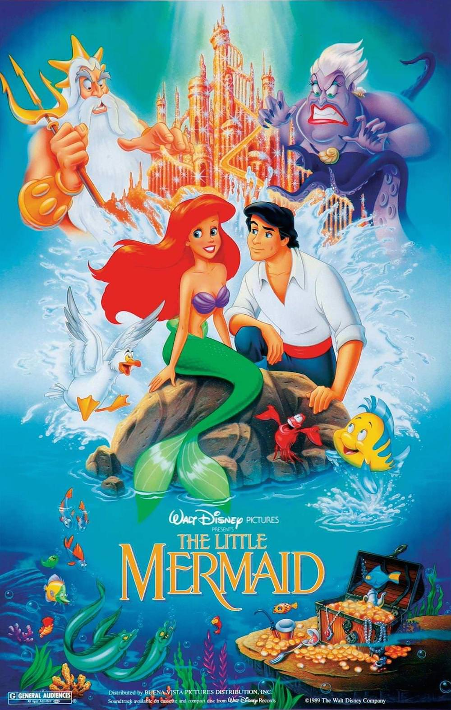
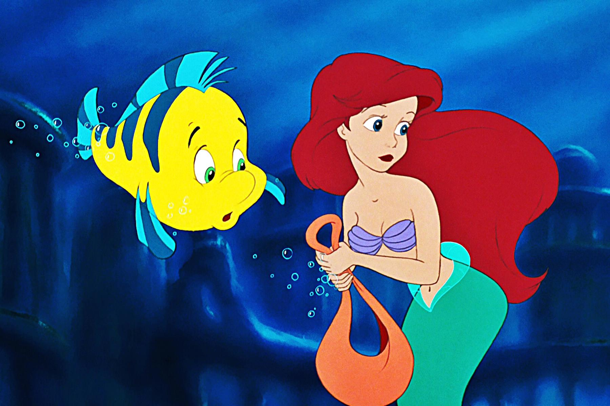
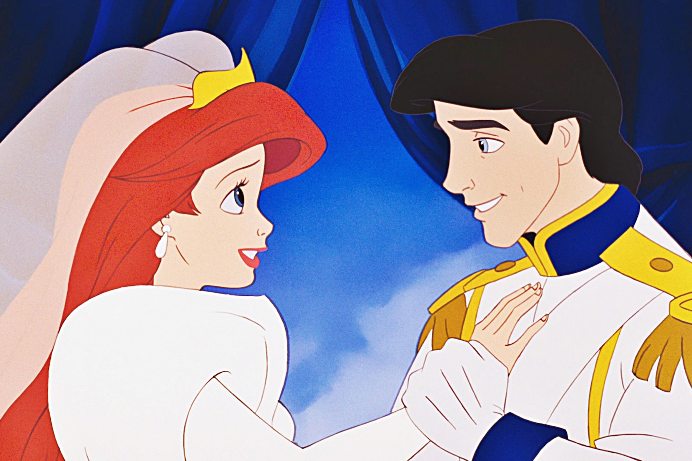

+++
titre = "<em>La Petite Sirène</em>, Ron Clements et John Musker"
title = "La Petite Sirène, Ron Clements et John Musker"
url = "/petite-sirene-clements-musker"
date = "2014-05-31T11:30:57"
Lastmod = "2014-05-31T11:28:44"
cover = "la-petite-sirene-clements-musker.jpg"
categorie = [ "À voir" ]
tag = [ "Adaptation littéraire", "Amour", "Animation", "Animaux", "Comédie musicale", "Conte", "Drame", "Famille" ]
createur = [ "John Musker", "Ron Clements", "Walt Disney" ]
annee = [ "1989" ]
weight = 1989
saga = [ "Classiques d'animation Disney" ]
pays = [ "États-Unis" ]
original = "The Little Mermaid"

+++

Pour les studios d&rsquo;animation Disney, <em>La Petite Sirène</em> est leur dernière carte. Après des années difficiles, avec quelques succès commerciaux certes, mais dépourvues de classiques dignes des premiers chef-d&rsquo;œuvres, la branche animation est sur le point de fermer, ou plutôt de se recentrer sur les petites séries qui commencent à très bien fonctionner à la télévision. Pourtant, le succès de <a href="http://voiretmanger.fr/basil-detective-prive-clements-mattinson-michener-musker/" title="Basil, détective privé, Ron Clements, Burny Mattinson, David Michener et John Musker"><em>Basil, détective privé</em></a>, sorti en 1986, permet de laisser au studio une nouvelle chance et les dirigeants d&rsquo;alors décident d&rsquo;offrir une vraie chance en misant tout sur un film aussi ambitieux qu&rsquo;à la grande époque. Plus ambitieux, même, puisque le vingt-huitième <a href="http://voiretmanger.fr/saga/classiques-danimation-disney/">classique Disney</a> est le plus coûteux de l&rsquo;histoire du studio à sa sortie. Dernier film d&rsquo;animation à utiliser les techniques traditionnelles de dessin, c&rsquo;est aussi le premier d&rsquo;une longue série. Entre retour au conte et nouvelles idées, Ron Clements et John Musker posent avec <em>La Petite Sirène</em> les bases du renouveau du studio d&rsquo;animation. Ils marquent ainsi durablement le studio — c&rsquo;est encore eux qui ont réalisé <a href="http://voiretmanger.fr/princesse-grenouille-walt-disney/" title="La Princesse et la grenouille, John Musker et Ron Clements"><em>La Princesse et la grenouille</em></a>, plus de vingt ans plus tard — et composent au passage un classique qui n&rsquo;a pas pris une ride.

En adaptant un conte européen du XIXe siècle, les studios Disney semblent d&rsquo;abord revenir à leurs origines. Plus de cinquante ans après la sortie de <a href="http://voiretmanger.fr/blanche-neige-sept-nains-hand/" title="Blanche-Neige et les sept nains, David Hand"><em>Blanche-Neige et les sept nains</em></a> qui ouvrait cette tradition des adaptations européennes et exactement trente ans après le dernier conte adapté — c&rsquo;était <a href="http://voiretmanger.fr/belle-bois-dormant-geronimi/" title="La Belle au bois dormant, Clyde Geronimi"><em>La Belle au bois dormant</em></a>, en 1959 —, un classique va à nouveau chercher dans les contes. Celui de Hans Christian Andersen qui est à la base de <em>La Petite Sirène</em> n&rsquo;a pas été découvert récemment par le studio, au contraire même. Le projet de l&rsquo;adapter remonte à la fin des années 1930, aux origines de Disney presque. Le projet avait alors été abandonné pour diverses raisons, la principale étant sans doute financière : raconter l&rsquo;histoire d&rsquo;Ariel, une sirène, est très ambitieux et le studio affronte les années 1940 avec des revenus réduits à cause de la Seconde Guerre mondiale. Fin des années 1980, les équipes en charge de Disney sentent que le studio d&rsquo;animation est à nouveau dans une impasse. Les finances ne sont plus trop un problème, mais aucun classique récent n&rsquo;a su attirer les foules et les derniers longs-métrages n&rsquo;ont plus l&rsquo;ambition d&rsquo;autrefois. Pour relancer la machine, quoi de plus naturel qu&rsquo;un conte traditionnel ? Pourtant, à première vue, Ron Clements et John Musker ne s&rsquo;attaquent pas au plus facile avec cette histoire d&rsquo;amour impossible qu&rsquo;il a fallu embellir et lui greffer une fin heureuse. Quoi qu&rsquo;il en soit, <em>La Petite Sirène</em> retrouve une profondeur dans le propos qui pouvait manquer à ses prédécesseurs et si les animaux sont toujours présents et parlants, les humains retrouvent la première place, même si c&rsquo;est souvent sous la forme de sirène. Un retour aux sources qui fait du bien au long-métrage, tout en relançant le mythe de la princesse, largement oublié par le studio. C&rsquo;est aussi pour cela que l&rsquo;on a tant l&rsquo;impression de voir une renaissance : sur de nombreux points, Walt Disney semble retrouver sa première vocation avec cette adaptation d&rsquo;un conte traditionnel.

Sur le plan technique aussi, <em>La Petite Sirène</em> crée une rupture. Ce n&rsquo;est pas forcément du côté de l&rsquo;animation à proprement parler qu&rsquo;il faut chercher les nouveautés, même si le vingt-huitième classique est intéressant pour être le dernier à être entièrement réalisé à l&rsquo;ancienne, sur du papier. Certaines séquences, dont une dans un escalier qui se repère facilement, ont été dessinées par un ordinateur, mais tout le travail de peinture a entièrement été réalisé à la main. Quand on pense aux séquences sous-marines et aux milliers de bulles que l&rsquo;on peut voir, on se dit que ce n&rsquo;était pas une mince affaire. De fait, le long-métrage réalisé par Ron Clements et John Musker est le plus ambitieux du studio, et celui qui a coûté le plus cher à réaliser à sa sortie. Un pari dangereux pour Disney, mais on voit bien que l&rsquo;entreprise qui gagne désormais de l&rsquo;argent aussi avec la télévision et ses parcs d&rsquo;attraction a tout misé sur ce nouvel opus. Paradoxalement, les dessins ne sont pas aussi travaillés que par le passé et notamment pour les personnages qui sont dessinés de manière assez simples. Sur ce point, les animateurs ont opté pour une simplicité plutôt bien vue : quand on revoit le film aujourd&rsquo;hui, l&rsquo;âge du film ne se sent pas et on pourrait très bien imaginer qu&rsquo;il vient de sortir, à quelques détails près. Une belle performance, mais la plus grosse nouveauté n&rsquo;est pas visuelle, mais auditive. Pour la première fois dans l&rsquo;histoire du studio, les chansons ne sont pas là simplement parce qu&rsquo;il faut faire chanter les personnages, mais pour faire avancer l&rsquo;action. À l&rsquo;image d&rsquo;une comédie musicale, <em>La Petite Sirène</em> exploite les chansons non seulement pour évoquer une situation, mais aussi comme moyen d&rsquo;avancer dans le récit. On voit ainsi Ariel qui se demande si elle veut devenir humaine et abandonner sa condition de sirène pour retrouver son prince, et c&rsquo;est la chanson qui la décide. Plus tard, c&rsquo;est la sorcière Ursula qui dévoile son plan en chanson et le met en œuvre pendant qu&rsquo;elle chante. Cela peut nous sembler tout à fait banal aujourd&rsquo;hui et pour cause, tous les films d&rsquo;animation sortis depuis en font autant. À l&rsquo;époque toutefois, c&rsquo;était une vraie nouveauté et c&rsquo;est sans conteste la plus importante pour le studio.

Porté par une histoire de princesse classique, mais bien menée, <em>La Petite Sirène</em> est un classique qui se regarde avec encore beaucoup de plaisir. La méchante est ici terrifiante à souhait et les enjeux sont vraiment dramatiques : Ariel doit-elle abandonner sa famille pour retrouver un ennemi naturel ? Ron Clements et John Musker trouvent le ton juste et le bon rythme et composent un grand classique, un de ceux qui ont attiré des millions de spectateurs dans les salles et qui conservent toujours autant de succès avec les années. <em>La Petite Sirène</em> est indémodable : à voir et à revoir !

<h3>Vous voulez <a href="http://voiretmanger.fr/soutien/">m&rsquo;aider</a> ?</h3>
<ul>
<li><a href="http://www.amazon.fr/gp/product/B00DE6NGOO/ref=as_li_ss_tl?ie=UTF8&amp;tag=leblogdenic07-21&amp;linkCode=as2&amp;camp=1642&amp;creative=19458&amp;creativeASIN=B00DE6NGOO">Acheter le film en Blu-ray sur Amazon</a></li>
<li><a href="http://www.amazon.fr/gp/product/B00GS0X9CC/ref=as_li_ss_tl?ie=UTF8&amp;tag=leblogdenic07-21&amp;linkCode=as2&amp;camp=1642&amp;creative=19458&amp;creativeASIN=B00GS0X9CC">Acheter le film en DVD sur Amazon</a></li>
<li><a href="https://itunes.apple.com/fr/movie/la-petite-sirene/id705684208">Acheter ou louer le film sur l&rsquo;iTunes Store</a></li>
</ul>

