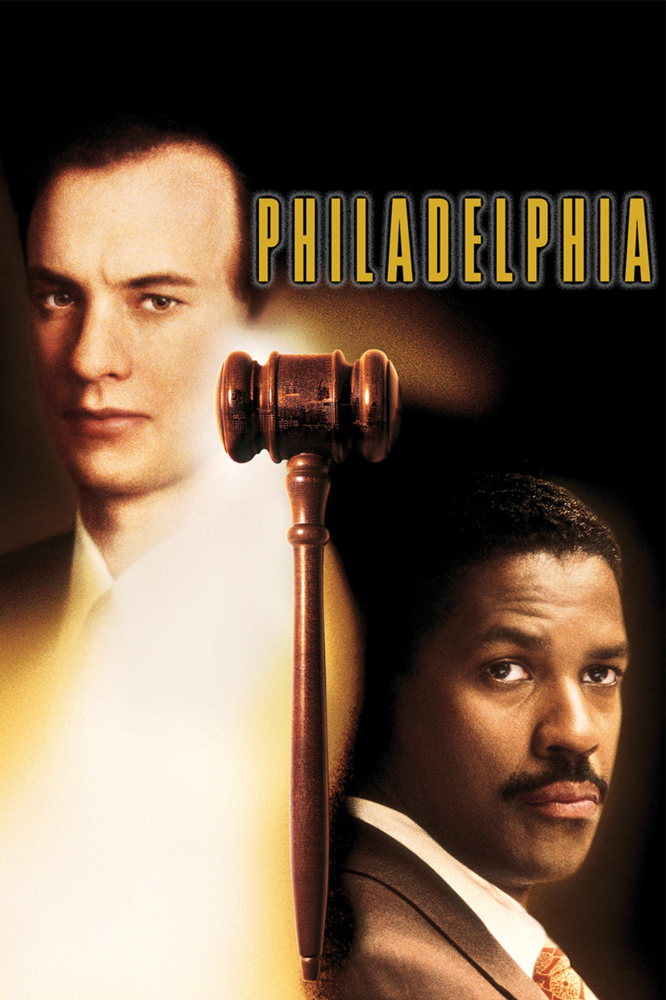
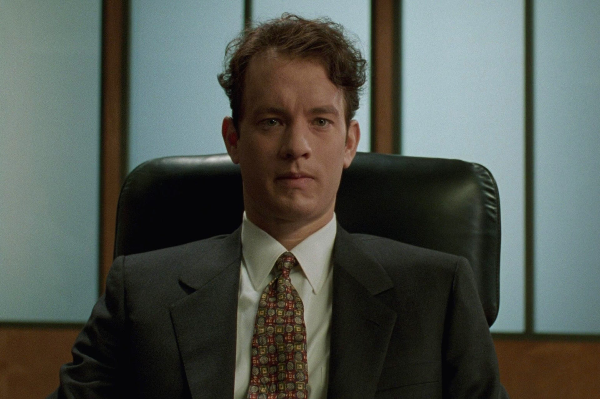
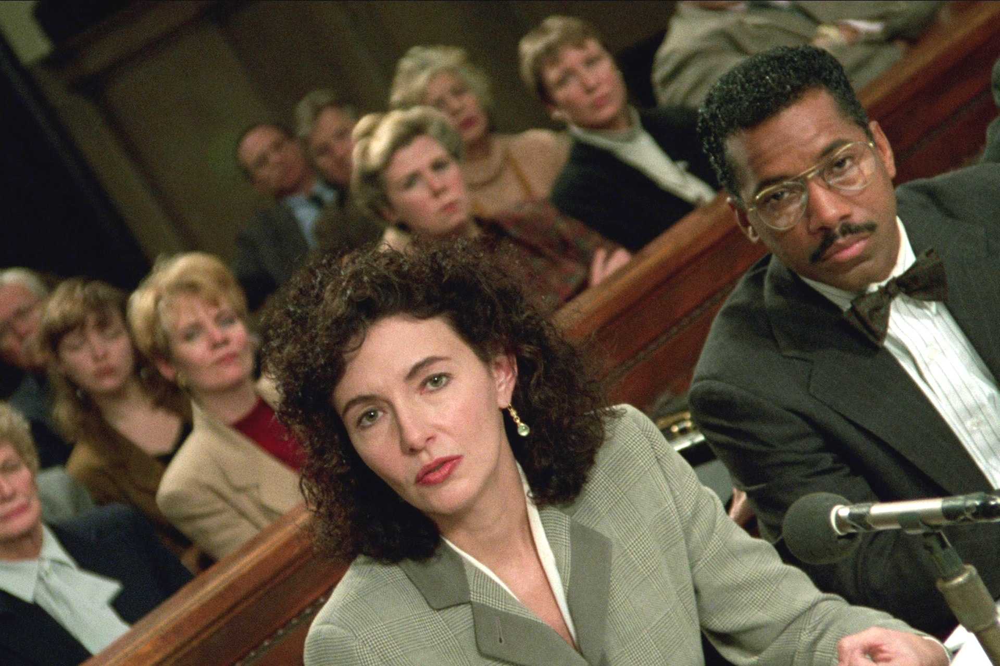

+++
type = "post"
titre = "<em>Philadelphia</em>, Jonathan Demme"
title = "Philadelphia, Jonathan Demme"
url = "/philadelphia-demme"
date = "2014-11-11T20:10:29"
Lastmod = "2014-12-12T11:36:01"
cover = "philadelphia-tom-hanks-denzel-washington.jpg"
categorie = [ "À voir" ]
tag = [ "Amour", "Clichés", "Drame", "Famille", "Homosexualité", "Justice", "Maladie", "Mort", "Procès", "SIDA", "Société" ]
createur = [ "Jonathan Demme" ]
acteur = [ "Antonio Banderas", "Denzel Washington", "Jason Robards", "Mary Steenburgen", "Tom Hanks" ]
annee = [ "1994" ]
weight = 1994
pays = [ "États-Unis" ]

+++

Sorti à une époque où l&rsquo;on commençait à peine à connaître le SIDA, mais où on était encore loin de savoir comment combattre cette maladie qui emportait toujours les malades à une vitesse folle, <em>Philadelphia</em> reste d&rsquo;abord comme un film symbolique. C&rsquo;est la première fois que Hollywood évoque de manière aussi frontale cette maladie associée à l&rsquo;homosexualité, c&rsquo;est la première fois que l&rsquo;industrie du cinéma américaine traite de l&rsquo;homosexualité de manière aussi frontale, même si c&rsquo;est encore de manière très timide, on le verra. Au-delà des symboles, Jonathan Demme signe un long-métrage qui tient à la fois au film de procès et au drame familial. Un mélange des genres qui lui réussit bien : <em>Philadelphia</em> est un film qui sait être particulièrement touchant, mais qui est aussi plein de tensions quant à l&rsquo;issue du procès. Une belle réussite, portée par deux acteurs déjà exceptionnels.

D&rsquo;emblée, <em>Philadelphia</em> pose deux informations essentielles pour le procès qui s&rsquo;ouvrira plus tard dans le film. En deux scènes, Jonathan Demme résume son film et son personnage principal : Andrew Beckett, dit Andy, est un jeune avocat brillant qui gagne tous ses procès, à la grande joie du cabinet qui la recruté. Passé le générique qui présente la ville sur une chanson originale composée par Bruce Springsteen<a href="#fn-12384-1" rel="footnote">1</a>, on découvre Andy contre un avocat sur un sujet quelconque. Ce n&rsquo;est pas le sujet qui est intéressant, mais le cinéaste montre bien que son personnage principal est talentueux… juste avant de nous le présenter dans un tout autre cadre. La scène suivante de <em>Philadelphia</em> prend place dans un hôpital, où Andy attend des résultats d&rsquo;analyse sanguine et si le scénario est très discret, c&rsquo;est d&rsquo;ailleurs l&rsquo;un de ses points forts pendant deux heures, on comprend vite de quoi il retourne. En pleine crise du SIDA, on comprend que ce jeune avocat talentueux est dépisté pour savoir s&rsquo;il souffre de cette maladie et <em>Philadelphia</em> ne laisse guère de place au doute : il en souffre bien. À partir là, le scénario déplie méthodiquement le récit : le cabinet d&rsquo;avocat le licencie prétextant de mauvais résultats et Andy les poursuit pour licenciement abusif. Si vous n&rsquo;avez jamais vu le film et que vous ne connaissez pas l&rsquo;histoire, mieux vaut ne pas aller plus loin, mais on se doute assez vite que le film de Jonathan Demme ne peut pas se conclure sur un happy-end. C&rsquo;est l&rsquo;histoire d&rsquo;une lutte et c&rsquo;est une histoire qui se termine avec une victoire… largement attristée par cette maladie que l&rsquo;on ne savait pas traiter. <em>Philadelphia</em> n&rsquo;est pas qu&rsquo;une histoire de procès, c&rsquo;est aussi le récit très touchant de la survie d&rsquo;un homme qui se sait condamné et une histoire d&rsquo;amour extrêmement discrète entre cet homme et son amant. On disait en préambule, c&rsquo;est la première fois que Hollywood montrait l&rsquo;homosexualité de manière frontale. C&rsquo;est un peu exagéré : les deux hommes ne s&rsquo;embrassent jamais, tout au plus les verra-t-on danser ensemble, le film reste extrêmement timide. Quelques scènes plus suggestives ont été tournées, mais coupées au montage, preuve que l&rsquo;évolution des mœurs est lente : en 1993, on peut suggérer, mais guère plus. Ce n&rsquo;est pas grave, car avec aussi peu de matière, Jonathan Demme parvient à raconter une histoire extrêmement touchante et il faut saluer au passage la prestation remarquable de son acteur. Tom Hanks était encore très jeune, mais il est déjà époustouflant dans ce rôle très difficile, amaigri et visiblement malade.

On peut le dire de toutes les œuvres naturellement, mais peut-être plus de celle-ci : <em>Philadelphia</em> est un témoignage de son époque, dans le sens où ce film marque une étape décisive dans le regard porté par la société sur le SIDA et l&rsquo;homosexualité. Jonathan Demme décrit aussi à merveille les clichés qui couraient à l&rsquo;époque sur ces deux minorités et le réalisateur montre bien à quel point elles étaient oppressées, comme pouvaient l&rsquo;être la minorité afro-américaine quelques années auparavant. D&rsquo;ailleurs, le choix d&rsquo;un avocat noir pour défendre Andy n&rsquo;est absolument pas anodin et le fait qu&rsquo;il revendique fièrement son homophobie dans un premier temps l&rsquo;est encore moins. Joe Miller est un type comme un autre, et dans les États-Unis des années 1990, cela veut dire quelqu&rsquo;un qui se méfie des gays, ces types qui mettent des robes et dont il faut à tout prix protéger les enfants. Comme tout le monde, il a vaguement dans l&rsquo;idée que le SIDA est forcément une maladie homosexuelle et que leur mode de vie qu&rsquo;il juge, lui aussi, un peu trop libre, pour ne pas dire dépravé, est la cause de cette maladie. Sans aller aussi loin que ces extrémistes qui revendiquent le SIDA comme une punition divine, Joe Miller pense lui aussi qu&rsquo;au fond, Andy l&rsquo;a peut-être bien mérité. Il n&rsquo;a pas fait attention, il a eu des rapports non protégés avec des étrangers et il n&rsquo;a eu que ce qu&rsquo;il mérite. En déroulant cette thèse, notamment au cours du procès, Jonathan Demme prend un parti assez gonflé, mais plutôt bien vu. <em>Philadelphia</em> est un film de procès et le scénario déroule tout l&rsquo;argumentaire pour mieux l&rsquo;inverser et nous faire réaliser l&rsquo;horreur de ces propos. C&rsquo;est courageux et dangereux, on pourrait mal comprendre l&rsquo;intention du scénario, d&rsquo;autant que ce film de plus de vingt ans est beaucoup plus subtil que bien des productions actuelles. Alors que l&rsquo;on n&rsquo;hésiterait pas à surligner ce qu&rsquo;il faut comprendre, le cinéaste parie sur l&rsquo;intelligence de ses spectateurs, tout comme l&rsquo;avocat parie sur l&rsquo;intelligence du jury. Le spectateur d&rsquo;aujourd&rsquo;hui peut constater les progrès effectués par la société, d&rsquo;autant que le SIDA n&rsquo;est plus cette maladie totalement incurable et inconnue décrite dans ce film, mais on retrouve aussi quelques clichés encore aujourd&rsquo;hui. Et au fond, ce procès entre une firme d&rsquo;avocat et un avocat licencié peut-être à tort, transformé en tribune en faveur de l&rsquo;égalité des homosexuels reste totalement d&rsquo;actualité. Peut-être pas de manière aussi frontale, en tout cas pas dans nos pays, mais ces questions restent toujours présentes. Et on le ressent avec toujours autant de force quand l&rsquo;avocat demande, à brûle-pourpoint, aux associés du cabinet d&rsquo;avocat qui ne s&rsquo;y attendaient pas du tout, s&rsquo;ils sont gays. Dans leurs yeux, on sent un trouble immense et ils ne savent plus répondre, ni où se mettre, comme si la réponse n&rsquo;était pas aussi évidente qu&rsquo;ils veulent bien le dire.

Deux acteurs vraiment excellents — on a parlé de Tom Hanks, il serait injuste de ne pas évoquer Denzel Washington qui est tout aussi bon dans son rôle d&rsquo;avocat homophobe trop tenté malgré tout par cette occasion de s&rsquo;attaquer à un grand cabinet —, une histoire passionnante inspirée d&rsquo;histoires vraies… <em>Philadelphia</em> avait tout pour plaire et Jonathan Demme ne s&rsquo;y est pas trompé. Sans prétendre au titre de chef-d&rsquo;œuvre du septième art, son long-métrage a marqué à l&rsquo;époque et fait avancer les esprits sur un sujet de société, mais il reste encore aujourd&rsquo;hui un très bon film. À voir !

<em>Merci <a href="https://twitter.com/nesussien">@Nesus</a> pour le cadeau.</em>

<h3>Vous voulez <a href="http://voiretmanger.fr/soutien/">m&rsquo;aider</a> ?</h3>
<ul>
<li><a href="http://www.amazon.fr/gp/product/B00O3LU7KA/ref=as_li_ss_tl?ie=UTF8&amp;tag=leblogdenic07-21&amp;linkCode=as2&amp;camp=1642&amp;creative=19458&amp;creativeASIN=B00O3LU7KA">Acheter le film en Blu-ray sur Amazon</a></li>
<li><a href="http://www.amazon.fr/gp/product/B000M05W1A/ref=as_li_ss_tl?ie=UTF8&amp;tag=leblogdenic07-21&amp;linkCode=as2&amp;camp=1642&amp;creative=19458&amp;creativeASIN=B000M05W1A">Acheter le film en DVD sur Amazon</a></li>
<li><a href="https://itunes.apple.com/fr/movie/philadelphia/id377261455">Acheter ou louer le film sur l&rsquo;iTunes Store</a></li>
</ul>

<ol>
<li id="fn-12384-1">
L&rsquo;ensemble de la <a href="http://www.amazon.fr/gp/product/B0000261CG/ref=as_li_ss_tl?ie=UTF8&amp;tag=leblogdenic07-21&amp;linkCode=as2&amp;camp=1642&amp;creative=19458&amp;creativeASIN=B0000261CG">bande-originale du film</a> est intéressante, pas forcément pour les titres composés par Howard Shore, mais plutôt pour les morceaux rassemblés pour le long-métrage. On y trouve Bruce Springsteen donc, mais aussi Neil Young et Peter Gabriel, tout de même…&#160;<a href="#fnref-12384-1" rev="footnote">&#8617;</a>
</li>
</ol>

