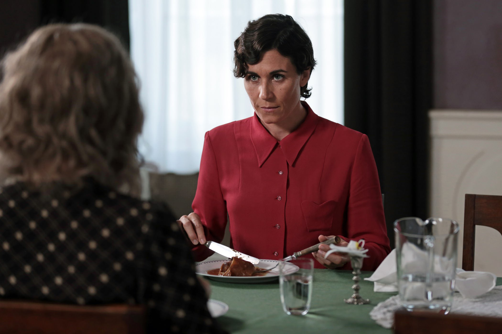

+++
type = "post"
titre = "<em>Phoenix</em>, Christian Petzold"
title = "Phoenix, Christian Petzold"
url = "/phoenix-petzold"
date = "2015-02-10T22:33:00"
Lastmod = "2015-02-10T22:38:15"
cover = "phoenix-christian-petzold.jpg"
categorie = [ "À voir" ]
tag = [ "Amour", "Apprentissage", "Drame", "Histoire", "Identité", "Shoah", "Sorties du mois" ]
createur = [ "Christian Petzold" ]
acteur = [ "Nina Hoss", "Nina Kunzendorf", "Ronald Zehrfeld" ]
pays = [ "Allemagne" ]

+++

À sa manière, <em>Phoenix</em> parle lui aussi de la Shoah, mais la dernière réalisation de Christian Petzold n&rsquo;est pas un film sur l&rsquo;holocauste juif. À partir du retour d&rsquo;une rescapée, le cinéaste allemand s&rsquo;appuie sur la tragédie pour construire un drame autour de l&rsquo;amour, mais aussi de l&rsquo;impossible nécessité du pardon, ou bien au moins de l&rsquo;oubli. L&rsquo;ensemble paraît bien complexe et peut-être rébarbatif, il n&rsquo;en est rien. Porté par une actrice exceptionnelle, <em>Phoenix</em> est un film passionnant de bout en bout, une vraie réussite.

Dès sa toute première scène, d&rsquo;une violence déjà extrême, <em>Phoenix</em> plante le décor. Allemagne, juste après la Seconde Guerre mondiale : le pays est encore marqué par les dégâts des combats et surtout des bombardements, mais la trace la plus terrible n&rsquo;est pas forcément visible. Les rescapés viennent de sortir des camps de concentration et ils doivent retrouver une vie aussi normale qu&rsquo;on pourrait l&rsquo;espérer dans la nouvelle société qui se met en place. Christian Petzold se base sur ce retour difficile avec son personnage principal, Nelly, qui fait partie de ces rescapés. Son visage a été presque complètement effacé au passage, on ne sait jamais pourquoi, mais on devine aisément que les Nazis lui ont fait subir cet ultime affront. Quand le film commence, elle est conduite par son amie Lene à une clinique spécialisée dans la reconstruction faciale, où l&rsquo;on découvre l&rsquo;ampleur de l&rsquo;horreur. Les médecins de cette clinique ne sont pas pris au dépourvu face à ce qui lui est arrivé, bien au contraire, ils recréent des visages à la chaîne, pour des dizaines de patients qui sont tous rescapés de la Shoah. Le chirurgien qui s&rsquo;occupe du visage de Nelly lui demande à quoi elle veut désormais ressembler et il lui propose quelques visages connus, des stars essentiellement. Tout l&rsquo;enjeu est là : ces femmes et ces hommes qui ont perdu toute humanité à cause des traitements des camps de concentration doivent se reconstruire une identité. Quelque part, c&rsquo;est une renaissance et le titre du film se lit déjà à ce niveau : <em>Phoenix</em>, c&rsquo;est le nouveau départ de tous ceux qui ont été détruits psychologiquement, voire physiquement, pendant la guerre.

Nelly ne veut pas d&rsquo;un autre visage toutefois, elle tient à retrouver <em>son</em> visage, celui qu&rsquo;elle a perdu pendant la guerre. C&rsquo;est que l&rsquo;héroïne de <em>Phoenix</em> a une idée bien précise en tête : elle veut retrouver Johnny, son mari qu&rsquo;elle n&rsquo;a pas revu depuis son arrestation. De fait, Christian Petzold ne veut pas d&rsquo;un film sur la Shoah à proprement parler, mais plutôt d&rsquo;un drame personnel où l&rsquo;évènement historique s&rsquo;inscrit en toile de fond. Très vite, le film se concentre sur les retrouvailles du couple… qui se font de manière assez atypique d&rsquo;ailleurs. Johnny est persuadé que son épouse est morte et il en est tellement certain qu&rsquo;il n&rsquo;envisage même pas une seconde que cette mystérieuse femme qui ressemble tant à celle qu&rsquo;il a aimé puisse être Nelly. Il la prend pour quelqu&rsquo;un qui lui ressemble assez et il imagine un plan pour récupérer l&rsquo;héritage important de son ancienne femme, seule survivante de toute sa famille. Il veut simuler son retour en faisant croire à tout le monde — et surtout aux banques — que Nelly est vivante, pour récupérer l&rsquo;argent et en donner un peu à cette inconnue. Nelly se laisse prendre au jeu, sans doute en partie parce qu&rsquo;elle est trop heureuse de pouvoir passer du temps avec l&rsquo;homme qu&rsquo;elle aime, mais aussi parce qu&rsquo;elle veut savoir si elle a été trahie. Elle a des raisons de le croire, mais elle refuse en même temps de l&rsquo;accepter. <em>Phoenix</em> est une histoire d&rsquo;amour qui n&rsquo;est pas très joyeuse, mais qui n&rsquo;est pas non plus marqué par la tragédie absolument. On n&rsquo;en dira pas plus, mais disons simplement que Christian Petzold a réalisé une œuvre plus complexe qu&rsquo;il n&rsquo;y paraît. Certes, l&rsquo;arrière-plan de Shoah n&rsquo;est pas très joyeux, mais le film est traversé d&rsquo;éclairs de lumière, au sens propre — quelques cadres magnifiques, dans ce long-métrage toujours particulièrement soigné —, comme au sens figuré. La dernière scène avec la chanson est, à cet égard, vraiment splendide.

Christian Petzold signe un film plus surprenant qu&rsquo;il n&rsquo;y paraît avec <em>Phoenix</em>. Certes, la Shoah est au cœur des enjeux, mais ce n&rsquo;est qu&rsquo;un arrière-plan pour un récit qui mêle histoire d&rsquo;amour et difficile retour à la vie après une expérience qui retire toute l&rsquo;humanité de ceux qui l&rsquo;ont traversée. Les enjeux sont multiples, mais on retient d&rsquo;abord la performance de Nina Hoss dans le rôle principal : l&rsquo;actrice allemand offre une prestation exceptionnelle de subtilité et elle est totalement convaincante. S&rsquo;il ne fallait qu&rsquo;une raison de voir <em>Phoenix</em>, elle pourrait très bien l&rsquo;être.

