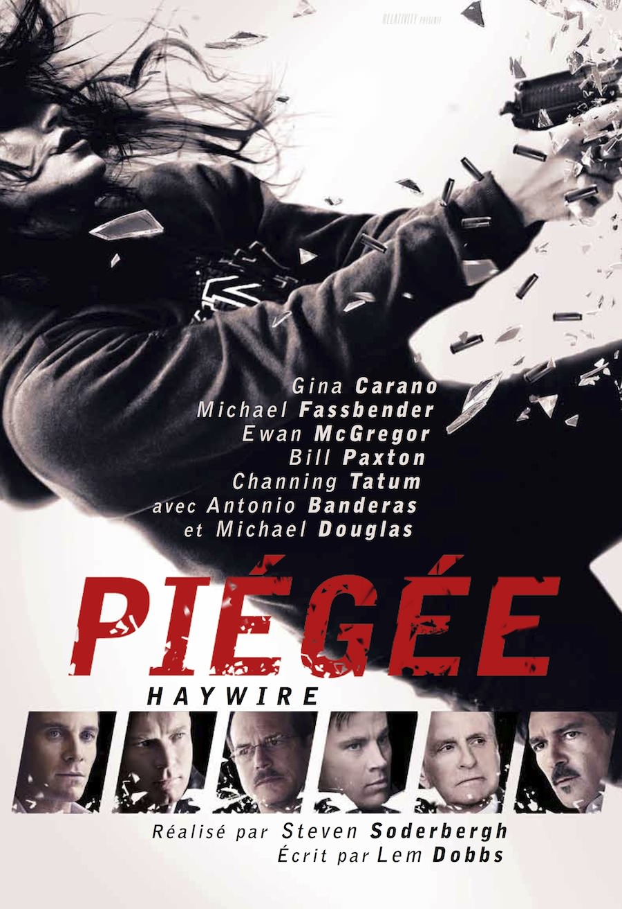
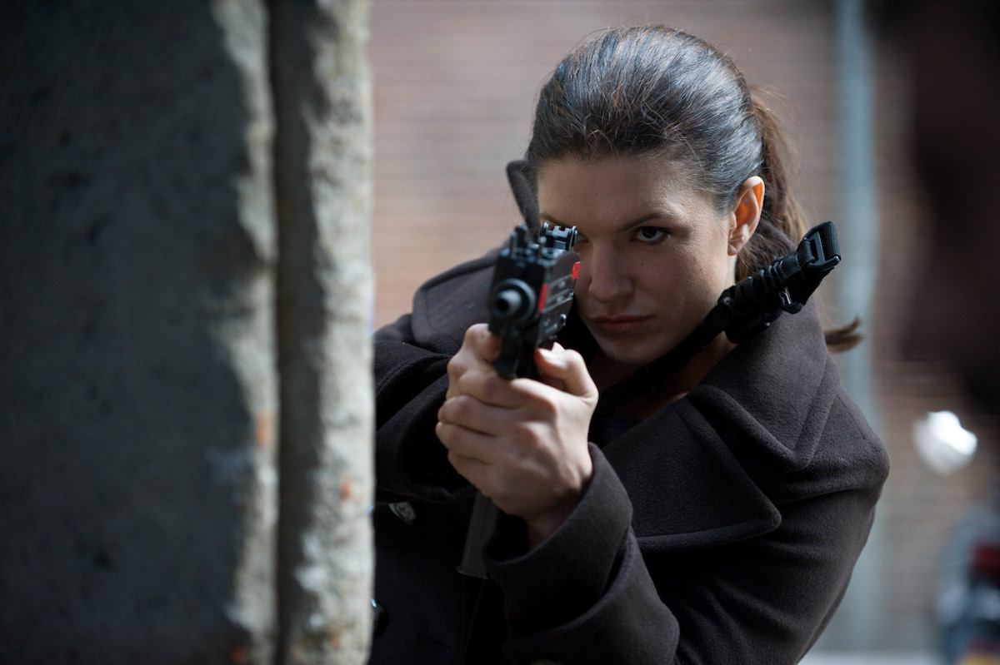
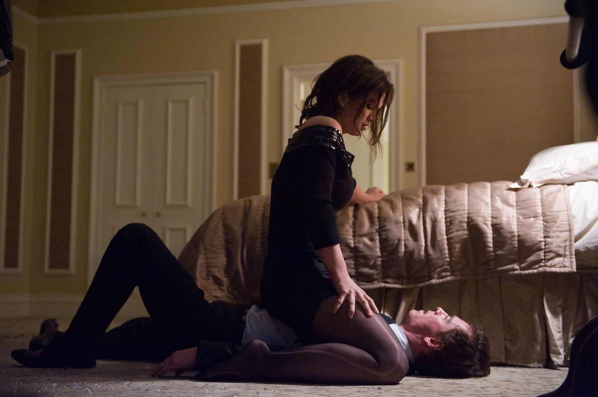

+++
type = "post"
titre = "<em>Piégée</em>, Steven Soderbergh"
title = "Piégée, Steven Soderbergh"
url = "/piegee-soderbergh"
date = "2012-07-11T22:30:51"
Lastmod = "2015-03-15T00:54:47"
cover = "piegee-steven-soderbergh.jpg"
categorie = [ "À voir" ]
tag = [ "Action", "Enquête", "Espionnage", "Thriller", "Vite oublié" ]
createur = [ "Steven Soderbergh" ]
acteur = [ "Antonio Banderas", "Channing Tatum", "Ewan McGregor", "Gina Carano", "Mathieu Kassovitz", "Michael Douglas", "Michael Fassbender" ]
annee = [ "2012" ]
weight = 2012
pays = [ "États-Unis" ]
original = "Haywire"

+++

Certains réalisateurs s&rsquo;en tiennent à un genre pendant toute leur carrière, Steven Soderbergh n&rsquo;est pas de ceux-là. Les calendriers des sorties ont prévu deux films du cinéaste cet été : un mois avant les strip-teasers de <em>Magic Mike</em>, place au thriller d&rsquo;action dans l&rsquo;esprit de la saga <em>Jason Bourne</em>. Le Jason est ici une femme et <em>Piégée</em> s&rsquo;avère finalement beaucoup moins proche du modèle annoncé. Un petit film très agréable, parfait pour une séance à oublier rapidement

Mallory est une ancienne membre des <em>marines</em>, elle est maintenant agente pour des missions à haut risque. Employée régulièrement par le gouvernement américain, elle voyage dans le monde entier pour réaliser des missions toujours plus dangereuses. Quand <em>Piégée</em> commence, elle est pourtant attaquée par un collègue dans un café au nord de l&rsquo;État de New York : Mallory est devenue la cible. Elle est soupçonnée d&rsquo;avoir assassiné un dissident chinois qu&rsquo;elle venait de libérer quelques jours auparavant à Barcelone. Alors que les dernières semaines défilent dans sa tête pour comprendre comment son employeur a pu ainsi la trahir, la jeune femme doit affronter les agents envoyés à ses trousses. Le piège qui se referme sur elle est implacable…

L&rsquo;affiche de <em>Piégée</em> ne laissait envisager rien qui vaille. On pouvait s&rsquo;attendre à un film d&rsquo;action basique dont le seul objectif semblait être de faire tourner la liste longue comme le bras de stars qui ont tous droit à un nom aussi gros que celui du réalisateur et même à une photo. Le synopsis du dernier film de Steven Soderbergh ne vaut pas mieux : l&rsquo;histoire semblait là encore basique, vue et revue et elle pouvait difficilement conduire à un film intéressant. De fait, tous les ingrédients de l&rsquo;énième variation du film d&rsquo;action qui ne peut plus être que très réaliste et violent depuis <em>Jason Bourne</em> sont réunis. On a ainsi un personnage fort, une femme ici, qui se fait piéger par ses anciens employeurs et qui doit à la fois lutter pour sa survie et tenter de comprendre ce qui s&rsquo;est passé derrière son dos. On a des agents secrets particulièrement violents sur le terrain et des hommes de l&rsquo;ombre qui tirent les ficelles et abandonnent leurs hommes sans hésiter. Tout est là pour faire un thriller dans la moyenne et <em>Piégée</em> va jusqu&rsquo;à reprendre la fameuse course-poursuite sur les toits, ici ceux de Dublin. L&rsquo;intrigue proprement dite est complexe comme il se doit, mais elle est aussi parfaitement explicitée pour ne pas risquer de perdre les spectateurs.

<em>Piégée</em> ressemble à un film formaté sans grand intérêt, mais on sent qu&rsquo;il y a un problème dès les toutes premières scènes. Au lieu d&rsquo;opter pour une action rythmée par une musique martiale, Steven Soderbergh prend son temps et il choisit une bande sonore jazzy qui ne convient pas du tout aux canons du genre. Bien vite, on comprend que ce film n&rsquo;est pas aussi prévisible que prévu : même si son intrigue reste assez classique, elle importe moins que l&rsquo;ambiance créée par le long-métrage. Contre toutes attentes, <em>Piégée</em> est un film d&rsquo;ambiance qui est assez bref (1h30), mais aussi très lent, à tel point que les amateurs de blockbusters resteront sur leur faim. Si Steven Soderbergh sait être violent par moment et le prouve avec un personnage principal aussi sec qu&rsquo;efficace, il ne faut pas s&rsquo;attendre à l&rsquo;artillerie lourde que Hollywood peut si bien mettre en place. Au total, les scènes d&rsquo;action restent rares et le cinéaste prend un malin plaisir à déjouer nos attentes. Mallory conduit une voiture de sport, on s&rsquo;attend à une course-poursuite endiablée, mais elle emprunte un chemin dans la neige qui la force à rouler doucement, tandis que c&rsquo;est un cerf qui l&rsquo;oblige à abandonner le véhicule. Rien ne fonctionne vraiment comme prévu dans <em>Piégée</em> et c&rsquo;est incontestablement le point fort de ce film.

Steven Soderbergh surprend ses spectateurs en optant pour une nonchalance salutaire qui empêche <em>Piégée</em> de devenir trop sérieux. Que les choses soient claires, le film n&rsquo;est pas une parodie du genre et l&rsquo;humour y est totalement absent. Reste que l&rsquo;ambiance est en décalage avec l&rsquo;action qui est censée se dérouler, à tel point que l&rsquo;une des scènes étouffe les coups de feu derrière la musique composée par David Holmes. Tout, ou presque, semble à contre-emploi dans ce film un peu étrange, à commencer par les acteurs. Channing Tatum n&rsquo;est pas là que pour ses muscles, le talent de Michael Fassbender est presque évacué par le scénario, Ewan McGregor joue le rôle d&rsquo;un méchant, etc. Dans le lot, seule Gina Carano qui est d&rsquo;abord une spécialiste du combat à l&rsquo;arme blanche et des arts martiaux est vraiment à sa place. L&rsquo;actrice excelle à interpréter ce personnage froid et violent, elle est parfaite. Il convient aussi de saluer le scénario, alambiqué à souhait, mais jamais inutilement complexe.

Steven Soderbergh semble avoir choisi de mêler <em>Oceans Eleven</em> et la saga <em>Jason Bourne</em> pour former cet entre-deux surprenant. Le film s&rsquo;annonçait déjà vu et sans intérêt, il est finalement beaucoup plus original que ça et il à ce titre très intéressant. <em>Piégée</em> n&rsquo;a rien d&rsquo;un grand film, mais le divertissement est au rendrez-vous et on passe un moment, pour peu que l&rsquo;on accepte le rythme assez lent et l&rsquo;ambiance décalée qui prédomine. Une bonne surprise, dans l&rsquo;ensemble…

<h3>Vous voulez m&rsquo;aider ?</h3>
<ul>
<li><a href="http://www.amazon.fr/gp/product/B009P6C10M/ref=as_li_ss_tl?ie=UTF8&tag=leblogdenic07-21&linkCode=as2&camp=1642&creative=19458&creativeASIN=B009P6C10M">Acheter le film en Blu-Ray sur Amazon</a></li>
<li><a href="http://www.amazon.fr/gp/product/B009P6C0NU/ref=as_li_ss_tl?ie=UTF8&tag=leblogdenic07-21&linkCode=as2&camp=1642&creative=19458&creativeASIN=B009P6C0NU">Acheter le film en DVD sur Amazon</a></li>
<li><a href="https://itunes.apple.com/fr/movie/piegee-haywire-vost/id591101021?l=en">Acheter ou louer le film sur l&rsquo;iTunes Store</a></li>
</ul>

