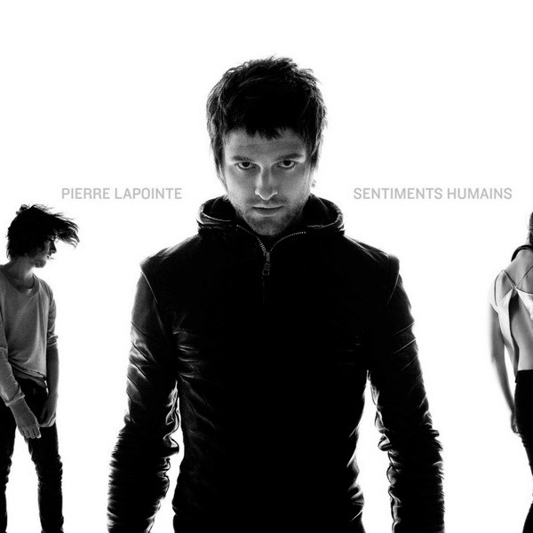
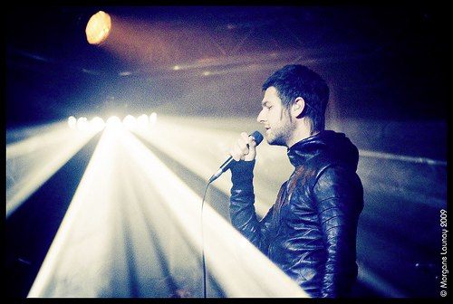
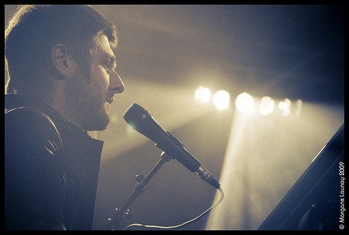
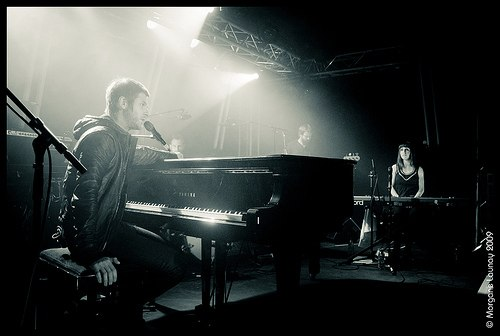

+++
type = "post"
titre = "Pierre Lapointe à la Boule Noire (9 octobre 2009)"
title = "Pierre Lapointe à la Boule Noire (9 octobre 2009)"
url = "/pierre-lapointe-boule-noire-2009"
date = "2009-10-10T00:54:06"
Lastmod = "2010-03-15T16:17:08"
cover = "lapointe.jpg"
categorie = [ "À voir… en live" ]
tag = [ "Chanson française", "Concert", "La Boule Noire" ]
createur = [ "Pierre Lapointe" ]
annee = [ "2009" ]
weight = 2009
pays = [ "France" ]

+++

Pierre Lapointe est un artiste francophone qui nous vient du grand nord québécois. Loin de faire de la soupe violoneuse et céline-dionesque, il propose une musique très originale, éloignée de tout ce que j&rsquo;avais pu entendre jusque-là, à mi-chemin entre la chanson française de la grande époque et la musique peut-être pas expérimentale, mais au moins originale. J&rsquo;avais adoré son album précédent, <em>La forêt des mal aimes</em>, et je trouve son dernier album, <em>Sentiments humains</em>, encore meilleur. Et après l&rsquo;avoir vu en concert, je sais maintenant aussi que c&rsquo;est un artiste complet sur scène. Pierre Lapointe, voilà un nom à surveiller de près !

Son dernier album condense tout ce que contenait le précédent, et ce condensé est très bénéfique. Plus resserrée sa musique gagne en force, ce qui pouvait sembler difficile à l&rsquo;écoute de <em>La forêt des mal-aimés</em>. <em>Sentiments humains</em> perd le côté un peu album concept du précédent, avec ses bruitages de forêt qui l&rsquo;ouvraient et le fermaient. La structure d&rsquo;ensemble est plus classique (12 titres, 40 minutes), sans perdre en originalité. Il faut ici évoquer les paroles de Pierre Lapointe, souvent très poétiques, assez incompréhensibles, mais globalement belles. Je ne suis pas fan des chansons à texte en français habituellement, mais là je tombe souvent sous le charme.

L&rsquo;album se construit musicalement autour de trois ensembles. Il y a d&rsquo;abord le chant de Pierre Lapointe, avec ce timbre de voix si particulier et même unique à ma connaissance. Si je suggérais un lien avec la chanson française traditionnelle c&rsquo;est d&rsquo;abord pour la voix et ses intonations qui, sans que je puisse vraiment expliquer pourquoi (après tout, je ne connais pas du tout la chanson française), m&rsquo;évoquent invariablement les chanteurs que l&rsquo;on devait pouvoir écouter dans le Paris des années 1930 ou 1940 (euh&#8230; disons au moins dans le Paris des années 30 des films américains). Au début cela surprend, mais la encore sans que je me l&rsquo;explique précisément, je m&rsquo;y suis très vite fait et j&rsquo;ai apprécié très rapidement cette affiliation qui donne un vernis à l&rsquo;ancienne aux titres de Pierre Lapointe qui est tout sauf désagréable.

Pour accompagner le chant, la musique se base sur <em>Sentiments humains</em> à la fois sur des instruments traditionnels (guitare/batterie/basse…) et sur un ensemble de cordes. Loin de donner ce côté larmoyant que je dénigrais plus haut, il fournit au contraire un cadre bienvenu, avec une vraie composition qui ne sert pas qu&rsquo;à meubler la scène sonore. On distingue aussi ici ou là des cuivres, ou alors des synthétiseurs. Un savant mélange qui sonne toujours juste puisque, justement, il ne sonne pas savant, mais semble au contraire tout naturel.

<em>© Morgane &#8211; <a href="http://www.le-hiboo.com/17680-pierre-lapointe-la-boule-noire-paris-28-09-2009">Le HibOO</a></em>

Après avoir raté le(s) précédent(s) concert(s) parisien(s), je décidai donc de ne rater sous aucun prétexte la série de concerts que Pierre Lapointe donne actuellement (et encore pour quelques jours) à la Boule Noire, à Paris. Beaucoup de dates, mais une salle toute petite, j&rsquo;ai eu du mal à trouver une date, mais ce soir c&rsquo;était bon ! Si j&rsquo;ai réussi à éviter la pluie pour <a href="http://voiretmanger.fr/?p=1907">Cougar</a>, cette fois j&rsquo;y ai eu droit, des torrents d&rsquo;eau dans la file d&rsquo;attente. Évidemment, les portes n&rsquo;ont ouvert qu&rsquo;à l&rsquo;heure dite (avec même cinq minutes de retard), donc après une demi-heure sous la pluie battante, nous étions tous trempés malgré les divers parapluies qui se sont ouverts un peu partout.

La composition de la salle est étonnante, puisque l&rsquo;on y trouve tous les âges des plus jeunes (y en a un qui ne devait pas avoir beaucoup plus que 3 ou 4 ans) au troisième âge. J&rsquo;ai ainsi hébergé sous mon parapluie une famille complète, les deux parents et les trois enfants dont une petite fille pas bien vieille non plus. Bref, ambiance famille dans un contexte qui l&rsquo;est peu (surtout du côté de Pigalle&#8230;). Cela fait en tout cas plaisir de voir un concert un peu divers comme celui-ci.

J&rsquo;avais un peu peur à l&rsquo;idée qu&rsquo;un concert de Pierre Lapointe puisse n&rsquo;être qu&rsquo;une écoute de l&rsquo;album, mais en concert. Heureusement, c&rsquo;est bien plus que ça et à la manière des plus grands artistes, les titres évoluent sur scène pour éviter les redites de l&rsquo;album. Certains titres se dévoilent ainsi sous un jour beaucoup plus énergique, d&rsquo;autres au contraire se font acoustiques et intimistes. Les morceaux les plus anciens sont ceux qui ont le plus évolué évidemment avec même, pour certains, des réinterprétations complètes où l&rsquo;on distingue juste la mélodie (et les paroles évidemment). Mais même les titres du dernier album, pourtant récent, sont modifiés sur scène. Les instruments à cordes sont en général remplacés alternativement par la guitare ou un clavier (piano ou électronique), même si un violon reste présent sur scène. Cette réinterprétation constante est un vrai plaisir et permet de redécouvrir une musique que l&rsquo;on pensait bien connaitre. Je pense en particulier à un morceau (je suis toujours très mauvais pour retenir les noms des titres&#8230;) qui prend un aspect bien différent quand il est interprété à deux flutes à bec.

<em>© Morgane &#8211; <a href="http://www.le-hiboo.com/17680-pierre-lapointe-la-boule-noire-paris-28-09-2009">Le HibOO</a></em>

Certains morceaux, dans l&rsquo;ambiance chaude de la Boule Noire, sont devenus des bombes à même de lever tout le public comme un seul homme, à lui faire taper dans les mains et hurler son bonheur. Par moments, j&rsquo;ai pensé à Dionysos ou -M-, toutes proportions gardées. On retrouve ces concerts où la scène transforme des morceaux plutôt sages sur disques en titres carrément énervés et qui emportent tout sur leur passage.

Ce qui me fait d&rsquo;autant plus regretter le choix d&rsquo;une configuration assise : un concert de Pierre Lapointe ne démériterait nullement dans la salle d&rsquo;à côté (la Cigale) ou toute autre salle standard, avec fosse. Cela ne conviendrait sans doute pas au public le plus jeune ou le plus âgé, mais il y avait aussi des jeunes prêts à sauter dans tous les sens s&rsquo;ils n&rsquo;étaient pas coincés sur leur chaise. C&rsquo;est déjà sans doute le cas au Canada où Pierre Lapointe est une véritable star et je ne vois pas pourquoi on n&rsquo;en ferait pas autant de ce côté-ci de l&rsquo;Atlantique.

J&rsquo;avais lu/entendu que les concerts de Pierre Lapointe étaient aussi visuels, et c&rsquo;est effectivement le cas. Dans une salle aussi petite que peut l&rsquo;être la Boule Noire, ils ont réussi à mettre beaucoup d&rsquo;éclairages, mais des éclairages intelligents, je veux dire qu&rsquo;ils font sens, ça n&rsquo;est pas simplement un mix de toutes les couleurs un peu en vrac. Une partie de l&rsquo;éclairage se compose originalement de néons (oui, comme ceux des salles de classe ou des aéroports), un peu à la manière de ce qu&rsquo;à fait Radiohead sur la dernière tournée. Sur scène, ils sont six. Le centre de la scène est occupé par un piano à queue, et évidemment par Pierre Lapointe, étonnamment stoïque, voire imperturbable, pendant le concert, ce qui est plutôt troublant, mais semble constituer simplement sa façon d&rsquo;être.

<em>© Morgane &#8211; <a href="http://www.le-hiboo.com/17680-pierre-lapointe-la-boule-noire-paris-28-09-2009">Le HibOO</a></em>

Pierre Lapointe en concert est une très bonne surprise. Je ne savais pas trop à quoi m&rsquo;attendre, les albums étant très typés et à première écoute difficilement adaptables sur scène, mais l&rsquo;artiste et ses musiciens ont su tirer parti de la scène pour proposer une relecture convaincante des morceaux. Le tout pour un show énergique, beau à regarder, bien fichu côté son&#8230; bref un concert vraiment sympa, ponctué de petites interventions de Pierre Lapointe qui, dans le genre humour déprimé et auto-dérision, sont pas mal du tout et créent une proximité entre le public et l&rsquo;artiste.

Voilà encore un artiste à ajouter à la longue liste des artistes qui mériteraient d&rsquo;être plus connus. Je conseille donc de jeter une oreille aux albums, mais surtout d&rsquo;aller voir Pierre Lapointe en concert, cela vaut même la peine de se faire tremper&#8230;

