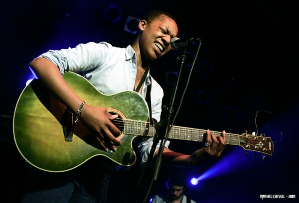
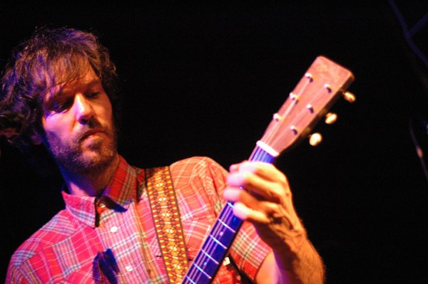
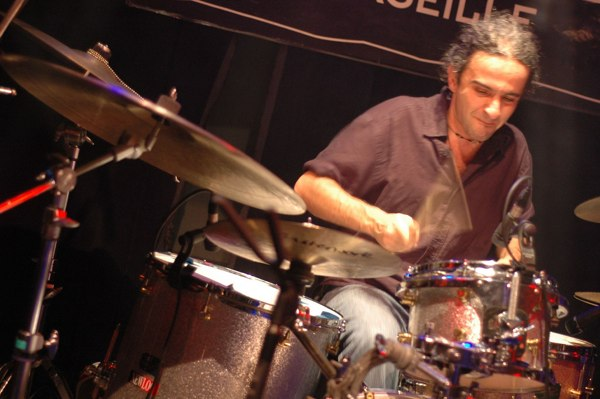
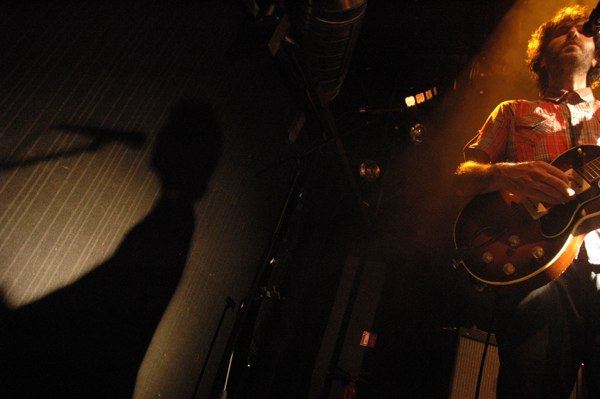

+++
type = "post"
titre = "Piers Faccini à la Cigale (16 décembre 2009)"
title = "Piers Faccini à la Cigale (16 décembre 2009)"
url = "/piers-faccini-cigale-2009"
date = "2009-12-17T01:40:05"
Lastmod = "2014-03-15T11:08:56"
cover = "piers-faccini-cigale-decembre-2009.jpg"
categorie = [ "À voir… en live" ]
tag = [ "Concert", "Folk", "La Cigale", "Rock" ]
annee = [ "2009" ]
weight = 2009
pays = [ "France" ]

+++

Piers Faccini est un artiste talentueux étonnamment méconnu du public. Et pourtant, avec trois albums au compteur seulement, il a eu l&rsquo;occasion à plusieurs reprises de produire une musique brassant de très nombreuses influences. À la clé, des titres pleins de finesse et souvent magnifiques. Sur scène, la musique de Piers Faccini prend de l&rsquo;ampleur sans perdre de sa finesse&#8230; une vraie réussite.

Ce soir, les voix furent à l&rsquo;honneur et on a eu l&rsquo;occasion de l&rsquo;entendre dès la première partie. Une partie assumée par une personne pour le moins androgyne dirons nous : je pensais à un homme, certes un peu efféminé, mais à en croire Piers Faccini lui-même, c&rsquo;est en fait une femme, <a href="http://www.myspace.com/krystlewarren">Krystle Warren</a>, très masculine donc (même en le sachant, c&rsquo;était difficile à deviner&#8230;). Peu importe, Krystle a un coffre ahurissant et une voix aussi puissante que magnifique (et assez grave, le doute était vraiment permis). La guitare sèche l&rsquo;accompagne, mais la voix se suffit a elle-même, même a capella, même sans micro. Elle bouge en permanence la tête autour de son micro dans une sorte de danse assez fascinante, sa puissance de voix lui permettant de reculer sans que le volume en pâtisse.

<em>Crédit : <a href="http://www.flickr.com/photos/buskpe/3833435258/">buskpe @ Flickr</a></em>

Après cette mise en bouche (si j&rsquo;ose dire), Piers Faccini arrive sur scène. L&rsquo;homme est grand et barbu, il correspond parfaitement à l&rsquo;image que l&rsquo;on peut se faire d&rsquo;un artiste. C&rsquo;est d&rsquo;ailleurs un artiste multiforme, aussi a l&rsquo;aise avec le chant qu&rsquo;avec <a href="http://www.piersfaccini.com/articles/articles.php?idarticle=318">un pinceau</a>, et un musicien aux horizons multiples et très ouverts aux musiques du monde. Ça n&rsquo;a sans doute pas rien à voir avec ses origines, fils d&rsquo;un père italien et d&rsquo;une mère anglaise, vivant en France depuis l&rsquo;âge de 5 ans. Le mélange a été musicalement fructueux et tous ses albums sont marqués par cette diversité, cette richesse, tout en restant étonnamment simples, évidents même.

La voix est un élément essentiel chez Piers Faccini, un pilier sur lequel repose toute la musique. Douce et chaleureuse, mais aussi puissante et forte quand il le fait, elle emporte l&rsquo;adhésion du public venu ce soir en nombre à la Cigale. Un public conquis à n&rsquo;en pas douter, qui connaît apparemment tous les titres sur le bout des doigts, même si le dernier album semble avoir plus de succès.

<em>Crédit : <a href="http://www.flickr.com/photos/pirlouiiiit/3991551720/"> pirlouiiiit @ Flickr</a></em>

Entouré d&rsquo;une bassiste qui semblait bien peu à l&rsquo;aise ce soir et d&rsquo;un batteur très efficace, Piers Faccini alterne morceaux du dernier album et titres plus anciens, sans oublier une reprise ou deux sur la fin, et notamment une chanson des années 1930 d&rsquo;un <em>bluesman</em> du Mississippi, chanson présentée comme l&rsquo;une de ses préférées. La plupart des titres prennent beaucoup d&rsquo;ampleur sur scène, ils sont souvent revisités pour laisser place à plusieurs solos où la guitare s&rsquo;emporte pour notre plus grand plaisir. D&rsquo;autres sont par contre réduits à leur plus simple expression, parfois à la voix seule. La plupart du temps, le groupe se limite au très efficace trio guitare/basse/batterie, mais sur un ou deux titres, un violoniste italien se joint à l&rsquo;ensemble. Et Krystle reviendra aussi le temps d&rsquo;un duo.

La salle réagit mieux avec les titres énergiques, mais globalement reste calme. La faute aussi à une configuration assise étonnante : une vraie fosse n&rsquo;aurait pas été de trop à plusieurs reprises et j&rsquo;aurais aimé personnellement pouvoir bouger un peu plus. C&rsquo;est vrai néanmoins que le concert alterne phases fortes avec des moments au contraire très calmes et pour ces derniers, être assis n&rsquo;est pas si mal. Je ne peux néanmoins m&rsquo;empêcher de penser que le concert aurait été plus fort si on avait été debout.

<em>Crédit : <a href="http://www.flickr.com/photos/pirlouiiiit/3990806439/"> pirlouiiiit @ Flickr</a></em>

Le public était finalement un peu à l&rsquo;image de l&rsquo;artiste lui-même. On ne peut pas dire en effet que Piers Faccini soit fait pour la scène, comme peuvent l&rsquo;être des artistes comme -M- ou Dionysos. Il reste en moyenne statique à son micro et semble tout timide. Il échange néanmoins un peu avec la salle, en français bien sûr (un français charmant, avec quelques plaisantes fautes de genre ici ou là), mais surtout pour nous remercier.

La scénographie est donc limitée en conséquence, mais on note quand même un effort sur les lumières. Quelques ampoules placées au-dessus de la scène et un éclairage surtout en arrière&#8230; rien de très original, mais c&rsquo;est efficace. Et puis réaliser un éclairage de concert en 2009 sans LED ni néon, voilà peut-être la plus grande originalité !

<em>Crédit : <a href="http://www.flickr.com/photos/pirlouiiiit/3990825097/"> pirlouiiiit @ Flickr</a></em>

Piers Faccini n&rsquo;est pas une bête de scène, mais sa musique suffit amplement à remplir un concert (après tout, c&rsquo;est mauvais signe si un concert à besoin de mise en scène&#8230;) Une musique bien vivante, par un artiste manifestement heureux d&rsquo;être avec nous le temps d&rsquo;un concert, concert qui a d&rsquo;ailleurs paru bien court, ce qui est toujours un bon signe. Je regrette juste, à titre personnel, que le violoniste n&rsquo;ait pas été plus présent sur scène&#8230;

Néanmoins, ce fut un très bon concert, et je recommande à tous les amateurs des disques de Piers Faccini (et les autres) de ne pas hésiter quand il passera près de chez vous. Et si vous ne connaissez pas du tout l&rsquo;artiste, il est toujours temps de commencer : ses trois albums sont de toute façon tous aussi bons les uns que les autres.

<em>Crédit photo couverture : </em><a href="http://www.flickr.com/photos/pirlouiiiit/3991565674/"><em> pirlouiiiit @ Flickr</em></a>

