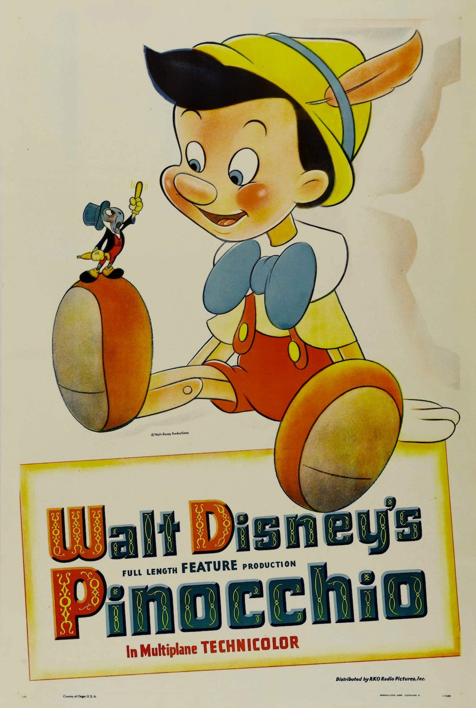
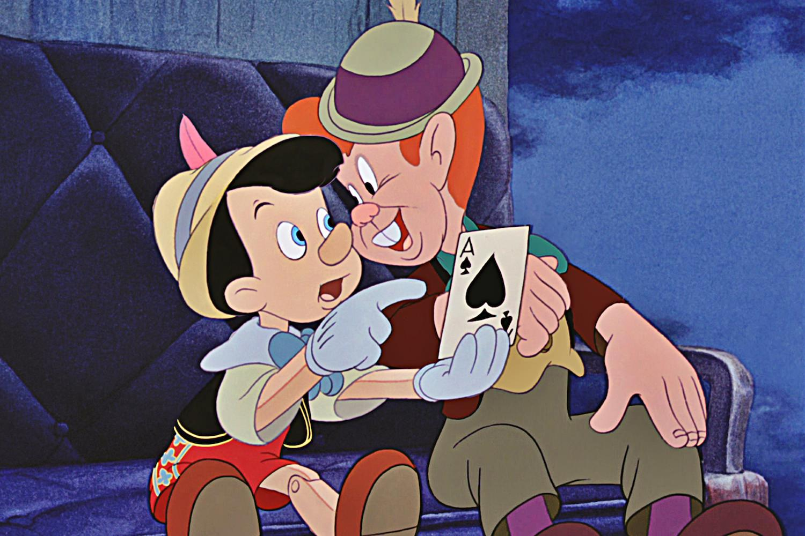
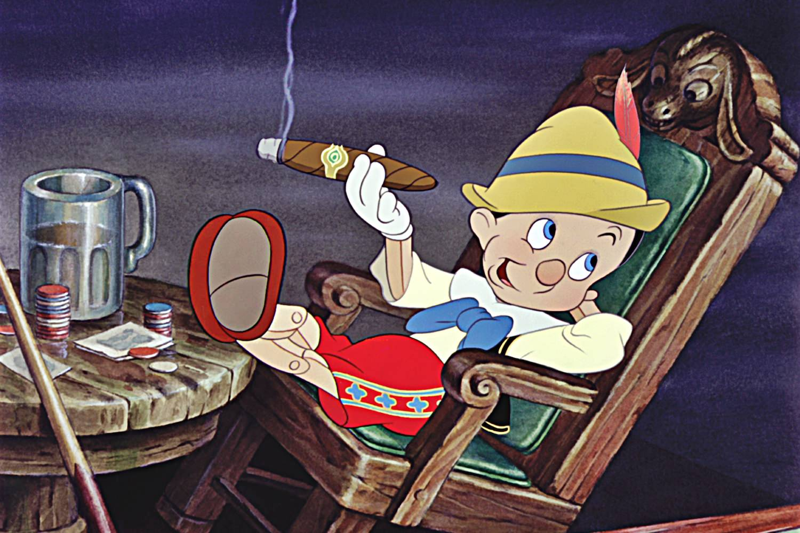

+++
titre = "<em>Pinocchio</em>, Hamilton Luske et Ben Sharpsteen"
title = "Pinocchio, Hamilton Luske et Ben Sharpsteen"
url = "/pinocchio-luske-sharpsteen"
date = "2014-01-25T13:09:17"
Lastmod = "2014-02-01T22:57:53"
cover = "pinocchio-luske-sharpsteen-disney.jpg"
categorie = [ "À voir" ]
tag = [ "Animation", "Éducation", "Enfance", "Fantastique", "Morale" ]
createur = [ "Ben Sharpsteen", "Hamilton Luske", "Walt Disney" ]
annee = [ "1940" ]
weight = 1940
saga = [ "Classiques d'animation Disney" ]
pays = [ "États-Unis" ]

+++

Après le succès de <a href="http://voiretmanger.fr/blanche-neige-sept-nains-hand/" title="Blanche-Neige et les sept nains, David Hand"><em>Blanche-Neige et les sept nains</em></a>, Walt Disney lance plusieurs projets en parallèle. Outre le très ambitieux <em>Fantasia</em>, un deuxième long-métrage pour les enfants est initié et c&rsquo;est à nouveau un conte européen du XIXe siècle qui sert de base au studio. Cette fois, les frères Grimm cèdent la place à Carlo Collodi, un journaliste et écrivain italien qui a publié en 1881 un conte nommé <em>Les Aventures de Pinocchio. Histoire d&rsquo;un pantin</em>. Soixante ans après sa publication, ce récit d&rsquo;un pantin qui rêve de devenir un petit garçon était déjà très populaire quand Walt Disney veut l&rsquo;adapter en un long-métrage d&rsquo;animation. <em>Pinocchio</em> sort dans les salles américaines en 1940, trois ans seulement après le précédent, et le film réalisé par Hamilton Luske et Ben Sharpsteen hausse encore le ton avec une réalisation largement perfectionnée. Si le film n&rsquo;a pas connu le succès escompté à sa sortie, Seconde Guerre mondiale oblige, il s&rsquo;est largement rattrapé depuis et reste un grand classique Disney.

L&rsquo;histoire de <em>Pinocchio</em> est assez simple : un ébéniste qui crée des jouets en bois réalise une marionnette, Pinocchio, qui devient vivant et veut devenir un vrai petit garçon. Sous la plume de Collodi, il s&rsquo;agit d&rsquo;un conte moral visant à effrayer les enfants avec tout ce qu&rsquo;ils ne doivent pas faire, pour leur apprendre à rester sur le droit chemin. Walt Disney et ses équipes conservent cet esprit moralisateur, tout en atténuant considérablement le récit original. Même si le long-métrage reste d&rsquo;une noirceur rare dans les grands classiques Disney, les changements effectués le rendent tout de même plus accessible pour les plus jeunes. Ainsi, le personnage de Pinocchio est une marionnette toute mignonne et avec ses grands yeux et sa naïveté, le héros de <em>Pinocchio</em> est plus touchant que ne l&rsquo;était l&rsquo;original. L&rsquo;autre ajout majeur est le personnage de Jiminy Cricket, un criquet qui fait office de conscience pour Pinocchio. Quasiment absent du conte original, il prend ici une place si importante que le studio en fera un personnage récurrent dans plusieurs films dans les années 1940. Ce criquet ouvre le récit en ouvrant d&rsquo;ailleurs un livre, comme dans <em>Blanche-Neige et les sept nains</em> : Walt Disney impose sa marque de fabrique avec ces éléments qui reviennent à chaque fois. Tous ces changements modifient sensiblement le conte original et permettent à <em>Pinocchio</em> de toucher les enfants… même s&rsquo;il reste à bien des égards l&rsquo;un des plus sombres de l&rsquo;histoire du studio.

Walt Disney a tout fait pour lisser l&rsquo;histoire de <em>Pinocchio</em> : la marionnette est un petit garçon naïf et non plus un sale gosse qui commence par tuer le criquet dans le conte italien. Ce travail d&rsquo;adaptation est aussi passé par l&rsquo;ajout de touches humoristiques avec, pour l&rsquo;essentiel, un personnage totalement incapable calqué sur le modèle du nain simplet, mais aussi quelques jeux de mots qui n&rsquo;ont plus toute leur force comique aujourd&rsquo;hui. Hamilton Luske et Ben Sharpsteen ont fait des efforts, mais leur film reste malgré tout d&rsquo;une noirceur surprenante. Gepeto n&rsquo;est pas aussi pauvre que dans l&rsquo;original, mais il reste un homme qui vit seul et qui n&rsquo;espère qu&rsquo;une chose : avoir un petit garçon. Quand il obtient ce qu&rsquo;il veut, c&rsquo;est pour qu&rsquo;on le lui retire immédiatement. Pinocchio est kidnappé avant d&rsquo;être envoyé sur une île qui transforme des enfants en ânes. Loin de la farce que l&rsquo;on pouvait attendre, <em>Pinocchio</em> présente cette séquence avec beaucoup de sérieux et le film n&rsquo;offre en outre aucune fin heureuse pour tous les enfants déjà transformés. Le héros s&rsquo;en sort, certes, mais il laisse derrière lui des centaines d&rsquo;autres enfants transformés, <em>a priori</em> sans espoir d&rsquo;un retour à leur état normal. Que dire ensuite de l&rsquo;épisode de Monstro qui, même s&rsquo;il se termine bien, est plein de désespoir. Le studio n&rsquo;osera plus par la suite faire des films non seulement sombres comme celui-ci, mais qui empêchent en plus tout espoir. Ici, le <em>happy end</em> est au rendez-vous, mais il est limité : Pinocchio devient un petit garçon, mais les méchants ne sont pas punis. Au total, on oublie vite les tentatives humoristiques d&rsquo;ailleurs assez moyennes — les surprises de Gepeto quand son pantin s&rsquo;anime sont assez réussies, le reste beaucoup moins — et on retient un récit qui surprend aujourd&rsquo;hui encore par sa noirceur.

Sorti dans un contexte de guerre, on comprend facilement pourquoi <em>Pinocchio</em> n&rsquo;a pas fonctionné en 1940. Hamilton Luske et Ben Sharpsteen signent un film qui vise les enfants, mais qui impose quelques images d&rsquo;horreur et surtout une noirceur générale qui est assez étonnante. De quoi masquer un peu la prouesse technique, l&rsquo;animation ayant énormément progressé entre le premier et ce deuxième long-métrage du studio. <em>Pinocchio</em> n&rsquo;est pas un film drôle et son côté moral pèse un peu, mais c&rsquo;est un aussi classique intemporel qui mérite à ce titre d&rsquo;être vu et revu.

<h3>Vous voulez m&rsquo;aider ?<a href="#footnote_0_11024" id="identifier_0_11024" class="footnote-link footnote-identifier-link" title="&Agrave; propos de la publicit&eacute;&hellip;">1</a></h3>
<ul>
<li><a href="http://www.amazon.fr/gp/product/B005974CTO/ref=as_li_ss_tl?ie=UTF8&#038;tag=leblogdenic07-21&#038;linkCode=as2&#038;camp=1642&#038;creative=19458&#038;creativeASIN=B005974CTO">Acheter le film en Blu-Ray sur Amazon</a></li>
<li><a href="http://www.amazon.fr/gp/product/B001OBVAG2/ref=as_li_ss_tl?ie=UTF8&#038;tag=leblogdenic07-21&#038;linkCode=as2&#038;camp=1642&#038;creative=19458&#038;creativeASIN=B001OBVAG2">Acheter le film en DVD sur Amazon</a></li>
</ul>

<ol class="footnotes"><li id="footnote_0_11024" class="footnote"><a href="http://voiretmanger.fr/soutien/">À propos de la publicité…</a> [<a href="#identifier_0_11024" class="footnote-link footnote-back-link">&#8617;</a>]</li></ol>
