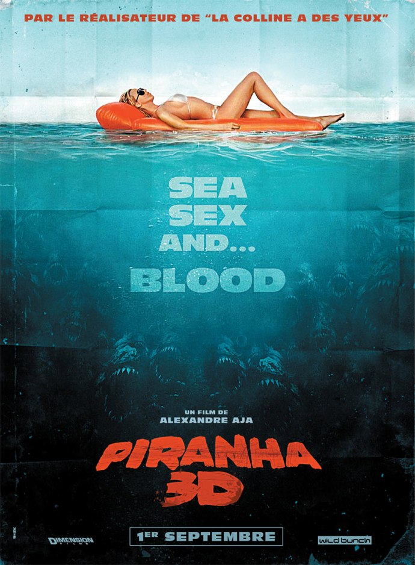
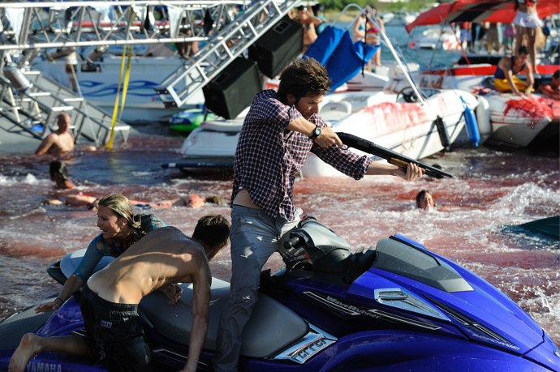

+++
type = "post"
titre = "Piranha 3D, Alexandre Aja"
title = "Piranha 3D, Alexandre Aja"
url = "/piranha-3d-aja"
date = "2010-08-31T00:15:50"
Lastmod = "2012-07-19T11:59:49"
cover = "piranha-3d.jpg"
categorie = [ "À voir" ]
tag = [ "3D", "Blockbuster", "Horreur", "Survival", "Vite oublié" ]
createur = [ "Alexandre Aja" ]
annee = [ "2010" ]
weight = 2010
pays = [ "États-Unis" ]

+++

&laquo;&nbsp;<em>Sea Sex and… Blood</em>&nbsp;&raquo; proclame l&rsquo;affiche du film, parodiant par là une formule devenue célèbre. Le programme de <em>Piranha 3D</em>, le dernier film d&rsquo;Alexandre Aja, est ainsi très simple. Prenez une bande de jeunes avec beaucoup de demoiselles peu vêtues et fort bien pourvues par dame nature et autant de damoiseaux virils, opposez-les à de sanguinaires et impitoyables piranhas et filmez le massacre. Simple, simpliste même et un ton qui s&rsquo;annonce très second degré. Le résultat est à la fois très gore et pas si second degré que cela. Un blockbuster estival qui arrive bien tard dans la saison…

Un film tel que <em>Piranha 3D</em> n&rsquo;a pas vraiment besoin de scénario, mais il faut croire que les scénaristes à Hollywood ont un immense pouvoir et parviennent à imposer leurs histoires même dans les films les plus débiles. Ceux qui ont travaillé avec Alexandre Aja ont donc imaginé une acadabrantesque histoire de séisme qui ouvre une faille vers un lac souterrain préhistorique renfermant en son sein de terribles piranhas. Mais attention, pas n&rsquo;importe quel piranha, mais les ancêtres de ceux que l&rsquo;on connaît aujourd&rsquo;hui dans certaines régions du monde : de monstrueuses créatures, viles et dangereusement intelligentes, attaquant en meutes et ne laissant que des masses sanguinolentes sur leur passage. Un cauchemar, mais bien réel en somme. Évidemment, il fallait que la faille s&rsquo;ouvre au mauvais endroit et au mauvais moment. Autour ce lac imaginaire et (forcément) californien, des jeunes aux corps parfaits viennent se lâcher pendant la période estivale, quelques jours de fête où l&rsquo;alcool coule à flots et où le sexe est totalement débridé. De concours de t-shirts mouillés aux élections de la plus belle paire de seins, ça ne vole pas bien haut, le tout sur musique techno à fond et avec certainement quelques substances illicites qui circulent à peine sous le manteau. L&rsquo;arrivée de bancs de piranha au milieu de cette débauche ne va pas se faire sans quelques dégâts collatéraux, comme on pouvait s&rsquo;en douter. Autant dire que les forces de l&rsquo;ordre vont avoir fort à faire, ne serait-ce que pour sauver leur propre peau. Évidemment, le scénario prévoit que la shérif héroïne ait un idiot de fils qui, au lieu de s&rsquo;occuper sagement de son petit frère et sa petite sœur, les abandonne pour rejoindre un réalisateur de porno et deux de ses actrices sur un yacht. Les jeunes, de nos jours… impossible de leur faire confiance !

Alexandre Aja joue énormément sur le second degré de son film. Il est vrai que le réalisateur français si américain multiplie les références aux films de genre, à commencer par le <em>Piranha</em> original. Mais les références se multiplient, en même temps que le film joue à fond la carte de la surenchère, notamment dans l&rsquo;hémoglobine. Alors que le réalisateur évoque un <em>Gremlins</em> pour adultes, on pense à tous les films d&rsquo;horreur parodique qui ont ajouté de l&rsquo;hémoglobine et de la chair jusqu&rsquo;à l&rsquo;absurde. <em>Piranha 3D</em> est un film très très gore, à tel point que l&rsquo;interdiction au moins de 12 ans paraît bien laxiste, surtout si l&rsquo;on pense qu&rsquo;un film comme <em><a href="/2010/08/20/dernier-exorcisme-stamm/">Le Dernier Exorciste</a></em> sera interdit, lui, au moins de 16 ans. Les âmes sensibles feraient vraiment mieux de s&rsquo;abstenir, on ne se contente pas d&rsquo;une eau rouge ici, mais on voit très bien les chairs et ces corps totalement dévoré par les poissons et sur lesquels il ne reste que quelques lambeaux de chair. C&rsquo;est peut-être ironique, mais c&rsquo;est aussi très réaliste et la caméra ne fait aucun cadeau aux spectateurs en ne se détournant jamais au moment. On reconnaît même très bien certains bouts de chair, comme ce phallus à moitié dévoré qui fit beaucoup rire la salle. Le sang coule à flot, notamment lors d&rsquo;une très impressionnante scène de massacre où des hordes de bestioles attaquent quelques centaines de jeunes dans un bain de sang impitoyable. C&rsquo;est certainement la partie la plus amusante du film, avec une multiplication des moyens mis en œuvre pour tuer les jeunes ou les piranhas. Le réalisateur aime bien que les personnages se fassent bouffer jusqu&rsquo;à la taille et n&rsquo;hésite pas à leur retirer un membre, voire à les couper en deux. Les bouts de chair volent dans tous les sens et c&rsquo;est assez jouissif. Sachez-le néanmoins, <em>Piranha 3D</em> prend très au sérieux le côté sanguinolent, cela ne fera indéniablement pas rire tout le monde.

Si le second degré semble évident chez Alexandre Aja, son dernier film laisse une impression étrange. Comme si derrière un vernis de second degré qui aurait bon dos, <em>Piranha 3D</em> était en fait beaucoup plus premier degré qu&rsquo;il n&rsquo;en a l&rsquo;air. Cela vaut pour le gore, qui semble bien réaliste pour une parodie qui aurait été au contraire encore plus dans le sanguinolent et se serait éloigné plus franchement du réalisme. Ici, le réalisateur est allé trop loin, ou s&rsquo;est au contraire arrêté trop tôt. Cela vaut aussi pour le sexe promis par l&rsquo;affiche et qui consiste essentiellement en des paires de seins et autres paires de fesses exhibées abondamment pendant la majeure partie du film. On voit bien les intentions du réalisateur : mettre le paquet sur ces femmes qui semblent n&rsquo;exister qu&rsquo;en tant qu&rsquo;objets de désir pour les hommes et qui donc ne sont bonnes qu&rsquo;à s&rsquo;exhiber. Sauf que là encore, Alexandre Aja s&rsquo;est arrêté en cours de route, ou alors est allé beaucoup trop loin dans la suggestion. Je trouve le second degré bien complaisant ici et le film m&rsquo;a vraiment mis mal à l&rsquo;aise à exhiber autant de corps féminins, comme si <em>Piranha 3D</em> n&rsquo;était qu&rsquo;un film de charme. Cibler aussi ostensiblement son public (manifestement, la gente féminine n&rsquo;est pas visée par Alexandre Aja) et de manière aussi vulgaire, c&rsquo;est gênant. Cette complaisance sous couvert de second degré m&rsquo;a amusé un peu, mais m&rsquo;a très vite lassé, d&rsquo;autant que le réalisateur en fait vraiment des tonnes, cadrant en permanence de manière à mettre en avant les avantages naturels de ces jeunes femmes.

L&rsquo;autre point qui gâche largement le spectacle, c&rsquo;est bien sûr la 3D. Alexandre Aja a beau nous expliquer qu&rsquo;il a fallu plus d&rsquo;un an de production pour ajouter effets spéciaux et relief, il peut toujours vanter son projet conçu dès le départ pour la 3D, il n&rsquo;en reste pas moins que le résultat est totalement décevant. La 3D ne sert à rien, comme toujours quand elle n&rsquo;arrive qu&rsquo;après le tournage. Tout au plus se prend-on un piranha ou deux dans la figure, un câble ici, un objet par là… mais le reste du temps, le film reste bien sagement en 2D. Cela ne serait pas grave si la 3D n&rsquo;était pas accompagnée de tous les désagréments possibles et imaginables. Flous permanents, difficultés à suivre les séquences les plus rapides… et surtout perte de la luminosité ou des couleurs. Je pense que la salle était fautive, car cette séance fut catastrophique, le film perdant toutes ses couleurs et devenant si sombre que la vision en était gênée. Je ne sais pas s&rsquo;il s&rsquo;agissait d&rsquo;un problème technique, mais en attendant je déconseille de voir des films en 3D à l&rsquo;UGC Bercy. Déjà que l&rsquo;on nous fait payer sans nous laisser le choix de la 2D, on est au moins en droit d&rsquo;exiger de la qualité. À part ce souci technique, <em>Piranha 3D</em> n&rsquo;a rien d&rsquo;intéressant en matière de réalisation, même si je reconnais au film une bonne capacité à faire monter le suspense en cachant les poissons pendant longtemps, tout en faisant en permanence sentir leur présence.

<em>Piranha 3D</em> a tout du blockbuster estival, à tel point que l&rsquo;on se demande bien pourquoi il ne sort qu&rsquo;en septembre. Erreur de calendrier pour un film pas aussi fun que ce qu&rsquo;il promettait sur le papier. Certes, les bestioles sont méchantes à souhait et parviennent à amuser dans leur nettoyage méthodique des jeunes gens. Mais le second degré affirmé laisse un arrière-goût étrange : le film est trop sérieux dans le gore ou le sexe pour être simplement fun. Il ne restera pas grand-chose après la séance, mais dans mon cas ce sera un léger sentiment de malaise. Cela dit, la salle comble à cette avant-première n&rsquo;était clairement pas de mon avis, et le succès public est au rendez-vous outre-Atlantique.

Et d&rsquo;ailleurs, <a href="http://www.toujoursraison.com/2010/08/piranha-3d.html">Rob Gordon</a> a beaucoup apprécié ce divertissement aussitôt consommé, aussitôt oublié. L&rsquo;enthousiasme semble dominer chez mes collègues blogueurs, à l&rsquo;image de <a href="http://www.cloneweb.net/critiques/critique-piranha-3d/">Basile de Cloneweb</a> ou d&rsquo;<a href="http://www.excessif.com/cinema/critique-piranha-3d-6042378-760.html">Alexandre d&rsquo;Excessif</a> qui considère même que la 3D n&rsquo;a jamais été aussi bien utilisée ici que depuis <em>avatar</em>. Il faut croire que je n&rsquo;étais pas d&rsquo;humeur à voir un blockbuster décérébré…

<h3>Vous voulez m&rsquo;aider ?<a href="#footnote_0_3971" id="identifier_0_3971" class="footnote-link footnote-identifier-link" title="&Agrave; propos de la publicit&eacute;&hellip;">1</a></h3>
<ul>
<li><a href="http://www.amazon.fr/gp/product/B0069RWKBK/ref=as_li_ss_tl?ie=UTF8&tag=leblogdenic07-21&linkCode=as2&camp=1642&creative=19458&creativeASIN=B0069RWKBK">Acheter le film en Blu-Ray sur Amazon</a></li>
<li><a href="http://www.amazon.fr/gp/product/B004CP39HA/ref=as_li_ss_tl?ie=UTF8&tag=leblogdenic07-21&linkCode=as2&camp=1642&creative=19458&creativeASIN=B004CP39HA">Acheter le film en DVD sur Amazon</a></li>
</ul>

<ol class="footnotes"><li id="footnote_0_3971" class="footnote"><a href="/soutien/">À propos de la publicité…</a> [<a href="#identifier_0_3971" class="footnote-link footnote-back-link">&#8617;</a>]</li></ol>
