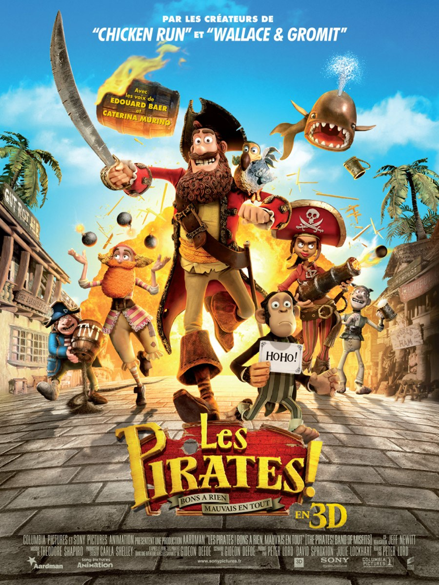
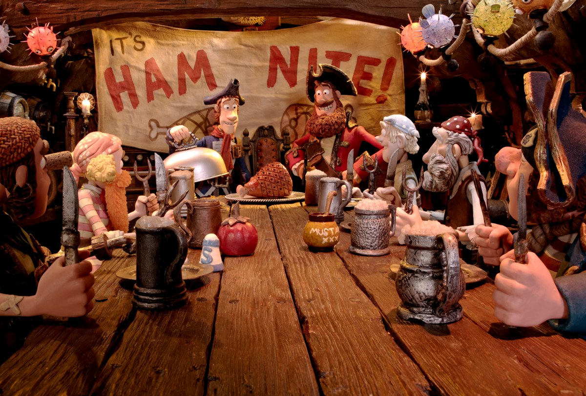
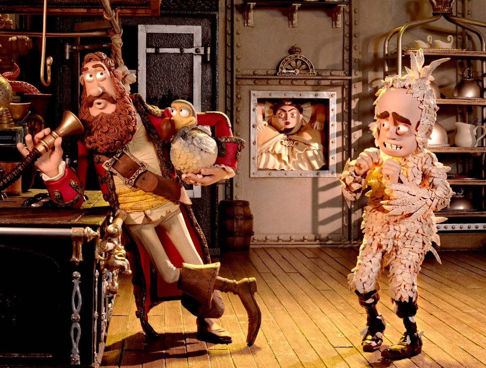

+++
titre = "<em>Les Pirates ! Bons à rien, Mauvais en tout</em>, Peter Lord"
title = "Les Pirates ! Bons à rien, Mauvais en tout, Peter Lord"
url = "/pirates-bons-rien-mauvais-tout-lord"
date = "2012-04-10T00:47:07"
Lastmod = "2015-04-03T21:05:47"
cover = "pirates-bon-rien-mauvais-tout-lord.jpg"
categorie = [ "À voir" ]
tag = [ "Animation", "Aventure", "Humour", "Parodie", "Pirates" ]
createur = [ "Aardman Animations", "Peter Lord" ]
annee = [ "2012" ]
weight = 2012
pays = [ "États-Unis" ]

+++

Son titre à rallonge et sa bande-annonce n&rsquo;annonçaient rien de bon, mais la mention &laquo;&nbsp;Par les créateurs de <em>Chicken Run</em> et <em>Wallace &amp; Gromit</em>&nbsp;&raquo; sur l&rsquo;affiche était déjà plus rassurante. De fait, <em>Les Pirates ! Bons à rien, Mauvais en tout</em> est le dernier film des célèbres studios Aardman Animations connus pour le travail à la pâte à modeler et leur humour britannique. Ce nouveau film réalisé par Peter Lord est jouissif, mais il ne s&rsquo;adresse pas vraiment aux enfants.

Le titre français est beaucoup trop long, mais il a le mérite d&rsquo;être explicite. Sans surprise, <em>Les Pirates ! Bons à rien, Mauvais en tout</em> raconte l&rsquo;histoire d&rsquo;une bande de pirates loosers. La bande rassemblée autour de Capitaine Pirate — c&rsquo;est le nom du capitaine — fait peine à voir et ils font de bien piètres pirates. Ils organisent bien des banquets, mais ce n&rsquo;est pas pour célébrer la victoire d&rsquo;un butin qu&rsquo;ils ne gagnent de toute manière jamais. Ces pirates aiment plutôt organiser des &laquo;&nbsp;nuits du jambon&nbsp;&raquo; pendant lesquelles ils… se gavent de jambon braisé. Toutes leurs attaques se terminent en fiasco, sans argent, mais avec la honte d&rsquo;avoir attaqué encore une fois un mauvais navire. Capitaine Pirate rêve pourtant de briller au sein de la communauté des pirates et il rêve tout particulièrement de devenir le pirate de l&rsquo;année. Il a beau avoir échoué pendant une vingtaine d&rsquo;années, il garde espoir et se présente une nouvelle fois. Pendant sa quête du butin, il tombe sur l&rsquo;expédition scientifique de Charles Darwin qui lui promet une immense fortune à condition de se rendre à Londres pour y présenter Polly, sont perroquet qui se trouve en fait être un Dodo. Les pirates vont-ils survivre à la terrible reine Victoria et rentrer couverts d&rsquo;argent et de gloire ? Rien n&rsquo;est moins sûr…

<em>Les Pirates ! Bons à rien, Mauvais en tout</em> reprend un principe bien connu, mais très efficace : une bande de loosers qui, contre toute attente, parvient à ses fins. L&rsquo;équipe de Peter Lord n&rsquo;a pas raté ces pirates totalement ridicules : il n&rsquo;y en a pas un pour sauver l&rsquo;autre, à l&rsquo;image du pirate albinos et timide, ou encore de ce pirate qui a des attributs manifestement bien féminins. Le film débute avec une hilarante scène de nuit du jambon qui donne une idée assez précise du niveau de ces pirates. La scène rappelle l&rsquo;univers des <a href="http://voiretmanger.fr/tag/monty-python/">Monty Python</a> et comme avec les comiques britanniques, l&rsquo;humour naît ici du décalage entre les attentes des spectateurs et le ridicule de la scène. On s&rsquo;attend à du rhum, des insultes, des coups… on a des chansons mignonnes, du jambon sur l&rsquo;os et des pirates tout polis et gentils. Leur aventure est à leur image : gentillette et ridicule pour des pirates. <em>Les Pirates ! Bons à rien, Mauvais en tout</em> emmène ses personnages dans les pires situations, mais ils s&rsquo;en tirent toujours selon le même principe bien connu. Capitaine Pirate, le héros officiel de l&rsquo;histoire, est un personnage naïf qui ne comprend rien à rien et se laisse embarquer dans les pires manigances, mais on sait bien qu&rsquo;il s&rsquo;en sort toujours.

Comme souvent dans ce genre de films, l&rsquo;intrigue n&rsquo;est pas l&rsquo;essentiel pour <em>Les Pirates ! Bons à rien, Mauvais en tout</em>. Elle est assez banale et on sait à l&rsquo;avance quelle en sera l&rsquo;issue. Ce sont surtout tous les personnages secondaires et les intrigues associées qui intéressent ici et Peter Lord a une imagination débordante en la matière. La bande de pirates n&rsquo;est déjà pas mal en son genre, mais que dire de cette grosse reine Victoria qui déteste tellement les pirates qu&rsquo;elle effraie jusqu&rsquo;à son État-Major quand il en est question. C&rsquo;est elle la véritable méchante du film, pas les pirates qui sont tous plutôt sympathiques, quand ils ne sont pas ridicules. Elle est terrifiante et l&rsquo;amour total que lui porte le pauvre Charles Darwin est logiquement source de beaucoup de rires. Le véritable héros de <em>Les Pirates ! Bons à rien, Mauvais en tout</em> n&rsquo;est toutefois ni le Capitaine Pirate, ni ce couple improbable, mais plutôt le pauvre Dodo qui n&rsquo;a rien demandé. C&rsquo;est lui qui fait avancer l&rsquo;action d&rsquo;un bout à l&rsquo;autre et cet animal rappelle par certains aspects le chien de <em>Wallace et Gromit</em>. Il est aussi au cœur d&rsquo;une intrigue culinaire que l&rsquo;on ne révèlera pas pour maintenir le suspense, mais qui est une idée totalement folle et géniale. <em>Les Pirates ! Bons à rien, Mauvais en tout</em> utilise tous les moyens imaginables de faire rire, de la parodie à l&rsquo;anachronisme — les scientifiques de l&rsquo;Académie Royale qui se font traiter de geeks et de nerds —, mais toujours avec cette ambiance humour britannique qui fait tout le charme des productions Aardman. Le film de Peter Lord souffre malgré tout un peu de son orientation marketing vers les plus jeunes, pour un résultat qui risque bien de leur déplaire de toute manière. <em>Les Pirates ! Bons à rien, Mauvais en tout</em> aurait gagné à proposer un humour clairement plus adulte, mais le film reste très drôle malgré tout.

Connus pour leur travail avec de la pâte à modeler, les studios Aardman avaient un peu abandonné cette technique extrêmement lourde à mettre en œuvre dans leurs derniers films. Avec <em>Les Pirates ! Bons à rien, Mauvais en tout</em>, ils ont trouvé une solution ingénieuse : une bonne dose d&rsquo;animation à la pâte à modeler, image par image, comme dans <em>Wallace et Gromit : le mystère du lapin-garou</em>, essentiellement pour les personnages. Les décors et certaines animations utilisent une animation numérique beaucoup plus moderne et rapide à mettre en place, et donc largement moins coûteuse. Une technique hybride donc qui rappelle, dans un autre genre, le travail des studios Disney sur <em><a href="http://voiretmanger.fr/2010/12/05/raiponce-disney/">Raiponce</a></em> et qui s&rsquo;avère payante. On retrouve la magie des visages en pâte à modeler et <em>Les Pirates ! Bons à rien, Mauvais en tout</em> est disponible en 3D, même si elle est assez peu utilisée.

<em>Les Pirates ! Bons à rien, Mauvais en tout</em> est une très bonne surprise et l&rsquo;on retrouve ici les studios Aardman dans ce qu&rsquo;ils font de meilleur, après deux films en animation numérique plus décevants. Peter Lord a su retrouver la magie de l&rsquo;animation à l&rsquo;ancienne, dans un film qui respire bon l&rsquo;humour anglais à mi-chemin entre les Monty Python et la série de jeux <em><a href="http://fr.wikipedia.org/wiki/The_Secret_of_Monkey_Island">The Secret of Monkey Island</a></em>. <em>Les Pirates ! Bons à rien, Mauvais en tout</em> risque bien de décevoir les plus jeunes pourtant visés par le discours marketing, la faute à un humour un peu trop spécial parfois. Tant pis, les plus grands s&rsquo;amuseront bien, eux…

<h3>Vous voulez m&rsquo;aider ?</h3>
<ul>
<li><a href="http://www.amazon.fr/gp/product/B007PDSFHU/ref=as_li_ss_tl?ie=UTF8&#038;tag=leblogdenic07-21&#038;linkCode=as2&#038;camp=1642&#038;creative=19458&#038;creativeASIN=B007PDSFHU">Acheter le film en Blu-Ray sur Amazon</a></li>
<li><a href="http://www.amazon.fr/gp/product/B007PDSFE8/ref=as_li_ss_tl?ie=UTF8&#038;tag=leblogdenic07-21&#038;linkCode=as2&#038;camp=1642&#038;creative=19458&#038;creativeASIN=B007PDSFE8">Acheter le film en DVD sur Amazon</a></li>
</ul>

