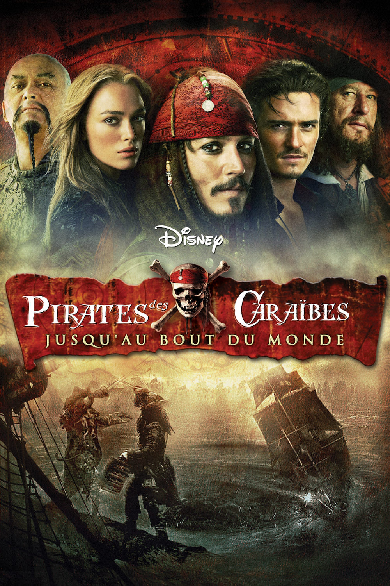
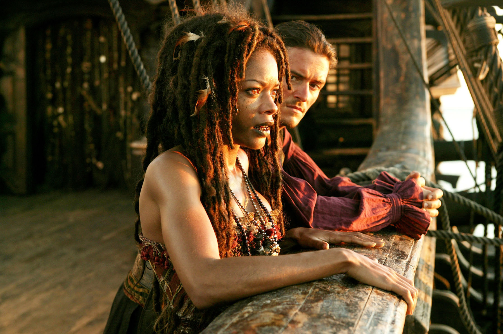
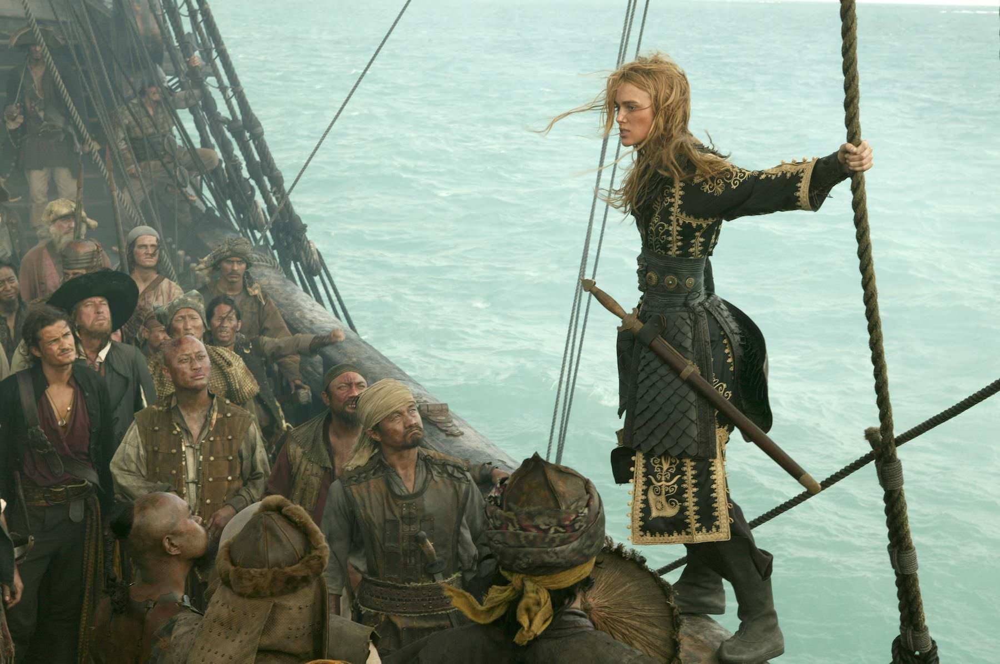

+++
type = "post"
titre = "<em>Pirates des Caraïbes : Jusqu&rsquo;au Bout du Monde</em>, Gore Verbinski"
title = "Pirates des Caraïbes : Jusqu'au Bout du Monde, Gore Verbinski"
url = "/pirates-caraibes-bout-monde-verbinski"
date = "2014-01-07T19:32:58"
Lastmod = "2014-09-23T23:57:02"
cover = "pirates-caraibes-bout-monde-verbinski-johnny-depp-keira-knightley-geoffrey-rush.jpg"
categorie = [ "À voir" ]
tag = [ "Action", "Blockbuster", "Fantastique", "Guerre", "Histoire", "Humour", "Pirates" ]
createur = [ "Gore Verbinski" ]
acteur = [ "Bill Nighy", "Chow Yun-Fat", "Geoffrey Rush", "Johnny Depp", "Keira Knightley", "Orlando Bloom", "Stellan Skarsgard" ]
annee = [ "2007" ]
weight = 2007
saga = [ "Pirates des Caraïbes" ]
pays = [ "États-Unis" ]
original = "Pirates of the Caribbean: At World's End"

+++

Il s’était écoulé trois ans entre le premier et le deuxième épisode, mais la <a href="/saga/pirates-des-caraibes/">saga <em>Pirates des Caraïbes</em></a> s’emballe avec ce troisième volet qui offre une conclusion à une première trilogie, avant un nouveau départ. <em>Pirates des Caraïbes : Jusqu’au Bout du Monde</em> a été écrit et réalisé en même temps que <a href="/pirates-caraibes-secret-coffre-maudit-verbinski/" title="Pirates des Caraïbes : le Secret du Coffre Maudit, Gore Verbinski"><em>Pirates des Caraïbes : le Secret du Coffre Maudit</em></a> et Gore Verbinski a plutôt signé un seul long-métrage divisé en deux parties que deux films différents. Pour la troisième fois, on navigue dans un univers de pirates revisité et remis au goût du jour avec une bonne dose de fantastique et toujours d’humour. Cette conclusion est plus épique encore, mais c’est aussi paradoxalement l’épisode où il se passe le moins de choses. Nonobstant un final explosif, <em>Pirates des Caraïbes : Jusqu’au Bout du Monde</em> est un blockbuster qui paradoxalement refuse le spectaculaire, pour un résultat en demi-teinte, mais plaisant malgré tout.

Gore Verbinski ouvre ce troisième volet avec la même idée que dans les deux précédents : comme une signature personnelle, c’est une séquence sombre qui lance <em>Pirates des Caraïbes : Jusqu’au Bout du Monde</em>. Après le naufrage causé par des pirates, après le mariage annulé, on commence cette fois avec une pendaison en masse. Le ton a changé et le contrôle de la Compagnie britannique des Indes orientales s’est renforcé sur les Caraïbes. Tout puissant, Lord Cutler Beckett traque sans relâche tous les pirates, une obsession qui le conduit à tuer quiconque semble entretenir des liens avec eux, fussent-ils seulement vagues. Une répression à outrance qui surprend quelque peu pour un film Disney, avec une idée très intéressante. Pour la première fois dans la saga, on évoque explicitement une réalité historique : la fin de la piraterie. Avec l’extension du monde connu, les zones d’ombres sur les cartes se réduisent à néant et les grandes civilisations européennes, représentées ici par la Compagnie, peuvent totalement contrôler les mers. Gore Verbinski exploite ce fait historique en l’insérant dans son histoire et en y ajoutant une bonne dose de fantastique. Si Beckett contrôle la terre, il contrôle surtout les mers grâce au cœur de Davy Jones, le capitaine du Hollandais Volant, un navire réputé invincible. Quand <em>Pirates des Caraïbes : Jusqu’au Bout du Monde</em> commence, Davy Jones réalise toutes les basses œuvres pour Beckett et il détruit inlassablement tous les pirates. De fait, la menace est réelle et sensible : c’est l’univers même de la saga qui est menacé d’extinction. Cette idée est plutôt surprenante et bien vue. Plutôt que d’aller chercher du côté d’un trésor assez banal comme dans <a href="/pirates-caraibes-malediction-black-pearl-verbinski/" title="Pirates des Caraïbes : la Malédiction du Black Pearl, Gore Verbinski"><em>Pirates des Caraïbes : la Malédiction du Black Pearl</em></a>, ou même celui, plus original, de <a href="/pirates-caraibes-fontaine-jouvence-marshall/" title="Pirates des Caraïbes : La Fontaine de Jouvence, Rob Marshall"><em>Pirates des Caraïbes : La Fontaine de Jouvence</em></a>, Gore Verbinski dispose d’un motif plus essentiel encore : la survie de tous les pirates. Ce qui motive l’action de manière générale, ce n’est pas la cupidité de l’un ou la revanche de l’autre, mais le rassemblement de tous les pirates dans une lutte à mort contre le pouvoir britannique.

C’est une idée prometteuse, mais <em>Pirates des Caraïbes : Jusqu’au Bout du Monde</em> ne l’exploite pas complètement. Saga oblige, il faut laisser suffisamment de place aux personnages principaux et en particulier à Jack Sparrow, tué à la fin du deuxième volet. Le scénario imagine qu’il est l’un des neuf seigneurs pirates et qu’à ce titre, il doit absolument revenir. Toute la première partie consiste ainsi au retour du pirate, avec une longue séquence complètement folle où on découvre Jack Sparrow — ou plutôt de multiples copies de Jack Sparrow — dans un univers parallèle qui pourrait s’apparenter à l’enfer. Une fois ce personnage clé de retour, le film s’attache au rassemblent des pirates et ce n’est qu’à la fin que la grande bataille annoncée dès le départ a lieu. <em>Pirates des Caraïbes : Jusqu’au Bout du Monde</em> dure près de trois heures et c’est vraiment long, par rapport à ce qui est raconté. On reprochait déjà au second volet quelques longueurs, mais c’est encore bien pire ici. Certaines séquences sont interminables et Gore Verbinski nous donne une foule de détails qui auraient gagné à être éliminés. On apprécie à nouveau le mécanisme qui consiste à cacher un maximum d’informations pour entretenir le mystère — on ne découvre qu’assez tard qui est vraiment Calipso —, mais le spectateur est par ailleurs noyé par d’autres éléments et on peut trouver le temps un peu long. Les longues discussions entre pirates étaient-elles vraiment nécessaires ? Fallait-il aussi vraiment une séquence aussi longue dans l’antre de Davy Jones ? Cette scène semble avoir été écrite dans l’unique but d’offrir à Johnny Depp son moment et s’il faut reconnaître que l’acteur s’en sort bien avec ce pirate schizophrène, on peut aussi noter qu’elle est assez gratuite. Fort heureusement, la bataille finale de <em>Pirates des Caraïbes : Jusqu’au Bout du Monde</em> justifie l’attente qui précède. Impressionnante, elle mêle tout ce que l’on attend d’une bataille navale avec force canonnades et même plusieurs combats individuels, dont un à l’épée et sur le mat du navire.

Gore Verbinski a vu grand pour sa conclusion, un peu trop peut-être. <em>Pirates des Caraïbes : Jusqu’au Bout du Monde</em> est certainement trop long, peut-être trop étrange. Trop détaillé par moment, il ignore par ailleurs quelque peu la bonne idée de la fin de la piraterie qui ne devient plus qu’un vague prétexte. La fin expédiée trop rapidement en témoigne bien : l’histoire pourtant vraie de la main mise des États sur les mers n’a pas vraiment été exploitée. Restent l’humour bien présent, quoique souvent déjà vu, et une bonne dose de fantastique qui fonctionne bien. <em>Pirates des Caraïbes : Jusqu’au Bout du Monde</em> est un blockbuster surprenant, plus original que ses deux prédécesseurs, mais pas forcément plus réussi pour autant.

<h3>Vous voulez m&rsquo;aider ?<a href="#footnote_0_10890" id="identifier_0_10890" class="footnote-link footnote-identifier-link" title="&Agrave; propos de la publicit&eacute;&hellip;">1</a></h3>
<ul>
<li><a href="http://www.amazon.fr/gp/product/B000XCXGM4/ref=as_li_ss_tl?ie=UTF8&tag=leblogdenic07-21&linkCode=as2&camp=1642&creative=19458&creativeASIN=B000XCXGM4">Acheter le film en Blu-Ray sur Amazon</a></li>
<li><a href="http://www.amazon.fr/gp/product/B000XCXGLK/ref=as_li_ss_tl?ie=UTF8&tag=leblogdenic07-21&linkCode=as2&camp=1642&creative=19458&creativeASIN=B000XCXGLK">Acheter le film en DVD sur Amazon</a></li>
<li><a href="https://itunes.apple.com/fr/movie/pirates-des-caraibes-jusquau/id369297847">Acheter ou louer le film sur l&rsquo;iTunes Store</a></li>
</ul>
<ul>
<li><a href="http://www.amazon.fr/gp/product/B00566CCKE/ref=as_li_ss_tl?ie=UTF8&tag=leblogdenic07-21&linkCode=as2&camp=1642&creative=19458&creativeASIN=B00566CCKE">Acheter la saga en Blu-Ray sur Amazon</a></li>
<li><a href="http://www.amazon.fr/gp/product/B00566CCFE/ref=as_li_ss_tl?ie=UTF8&tag=leblogdenic07-21&linkCode=as2&camp=1642&creative=19458&creativeASIN=B00566CCFE">Acheter la saga en DVD sur Amazon</a></li>
</ul>

<ol class="footnotes"><li id="footnote_0_10890" class="footnote"><a href="/soutien/">À propos de la publicité…</a> [<a href="#identifier_0_10890" class="footnote-link footnote-back-link">&#8617;</a>]</li></ol>
