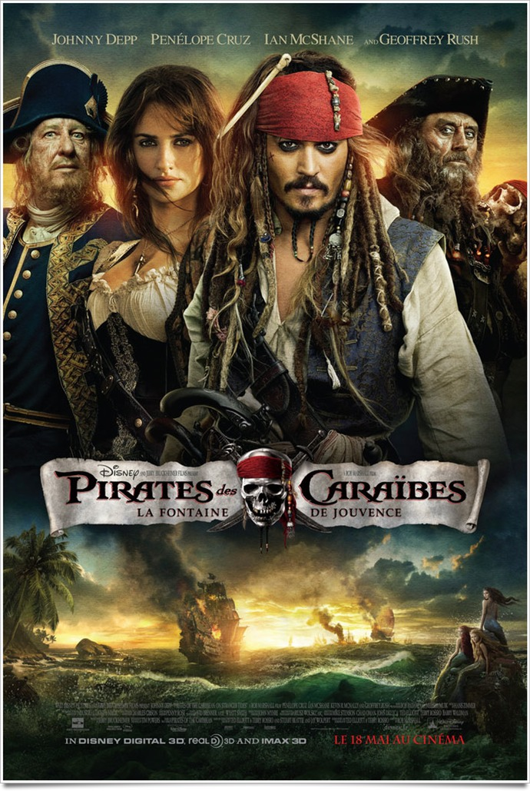
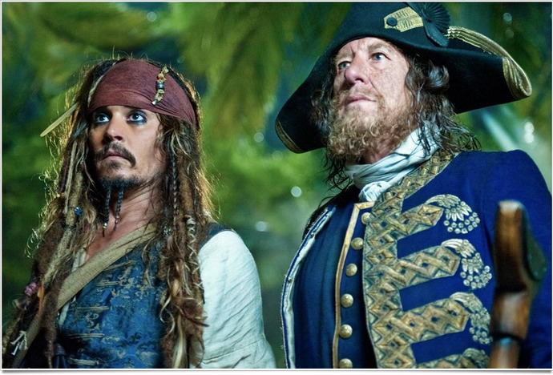

+++
type = "post"
titre = "<em>Pirates des Caraïbes : La Fontaine de Jouvence</em>, Rob Marshall"
title = "Pirates des Caraïbes : La Fontaine de Jouvence, Rob Marshall"
url = "/pirates-caraibes-fontaine-jouvence-marshall"
date = "2011-05-21T02:26:09"
Lastmod = "2013-08-13T22:24:05"
cover = "pirates-caraibes-depp-cruz.jpg"
categorie = [ "À voir" ]
tag = [ "Aventure", "Blockbuster", "Fantastique", "Humour", "Pirates", "Vite oublié" ]
createur = [ "Rob Marshall" ]
acteur = [ "Geoffrey Rush", "Ian McShane", "Johnny Depp", "Penélope Cruz" ]
annee = [ "2011" ]
weight = 2011
saga = [ "Pirates des Caraïbes" ]
pays = [ "États-Unis" ]
original = "Pirates of the Caribbean: On Stranger Tides"

+++

Sorti en 2003, <em>Pirates des Caraïbes : La Malédiction du Black Pearl</em>, premier épisode de ce qui n&rsquo;était pas encore une saga, permettait à Walt Disney de revenir dans la course avec un blockbuster familial assez spectaculaire, plutôt drôle et dépoussiéré. Bonne pioche qui s&rsquo;est transformée en trilogie avec deux films toujours plus spectaculaires. Le succès de la trilogie était tel que le studio ne pouvait en rester là et avec ce <em>Pirates des Caraïbes : La Fontaine de Jouvence</em>, c&rsquo;est manifestement une nouvelle trilogie qui se prépare. Ce nouvel épisode s&rsquo;apparente à une rupture dans la continuité : Jack Sparrow et Barbossa sont toujours là, mais ce sont les seuls personnages principaux à avoir survécu. Une partie de l&rsquo;équipe est restée, mais ce quatrième film introduit de nouveaux personnages et un nouveau réalisateur. Malheureusement, la perspective d&rsquo;un ton nouveau tombe vite à l&rsquo;eau : <em>Pirates des Caraïbes : La Fontaine de Jouvence</em> manque cruellement de… pirates et le film ronronne paisiblement…

<em>Pirates des Caraïbes : La Fontaine de Jouvence</em> se déroule quelques années après la fin de <em>Pirates des Caraïbes : Jusqu&rsquo;au bout du monde</em>. Le film commence en Grande-Bretagne, par un simulacre de procès au cours duquel le vrai Jack Sparrow condamne Gibbs qui est alors pris pour Jack Sparrow à une peine de prison pour piraterie. Le plan de Jack échoue, mais il parvient <em>in extremis</em> à s&rsquo;évader devant le roi lui-même. Dans un bar obscur de Londres, il tombe sur le pirate qui se fait passer pour Jack Sparrow dans la ville et qui recrute un équipage. Cet usurpateur s&rsquo;avère en fait être une usurpatrice : Jack tombe en fait nez à nez avec Angelica. Entre les deux, on comprend vite qu&rsquo;il y a eu une affaire quelques années auparavant, mais qu&rsquo;elle s&rsquo;est mal terminée. Par un concours de circonstances variées, Jack se retrouve alors sur le navire du terrible Barbe-Noire. Angelica se fait passer pour la fille de ce pirate craint sur toutes les mers du globe et qui est parti, comme Barbossa reconverti en Corsaire pour le compte de la Couronne d&rsquo;Angleterre et comme les Espagnols, en quête de la Fontaine de Jouvence. Comme son nom l&rsquo;indique bien, cette fontaine est censée prendre une vie et l&rsquo;offrir à une autre personne. Un élément précieux bien évidemment, après lequel tous les personnages vont courir… Mais qui va arriver le premier ?

Le scénario de <em>Pirates des Caraïbes : La Fontaine de Jouvence</em> n&rsquo;est pas très bon, pour deux raisons essentiellement. Tout d&rsquo;abord parce qu&rsquo;il est très largement en rupture par rapport aux scénarios des trois films précédents, si bien que l&rsquo;on est surpris de découvrir que l&rsquo;auteur est le même pour toute la saga. Le troisième épisode mentionnait bien dans ses dernières minutes la fontaine de jouvence, mais c&rsquo;est bien le seul lien entre la trilogie et ce nouvel opus. Il ne reste quasiment plus aucun personnage, le contexte géographique a changé et même le style a évolué. Paradoxalement, <em>Pirates des Caraïbes : La Fontaine de Jouvence</em> manque de pirates pour un film de genre. La majeure partie du film se déroule ainsi sur terre et il n&rsquo;y a aucune poursuite en bateau, encore moins une bataille ou un abordage. Tout au plus a-t-on droit à quelques brèves batailles au sabre et à l&rsquo;épée, mais rien d&rsquo;aussi spectaculaire que ce que l&rsquo;on avait pu voir jusque-là. Autant le dire, il ne sert à rien d&rsquo;avoir vu un film de la saga pour voir celui-ci… <em>Pirates des Caraïbes : La Fontaine de Jouvence</em> semble même chercher plus du côté d&rsquo;<em>Indiana Jones</em> que des premiers <em>Pirates des Caraïbes</em>.

Le problème n&rsquo;est pas vraiment que <em>Pirates des Caraïbes : La Fontaine de Jouvence</em> n&rsquo;ait rien à voir avec les films qui précèdent, après tout la série peut bien dévier vers autre chose, ce serait même plutôt un point positif. Malheureusement, le film ne bénéficie pas vraiment de ce nouveau départ. Il s&rsquo;avère bien au contraire extrêmement paresseux : l&rsquo;histoire est cousue de fil blanc, elle est lancée sur des rails qu&rsquo;elle ne quittera jamais jusqu&rsquo;à la fin. Tout ce qui se passe dans le film est prévisible : l&rsquo;évasion de Jack Sparrow au début, la fin du film (y compris la toute fin qui reprend une idée du premier épisode) et toutes les péripéties intermédiaires sont toutes, sans exception, comprises à l&rsquo;avance. Le scénario de <em>Pirates des Caraïbes : La Fontaine de Jouvence</em> manque cruellement d&rsquo;originalité, d&rsquo;un souffle, quelque chose qui pourrait lui donner un peu d&rsquo;intérêt. En l&rsquo;état, il semble simplement prévu pour enchaîner des scènes alternativement d&rsquo;action ou comiques. Les passages obligés sont tous réunis, les fuites bras en l&rsquo;air de Jack Sparrow, ses évasions farfelues, ses plans alambiqués… l&rsquo;humour comme toujours tourne essentiellement autour de ce personnage. Les scènes d&rsquo;action manquent également d&rsquo;originalité, à l&rsquo;image du premier duel entre Jack et Angelica où tous les éléments de décor sont à un moment ou à un autre utilisés. Cette scène évoque celle de <em>Pirates des Caraïbes : La Malédiction du Black Pearl</em> dans la forge, mais en déjà-vu et moins intéressante. L&rsquo;humour fonctionne aussi logiquement moins bien : on a déjà vu et revu les pitreries de Jack Sparrow et elles font beaucoup moins rire. Étrangement, même le personnage semble s&rsquo;en être aperçu : on est frappé du sérieux inhabituel de certaines scènes qui auraient pu être comiques, comme l&rsquo;évasion du camp espagnol traité avec un professionnalisme froid qui laisse pantois alors que Jack est censé improviser.

<em>Pirates des Caraïbes : La Fontaine de Jouvence</em> assure le service minimum sur le plan technique. Rob Marshall n&rsquo;y est pas forcément pour grand-chose, sur de tels projets un réalisateur a rarement une marge de manœuvre démesurée, mais son film assure le (grand) spectacle. Inutile de le nier, le film est efficace et même si les effets spéciaux sont plus modestes que par le passé, ils ménagent tout de même quelques scènes plutôt sympa, comme celle des sirènes. On regrettera encore une fois le choix de la 3D qui, comme souvent, ne sert strictement à rien et assombrit l&rsquo;image, mais dans l&rsquo;ensemble le contrat est rempli, même si <em>Pirates des Caraïbes : La Fontaine de Jouvence</em> se contente encore une fois du strict nécessaire. Hans Zimmer ne fait guère mieux côté son et cette paresse généralisée atteint aussi les comédiens. Johnny Depp persévère dans ses pitreries habituelles, sans trop se forcer non plus et son personnage semble un peu en retrait. Un beau paradoxe quand on pense qu&rsquo;il est au cœur du récit, mais c&rsquo;est le constat que l&rsquo;on peut faire pour tous les personnages principaux. À trop les multiplier, le scénario finit par tous les effacer, que ce soit Barbossa (Geoffrey Rush, comme d&rsquo;hab), le pas si terrifiant Barbe-Noire (Ian McShane qui était bien meilleur dans <em><a href="http://voiretmanger.fr/2010/05/10/deadwood-hbo/">Deadwood</a></em>) ou la nouvelle femme, l&rsquo;assez peu passionnante Angelica (Penélope Cruz, quelconque). Ils se contentent tous du service minimum, ce qui n&rsquo;aide assurément pas le film…

Le film de Rob Marshall est un film paresseux qui ne met que mieux en valeur l&rsquo;unique motivation financière qui a présidé à sa conception. <em>Pirates des Caraïbes : La Fontaine de Jouvence</em> est trop grossièrement une suite qui exploite une licence qui a tant rapporté par le passé et qui rapportera sans doute autant cette fois. On peut espérer que ce film n&rsquo;était qu&rsquo;un épisode de transition avant un nouveau départ dans le cinquième film… l&rsquo;espoir est maigre néanmoins. En attendant d&rsquo;en voir plus, la saga <em>Pirates des Caraïbes</em> perd ici la majeure partie de son intérêt : on veut des pirates, du rhum et des canons, pas un Indiana Jones des Caraïbes…

<h3>Vous voulez m&rsquo;aider ?<a href="#footnote_0_4842" id="identifier_0_4842" class="footnote-link footnote-identifier-link" title="&Agrave; propos de la publicit&eacute;&hellip;">1</a></h3>
<ul>
<li><a href="http://www.amazon.fr/gp/product/B004NBXU18/ref=as_li_ss_tl?ie=UTF8&tag=leblogdenic07-21&linkCode=as2&camp=1642&creative=19458&creativeASIN=B004NBXU18">Acheter le film en Blu-Ray sur Amazon</a></li>
<li><a href="http://www.amazon.fr/gp/product/B004NBXU0Y/ref=as_li_ss_tl?ie=UTF8&tag=leblogdenic07-21&linkCode=as2&camp=1642&creative=19458&creativeASIN=B004NBXU0Y">Acheter le film en DVD sur Amazon</a></li>
<li><a href="http://itunes.apple.com/fr/movie/pirates-des-caraibes-la-fontaine/id446158554">Acheter ou louer le film sur l&rsquo;iTunes Store</a></li>
</ul>

<ol class="footnotes"><li id="footnote_0_4842" class="footnote"><a href="http://voiretmanger.fr/a-propos/publicite/">À propos de la publicité…</a> [<a href="#identifier_0_4842" class="footnote-link footnote-back-link">&#8617;</a>]</li></ol>
