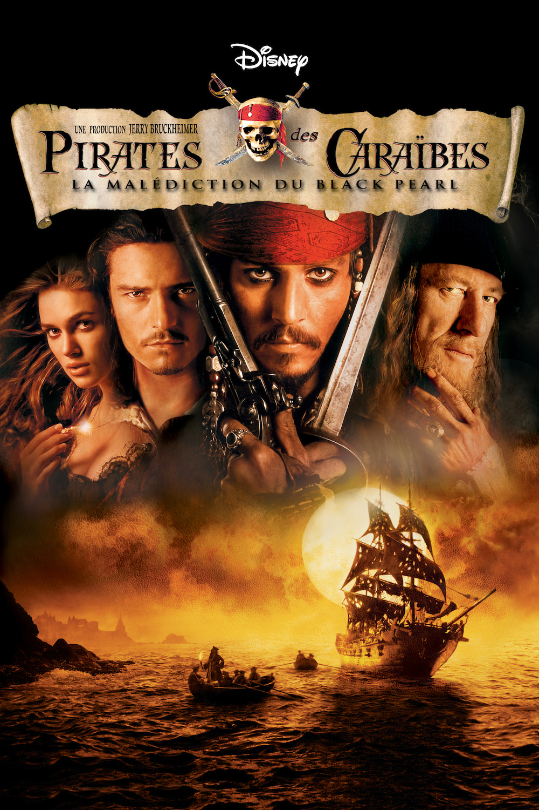
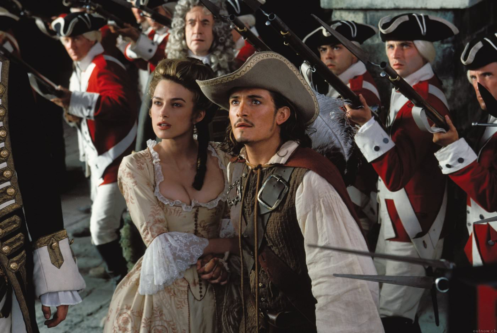
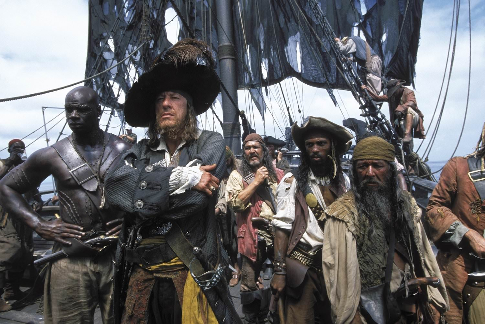

+++
type = "post"
titre = "<em>Pirates des Caraïbes : la Malédiction du Black Pearl</em>, Gore Verbinski"
title = "Pirates des Caraïbes : la Malédiction du Black Pearl, Gore Verbinski"
url = "/pirates-caraibes-malediction-black-pearl-verbinski"
date = "2014-01-05T00:42:17"
Lastmod = "2014-01-05T23:38:52"
cover = "pirates-des-caraibes-malediction-black-pearl-verbinski-johnny-depp.jpg"
categorie = [ "À voir" ]
tag = [ "Action", "Amour", "Aventure", "Blockbuster", "Fantastique", "Humour", "Pirates" ]
createur = [ "Gore Verbinski" ]
acteur = [ "Geoffrey Rush", "Jack Davenport", "Johnny Depp", "Jonathan Pryce", "Keira Knightley", "Orlando Bloom" ]
annee = [ "2003" ]
weight = 2003
saga = [ "Pirates des Caraïbes" ]
pays = [ "États-Unis" ]
original = "Pirates of the Caribbean : the Curse of the Black Pearl"

+++

En général, une saga nait d’une série de livres, éventuellement d’une idée originale. <em>Pirates des Caraïbes</em> a été créée à partir… d’un parc d’attractions. C’est à partir de bateaux pirates des parcs Disney que <em>Pirates des Caraïbes : la Malédiction du Black Pearl</em>, le film qui ouvre la saga en 2003, a été écrit. Une origine pour le moins curieuse, même si on l’oublie vite quand on voit le résultat. Les scénaristes ont gardé l’idée des pirates dans le cadre spatio-temporel le plus approprié — quoi de mieux que les Caraïbes au XVIIe siècle ? —, mais ils l’ont considérablement enrichi avec de l’humour et une teinte de fantastique qui fait toute l’originalité de la saga. Ce premier volet signé Gore Verbinski est une réussite : parfaitement équilibré, il est à la fois spectaculaire et drôle et il pose bien les bases de la saga. Un grand divertissement, qui ne prend pas de rides.

Même si c’est l’attraction éponyme des parcs Disney qui est officiellement à l’origine du film, <em>Pirates des Caraïbes : la Malédiction du Black Pearl</em> puise ses influences de divers horizons. Le plus évident est évidemment la littérature et les films de pirates ou de cape et d’épée. Le temps d’un combat à l’épée dans une forge, Gore Verbinski semble même quasiment faire un pastiche de film de cape et d’épée à l’ancienne et au-delà de cette scène à l’influence assumée, tout son film est marqué par le genre. On pourrait lister toutes les scènes qui sont autant de passages obligés, à l’image de la confrontation des deux navires aux canons ou encore des combats à l’épée vers la fin, entre les deux pirates ennemis. Outre l’aventure, il y a bien sûr de l’amour, un autre élément obligatoire dans le genre. Le le long-métrage ouvre d’ailleurs directement sur ce sujet, avec une scène qui signe la rencontre du couple qui s’ignore encore. Par la suite, l’amour est un moteur essentiel de l’action et tout le scénario se déroule autour de William Turner, fils de pirate sauvé par le navire qui emmène Elizabeth Swann et son père vers l’une des îles des Caraïbes. Cette première scène n’est pas anodine : outre qu’elle informe le spectateur sur l’origine de la rencontre des deux tourtereaux, elle donne aussi le ton. De fait, <em>Pirates des Caraïbes : la Malédiction du Black Pearl</em> est peut-être un film Disney, ce n’est pas un film gentil et un peu niais pour autant. Gore Verbinski crée une ambiance sombre très marquée et ses pirates sont vraiment dangereux. Même si on est loin du travail d’un Christopher Nolan par exemple, la noirceur est sensible dès cette scène où deux jeunes enfants se rencontrent suite à un naufrage causé par des pirates.

De l’amour, des combats à l’épée, un peu de noirceur… <em>Pirates des Caraïbes : la Malédiction du Black Pearl</em> n’en oublie pas pour autant son statut de divertissement et le film est aussi drôle. L’humour n’est pas sans rappeler celui de la <a href="http://fr.wikipedia.org/wiki/Monkey_Island">série de jeux <em>Monkey Island</em></a> — il faut dire que le contexte est le même — et il repose essentiellement sur les épaules d’un seul personnage : Jack Sparrow. Ce pirate raté débarque dans le film à bord d’un bateau qui prend l’eau et qui finit par couler quand il arrive à quai. Une brève séquence qui résume bien l’esprit du personnage et de manière plus générale, l’humour dans le film. Gore Verbinski ne fait pas dans l’originalité avec ce pirate qui ne correspond absolument pas à l’archétype, mais il faut reconnaître que ce type d’humour fonctionne très bien et le film l’exploite à la perfection. On apprécie les manigances permanentes du pirate pour essayer de s’en sortir, sa couardise et surtout la petite pointe de folie qui se transmet même à son accoutrement. On sait que Jack Sparrow, qui est sans aucun doute le personnage principal de <em>Pirates des Caraïbes : la Malédiction du Black Pearl</em>, doit beaucoup à son interprète. Johnny Depp ne s’est pas contenté d’incarner avec beaucoup de ferveur ce personnage, il l’a lui-même créé et c’est sans doute pour cette raison qu’il est aussi réussi. Il prendra sans doute trop de place dans la suite de la saga, mais dans ce premier volet l’équilibre est bien respecté et les apparitions de Jack Sparrow sont toujours amusantes, sans pour autant nuire au reste. D’ailleurs, si l’on peut, à raison, saluer le travail de Johnny Depp, on retiendra aussi le jeu d’acteurs de son rival, Barbossa, incarné par un Geoffrey Rush en grande forme. Le couple d’amoureux est plus banal, même si Keira Knightley s’en sort plutôt bien et qu’Orlando Bloom n’est pas aussi mauvais qu’on a bien voulu le dire.  L’autre star du film, c’est sa musique : même si Hans Zimmer ne signe pas officiellement cette <a href="https://itunes.apple.com/fr/album/pirates-caribbean-dead-mans/id714565074">bande originale</a>, c’est son équipe et surtout le son Zimmer que l’on entend et elle est excellente. Posant les bases des principaux thèmes de la saga, cette musique entraînante et mystérieuse a depuis été mainte fois reprise, mais elle fonctionne parfaitement dans le long-métrage.

Succès critique et public, <em>Pirates des Caraïbes : la Malédiction du Black Pearl</em> est, de fait, un excellent divertissement qui n’a pas volé sa réputation. Gore Verbinski parvient à relancer le film de pirates, un genre quelque peu tombé en désuétude, en lui ajoutant une bonne dose d’humour, mais aussi de fantastique. L’aventure, le spectacle, l’humour et la malédiction paranormale forment un cocktail extrêmement efficace qui explique le succès du film. <em>Pirates des Caraïbes : la Malédiction du Black Pearl</em> lance une saga en créant un univers original que l’on a envie de retrouver, une réussite !

<h3>Vous voulez m&rsquo;aider ?<a href="#footnote_0_10871" id="identifier_0_10871" class="footnote-link footnote-identifier-link" title="&Agrave; propos de la publicit&eacute;&hellip;">1</a></h3>
<ul>
<li><a href="http://www.amazon.fr/gp/product/B000O5B078/ref=as_li_ss_tl?ie=UTF8&tag=leblogdenic07-21&linkCode=as2&camp=1642&creative=19458&creativeASIN=B000O5B078">Acheter le film en Blu-Ray sur Amazon</a></li>
<li><a href="http://www.amazon.fr/gp/product/B000E6FXTS/ref=as_li_ss_tl?ie=UTF8&tag=leblogdenic07-21&linkCode=as2&camp=1642&creative=19458&creativeASIN=B000E6FXTS">Acheter le film en DVD sur Amazon</a></li>
<li><a href="https://itunes.apple.com/fr/movie/pirates-des-caraibes-la-malediction/id366469787">Acheter ou louer le film sur l&rsquo;iTunes Store</a></li>
</ul>
<ul>
<li><a href="http://www.amazon.fr/gp/product/B00566CCKE/ref=as_li_ss_tl?ie=UTF8&tag=leblogdenic07-21&linkCode=as2&camp=1642&creative=19458&creativeASIN=B00566CCKE">Acheter la saga en Blu-Ray sur Amazon</a></li>
<li><a href="http://www.amazon.fr/gp/product/B00566CCFE/ref=as_li_ss_tl?ie=UTF8&tag=leblogdenic07-21&linkCode=as2&camp=1642&creative=19458&creativeASIN=B00566CCFE">Acheter la saga en DVD sur Amazon</a></li>
</ul>

<ol class="footnotes"><li id="footnote_0_10871" class="footnote"><a href="/soutien/">À propos de la publicité…</a> [<a href="#identifier_0_10871" class="footnote-link footnote-back-link">&#8617;</a>]</li></ol>
