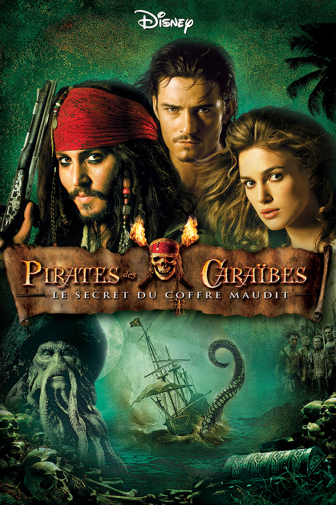
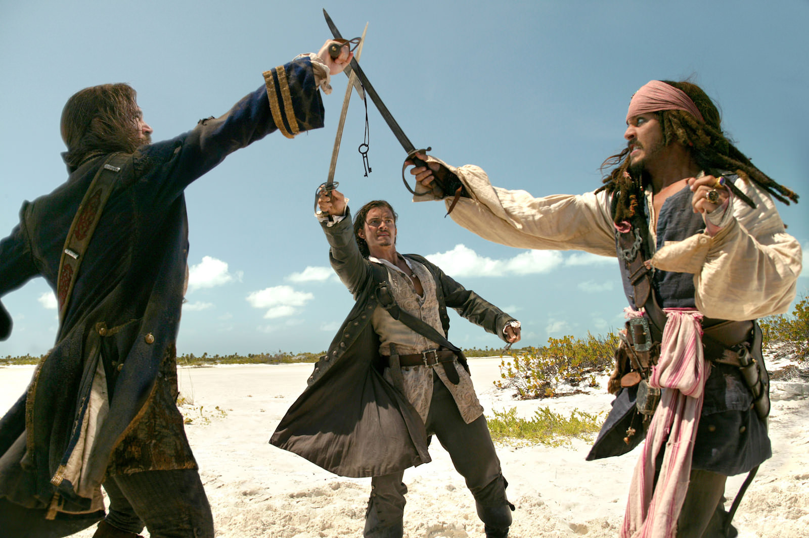
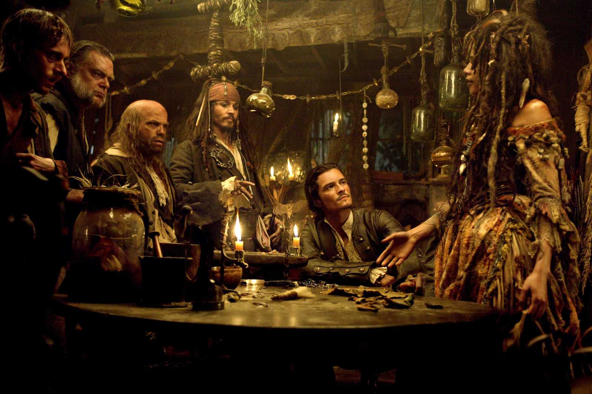

+++
type = "post"
titre = "<em>Pirates des Caraïbes : le Secret du Coffre Maudit</em>, Gore Verbinski"
title = "Pirates des Caraïbes : le Secret du Coffre Maudit, Gore Verbinski"
url = "/pirates-caraibes-secret-coffre-maudit-verbinski"
date = "2014-01-06T10:46:29"
Lastmod = "2014-09-23T23:56:21"
cover = "pirates-caraibes-secret-coffre-maudit-johnny-depp.jpg"
categorie = [ "À voir" ]
tag = [ "Action", "Blockbuster", "Famille", "Fantastique", "Humour", "Pirates" ]
createur = [ "Gore Verbinski" ]
acteur = [ "Bill Nighy", "Johnny Depp", "Keira Knightley", "Orlando Bloom", "Stellan Skarsgard" ]
annee = [ "2006" ]
weight = 2006
saga = [ "Pirates des Caraïbes" ]
pays = [ "États-Unis" ]
original = "Pirates of the Caribbean: Dead Man's Chest"

+++

Face à l’énorme succès de <a href="http://voiretmanger.fr/pirates-caraibes-malediction-black-pearl-verbinski/" title="Pirates des Caraïbes : la Malédiction du Black Pearl, Gore Verbinski"><em>Pirates des Caraïbes : la Malédiction du Black Pearl</em></a>, les producteurs ne pouvaient qu’offrir une suite. L’équipe est intégralement reconduite, devant comme derrière les caméras, et ce n’est pas un, mais deux films qui sont écrits par les scénaristes. De fait, si le premier volet de la saga se suffisait à lui même, <em>Pirates des Caraïbes : le Secret du Coffre Maudit</em> n’est que la première partie d’un long-métrage qui dure en fait près de cinq heures et qui ne trouvera de conclusion qu’avec <em>Pirates des Caraïbes : Jusqu’au Bout du Monde</em> sorti l’année d’après. En attendant, Gore Verbinski poursuit son travail avec un nouveau film qui fait plus dans tous les domaines. Quitte à en faire trop parfois, le cinéaste s’en donne à cœur joie avec une histoire toujours plus folle, pour un grand spectacle jouissif. <em>Pirates des Caraïbes : le Secret du Coffre Maudit</em> n’est pas un grand film, mais c’est un blockbuster prenant.

Sorti trois ans après, <em>Pirates des Caraïbes : le Secret du Coffre Maudit</em> reprend très peu de temps après la fin du premier film. Gore Verbinski garde son idée d’une ouverture assez noire, avec cette fois le mariage raté de Will et Elizabeth. Sous des trombes d’eau qui viennent contredire le dicton populaire, les deux tourtereaux sont arrêtés par un noble envoyé par la célèbre Compagnie britannique des Indes orientales pour restaurer l’ordre sur l’île. Prenant les pouvoirs, il enferme toute la famille et négocie avec Will : en échange d’une mission, il lui assurera, ainsi qu’à sa belle, la liberté. La mission en question semble dès plus banale, puisqu’il s’agit de retrouver le pirate Jack Sparrow pour lui dérober le compas qu’il garde en permanence près de lui, mais qui n’indique même pas le Nord. Notre héros accepte bien volontiers, sans savoir précisément de quoi il retourne, pas plus que le spectateur d’ailleurs. C’est sans doute <em>la</em> bonne idée de ce film qui ne dit pas tout tout de suite et qui cache même la plupart des informations aux spectateurs. Quand <em>Pirates des Caraïbes : le Secret du Coffre Maudit</em> commence, on ne sait rien de Davy Jones, du contenu du coffre et de tout ce qui va arriver au cours des deux films et c’est une excellente chose. Les blockbusters ont trop souvent tendance à vouloir tout expliquer de peur qu’une partie du public visé soit perdu. Gore Verbinski a fort heureusement fait le pari de faire confiance en l’intelligence du public et le long-métrage n’en est que plus plaisant, puisque l’on essaie de comprendre, sans tout maîtriser pour autant.

Pendant pas moins de 2h30, Gore Verbinski étend l’univers qu’il a créé avec <em>Pirates des Caraïbes : la Malédiction du Black Pearl</em>. Ce nouveau volet reprend ainsi tout ce qui a le mieux fonctionné avec le précédent film et offre plus de spectacle, plus de fantastique, mais aussi plus d’humour. Déjà très présent, le personnage de Jack Sparrow devient omniprésent et on sent de plus en plus l’influence de Johnny Depp non seulement sur son personnage, mais aussi sur toute la saga. L’acteur semble particulièrement apprécier son pirate sans courage et manipulateur qu’il améliore encore en mentant à tous les autres personnages pour son propre compte. <em>Pirates des Caraïbes : le Secret du Coffre Maudit</em> repose désormais uniquement sur ce personnage qui est lié à tous les autres dans le film et même s’il n’a pas encore de séquence dédiée, il s’affirme comme le vrai héros de la saga. L’acteur n’a plus à prouver son talent et il l’exploite encore à merveille, même si l’effet de surprise est passé. Il faut dire qu’à trop en faire, le long-métrage de Gore Verbinski a tendance à lasser un petit peu. Autant le premier volet était très bien équilibré et passait bien, autant ce nouveau film est peut-être un peu trop long et un peu trop énorme. Ce sera encore plus vrai pour le troisième volet, mais on note déjà certains combats qui s’allongent plus que de raison et peut-être une surenchère d’histoires secondaires. Le combat à l’épée sur l’île déserte est très spectaculaire, c’est vrai, mais il aurait pu aisément être raccourci de quelques minutes. Plus que la durée, c’est le foisonnement qui pose peut-être problème. <em>Pirates des Caraïbes : le Secret du Coffre Maudit</em> ajoute beaucoup d’éléments au premier volet, ce qui est plutôt positif en soi, mais peut s’avérer contre-productif. À l’écran, Gore Verbinski se débrouille plutôt bien avec tous ces éléments et parvient à sortir un film qui tient la route et qui n’oublie jamais d’être un bon divertissement.

Moins concentré que son prédécesseur, moins équilibré aussi, <em>Pirates des Caraïbes : le Secret du Coffre Maudit</em> tend plus à la comédie avec le personnage de Jack Sparrow qui tire de plus en plus la couverture. Gore Verbinski signe malgré tout un blockbuster divertissement et impressionnant, voire même époustouflant pour l’équipage du Hollandais Volant, mi-humain, mi-mollusques. On s’amuse, on a droit à un spectacle de qualité : le contrat est indéniablement rempli pour ce film qui n’a aucune autre ambition que le divertissement.

<h3>Vous voulez m’aider ?<a href="#footnote_0_10881" id="identifier_0_10881" class="footnote-link footnote-identifier-link" title="&Agrave; propos de la publicit&eacute;&hellip;">1</a></h3>
<ul>
<li><a href="http://www.amazon.fr/gp/product/B000O5B07I/ref=as_li_ss_tl?ie=UTF8&#038;tag=leblogdenic07-21&#038;linkCode=as2&#038;camp=1642&#038;creative=19458&#038;creativeASIN=B000O5B07I">Acheter le film en Blu-Ray sur Amazon</a></li>
<li><a href="http://www.amazon.fr/gp/product/B000K4X38M/ref=as_li_ss_tl?ie=UTF8&#038;tag=leblogdenic07-21&#038;linkCode=as2&#038;camp=1642&#038;creative=19458&#038;creativeASIN=B000K4X38M">Acheter le film en DVD sur Amazon</a></li>
<li><a href="https://itunes.apple.com/fr/movie/pirates-des-caraibes-le-secret/id369300353">Acheter ou louer le film sur l’iTunes Store</a></li>
</ul>
<ul>
<li><a href="http://www.amazon.fr/gp/product/B00566CCKE/ref=as_li_ss_tl?ie=UTF8&#038;tag=leblogdenic07-21&#038;linkCode=as2&#038;camp=1642&#038;creative=19458&#038;creativeASIN=B00566CCKE">Acheter la saga en Blu-Ray sur Amazon</a></li>
<li><a href="http://www.amazon.fr/gp/product/B00566CCFE/ref=as_li_ss_tl?ie=UTF8&#038;tag=leblogdenic07-21&#038;linkCode=as2&#038;camp=1642&#038;creative=19458&#038;creativeASIN=B00566CCFE">Acheter la saga en DVD sur Amazon</a></li>
</ul>

<ol class="footnotes"><li id="footnote_0_10881" class="footnote"><a href="http://voiretmanger.fr/soutien/">À propos de la publicité…</a> [<a href="#identifier_0_10881" class="footnote-link footnote-back-link">&#8617;</a>]</li></ol>
