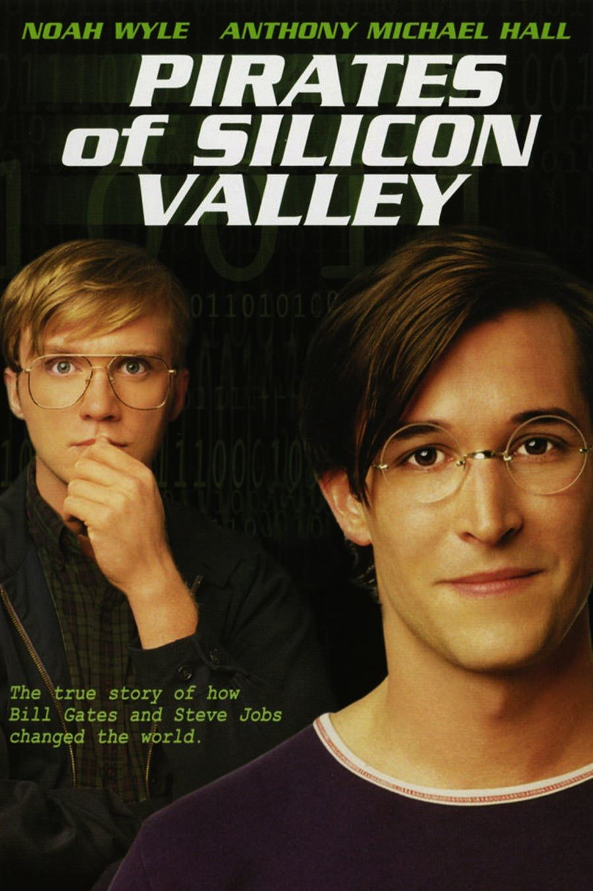
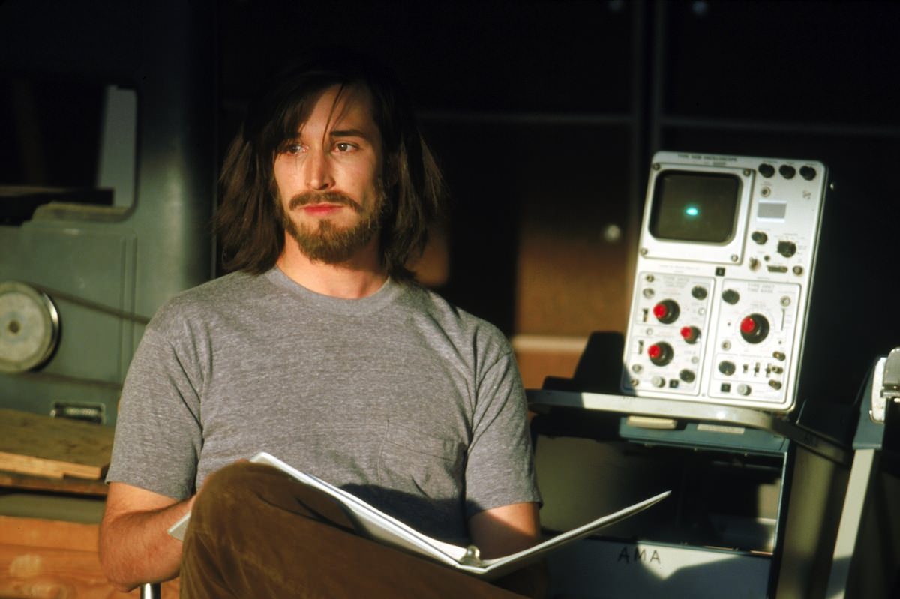

+++
type = "post"
titre = "<em>Les Pirates de la Silicon Valley</em>, Martyn Burke"
title = "Les Pirates de la Silicon Valley, Martyn Burke"
url = "/pirates-silicon-valley-burke"
date = "2013-01-21T10:44:50"
Lastmod = "2013-08-22T00:10:37"
cover = "pirates-silicon-valley-noah-wyle.jpg"
categorie = [ "À voir" ]
tag = [ "Histoire", "Histoire vraie", "Informatique", "Steve Jobs", "Téléfilm" ]
createur = [ "Martyn Burke" ]
acteur = [ "Anthony Michael Hall", "Joey Slotnick", "Noah Wyle" ]
annee = [ "1999" ]
weight = 1999
pays = [ "États-Unis" ]
original = "Pirates of Silicon Valley"

+++

Raconter la naissance de l’informatique personnelle à travers deux histoires qui se croisent, tel est le but de ce téléfilm américain sorti à la fin des années 1990. <em>Les Pirates de la Silicon Valley</em> suit ainsi les premiers pas de Steve Jobs et d’Apple d’un côté, ceux de Bill Gates et de Microsoft de l’autre. Deux personnalités et deux entreprises radicalement opposées qui font naturellement un excellent sujet. Alors que la <a href="http://voiretmanger.fr/2011/10/06/steve-jobs-1955-2011/" title="Soyez insatiables, soyez fous - À voir et à manger">mort de Steve Jobs</a> a lancé l’intérêt du cinéma pour l’homme qui a fondé Apple, ce premier film de Martyn Burke construit un récit intéressant, quoiqu’un peu caricatural, sur ces deux génies de l’informatique. 

1984, sur un plateau de tournage, Steve Jobs donne ses conseils à Ridley Scott en train de tourner la fameuse <a href="http://youtu.be/HhsWzJo2sN4">publicité</a> pour le Macintosh. 1997, Steve Jobs a nouveau, mais cette fois sur scène : à l’occasion de l’un de ses traditionnels Keynotes, il annonce qu’Apple a signé un accord avec Microsoft et enterre ainsi la hache de guerre. C’est sur ces deux évènements marquants que débute <em>Les Pirates de la Silicon Valley</em>, une manière astucieuse de montrer Apple à son heure de gloire et à son niveau le plus bas. Entre les deux, l’entreprise de Bill Gates a sorti Windows, un système d’exploitation inspiré très largement de celui du Macintosh, et Microsoft a gagné la bataille des parts de marché, réduisant Apple à l’anecdote. Ceci posé, Martyn Burke revient en arrière jusqu’au début des années 1970. Steve Jobs et son ami Steve Wozniak sont alors à l’université, à une époque où les émeutes étudiantes sont légion. Ensemble, ils ont déjà imaginé la Blue Box qui permet de passer des appels gratuitement et ils commencent à construire leur premier ordinateur. En parallèle, Bill Gates et Paul Allen sont d’excellents développeurs et ils parviennent à convaincre Altair, un constructeur d’ordinateurs, de concevoir le logiciel permettant de l’utiliser. Par la suite, c’est IBM qu’ils réussissent à convaincre : ils rachètent DOS à un autre développeur et l’adaptent pour les PC de l’entreprise. Plus tard, Bill Gates parvient à convaincre Steve Jobs de lui prêter un Macintosh, une erreur grossière de la part d’Apple… En racontant ces deux histoires, <em>Les Pirates de la Silicon Valley</em> raconte la naissance de l’informatique, mais n’espérez pas apprendre grand-chose sur le plan technique. Si vous n’avez pas quelques connaissances de base sur la période et sur Steve Jobs et Bill Gates, vous serez un peu perdus et Martyn Burke ne fait pas grand-chose pour vous aider. Le choix est clair : le réalisateur s’intéresse d’abord aux hommes, avant de s’intéresser à la technique et aux inventions. 

Sur le papier, <em>Les Pirates de la Silicon Valley</em> échappe au genre du biopic en traitant de deux personnalités en parallèle. Martyn Burke a en plus l’idée plutôt originale dans le genre de choisir deux narrateurs — Steve Wozniak d’un côté, Steve Ballmer de l’autre — pour les faire intervenir régulièrement sous la forme quasiment d’interviews. De quoi casser encore plus le côté biopic scénarisé et s’approcher du documentaire, avec un certain succès d’ailleurs : Steve Wozniak lui-même a <a href="http://www.woz.org/taxonomy/term/2?page=1">indiqué</a> qu’il se retrouvait dans l’acteur qui joue son rôle (Joey Slotnick), tandis que Steve Jobs a invité le sien pour <a href="http://www.youtube.com/watch?v=TIClAanU7Os">commencer une conférence</a> en 1999 (Noah Wyle). Reste que <em>Les Pirates de la Silicon Valley</em> n&rsquo;est pas tout à fait exact sur de nombreux points et oriente quelque peu le propos contre Microsoft et surtout Bill Gates, représenté comme un menteur et un voleur incapable de créer quoi que ce soit par lui-même. De ce fait, le téléfilm de Martyn Burke s’apparente bien à un biopic et il s’intéresse d’abord au fondateur d’Apple, avant de se pencher sur celui de Microsoft. Le film en dresse un portrait qui est loin d’être totalement élogieux, au contraire même : <em>Les Pirates de la Silicon Valley</em> dépeint un homme visionnaire, certes, mais aussi odieux envers ses employés, comme envers sa famille. Le film insiste, un peu lourdement d’ailleurs, sur l’équipe du Macintosh maltraitée par Steve Jobs qui imposait à ses employés des horaires totalement fous. Dans le même temps, il refuse de reconnaître Lisa, sa fille, et ne veut pas aider la mère de son enfant qui doit se résigner à vivre dans un taudis. En face, le portrait de Bill Gates n’est pas tendre non plus, si bien que ni l’un, ni l’autre ne s’en sortent vraiment bien. 

<em>Les Pirates de la Silicon Valley</em> est un téléfilm assez banal sur le plan formel, même si Martyn Burke ne se débrouille pas trop mal par rapport à ce qui peut se faire dans le genre. On a parfois le sentiment que les dialogues sonnent faux, mais l’ensemble se regarde sans déplaisir et on découvre deux personnalités très différentes et très fortes à la fois. L’angle choisi est plutôt bien vu, la reconstitution de l’époque est honorable… bref c’est un téléfilm efficace et instructif, à défaut d’être du grand cinéma. Si vous vous intéressez à Apple, Microsoft ou l’informatique, <em>Les Pirates de la Silicon Valley</em> mérite ainsi d’être vu…

