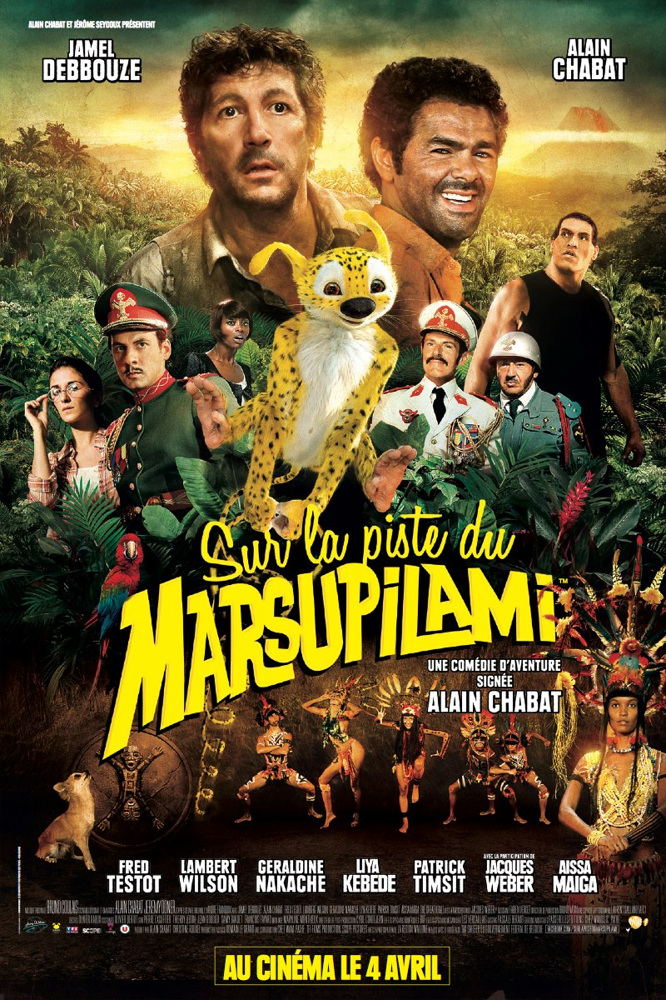

+++
type = "post"
titre = "Sur la piste du Marsupilami, Alain Chabat"
title = "Sur la piste du Marsupilami, Alain Chabat"
url = "/piste-marsupilami-chabat"
date = "2012-04-20T00:01:57"
Lastmod = "2012-08-23T20:14:55"
cover = "sur-la-piste-marsupilami.jpg"
categorie = [ "À voir" ]
tag = [ "Aventure", "Blockbuster", "Comédie", "Humour", "Parodie", "Vite oublié" ]
createur = [ "Alain Chabat" ]
acteur = [ "Alain Chabat", "Fred Testot", "Géraldine Nakache", "Jamel Debbouze", "Lambert Wilson", "Patrick Timsit" ]
annee = [ "2012" ]
weight = 2012
pays = [ "France" ]

+++

Alain Chabat retourne derrière la caméra pour tenter de retrouver le succès d&rsquo;<em>Astérix et Obelix : Mission Cléopatre</em> avec ce quatrième film. <em>Sur la piste du Marsupilami</em> est une &laquo;&nbsp;comédie d&rsquo;aventure&nbsp;&raquo; calibrée pour les séances en famille avec le difficile objectif de plaire aux petits et aux grands. À la sortie, le job est fait avec un divertissement de qualité, mais <em>Sur la piste du Marsupilami</em> ne restera pas dans les mémoires bien longtemps…

Dan Geraldo est un reporter qui a fait son temps. Son émission a emmené les téléspectateurs partout dans le monde avec une petite caméra qui commence à dater, mais les audiences ne suivent plus. La chaîne lui donne un ultimatum, il a moins d&rsquo;une semaine pour se rendre en Palombie et rapporter un reportage inédit sur le peuple Paya qui est connu pour son extraordinaire longévité. Pour réaliser ce reportage de la dernière chance, Dan Geraldo doit compter sur Pablito, un faux vétérinaire fauché qui compte bien profiter de la naïveté du journaliste pour rembourser ses dettes. Les deux hommes s&rsquo;enfoncent dans la jungle pour y découvrir les Payas, certes, mais aussi et surtout… le mythe Marsupilami. Cet animal extraordinaire est toutefois particulièrement recherché et les deux héros devront affronter le terrible Hermoso, botaniste qui compte sur l&rsquo;animal pour rajeunir. L&rsquo;aventure sera pleine de dangers…

<em>Sur la piste du Marsupilami</em> est un blockbuster conçu pour plaire au plus grand nombre. Alain Chabat avait su trouver la bonne formule avec son adaptation des aventures d&rsquo;Asterix, même si le ton était souvent assez adulte. Dans ce nouveau film, l&rsquo;humoriste penche plus résolument du côté des plus petits en s&rsquo;inspirant d&rsquo;un classique de la bande-dessinée. Le Marsupilami est un petit animal tout mignon qui fera craquer les enfants, surtout dans l&rsquo;inévitable happy-end. Le scénario reste en outre assez simple et il évite les références trop compliquées pour ne pas devenir incompréhensible, même à six ans. L&rsquo;ouverture de <em>Sur la piste du Marsupilami</em> risque d&rsquo;ailleurs d&rsquo;ennuyer ferme les parents qui les accompagnent. Le film prend beaucoup trop de temps à poser le personnage du guide, ses difficultés financières et surtout tous les enfants abandonnés qu&rsquo;il a recueilli. Heureusement, Alain Chabat trouve un bon rythme en emmenant ses deux personnages dans la jungle et l&rsquo;acteur qui est aussi co-scénariste propose une série de scènes tantôt très drôles, tantôt &laquo;&nbsp;trop mignonnes&nbsp;&raquo;.

Alain Chabat aurait-il pour autant oublié cet humour si particulier et si adulte qui faisait tout l&rsquo;intérêt des Nuls ? Pas tout à fait : <em>Sur la piste du Marsupilami</em> n&rsquo;oublie pas complètement les parents et on peut compter sur le cinéaste pour pimenter son film de scènes qui amuseront plus les grands. À côté d&rsquo;un humour de situation très classique, à l&rsquo;image de la fameuse scène du lama qui crache à la figure du guide, le film propose aussi quelques clins d&rsquo;œil, voire citations au second degré. Parmi les bonnes idées, citons le dictateur fan de Céline Dion qui n&rsquo;hésite pas à revêtir une des robes de la diva dans une scène assez ahurissante. La séquence avec les Payas est également plutôt loufoque, tant sur les chorégraphies que sur le contenu des chants. <em>Sur la piste du Marsupilami</em> propose même une scène qui risque bien d&rsquo;être à l&rsquo;origine de quelques questions gênantes de la part des charmantes têtes blondes : n&rsquo;en disons pas trop pour ne pas supprimer tout le suspense, mais cette scène représente un petit chien dans une posture pour le moins inconvenante. Le film d&rsquo;Alain Chabat ne parvient pas totalement à concilier deux publics si différents toutefois : rares sont les films qui peuvent vraiment plaire à des enfants et des adultes et <em>Sur la piste du Marsupilami</em> ne fait pas exception. Quelques scènes sont vraiment drôles, on éclate même parfois de rire, mais le film est en dent de scie et d&rsquo;autres scènes s&rsquo;avèrent au contraire décevantes.

Avec son budget de 30 millions d&rsquo;euros, son tournage sur trois continents différents et ses effets spéciaux en pagaille, <em>Sur la piste du Marsupilami</em> est bel et bien un blockbuster à la française. Cette profusion de moyens est plutôt bien mise à profit par Alain Chabat et son film n&rsquo;a pas à rougir de la comparaison avec certaines productions américaines. On peut regretter que le Marsupilami ne soit pas plus réaliste, on a parfois l&rsquo;impression de voir une peluche au milieu des acteurs, mais l&rsquo;ensemble reste tout à fait correct. <em>Sur la piste du Marsupilami</em> repose bien évidemment sur sa brochette de stars et d&rsquo;abord sur son duo d&rsquo;acteurs principaux. Alain Chabat n&rsquo;a plus rien à prouver, mais il compose ici un excellent reporter complètement dépassé et naïf. Jamel Debbouze de son côté reste sur son registre habituel, mais avec une subtilité bienvenue ici. Les meilleures scènes du film sont toutes en présence de ces deux acteurs et le plus souvent quand ils sont les seuls présents. Autour d&rsquo;eux, les nombreux acteurs qui défilent sont rarement convaincants à l&rsquo;image d&rsquo;un Fred Testot jamais crédible en botaniste de 80 ans. <em>Sur la piste du Marsupilami</em> pâtit néanmoins assez peu de ce défilé de stars qui semble être indispensable dans tous les grands films français et le film n&rsquo;est pas sacrifié face à cette exigence comme l&rsquo;a été l&rsquo;horrible <em>Asterix aux Jeux Olympiques</em>.

<em>Sur la piste du Marsupilami</em> n&rsquo;est pas un mauvais film et il remplit parfaitement son contrat en proposant un divertissement familial. Alain Chabat réussit à nous faire rire et c&rsquo;est bien là l&rsquo;essentiel. Reste que son film cherche un peu trop à plaire à tout le monde et prend alors le risque de déplaire un petit peu à tous. Pour une séance en famille, on peut malgré tout difficilement trouver mieux…

<h3>Vous voulez m&rsquo;aider ?<a href="#footnote_0_6256" id="identifier_0_6256" class="footnote-link footnote-identifier-link" title="&Agrave; propos de la publicit&eacute;&hellip;">1</a></h3>
<ul>
<li><a href="http://www.amazon.fr/gp/product/B007TI559M/ref=as_li_ss_tl?ie=UTF8&#038;tag=leblogdenic07-21&#038;linkCode=as2&#038;camp=1642&#038;creative=19458&#038;creativeASIN=B007TI559M">Acheter le film en Blu-Ray et DVD sur Amazon</a></li>
<li><a href="http://www.amazon.fr/gp/product/B007TI54JI/ref=as_li_ss_tl?ie=UTF8&#038;tag=leblogdenic07-21&#038;linkCode=as2&#038;camp=1642&#038;creative=19458&#038;creativeASIN=B007TI54JI">Acheter le film en DVD sur Amazon</a></li>
<li><a href="http://itunes.apple.com/fr/movie/sur-la-piste-du-marsupilami/id545129671">Acheter ou louer le film sur l&rsquo;iTunes Store</a></li>
</ul>

<ol class="footnotes"><li id="footnote_0_6256" class="footnote"><a href="http://nicolinux.fr/soutien/">À propos de la publicité…</a> [<a href="#identifier_0_6256" class="footnote-link footnote-back-link">&#8617;</a>]</li></ol>
