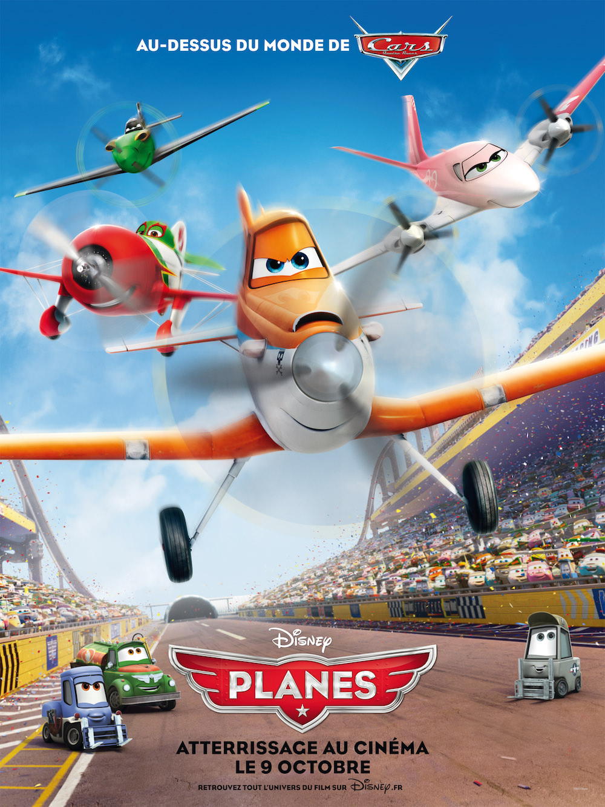
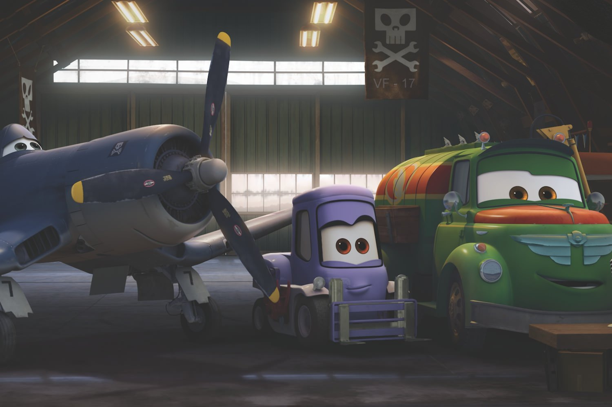

+++
type = "post"
titre = "<em>Planes</em>, Klay Hall"
title = "Planes, Klay Hall"
url = "/planes-hall"
date = "2014-01-02T08:26:54"
Lastmod = "2014-01-01T20:30:38"
cover = "planes-disney.jpg"
categorie = [ "À voir" ]
tag = [ "Animation", "Avion", "Course", "Vite oublié" ]
createur = [ "Klay Hall", "Walt Disney" ]
annee = [ "2013" ]
weight = 2013
pays = [ "États-Unis" ]

+++

« <em>Au-dessus du monde de</em> <a href="/cars-pixar/" title="Cars, John Lasseter">Cars</a> » : l’affiche de <em>Planes</em> ne laisse guère planer le doute, ce nouveau film signé Disney se base sur le film de Pixar sorti en 2006. Sept ans après, le studio a l’idée de reprendre cet univers fantastique où les hommes ont été remplacés par des voitures, mais en s’intéressant aux avions. D’emblée, le long-métrage réalisé par Klay Hall ne s’arroge pas la palme de l’originalité et on pouvait être d’autant plus inquiet que ce n’est pas Pixar qui a mené le projet, même si John Lasseter garde un œil sur le projet en tant que producteur. Le résultat est sans surprise : <em>Planes</em> est un film paresseux qui se contente de capitaliser sur une formule qui a marché. Les enfants seront ravis de découvrir des avions vivants, quand les parents passeront un moment agréable, mais qui sera vite oublié.

<em>Planes</em>, c’est donc <em>Cars</em> dans les airs. Le film reprend l’idée d’appareils mécaniques qui semblent vivants et Klay Hall peut compter sur tout l’imaginaire déployé par le studio Pixar. Force est de constater que cela fonctionne plutôt bien : on s’amuse des relectures à la sauce mécanique de notre monde, avec cette Statue de la Liberté mécanisée ou bien encore les vaches transformées en tracteur et autres idées dissimulées un peu partout. Ce nouveau long-métrage ne peut pas, toutefois, bénéficier de l’effet de surprise : on est en terrain connu. La trame générale emprunte elle aussi au film de Pixar avec cet avion dédié à l’épandage qui rêve de vitesse et de courses. Avec l’aide d’un avion vétéran — encore un point commun avec <em>Cars</em> —, Dusty apprend à voler pour la course et, contre toute attente, il parvient à être qualifié et à gagner quelques courses. On ne racontera pas la suite, mais elle est prévisible au possible : surprendre n’est clairement pas l’ambition de <em>Planes</em>… Le film est au moins divertissant et on passe un bon moment, même si on devine tout ce qui se passe dix bonnes minutes avant que cela se passe. À condition d’oublier ce scénario sur des rails — un comble ! —, on peut noter que le film est techniquement irréprochable, mais on n’en attendait pas moins. Les clichés accumulés sur chaque pays rappellent un peu <a href="/cars-2-pixar/" title="Cars 2, Pixar"><em>Cars 2</em></a> et ce n’est pas forcément une bonne chose, les histoires d’amour sont un peu forcées également. Bref, <strong>Planes</strong> n’est pas un grand film, loin de là, mais il plaira sûrement à tous les enfants qui rêvent d’avions.

Ce film ne devait même pas sortir au cinéma et se contenter d’une discrète sortie en DVD. C’est certainement ce qui arrivera à <em>Planes : Mission Canadair</em>, la suite prévue pour cette année. Le long-métrage signé Klay Hall a bénéficié à une plus grande visibilité avec une sortie au cinéma et avec plus de 1,5 million d’entrées rien qu’en France, c’était indéniablement un bon choix. De fait, <em>Planes</em> n’est pas un mauvais film et pour une séance en famille, il fait très bien l’affaire. On regrette simplement que le génie créatif de Pixar n’ait pas été mis à contribution pour imaginer un récit un petit peu plus original. En l’état, ce n’est qu’un film d’animation de plus, vite regardé, vite oublié. 

<h3>Vous voulez m’aider ?<a href="#footnote_0_10864" id="identifier_0_10864" class="footnote-link footnote-identifier-link" title="&Agrave; propos de la publicit&eacute;&hellip;">1</a></h3>
<ul>
<li><a href="http://www.amazon.fr/gp/product/B00D13OD9W/ref=as_li_ss_tl?ie=UTF8&tag=leblogdenic07-21&linkCode=as2&camp=1642&creative=19458&creativeASIN=B00D13OD9W">Acheter le film en Blu-Ray sur Amazon</a></li>
<li><a href="http://www.amazon.fr/gp/product/B00D13OCDE/ref=as_li_ss_tl?ie=UTF8&tag=leblogdenic07-21&linkCode=as2&camp=1642&creative=19458&creativeASIN=B00D13OCDE">Acheter le film en DVD sur Amazon</a></li>
<li><a href="https://itunes.apple.com/fr/movie/planes/id767108130">Acheter ou louer le film sur l’iTunes Store</a></li>
</ul>

<ol class="footnotes"><li id="footnote_0_10864" class="footnote"><a href="/soutien/">À propos de la publicité…</a> [<a href="#identifier_0_10864" class="footnote-link footnote-back-link">&#8617;</a>]</li></ol>
