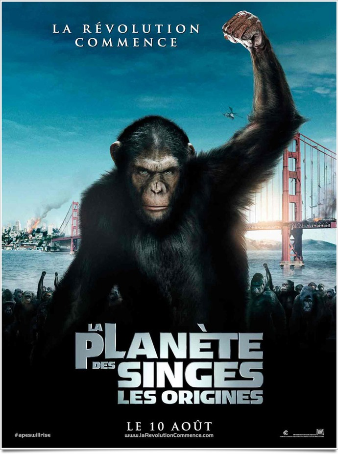
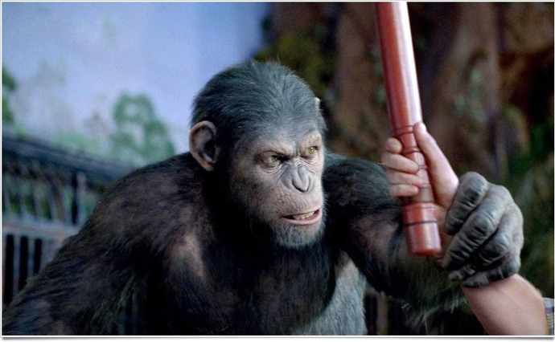

+++
type = "post"
titre = "<em>La Planète des Singes : les origines</em>, Rupert Wyatt"
title = "La Planète des Singes : les origines, Rupert Wyatt"
url = "/planete-singes-origines-wyatt"
date = "2011-08-14T19:46:20"
Lastmod = "2013-12-18T18:44:47"
cover = "planete-singes-origines-wyatt.jpg"
categorie = [ "À voir" ]
tag = [ "Animaux", "Blockbuster", "Drame", "Dystopie", "Famille", "Science-Fiction", "Société" ]
createur = [ "Rupert Wyatt" ]
acteur = [ "Brian Cox", "Freida Pinto", "James Franco" ]
annee = [ "2011" ]
weight = 2011
saga = [ "La Planète des Singes" ]
pays = [ "États-Unis" ]
original = "Rise of the Planet of the Apes"

+++

<em>La Planète des Singes</em> fait partie des œuvres de science-fiction qui ont durablement marqué. Le roman de Pierre Boulle date des années 1960 et il a engendré un nombre incalculable de films, séries et autres œuvres, chacun utilisant l&rsquo;inversion du rôle des singes et des hommes à sa sauce. <em>La Planète des Singes : les origines</em> vient s&rsquo;ajouter à la longue liste, mais il propose un angle original. Plutôt qu&rsquo;un remake de <em><a href="http://voiretmanger.fr/2011/08/15/planete-singes-schaffner/">La Planète des Singes</a></em>, le film de 1968 réalisé par Franklin J. Schaffner, qui était la voie <a href="http://voiretmanger.fr/2011/08/21/planete-singes-burton/">choisie par Tim Burton</a> dans les années 2000, le film de Rupert Wyatt se déroule avant les faits. Comme son nom l&rsquo;indique bien, <em>La Planète des Singes : les origines</em> explique la naissance des singes intelligents. Un choix qui s&rsquo;avère payant : cette nouvelle branche de l&rsquo;histoire commence avec un film extrêmement réaliste et assez nouveau. Une réussite, même si elle ne respecte pas du tout l&rsquo;œuvre originale.

<strong>Ne lisez pas ce qui suit si vous n&rsquo;avez jamais entendu parler de <em>La Planète des Singes</em>…</strong>

Contrairement au roman original et contrairement aux adaptations qui ont suivi, <em>La Planète des Singes : les origines</em> ne se déroule pas dans un lieu et un futur lointains. Le film prend place au contraire dans un futur très proche, à San Francisco. Un jeune scientifique travaille sur un médicament qui pourrait soigner les malades souffrant d&rsquo;Alzheimer. Ce médicament permet au cerveau de générer lui-même des cellules pour remplacer celles qui ne fonctionnent plus par de nouvelles. Testé sur des chimpanzés, ce traitement s&rsquo;avère extrêmement efficace : un singe fait même preuve d&rsquo;une intelligence rare après l&rsquo;avoir subi. Au moment où les tests humains devraient commencer, un incident conduit à la mort du singe et à l&rsquo;arrêt du programme. Le singe s&rsquo;avérait en fait être une mère qui laisse au monde un jeune singe. Récupéré par le scientifique qui l&rsquo;élève chez lui, César fait lui aussi preuve d&rsquo;une rare intelligence. Il comprend les humains et se comporte vite comme un enfant. César devient un fils pour ce scientifique et il semble parfaitement s&rsquo;intégrer… jusqu&rsquo;au jour où ses instincts reprennent temporairement le dessus et César attaque alors un voisin. Enfermé dans un refuge, le singe développe une rancœur tenace à l&rsquo;égard des humains et son intelligence lui permet d&rsquo;envisager une révolte…

<em>La planète des Singes</em> commence normalement avec un postulat : les singes sont devenus intelligents et ils ont pris le pouvoir, inversant l&rsquo;évolution darwinienne que tous les humains considèrent tout à fait normale et ne remettent jamais en cause. Rupert Wyatt a décidé lui de ne pas partir de ce point de départ, mais d&rsquo;expliquer l&rsquo;arrivée à cette inversion. Son film explique donc l&rsquo;origine de l&rsquo;intelligence des singes et le début de leur révolution. Quand <em>La Planète des Singes : les origines</em> se termine, les singes n&rsquo;ont pas encore pris le pouvoir, ils ont simplement mis une belle pagaille dans San Francisco. La révolution viendra sans doute, la fin reste ouverte et appelle indéniablement à une suite, mais ce n&rsquo;est pas le sujet du film. C&rsquo;est un pari osé, les fans seront sans doute surpris de ne jamais trouver <em>La Planète des Singes</em> telle qu&rsquo;ils l&rsquo;imaginaient, mais c&rsquo;est sans doute la meilleure idée du film de Rupert Wyatt. Ce choix permet au film de s&rsquo;affranchir des modèles et de gagner en liberté, mais aussi en réalisme. Presque tout, dans <em>La Planète des Singes : les origines</em>, est réaliste, ou du moins crédible, la seule chose à admettre est que la connaissance du cerveau ait suffisamment augmenté pour que l&rsquo;on sache comment provoquer la croissance de cellules nerveuses. C&rsquo;est beaucoup, certes, mais c&rsquo;est une science-fiction très scientifique et peu fictive. L&rsquo;idée que des singes peuvent nous imiter et faire mieux que nous s&rsquo;avère toujours aussi gênante et forte. Si elle perd ici le message politique qu&rsquo;elle avait dans les premières versions, cette idée est quand même efficace et remet en cause quelques certitudes. Les hommes insistent toujours sur le fait qu&rsquo;il ne s&rsquo;agit que de singes, des êtres inférieurs donc et le film montre bien leur effroi quand ils comprennent que les singes sentent cette condescendance et se vengent. Quand César prononce son premier mot, cet accès au langage est si fort qu&rsquo;il paralyse l&rsquo;homme qui tient pourtant un fusil.

L&rsquo;autre bonne idée de <em>La Planète des Singes : les origines</em> est d&rsquo;inverser le regard sur les hommes et les singes. Traditionnellement, les hommes restent les gentils, tandis que les singes sont les méchants menaçants. Rupert Wyatt a inversé les choses : dans son film, ce sont les humains qui sont prêts à tout pour sauver leur peau et qui n&rsquo;ont absolument aucun égard pour les animaux. Les singes leur servent de souris de laboratoire, ils les traitent comme des moins que rien et n&rsquo;hésitent pas à les massacrer méthodiquement au moindre problème. Paradoxalement, les singes paraissent alors beaucoup plus doux, attentionnés, nous dirions beaucoup plus humains. Même quand ils combattent les hommes, ils ne les tuent pas gratuitement, ils les laissent simplement sonnés ou les enferment dans leurs anciennes cages. Le résultat est logique : le spectateur se sent plus proche des singes que des hommes. Bonne idée, mais qui a aussi un inconvénient : aucun rôle humain ne sort du lot et ils sont globalement peu passionnants. Seule exception notable : Will, le scientifique qui recueille et élève César. Entre le maître et le singe s&rsquo;établit une relation filiale très belle et étonnante dans un tel film. Les regards du singe en disent long sur ce qu&rsquo;il ressent pour son maître, loin des clichés du genre. De fait, <em>La Planète des Singes : les origines</em> reste éloigné d&rsquo;un film de science-fiction traditionnel, pour s&rsquo;approcher plus du drame familial mâtiné de biopic. Le résultat est étonnant, mais finalement assez plaisant.

Si les relations entre le singe et son jeune maître sont réussies, c&rsquo;est d&rsquo;abord parce que la réussite technique est totale. Les singes sont des créations numériques selon la méthode de captation de mouvements (<em>motion capture</em>) exploitée notoirement dans <em><a href="http://voiretmanger.fr/2009/12/18/avatar-james-cameron/">Avatar</a></em>, mais aussi dans <em>Le Seigneur des Anneaux</em>. Cette technologie rend les singes extrêmement convaincants, mais en même temps très humains puisqu&rsquo;il y a un acteur derrière chacun d&rsquo;entre eux. César a ainsi été interprété par Andy Serkis, le même acteur qui se trouvait derrière Gollum. Son travail est vraiment remarquable et on oublie vite toute la technique, ce qui est sans doute le plus beau compliment qu&rsquo;on pourrait lui faire. Au-delà du <em>motion capture</em>, <em>La Planète des Singes : les origines</em> ne brille pas par une réalisation particulièrement brillante. Ce blockbuster estival est correct, sans plus, il remplit son rôle sans grandes idées, mais il est efficace et honnête. On pourra encore une fois regretter des rôles humains souvent assez insignifiants (mentions spéciales pour la copine du scientifique ou pour le gardien des singes), mais c&rsquo;est aussi finalement un parti-pris intéressant.

Une préquelle pour <em>La Planète des Singes</em> ? Dire que l&rsquo;on attendait <em>La Planète des Singes : les origines</em> avec peu d&rsquo;enthousiasme relève encore de l&rsquo;euphémisme, mais le film de Rupert Wyatt crée la surprise pour cette saison estivale assez fade côté blockbusters. Le film n&rsquo;est pas un chef-d&rsquo;œuvre, il n&rsquo;en a pas non plus l&rsquo;ambition : c&rsquo;est l&rsquo;ouverture honnête et pleine de potentiel d&rsquo;une nouvelle série qui, on l&rsquo;espère, maintiendra ce bon niveau. En attendant d&rsquo;en voir plus, <em>La Planète des Singes : les origines</em> est sans doute le meilleur blockbuster à pop-corn à voir en ce moment : si vous en cherchez un, c&rsquo;est une valeur sûre.

<h3>Vous voulez m&rsquo;aider ?<a href="#footnote_0_5025" id="identifier_0_5025" class="footnote-link footnote-identifier-link" title="&Agrave; propos de la publicit&eacute;&hellip;">1</a></h3>
<ul>
<li><a href="http://www.amazon.fr/gp/product/B005DS9YIS/ref=as_li_ss_tl?ie=UTF8&tag=leblogdenic07-21&linkCode=as2&camp=1642&creative=19458&creativeASIN=B005DS9YIS">Acheter le film en Blu-Ray et DVD sur Amazon</a></li>
<li><a href="http://www.amazon.fr/gp/product/B005DS9YC4/ref=as_li_ss_tl?ie=UTF8&tag=leblogdenic07-21&linkCode=as2&camp=1642&creative=19458&creativeASIN=B005DS9YC4">Acheter le film en DVD sur Amazon</a></li>
<li><a href="https://itunes.apple.com/fr/movie/la-planete-des-singes-les/id464566095">Acheter ou louer le film sur l&rsquo;iTunes Store</a></li>
</ul>
<ul>
<li><a href="http://www.amazon.fr/gp/product/B005MON9WU/ref=as_li_ss_tl?ie=UTF8&tag=leblogdenic07-21&linkCode=as2&camp=1642&creative=19458&creativeASIN=B005MON9WU">Acheter l&rsquo;intégralité de la saga en Blu-Ray sur Amazon</a></li>
<li><a href="http://www.amazon.fr/gp/product/B005MON9ZW/ref=as_li_ss_tl?ie=UTF8&tag=leblogdenic07-21&linkCode=as2&camp=1642&creative=19458&creativeASIN=B005MON9ZW">Acheter l&rsquo;intégralité de la saga en DVD sur Amazon</a></li>
</ul>

<ol class="footnotes"><li id="footnote_0_5025" class="footnote"><a href="http://voiretmanger.fr/soutien/">À propos de la publicité…</a> [<a href="#identifier_0_5025" class="footnote-link footnote-back-link">&#8617;</a>]</li></ol>
