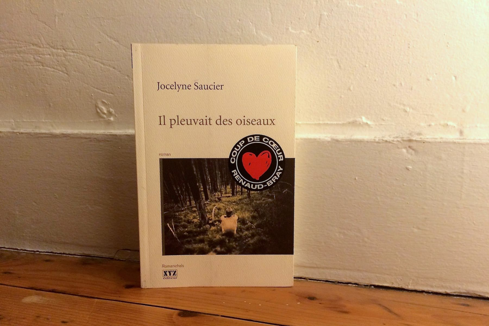
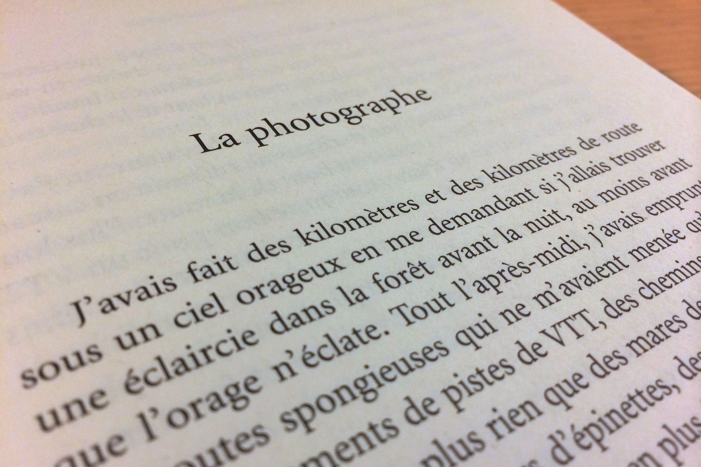

+++
type = "post"
titre = "<em>Il pleuvait des oiseaux</em>, Jocelyne Saucier"
title = "Il pleuvait des oiseaux, Jocelyne Saucier"
url = "/pleuvait-oiseaux-saucier"
date = "2014-02-19T23:02:32"
Lastmod = "2014-02-19T23:04:45"
cover = "il-pleuvait-des-oiseaux-saucier.jpg"
categorie = [ "À lire" ]
tag = [ "Amour", "Histoire", "Nature", "Roman" ]
createur = [ "Jocelyne Saucier" ]
annee = [ "2011" ]
weight = 2011
pays = [ "Canada" ]

+++

Publié au Canada en 2011, disponible en France depuis l’an dernier, <em>Il pleuvait des oiseaux</em> est le quatrième roman de Jocelyne Saucier, romancière que l’on connaît mal de ce côté de l’Atlantique. Et pourtant, ce récit surprenant montre bien que l’on devrait s’intéresser de plus près à son œuvre. Atypique, ce roman évoque un épisode largement méconnu de l’histoire canadienne, tout en composant des personnages étonnants et surtout touchants. Porté par une prose simple, mais pas simpliste, <em>Il pleuvait des oiseaux</em> s’impose à son lecteur avec beaucoup de force. Un roman surprenant et très plaisant, à découvrir.

<blockquote class="pull-quote">
Les Grands Feux ont eu leurs héros et leurs martyrs. Boychuck n’était ni l’un ni l’autre, mais il apparaissait dans tous les récits des survivants du Grand Feu de Matheson, même ceux qui ne le connaissaient pas, qui ne l’avaient jamais vu, qui n’avaient rien à témoigner à son sujet. […] Le garçon qui marchait dans les décombres fumants. C’est ainsi qu’on le désignait le plus souvent.<cite class="author"> — Jocelyne Saucier, Il pleuvait des oiseaux, Les Grands Feux</cite>

</blockquote>

Jocelyne Saucier construit son récit à partir d’un fait historique. Dans les années 1910, le nord de l’Ontario est touché par <a href="http://en.wikipedia.org/wiki/Great_Fire_of_1922">plusieurs</a> <a href="http://en.wikipedia.org/wiki/Matheson_Fire">incendies</a>, surnommés ici « <em>Grands Feux</em> », qui ont tué plusieurs centaines de personnes et détruit des villes et des étendues immenses de forêts en un jour seulement. Le roman commence avec une photographe qui enquête sur ces feux et veut photographier tous les survivants. Elle a entendu parler d’un homme que tous les survivants évoquent, mais à chaque fois avec des anecdotes différentes. Ce Boychuck ressemble fort à une légende et <em>Il pleuvait des oiseaux</em> commence un peu comme une enquête, avec cette photographe qui part à sa recherche dans la forêt profonde, comme le Canada en compte tant. Cette piste s’avère toutefois très rapidement fausse, puisque l’on apprend dans les premières pages que cet homme vient de mourir. Jocelyne Saucier oriente alors son récit vers autre chose et son roman s’attache à ces vieillards qui ont décidé de tout plaquer pour venir terminer leur vie dans des cabanes rudimentaires au cœur de la forêt. À la lecture, on ne peut qu’être saisi par la simplicité de l’ensemble : simplicité du style, on l’évoquait, mais aussi du récit qui ne repose jamais sur des artifices pour avancer, mais pose plutôt ses personnages et les quelques évènements avec beaucoup de douceur.

On pourrait croire que c’est une histoire sans intérêt, il n’en est rien : malgré — ou peut-être à cause de — cette simplicité, <em>Il pleuvait des oiseaux</em> s’avère toujours prenant et on lit ce bref roman (moins de 200 pages) avec beaucoup de facilité. Ces vieux marginaux qui vivent au jour le jour, tranquillement, en attendant la mort dont il se moque régulièrement, semblent totalement anodins <em>a priori</em>, et pourtant on se passionne pour eux dès les premières pages. La romancière sait entretenir le doute avec une troublante histoire de drogue, mais c’est essentiellement une fausse piste. Et puis il y a cette femme qui débarque comme à l’improviste en cours de route et qui bouleverse tout. L’air de rien, le roman avance ainsi et parvient à capter l’attention, peut-être par sa simplicité apparente. On a envie d’en savoir plus sur cette légende, cet antihéros qui hante le lecteur autant que la photographe. Et puis qui sont ces hommes qui viennent mourir loin de leurs anciennes vies ? Que cherche au juste cette photographe qui n’a aucun lien avec eux ? Jocelyne Saucier ne répond pas nécessairement à toutes ces questions, mais l’important est qu’on se les pose et que l’on ne sache jamais exactement où va <em>Il pleuvait des oiseaux</em>. Il commence à la première personne, mais entretient d’emblée le doute en multipliant les narrateurs. On ne serait pas surpris si une touche de fantastique venait s’y mêler, mais ce n’est pas une bonne piste. À la fin, le « je » a totalement disparu, sans que l’on sache bien pourquoi, au fond. Dommage qu’après tant de mystères, le roman ne sache pas conserver une fin ouverte, mais ce n’est qu’un petit défaut qui ne vient pas gâcher le plaisir de l’ensemble.

<em>Il pleuvait des oiseaux</em> n’est pas nécessairement le roman le plus engageant au premier abord, et pourtant Jocelyne Saucier parvient à nous emporter dans les profondeurs des forêts canadiennes. Sans que l’on sache très bien pourquoi, ce récit étonnant est aussi passionnant et on le suit avec beaucoup de plaisir. Un livre à découvrir !

<h3>Vous voulez m’aider ?<a href="#footnote_0_11206" id="identifier_0_11206" class="footnote-link footnote-identifier-link" title="&Agrave; propos de la publicit&eacute;&hellip;">1</a></h3>
<ul>
<li><a href="http://www.amazon.fr/gp/product/2207116107/ref=as_li_ss_tl?ie=UTF8&#038;tag=leblogdenic07-21&#038;linkCode=as2&#038;camp=1642&#038;creative=19458&#038;creativeASIN=2207116107">Acheter le roman sur Amazon</a></li>
<li><a href="https://itunes.apple.com/fr/book/il-pleuvait-des-oiseaux/id476639429?mt=11">Télécharger le roman sur l’iBooks Store</a></li>
</ul>

<ol class="footnotes"><li id="footnote_0_11206" class="footnote"><a href="http://voiretmanger.fr/soutien/">À propos de la publicité…</a> [<a href="#identifier_0_11206" class="footnote-link footnote-back-link">&#8617;</a>]</li></ol>
