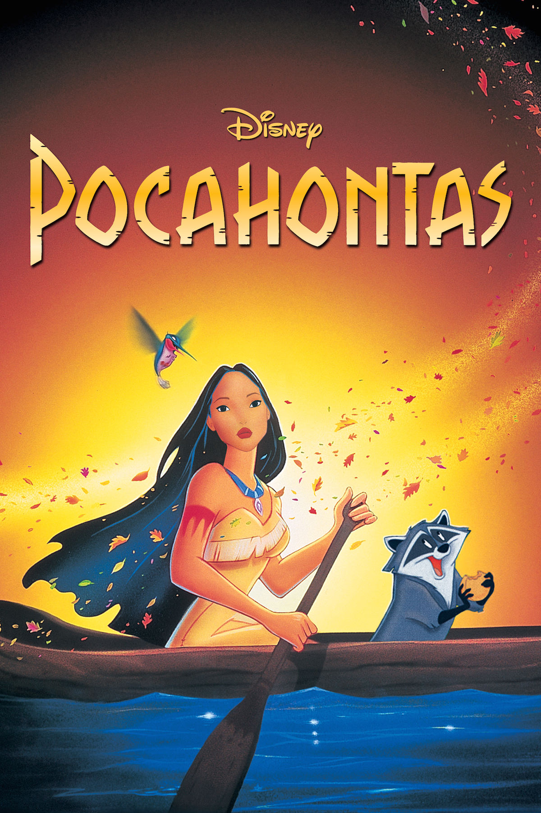
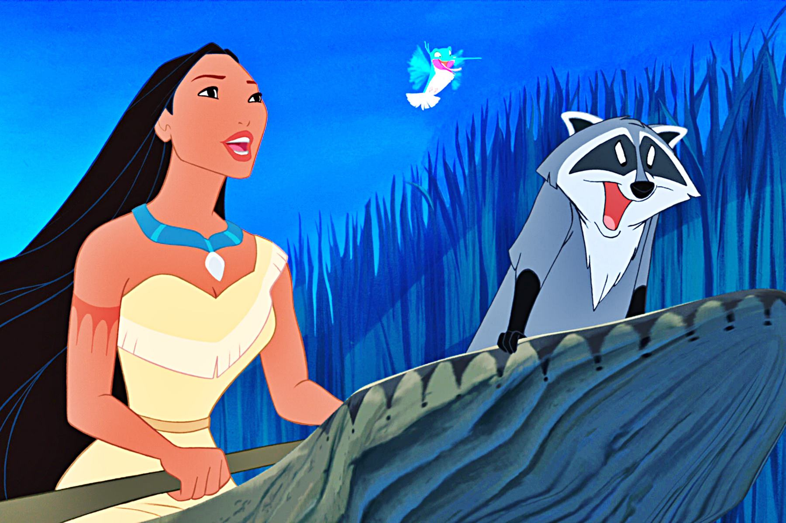

+++
titre = "<em>Pocahontas, une légende indienne</em>, Mike Gabriel et Eric Goldberg"
title = "Pocahontas, une légende indienne, Mike Gabriel et Eric Goldberg"
url = "/pocahontas-legende-indienne-gabriel-goldberg"
date = "2014-06-27T21:34:00"
Lastmod = "2014-06-27T21:36:34"
cover = "pocahontas-legende-indienne.jpg"
categorie = [ "À voir" ]
tag = [ "Amour", "Animation", "Comédie musicale", "Comédie romantique", "Drame", "Écologie", "Histoire", "Histoire vraie", "Nature" ]
createur = [ "Eric Goldberg", "Mike Gabriel" ]
annee = [ "1995" ]
weight = 1995
saga = [ "Classiques d'animation Disney" ]
pays = [ "États-Unis" ]
original = "Pocahontas"

+++

Conçu pendant cinq années, mobilisant plus de 600 personnes dans le studio, <em>Pocahontas, une légende indienne</em> est censé être le nouveau chef-d’œuvre du studio, après la réussite et le succès commercial d’<a href="http://voiretmanger.fr/aladdin-musker-clements/" title="Aladdin, John Musker et Ron Clements"><em>Aladdin</em></a>. C’est un gros projet, mais le succès n’a pas été à la hauteur des ambitions de Disney. Il faut dire que le trente-troisième <a href="http://voiretmanger.fr/saga/classiques-danimation-disney/">classique</a> s’est fait griller la politesse par <a href="http://voiretmanger.fr/roi-lion-allers-minkoff/" title="Le Roi Lion, Roger Allers et Rob Minkoff"><em>Le Roi Lion</em></a>, le petit projet qui devait uniquement occuper le terrain en attendant la sortie de ce film. Pendant que les meilleurs animateurs et scénaristes travaillaient sur cette relecture de <em>Roméo et Juliette</em>, une petite équipe a produit sans vraiment le savoir un vrai chef-d’œuvre, une œuvre qui a ému le monde entier en touchant, par sa simplicité même, l’universel. Pourtant, <em>Pocahontas, une légende indienne</em> avait aussi beaucoup de potentiel : s’inspirant pour la première fois d’une histoire vraie et de l’histoire des États-Unis, le studio tenait un joli récit de princesse qui s’éloigne des standards du conte avec une lecture plus moderne. Malheureusement, malgré une animation soignée et quelques beaux moments, le film de Mike Gabriel et Eric Goldberg peine à divertir et il se résume vite à une histoire d’amour qui a des airs de déjà-vu.

<a href="http://fr.wikipedia.org/wiki/Pocahontas">Pocahontas</a> est un personnage historique, mais les récits qui s’en inspirent sont en général assez éloignés de la réalité historique. C’est particulièrement vrai pour la relecture Disney qui est, comme toujours, sérieusement romancée. De l’idée originale, Mike Gabriel et Eric Goldberg retiennent une histoire d’amour probablement inventée de toute pièce — l’action se déroulant au début du XVIIe siècle, on manque de preuves, mais la jeune indienne devait avoir une douzaine d’années quand elle rencontre John Smith. Qu’importe que le récit soit réel ou fictif, <em>Pocahontas, une légende indienne</em> est une histoire d’amour qui revisite le mythe de Roméo et Juliette : John Smith est un Anglais venu mâter les autochtones du Nouveau Monde pendant que le reste de l’équipage cherche de l’or ; Pocahontas est la fille du chef indien local qui entre en conflit contre les envahisseurs. Tout les oppose, et pourtant dès le premier regard, c’est le coup de foudre. Ensemble, ils vont tout faire pour s’opposer à la guerre qui semble inévitable : le scénario n’est pas très original, mais ce n’est jamais vraiment le point fort des Disney. De manière plus surprenante en revanche, ce film est aussi beaucoup plus sérieux que ses prédécesseurs. Certes, Mike Gabriel et Eric Goldberg ménagent de la place pour des personnages secondaires comiques, ici uniquement des animaux qui, chose rare supplémentaire, ne parlent pas. Mais ces touches comiques ne sont jamais aussi marquées que dans <em>Aladdin</em> ou même dans <em>Le Roi Lion</em> : la relation amoureuse prend toute la place ici, si bien que cette comédie romantique est sérieuse, très sérieuse.

<em>Pocahontas, une légende indienne</em> a des arguments à faire valoir, à commencer par son style graphique très travaillé, même si cela ne se remarque pas forcément. Les studios ont décidé de repartir sur une vieille idée avec un style épuré et souvent assez carré qui n’est pas sans rappeler par certains aspects <a href="http://voiretmanger.fr/belle-bois-dormant-geronimi/" title="La Belle au bois dormant, Clyde Geronimi"><em>La Belle au bois dormant</em></a>. C’est moins impressionnant à première vue que le travail réalisé pour <em>Le Roi Lion</em>, mais il faut reconnaître que le long-métrage est très soigné et propose des paysages de toute beauté. L’animation fait aussi un bond en avant en matière de réalisme pour les humains : même si on a fait beaucoup mieux depuis, les deux personnages principaux en particuliers sont très bien dessinés et animés. Pour la première fois d’ailleurs, une femme a des formes généreuses et une chevelure qui n’est pas complètement statique : pour un film sorti il y a près de vingt ans et qui ne bénéficiait pas encore des options quasiment infinies offertes par l’informatique, c’est impressionnant. <em>Pocahontas, une légende indienne</em> est aussi une comédie musicale réussie avec certaines chansons qui ont marqué les spectateurs, même si sur ce registre, il est difficile de passer après les classiques Disney des années précédentes. Le plus gros défaut du film au fond, c’est peut-être encore une fois son ton trop sérieux et une histoire qui est un peu passée à la trappe face à son sujet. Le long-métrage est trop sérieux, sans l’être suffisamment pour être crédible sur le plan historique : on reste dans un entre-deux qui ne convient pas vraiment au projet. Le discours écologique de Pocahontas est toutefois une idée moderne et surprenante à l’époque : le discours se fait presque ouvertement politique, ce qui est rare, voire unique, chez Disney.

Ironie de l’histoire, le grand projet de Disney, le film qui mobilise toutes les forces du studio a fait beaucoup moins bien que le projet secondaire auquel personne ne croyait. Sorti un an seulement après <em>Le Roi Lion</em>, <em>Pocahontas, une légende indienne</em> a du mal à tenir la comparaison. Non pas que ce classique soit mauvais, mais il paraît bien fade après plusieurs bijoux d’animation. Trop sérieux et pas assez crédible à la fois, le long-métrage réalisé par Mike Gabriel et Eric Goldberg est bloqué dans un entre-deux qui ne lui convient pas. Reste une comédie romantique et musicale efficace et qui a d’ailleurs trouvé son public.

<h3>Vous voulez <a href="http://voiretmanger.fr/soutien/">m’aider</a> ?</h3>
<ul>
<li><a href="http://www.amazon.fr/gp/product/B007MFUGKU/ref=as_li_ss_tl?ie=UTF8&amp;tag=leblogdenic07-21&amp;linkCode=as2&amp;camp=1642&amp;creative=19458&amp;creativeASIN=B007MFUGKU">Acheter le film en Blu-ray sur Amazon</a></li>
<li><a href="http://www.amazon.fr/gp/product/B00005NYXP/ref=as_li_ss_tl?ie=UTF8&amp;tag=leblogdenic07-21&amp;linkCode=as2&amp;camp=1642&amp;creative=19458&amp;creativeASIN=B00005NYXP">Acheter le film en DVD sur Amazon</a></li>
<li><a href="https://itunes.apple.com/fr/movie/pocahontas-une-legende-indienne/id369305202">Acheter ou louer le film sur l’iTunes Store</a></li>
</ul>

