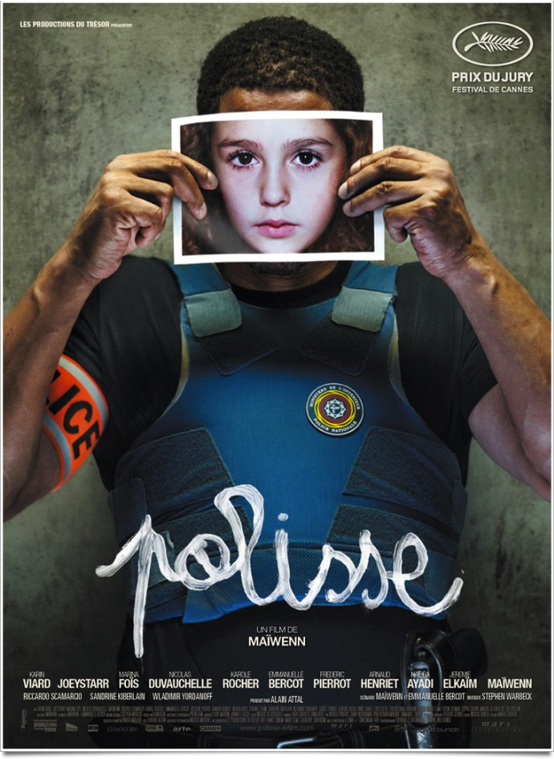
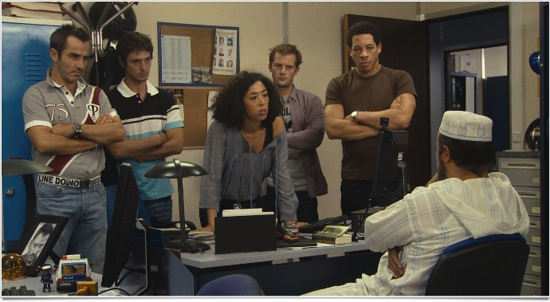
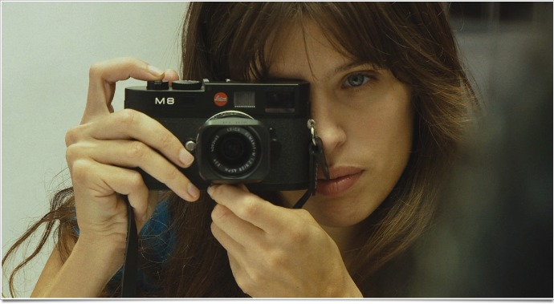

+++
titre = "Polisse, Maïwenn"
title = "Polisse, Maïwenn"
url = "/polisse-maiwenn"
date = "2011-11-01T17:43:52"
Lastmod = "2012-10-24T15:03:59"
cover = "polisse-joey-starr.jpg"
categorie = [ "À voir" ]
tag = [ "Amour", "Drame", "Police", "Société" ]
createur = [ "Maïwenn" ]
acteur = [ "Joey Starr", "Karin Viard", "Maïwenn", "Marina Foïs" ]
annee = [ "2011" ]
weight = 2011
pays = [ "France" ]

+++

Prix du Jury mérité à Cannes, <em>Polisse</em> est le nouveau film de Maïwenn. Après un surprenant <em><a href="http://voiretmanger.fr/2009/02/08/le-bal-des-actrices-maiwenn/">Le Bal des Actrices</a></em> dans lequel elle filmait des actrices et une réalisatrice en train de faire un film, la cinéaste continue de nous étonner avec une plongée tour à tour éprouvante et complètement folle au cœur de la brigade de protection des mineurs (BPM). <em>Polisse</em> est un long-métrage qui oscille entre documentaire, série télévisée pour constituer un véritable film de cinéma. Un coup de poing à ne pas rater.

Maïwenn ne ménage pas ses spectateurs. D&rsquo;entrée de jeu, <em>Polisse</em> place ses caméras au cœur de la brigade et de leur quotidien de viols, d&rsquo;incestes, de pédophiles ou simplement de maltraitances. Le film ne suit pas une trame scénaristique précise, mais s&rsquo;attache plutôt à suivre le quotidien de ces hommes et de ces femmes dévoués à leur travail. On sera avec eux pendant quelques mois et pendant deux heures qui ne passent en un rien de temps. Largement le temps en tout cas de constater l&rsquo;étendue de leur travail. S&rsquo;il y a des journées spectaculaires, comme cette attaque générale contre un camp de gens du voyage, il y a aussi le quotidien fait de dépositions. Les membres de la BPM en voient des vertes et des pas mures au quotidien : cette fille qui accepte tout naturellement de sucer pour récupérer son téléphone, cette mère qui branle son fils de quatre ans tous les soirs, ce père de famille qui a des relations sexuelles avec sa fille d&rsquo;une dizaine d&rsquo;années tous les jours… Beaucoup d&rsquo;horreurs, mais aussi le quotidien d&rsquo;une société en crise, comme le montre bien cette séquence déchirante où une mère vient abandonner son fils auprès de la brigade, faute de pouvoir le loger au sec… Au milieu de tout cela, une photographe chargée de faire un livre sur la brigade. Présent en permanence dans un coin, elle prend en photo tout ce qu&rsquo;elle voit, quitte à agacer certains policiers. C&rsquo;est notamment le cas de Fred qui craque vite en sa présence finalement beaucoup plus significative qu&rsquo;il n&rsquo;y paraissait…

À l&rsquo;image du travail de Melissa, photographe dans le film, <em>Polisse</em> permet au grand public de voir le travail de la BPM au quotidien. On connaît mal cette police en général moins spectaculaire et moins télévisuelle que celle qui arrête les grands bandits ou que celle qui démantèle des réseaux de drogue et son travail est pourtant tout aussi essentiel. Le film montre bien comment la police elle-même hiérarchise ses services et place la protection des mineurs tout en bas de l&rsquo;échelle : quand il faut réduire les moyens, si une autre brigade a besoin de voitures ou de personnels, c&rsquo;est toujours la BPM qui en pâtit. C&rsquo;est un travail difficile, long et souvent sans résultat : il faut parcourir les rues de Paris pendant des jours entiers à la recherche d&rsquo;une mère et de son nourrisson. Souvent, les membres de la brigade ont le sentiment que leur travail ne sert à rien, surtout face à l&rsquo;échec, toujours dramatique dans de telles circonstances. <em>Polisse</em> évite de tomber dans l&rsquo;excès de sensationnalisme ou, pire, de misérabilisme, mais le film montre une réalité difficile sans rien nous épargner et le résultat est souvent poignant. Quand le film se termine, on aurait presque envie d&rsquo;applaudir ces hommes et femmes, voire même de leur envoyer des dons ou plus fou encore, de s&rsquo;engager dans leur brigade.

Fou, il faudrait l&rsquo;être pour s&rsquo;engager. Le travail de la BPM est essentiel, mais il est aussi extrêmement difficile, beaucoup trop sans doute. <em>Polisse</em> n&rsquo;est pas seulement un film sur le quotidien d&rsquo;une brigade, c&rsquo;est aussi un film sur des hommes et femmes brisés par leur métier. Maïwenn ménage quelques scènes de vie quotidienne pour chaque acteur, ce qui suffit amplement pour comprendre qu&rsquo;aucun ne s&rsquo;en sort indemne. Travailler à la BPM, c&rsquo;est consacrer sa vie à la brigade et tout lui sacrifier : aucun couple n&rsquo;a ainsi résisté. Tous sont divorcés, en instance de divorce ou alors dans une situation difficile avec son conjoint. Ces policiers peuvent travailler de quatre heures du matin jusqu&rsquo;à 23 heures sans discontinuer et ils doivent malgré tout se lever le lendemain, repartir au travail. La fatigue est physique, mais elle est surtout morale : vivre au quotidien avec les pires horreurs de l&rsquo;humanité n&rsquo;est pas bon pour le moral, surtout quand l&rsquo;action de la brigade mène à l&rsquo;échec. Les revers sont difficiles à vivre et sans trop en dévoiler de la fin du film, disons simplement que les conséquences peuvent alors être terribles. Ils devraient ne pas prendre leur travail trop à cœur, laisser faire, se résigner, mais pas un ne peut vraiment le faire : tous à leur manière, ils subissent ce quotidien à la BPM et ils morflent…

Maïwenn réalise son troisième film et comme dans les deux précédents, elle interprète un des rôles de <em>Polisse</em>. Dans le film, elle est Mélissa, la photographe timide qui essaie de se faire une place dans la brigade : une mise en abîme intéressante puisque l&rsquo;on imagine qu&rsquo;elle joue ici son propre rôle quand, préparant son film, elle est sûrement allée dans la brigade de protection des mineurs. On a souvent reproché à la jeune cinéaste de trop se mettre en avant dans ses films, cela ne sera pas le cas avec <em>Polisse</em>. Son rôle est au contraire réservé et on la voit peu, au moins dans la première partie du film. Au cœur de <em>Polisse</em>, les policiers de la brigade sont filmés avec un réalisme qui impressionne vraiment. Il n&rsquo;y a que des acteurs, certains sont bien connus, mais tous font des policiers troublants de vérité. Dans l&rsquo;ensemble, Joey Starr surprend à nouveau avec un rôle à contrepied de son image de rappeur, un rôle qu&rsquo;il épouse parfaitement et qui lui va très bien. De manière générale, <em>Polisse</em> est un film extrêmement réaliste, au point que l&rsquo;on pourrait parfois le confondre avec un documentaire. Ce n&rsquo;est évidemment pas le cas, tout est très écrit et travaillé, mais le résultat est là : on y croit. D&rsquo;aucuns ont pu dire que le film n&rsquo;était qu&rsquo;un téléfilm sans intérêt, mais c&rsquo;est injuste pour <em>Polisse</em>. Le film a parfois un côté série télé, mais c&rsquo;est un point positif et son art du cadre et surtout du montage justifie tout à fait la place du film dans des salles de cinéma…

<em>Polisse</em> fait un peu l&rsquo;effet d&rsquo;un coup de poing. Le film dure deux heures et demie, mais son rythme intense empêche de les voir passer et on est vraiment emporté par le résultat. Maïwenn a réussi à proposer une plongée loin de toute caricature au cœur de la brigade de protection des mineurs et le résultat est vraiment satisfaisant. C&rsquo;est dur, mais on est ravi d&rsquo;avoir passé un peu de temps en compagnie de ces hommes et de ces femmes… un film à voir.

<h3>Vous voulez m&rsquo;aider ?<a href="#footnote_0_5266" id="identifier_0_5266" class="footnote-link footnote-identifier-link" title="&Agrave; propos de la publicit&eacute;&hellip;">1</a></h3>
<ul>
<li><a href="http://www.amazon.fr/gp/product/B0064JV3W0/ref=as_li_ss_tl?ie=UTF8&#038;tag=leblogdenic07-21&#038;linkCode=as2&#038;camp=1642&#038;creative=19458&#038;creativeASIN=B0064JV3W0">Acheter le film en Blu-Ray sur Amazon</a></li>
<li><a href="http://www.amazon.fr/gp/product/B0064JV3PM/ref=as_li_ss_tl?ie=UTF8&#038;tag=leblogdenic07-21&#038;linkCode=as2&#038;camp=1642&#038;creative=19458&#038;creativeASIN=B0064JV3PM">Acheter le film en DVD sur Amazon</a></li>
</ul>

<ol class="footnotes"><li id="footnote_0_5266" class="footnote"><a href="http://voiretmanger.fr/a-propos/publicite/">À propos de la publicité…</a> [<a href="#identifier_0_5266" class="footnote-link footnote-back-link">&#8617;</a>]</li></ol>
