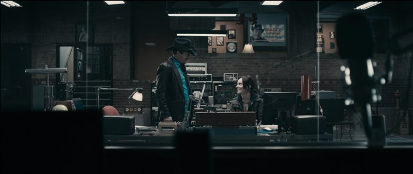
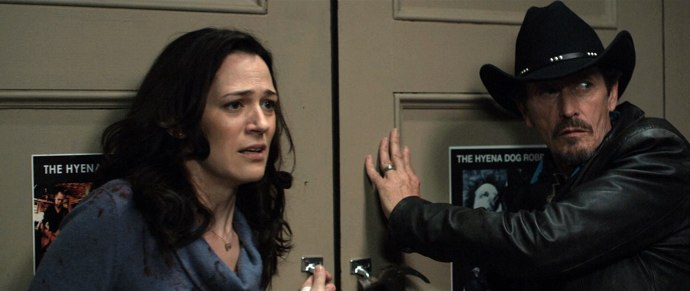

+++
type = "post"
titre = "Pontypool, Bruce McDonald"
title = "Pontypool, Bruce McDonald"
url = "/pontypool-mcdonald"
date = "2010-11-18T01:03:23"
Lastmod = "2010-11-19T00:38:05"
cover = "pontypool-mchattie.jpg"
categorie = [ "À voir" ]
tag = [ "Horreur", "Huis clos", "Suspense", "Thriller" ]
createur = [ "Bruce McDonald" ]
acteur = [ "Stephen McHattie" ]
annee = [ "2008" ]
weight = 2008

+++

Parfois, l&rsquo;image est presque de trop au cinéma. Trop explicite, trop convenue, trop attendue. <em>Pontypool</em> le prouve brillamment en faisant un film de radio, un film où tout passe par la voix, les sons. Ce film canadien sorti en 2008 n&rsquo;a pas eu les honneurs d&rsquo;une sortie française, et pourtant c&rsquo;est un grand film. Un film qui vous emporte avec quelques voix, beaucoup d&rsquo;inconnus, de doutes et très peu de sang malgré son statut de film de zombies. À ne pas rater…

<a href="http://www.allocine.fr/film/fichefilm_gen_cfilm=143445.html">

</a>

<a href="http://maps.google.com/maps?f=q&amp;source=s_q&amp;hl=fr&amp;geocode=&amp;q=Pontypool,+Ontario,+Canada&amp;ie=UTF8&amp;hq=&amp;hnear=Pontypool,+Kawartha+Lakes+Division,+Ontario,+Canada&amp;ll=44.319918,-78.458862&amp;spn=2.14582,4.746094&amp;z=8">Pontypool, Ontario.</a> C&rsquo;est dans la radio locale de cette petite bourgade située au nord du lac Ontario au Canada qu&rsquo;officie désormais Grant Mazzy. Cet animateur au look de biker était autrefois une star sur les radios nationales, mais les temps ont changé et son brillant passé derrière lui. L&rsquo;adaptation à cette radio locale où l&rsquo;on parle essentiellement de chats écrasés et autres informations palpitantes ne se fait pas sans heurt. Entre deux pistes de musique, il donne des informations générales ou fait le point sur la circulation avec Ken et son presque hélicoptère du soleil. De quoi satisfaire les gens du cru donc, mais pas le vieil homme qui regrette sa gloire d&rsquo;antan et peine à s&rsquo;habituer au temps apparemment vraiment pourri de la région. Difficile aussi pour lui d&rsquo;écouter les consignes de sa supérieure, Sydney, qui entend bien satisfaire ses auditeurs et peine à contrôler cet animateur de l&rsquo;ancienne garde, certainement un ancien hippie qui entend éveiller les consciences et critique la police bourrée, tandis que lui s&rsquo;enfile une bouteille de whisky sans même se cacher.

Depuis le sous-sol de l&rsquo;église où émet la radio, des rumeurs étranges commencent à arriver. Des appels de citoyens affolés et incompréhensibles d&rsquo;abord, la rumeur d&rsquo;une manifestation ensuite, plus d&rsquo;une émeute autour de la maison d&rsquo;un docteur de Pontypool. Les informations se précisent progressivement alors que l&rsquo;envoyé de la radio se retrouve au cœur des émeutes, et que la BBC, télévision nationale, les appelle pour obtenir des informations. On parle de cannibalisme, de mots incompréhensibles prononcés par les victimes avant leurs agressions sanglantes. Bref, on est en pleine attaque de zombies. <em>Pontypool</em> pourrait dès lors ressembler à tant de films de genre, multiplier les attaques, les effusions de sang et la chair fraiche. Mais le film évite le piège de la facilité et conserve presque jusqu&rsquo;au bout son originalité qui est aussi sa force : l&rsquo;économie de moyens. Rendue nécessaire par un budget que l&rsquo;on imagine serré, cette économie n&rsquo;est pas un frein pour le film, bien au contraire. À la manière de l&rsquo;écriture sous contrainte des Oulipiens, l&rsquo;économie de moyens contraint <em>Pontypool</em> à imaginer de nouveaux moyens de dire sans montrer, de faire comprendre sans expliciter à l&rsquo;écran. Concrètement, le film de Bruce McDonald prend la forme d&rsquo;un huis clos puisque toute l&rsquo;action se déroule dans le studio de radio. Économie aussi dans le nombre d&rsquo;acteurs : 3 principaux, quelques figurants, mais guère plus. Économie enfin dans les effets : on voit très peu de sang ou même de zombies dans <em>Pontypool</em> et au moins toute la première partie se déroule à l&rsquo;intérieur du studio seulement et sans la moindre trace à l&rsquo;écran de zombies. Cette propension à détourner la faiblesse sur le papier en force à l&rsquo;écran participe indéniablement à la réussite du film.

S&rsquo;il ne se passe pas beaucoup de choses à l&rsquo;écran, <em>Pontypool</em> est loin d&rsquo;être un film vide. Il s&rsquo;y passe beaucoup de choses, mais plutôt que d&rsquo;être visibles sur la pellicule, elles sont à entendre dans la bande sonore. Bruce McDonald a fait le choix très malin de tout faire passer, ou presque, par les voix de ses personnages et tout particulièrement par celle de Mazzy, chaude et sensuelle. Une vraie voix de radio, extrêmement efficace, posée, claire et forte. C&rsquo;est un véritable régal que de l&rsquo;écouter parler : on est comme captivé dès qu&rsquo;il ouvre la bouche et il parvient à capter l&rsquo;attention avec autant de force qu&rsquo;il évoque la disparition d&rsquo;un chat ou une émeute ayant causé de nombreux morts. Plus que l&rsquo;acteur, c&rsquo;est vraiment la voix qui tient ici un rôle central, comme si c&rsquo;était finalement un personnage à part entière. Il va de soit qu&rsquo;il faut absolument voir la VO pour en profiter, je n&rsquo;ose imaginer ce que doit donner la version française, une catastrophe sans aucun doute… Mais <em>Pontypool</em> ne serait rien si ses voix ne racontaient pas quelque chose. Au-delà de l&rsquo;histoire de zombies, le film de McDonald est remarquable par ses dialogues d&rsquo;un très haut niveau. <em>Pontypool</em> est un film très bavard puisque les dialogues y sont quasiment interrompus du début à la fin. Et ce sont des dialogues très réussis qui nous sont proposés, tantôt drôles ou ironiques, tantôt plein de tension, inquiets ou stressés. Le film parvient à proposer un très large spectre de sensations, la peur de l&rsquo;inconnu étant la plus forte, uniquement par les mots et par l&rsquo;intonation. Le rôle des mots va même beaucoup plus loin puisqu&rsquo;ils ont une responsabilité dans la maladie subite de toute la ville. <em>Pontypool</em> est ainsi marqué par un discours original et intéressant sur les mots, leur sens et leur pouvoir. Le fait que le film se déroule entièrement de radio, empire des mots par excellence, n&rsquo;est bien sûr pas anodin.

<em>Pontypool</em> ne bluffera personne par la qualité ou l&rsquo;inventivité de ses effets spéciaux, mais ce n&rsquo;est vraiment pas son objectif. Le réalisateur n&rsquo;a eu à sa disposition qu&rsquo;un faible budget, mais au lieu d&rsquo;essayer d&rsquo;en faire trop avec cet argent, il a décidé d&rsquo;en tirer parti jusqu&rsquo;au bout. Le huis clos, genre économe par excellence, s&rsquo;imposait de lui-même, mais loin d&rsquo;être une rustine posée à la hâter pour masquer des faiblesses techniques, le huis clos est ici totalement justifié par le scénario et même rendu nécessaire par l&rsquo;histoire. En outre, si huis clos il y a, il est suffisamment large pour ne pas devenir totalement surréaliste. <em>Pontypool</em> est un film de zombies dans le sens où il contient des zombies, mais c&rsquo;est loin d&rsquo;être un film de genre. Pendant une première large partie, il n&rsquo;y a d&rsquo;ailleurs aucune apparition de zombies, même si leur existence se précise par les descriptifs oraux. Quand ils apparaissent enfin, on ne les attendait plus vraiment et le film en propose deux ou trois, plutôt bien réalisés cela dit, en guise d&rsquo;exemples. Plus qu&rsquo;un film de genre de zombies, <em>Pontypool</em> est un film d&rsquo;ambiance. La réalisation participe évidemment à l&rsquo;élaboration de cette ambiance froide et électrique annonciatrice d&rsquo;évènements terribles, et en même temps chaleureuse grâce à la voix et la présence de l&rsquo;animateur radio interprété par l&rsquo;excellent Stephen McHattie. Indéniablement, le film lui doit beaucoup…

Bel exploit que ce <em>Pontypool</em>, film sans budget, mais qui parvient à instaurer un climat de stress comme on en voit rarement au cinéma. Son secret, c&rsquo;est l&rsquo;inconnu, tout ce que le film ne montre pas, mais suggère. La voix, les mots suffisent, l&rsquo;imagination des spectateurs fait le reste et elle est sans nul doute beaucoup plus intense que toutes les images imaginables. Pour preuve, le film faiblit sur la fin quand le réalisateur abandonne son idée de tout faire passer par la voix et engage son film sur une piste beaucoup plus classique avec zombies et chasses à l&rsquo;homme. Cette fin en demi-teinte ne vient en rien gâcher le plaisir de ce film, modeste, mais assez brillant.

