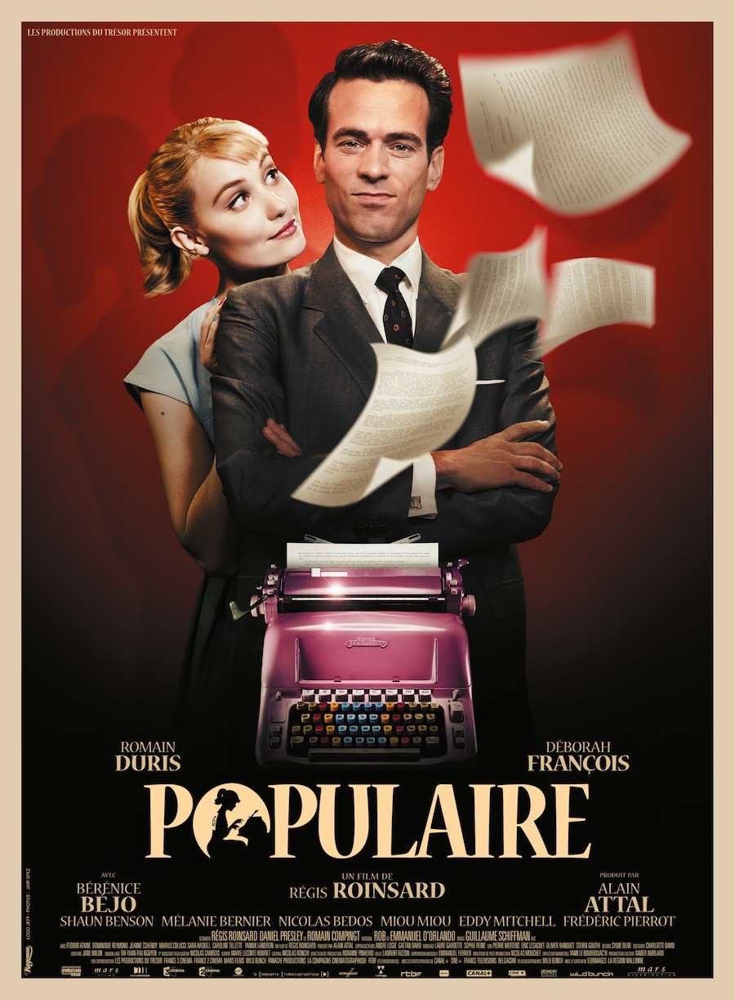
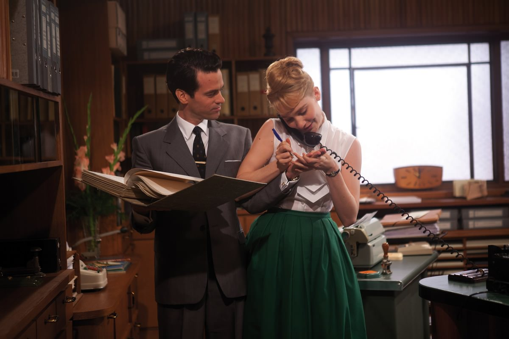
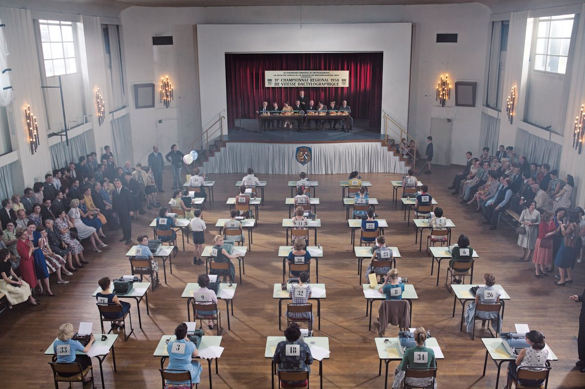

+++
titre = "<em>Populaire</em>, Régis Roinsard"
title = "Populaire, Régis Roinsard"
url = "/populaire-roinsard"
date = "2012-12-05T00:11:42"
Lastmod = "2013-12-06T16:43:27"
cover = "deborah-francois-populaire.jpg"
categorie = [ "À voir" ]
tag = [ "Amour", "Comédie dramatique", "Histoire", "Humour", "Société", "Sport", "Vite oublié" ]
createur = [ "Régis Roinsard" ]
acteur = [ "Bérénice Béjo", "Déborah François", "Eddy Mitchell", "Nicolas Bedos", "Romain Duris" ]
annee = [ "2012" ]
weight = 2012
pays = [ "France" ]

+++

<em>Populaire</em> ambitionne de devenir le film français de l’année, atteindre les niveaux d’un <a href="http://voiretmanger.fr/2011/11/08/intouchables-toledano-nakache/" title="Intouchables, Eric Toledano et Olivier Nakache - À voir et à manger"><em>Intouchables</em></a> avec une comédie populaire, mais de très bonne tenue. Pour son premier film, Régis Roinsard n’a pas choisi un sujet très vendeur en apparence avec cette histoire de jeune secrétaire qui s’entraîne pour un concours de vitesse. Au total, <em>Populaire</em> ne convainc qu’à moitié : la reconstitution historique est certes de qualité, mais le scénario reste sans doute un peu trop sage pour que le film soit inoubliable. Parfait pour une séance sympa, mais rapidement oubliée…

À l’heure où les appareils tactiles remplacement les ordinateurs et leurs claviers, on a un peu oublié qu’à une époque pas si éloignée, on écrivait sur de grosses machines à écrire mécaniques. La maîtrise de ces appareils était alors l’apanage des secrétaires, des femmes qui découvraient souvent en même temps le travail et la liberté que pouvait leur offrir un salaire. <em>Populaire</em> se déroule à la toute fin des années 1950 et pour toutes les femmes, le rêve est d’être embauchée comme secrétaire par un patron, si possible mignon. Rose Pamphyle est une fille venue de la campagne normande profonde à Lisieux pour y trouver un travail de secrétaire et éviter l’avenir tout tracé par son père comme mère de famille et épouse du garagiste du village. Elle se rend au bureau de Louis Echard, assureur, et obtient contre toute attente le job. Elle est pourtant une assez mauvaise secrétaire, mais elle a un point fort qui séduit immédiatement l’ancien sportif : elle tape extrêmement vite à la machine. Dans ces années de gloire du secrétariat, les championnats de vitesse dactylographique constituent un évènement couru et reconnu et Louis voit en Rose une gagnante potentielle. Il décide ainsi de l’embaucher comme secrétaire, mais aussi en secret de l’entraîner pour le championnat départemental et peut-être, si la chance est de leur côté, le national, puis le championnat mondial. 

Régis Roinsard a une excellente idée en filmant l’entraînement de Rose comme un entraînement d’un sportif de haut niveau. <em>Populaire</em> suit ainsi les codes d’un film de concours : il y a d’abord la phase de découverte du sport, les premiers entraînements laborieux, les progrès et enfin la compétition. Étape par étape, l’héroïne gagne des combats et monte en niveau, gagnant d’abord le championnat départemental, avant Paris pour la compétition nationale et, peut-être, New York si Rose peut atteindre l’international. La phase d’apprentissage est incontestablement la meilleure dans <em>Populaire</em>. Rose et Louis apprennent à se connaître, ils ont deux tempéraments très différents et une attirance naturelle qu’ils s’appliquent, l’un comme l’autre, à effacer. Louis semble attiré dès les premières minutes par la beauté à l’état brut de la jeune femme, mais il s’interdit d’emblée toute approche. Rose de son côté est un peu sauvage, elle ne sait manifestement pas comment faire avec les hommes et elle est un peu brutale au départ. On retrouve cette relation semi-amoureuse dans l’entraînement, fait de remontrances et de dur labeur. Le jeune patron impose une discipline de fer à son élève qui doit non seulement apprendre à taper avec dix doigts, mais aussi faire du sport, à se tenir droite et même à assouplir ses doigts avec des leçons de piano. La deuxième partie de <em>Populaire</em>, consacrée aux concours proprement dits, est moins passionnante, sans doute parce qu’elle est plus convenue. Elle correspond aussi à la naissance de l’amour entre Louis et sa secrétaire, amour qui s’exprime librement dans un premier temps avant d’être volontairement effacé par l’entraîneur au profit de la seule compétition. Sans trop en dire sur la fin, disons simplement que le premier long-métrage de Régis Roinsard ne surprendra personne, ce qui est bien dommage. 

L’histoire d’amour sur fond de compétition sur la vitesse dactylographique n’empêche pas <em>Populaire</em> de proposer un regard qui se veut critique sur la position de la femme dans la société. L’histoire se déroule en 1959, une époque où le travail reste avant tout masculin, même si l’explosion du secrétariat offre aux femmes l’opportunité de gagner leur vie et ainsi de prendre leur indépendance. Cette idée a manifestement intéressé Régis Roinsard et le cinéaste ne manque pas d’opposer la vie de Lisieux — ouverte et pleine d’espoir — à celle du village de Rose, au contraire fermé sur lui-même et avec une vie toute tracée pour la jeune femme. Si elle gagne son indépendance avec la dactylographie et devient l’une des femmes les plus célèbres de France, Rose reste sous l’égide et le contrôle de son patron et l’émancipation des femmes reste très théorique dans <em>Populaire</em>. Les jurys des concours sont exclusivement masculins, alors que les participants ne sont que des candidates : on ne sort jamais de cette opposition caricaturale. Régis Roinsard tenait pourtant un sujet intéressant, mais qu’il n’aborde pas du tout, sans doute en raison pour ménager le caractère grand public du projet. L’entraînement de Rose par Louis s’accompagne toujours d’un sous texte romantique, voire sexuel et tend, par les réprimandes et la difficulté de l’entraînement, à un rapport de dominé et de dominant qui pourrait s’apparenter à des pratiques SM. En formant Rose, Louis lui offre la possibilité de changer de vie, mais il le fait d’abord et avant tout comme un défi personnel et il construit par ce processus sa femme idéale en quelque sorte. <em>Populaire</em> reste bien éloigné de ces considérations, dans l’ambiance un peu acidulée du film, même si le cinéaste souligne les motivations plus ou moins avouables de son personnage principal. 

Dès les premières images, il faut reconnaître que le travail de reconstitution est très soigné, tatillon et en un mot, bluffant. <em>Populaire</em> se donne les moyens pour recréer cette époque perdue, ou plutôt peut-être, l’image que l’on s’en fait, mais le travail en valait la peine. L’ensemble est parfaitement crédible, c’est bien le minimum pour un film historique, certes, mais il fallait le souligner. Venu de l’univers du clip et de la publicité, Régis Roinsard se débrouille par ailleurs assez bien sur ce premier long-métrage, sans faire d’étincelles pour autant. Sa mise en scène est classique, mais efficace, avec quelques idées un peu plus folles ici ou là, comme cette scène d’amour très graphique. Le scénario et les dialogues sont plutôt bien écrits et l’humour fonctionne assez bien, on rit de bon cœur et les acteurs choisis sont tous très bons pour accompagner ce texte. Mention spéciale à Romain Duris qui tire vraiment son épingle du jeu avec ce rôle pas facile, où il s’enlaidit la majeure partie du temps. Face à lui, Deborah François assure et offre une prestation convaincante, tout comme le reste des seconds rôles. 

<em>Populaire</em> aurait pu être un excellent film, mais Régis Roinsard a opté pour un scénario et un traitement beaucoup trop conventionnels pour ça. En accentuant sur l’entraînement et en réduisant au contraire la partie concours, le film aurait peut-être gagné en force et en originalité. Il aurait aussi évité, au passage, de placer constamment les femmes dans une position d’infériorité, l’idée même que <em>Populaire</em> tenait à l’origine à dénoncer…

<h3>Vous voulez m&rsquo;aider ?<a href="#footnote_0_7929" id="identifier_0_7929" class="footnote-link footnote-identifier-link" title="&Agrave; propos de la publicit&eacute;&hellip;">1</a></h3>
<ul>
<li><a href="http://www.amazon.fr/gp/product/B00B1COIRW/ref=as_li_ss_tl?ie=UTF8&#038;tag=leblogdenic07-21&#038;linkCode=as2&#038;camp=1642&#038;creative=19458&#038;creativeASIN=B00B1COIRW">Acheter le film en Blu-Ray sur Amazon</a></li>
<li><a href="http://www.amazon.fr/gp/product/B00B1COIRC/ref=as_li_ss_tl?ie=UTF8&#038;tag=leblogdenic07-21&#038;linkCode=as2&#038;camp=1642&#038;creative=19458&#038;creativeASIN=B00B1COIRC">Acheter le film en DVD sur Amazon</a></li>
<li><a href="https://itunes.apple.com/fr/movie/populaire/id600018426">Acheter ou louer le film sur l&rsquo;iTunes Store</a></li>
</ul>

<ol class="footnotes"><li id="footnote_0_7929" class="footnote"><a href="http://voiretmanger.fr/soutien/">À propos de la publicité…</a> [<a href="#identifier_0_7929" class="footnote-link footnote-back-link">&#8617;</a>]</li></ol>
