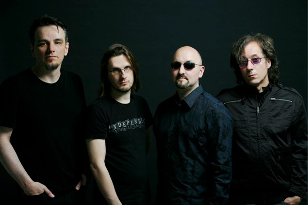
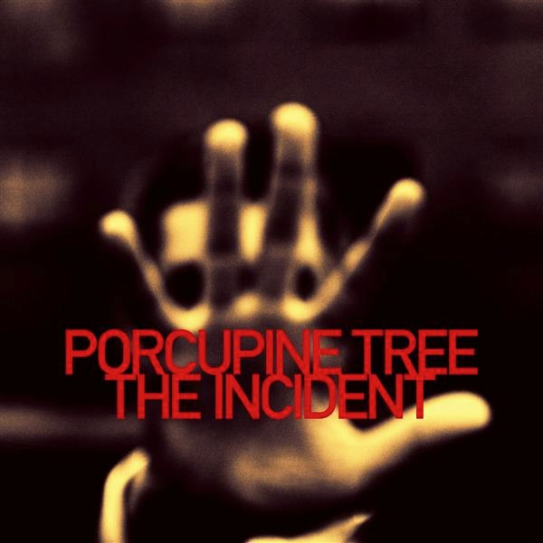
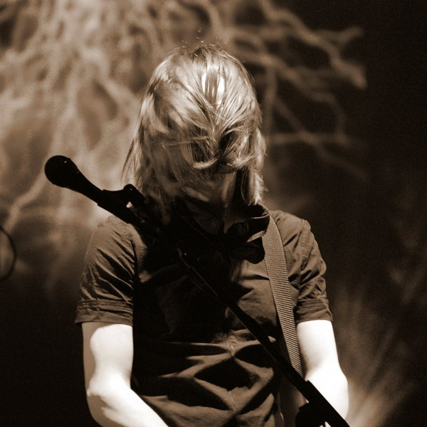
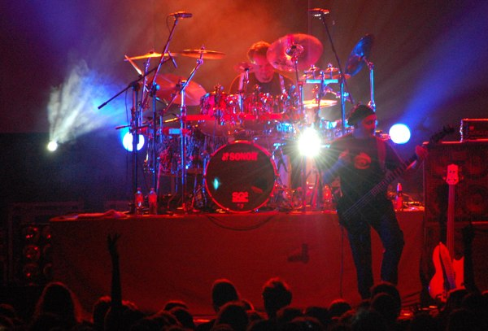
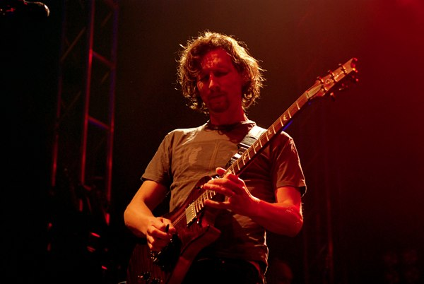

+++
titre = "Porcupine Tree à l&rsquo;Olympia (13 octobre 2009)"
title = "Porcupine Tree à l'Olympia (13 octobre 2009)"
url = "/porcupine-tree-olympia-octobre-2009"
date = "2009-10-14T01:27:30"
Lastmod = "2010-03-15T16:03:02"
cover = "porcupine-tree-live.jpg"
categorie = [ "À voir… en live" ]
tag = [ "Concert", "Olympia", "Rock progressif" ]
createur = [ "Porcupine Tree" ]
annee = [ "2009" ]
weight = 2009

+++

Ce soir, je suis allé voir pour la première fois sur scène Porcupine Tree qui est l&rsquo;un des tous derniers groupes de rock progressif que je puisse encore écouter aujourd&rsquo;hui. On m&rsquo;avait dit beaucoup de bien des concerts de ce groupe, et il est vrai que par rapport à ce que je connaissais des concerts de progressif, c&rsquo;est clairement mieux. Néanmoins, on sent encore bien l&rsquo;influence de ce genre né et mort avec les années 1970.

Avant d&rsquo;en venir au concert proprement dit, un mot sur le groupe et notamment son dernier album, <em>The Incident</em>, tout juste sorti dans les bacs (comme on dit toujours). Porcupine Tree est né dans les années 1980, donc après l&rsquo;âge d&rsquo;or du rock progressif, autour de Steven Wilson qui reste encore aujourd&rsquo;hui le leader du groupe, écrivant la majorité des titres et chantant sur la totalité d&rsquo;entre eux. À l&rsquo;époque, c&rsquo;était une blague entre potes, et finalement le groupe a plu et a fini par se former. Depuis, le groupe a sorti dix albums et continue à avoir du succès.

Ce qui est intéressant avec Porcupine Tree, c&rsquo;est leur capacité à se renouveler. Loin de s&rsquo;enfermer dans le carcan progressif qui forme leur base, ils ont su s&rsquo;orienter vers d&rsquo;autres horizons, le pop-rock avec des albums comme <em>Lightbulb Sun</em> (souvent comparé à Radiohead, ce qui me semble douteux) puis le métal aujourd&rsquo;hui et surtout avec <em>Deadwing</em>. Certains albums ou titres tendent plutôt vers le post-rock, tandis que Steven Wilson s&rsquo;est aussi montré capable de faire de la grosse pop à l&rsquo;ancienne avec les deux <em>Blackfield</em>. Bref, une certaine diversité qui sauve le groupe à mes oreilles actuelles, bien éloignées de la période progressif que j&rsquo;ai connue.

Néanmoins, les fondations progressives restent bien audibles, ou visibles. Ainsi, le sacro-saint principe du concept album est régulièrement remis au goût du jour par le groupe, enfin, remis à jour s&rsquo;entend plutôt comme une copie parfaite de l&rsquo;idée de base. Au départ donc, des groupes mythiques comme Genesis (tous les albums de l&rsquo;ère Peter Gabriel, ou presque) puis Pink Floyd (avec le célébrissime <em>The Wall</em>, sans doute l&rsquo;apogée du concept-album, celui qui signale l&rsquo;impasse du principe) écrivent des albums faisant sens dans leur globalité, racontant une histoire, à la manière si l&rsquo;on veut des pièces religieuses (passion) ou des opéras, mais sans mise en scène nécessairement induite. Un concept album se suffit à lui-même, normalement en tout cas. L&rsquo;idée s&rsquo;est vite banalisée, au point que le concept album est devenu un poncif du progressif. À quelques rares exceptions près, l&rsquo;histoire est d&rsquo;un intérêt proche du néant ou d&rsquo;une banalité affligeante, souvent elle est aussi très ridicule et finalement, on se dit que les artistes feraient mieux de faire de la musique.

Porcupine Tree n&rsquo;échappe pas à la règle et semble même s&rsquo;adonner avec de plus en plus de plaisir à l&rsquo;exercice du concept album, comme en témoigne ses deux derniers albums, conceptuels tous les deux. L&rsquo;intérêt de ne pas être anglophone de langue maternelle, c&rsquo;est que l&rsquo;on peut ne pas comprendre les paroles. Et en l&rsquo;occurrence, cela vaut mieux. Dans les deux cas, il est question de la vie et de la mort, de la stupidité de la société actuelle, du temps qui passe&#8230; bref de la philosophie de comptoir à l&rsquo;intérêt au-delà déjà du néant. Ainsi, <em>The Incident</em> (le dernier donc) contient une première piste d&rsquo;une petite heure qui raconte une passionnante histoire décrite en ces termes par le groupe : « une chanson vaguement surréaliste à propos de débuts et de fins, et du sentiment &laquo;&nbsp;qu&rsquo;après ça, les choses ne seront plus jamais les même&nbsp;&raquo; » (sic). Ça fait peur&#8230;

Si j&rsquo;évoque tout cela, ça n&rsquo;est pas seulement pour montrer que, moi aussi, je peux étaler ma confiture. Mais c&rsquo;est que cela influence directement le concert. Qui dit tournée d&rsquo;album, dit en fait une partie entière dédiée à cet album, une partie d&rsquo;une heure donc durant laquelle le groupe refait, dans le même ordre, toutes les chansons de l&rsquo;album, le tout sur fond de clips vidéos qui varient entre le kitsch et l&rsquo;illustration stricte des paroles, jusqu&rsquo;au quasi-karaoké.

Mais n&rsquo;allons pas trop vite en besogne, et revenons-en au concert. Finalement, c&rsquo;était mon premier concert de rock progressif, si l&rsquo;on exclut The Musical Box qui est plus un musée vivant qu&rsquo;un vrai concert. Je n&rsquo;ai pas pu m&rsquo;empêcher d&rsquo;observer que le public de ce soir était très typé. Très peu de sexe féminin dans la salle, par contre beaucoup de cheveux longs et nombreux pronostics sur le nombre de timbales que comporte la batterie. Pas de doute, on est bien dans un concert de rock progressif. Je note d&rsquo;ailleurs que le public (au moins le parisien) y est assez sage, ne bouge pas dans la fosse, ne boit pas, applaudit comme en jazz les solos et lève le doigt comme un métalleux. Un mélange étrange donc, avec aussi plusieurs générations. On peut distinguer sans doute les fans de la première heure, certains devant être aussi fans des groupes de rock progressif mythiques, et les plus récents, venus par le biais du métal depuis <em>Deadwing</em>.

<em>Crédit : <a href="http://www.flickr.com/photos/gchorus/2593397301/">gchorus @ FlickR</a></em>

Le concert commence avec une étonnante première partie en la personne de Robert Fripp. Véritable légende vivante depuis qu&rsquo;il a cofondé le mythique groupe King Crimson (l&rsquo;un des tout premiers a être reconnu comme groupe de rock progressif), ce désormais vieux monsieur a depuis beaucoup évolué sur le plan musical, au point d&rsquo;inventer à lui tout seul un genre, la <a href="http://en.wikipedia.org/wiki/Frippertronics">Frippertronics</a>. D&rsquo;après ce que j&rsquo;en ai vu ce soir, il s&rsquo;agit en fait de samples améliorés de guitare. Avec une seule guitare, il arrive effectivement à créer des sons étonnants, que l&rsquo;on attribuerait plutôt à un synthétiseur à l&rsquo;oreille. Cette musique semble intéressante, mais elle passe mal en première partie d&rsquo;un groupe qui a des tendances metal, et le public n&rsquo;a pas apprécié, allant jusqu&rsquo;à siffler l&rsquo;artiste. C&rsquo;était finalement assez triste de le voir jouer et saluer sans mot&#8230;

Bref, les choses se remettent vite en place avec Porcupine Tree. La scène est déjà très significative du genre : quand une batterie si grosse qu&rsquo;elle cache le batteur (cf ci-dessous) et une série de claviers en tout genre sont sur des estrades de part et d&rsquo;autre, c&rsquo;est un bon signe. Au centre, au micro et à la guitare se trouve Steven Wilson, un homme qui étonne par ses airs d&rsquo;adolescent sur le tard. Je ne sais pas si ce sont ses lunettes, ou ses cheveux encombrants (cf ci-dessus), mais il ne fait pas du tout ses 40 ans passés, on lui en donnerait plutôt une vingtaine.

Le show commence donc, je l&rsquo;ai évoqué, avec l&rsquo;intégralité du morceau concept du dernier album, soit en gros une petite heure de musique sans interruption, si ce n&rsquo;est un salut entre le premier et le deuxième titre. Au-dessus de la scène, au fond, trône un écran géant qui sert à afficher des images illustrant le concept. Si certains plans sont assez beaux, ou au moins intéressants, la majorité est kitsch à souhait (le sommet étant atteint avec ce train qui défile dans la campagne anglaise en sépia&#8230;) ou se contente d&rsquo;illustrer au premier degré des paroles déjà très loin de la métaphore. Pour le dire autrement, tout cela est bien lourd et détourne l&rsquo;attention des artistes eux-mêmes. D&rsquo;ailleurs, c&rsquo;est étonnant, ils semblent s&rsquo;effacer de bout en bout : l&rsquo;éclairage les met rarement en valeur et finalement, on a un peu le sentiment qu&rsquo;ils ne comptent pas vraiment. Oui, comme à la Star Academy ou à un concert de Michael Jackson, ce qui est tout de même étrange et inattendu.

<em>Crédit : <a href="http://www.flickr.com/photos/gchorus/2073389701/">gchorus @ FlickR</a></em>

Le vrai problème du concept album, ça n&rsquo;est pas vraiment le concept (après tout, on s&rsquo;en fiche des paroles), mais plus sa place dans le concert. Nous balancer une heure de concept sur un album qu&rsquo;une bonne partie de la salle a manifestement découvert pour l&rsquo;occasion, voilà qui n&rsquo;est pas malin. La salle ne s&rsquo;est vraiment éveillée que pendant la seconde partie, quand des classiques plus énervés ont fait apparition. Si le groupe avait mêlé tout cela, je pense que le concert aurait été plus équilibré. Oui, mais voilà, un concept, c&rsquo;est sacré.

Au chapitre des inattendus, la pause de dix minutes marquée par un compteur à la 24 heures chrono entre le concept album et la suite du concert. J&rsquo;ai trouvé ça un peu gonflé sur le coup, la tension qui redescend, tout ça, mais finalement ça a eu plutôt l&rsquo;effet inverse avec le décompte final scandé par un Olympia plein à craquer. Les artistes remontent sur scène au bout de 10 minutes pétantes, et le concert reprend.

Cette exactitude millimétrique est sans doute l&rsquo;un des défauts de Porcupine Tree sur scène. Le concert est très professionnel, c&rsquo;est même peu dire : les partitions complexes du groupe passent comme une lettre à la poste, il n&rsquo;y a pas la moindre hésitation et les titres s&rsquo;enchaînent comme sur un album gapless. Non, vraiment, sur le plan technique, rien à dire. Mais un concert en direct, n&rsquo;est-ce pas justement le lieu de l&rsquo;hésitation, du flou, de l&rsquo;erreur ? D&rsquo;autant que qui dit album récent et complexe, dit titres en live identiques à ceux de l&rsquo;album. C&rsquo;est bien simple, toute la partie <em>The Incident</em> n&rsquo;a été que l&rsquo;album en version un peu musclée. Ça n&rsquo;était pas désagréable du coup, mais vraiment attendu et sans surprise aucune&#8230; Heureusement, sur les anciens titres, le groupe se lâche un peu, et le public sautille. C&rsquo;est donc vraiment dommage de n&rsquo;avoir pas mélangé titres anciens et récents&#8230;

<em>Crédit : <a href="http://www.flickr.com/photos/selfishtears/4000517571/">selfishtears @ FlickR</a></em>

Heureusement toutefois que Porcupine Tree ne tombe pas dans le travers du solo. Il y a des groupes de rock progressif qui ne sont en fait que l&rsquo;association de solos, et non de vrais groupes. Ici, il y en a quelques-uns, mais ils sont limités en nombre et dans le temps, et en plus il ne s&rsquo;agit jamais de vrais solos. Par contre, détail amusant, une lumière placée au-dessus de chaque artiste signale qui fait un solo. Peut-être que le groupe avait peur que le public se demande &laquo;&nbsp;oh une guitare, mais qui diable joue de la guitare ? oh&#8230; mais c&rsquo;est le guitariste devant !&nbsp;&raquo;&#8230;

Ce concert ne m&rsquo;a pas passionné autant que je l&rsquo;espérais. Il confirme par contre deux idées que j&rsquo;avais avant d&rsquo;y aller : 1) le rock progressif ne peut que survivre à travers un autre genre, et le métal est le candidat apparemment le mieux indiqué ; 2) le meilleur album de Porcupine Tree est le précédent, <em>Fear of A Blank Planet</em>. Les meilleurs titres de ce soir étaient les titres les plus orientés métal, ce sont les seuls qui ont un peu remué la fosse, les seuls aussi qui faisaient vraiment concert et qui ont permis au groupe de varier par rapport aux originaux. <em>Fear of a Blank Planet</em> est, certes, un concept autour de l&rsquo;enfance et des dégâts de notre société de la communication à outrance, mais c&rsquo;est aussi un album court (contrairement au dernier) qui fait la synthèse entre métal et rock progressif tendance pop-rock du groupe. Voilà pourquoi c&rsquo;est, selon moi, le meilleur du groupe, celui qui devrait rester dans ma mémoire.

Voilà, un concert sympathique à défaut d&rsquo;être LE concert. Je pense quand même que c&rsquo;est un bien meilleur concert que la moyenne du rock progressif actuel (quoique si Ayreon existait sur scène et en costumes, ça pourrait être marrant) et c&rsquo;est déjà pas mal. Bon et on passe un très bon moment, rien à redire sur ce point&#8230;

<em>Crédit photo couverture :  <a href="http://www.flickr.com/photos/gchorus/2073156525/">gchorus @ FlickR</a></em>

