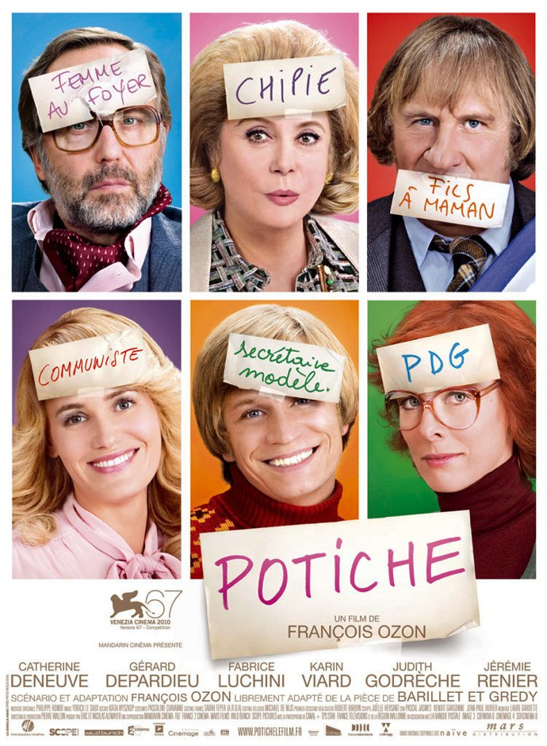
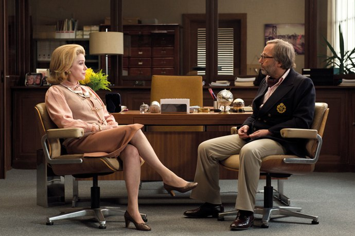
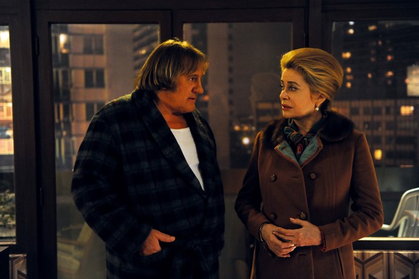

+++
type = "post"
titre = "<em>Potiche</em>, François Ozon"
title = "Potiche, François Ozon"
url = "/potiche-ozon"
date = "2010-11-13T18:02:22"
Lastmod = "2014-09-14T11:47:25"
cover = "deneuve-luchini-potiche.jpg"
categorie = [ "À voir" ]
tag = [ "Comédie", "Drame", "Famille", "Société", "Vite oublié" ]
createur = [ "François Ozon" ]
acteur = [ "Catherine Deneuve", "Fabrice Luchini", "Gérard Depardieu", "Jérémie Renier", "Judith Godrèche", "Karine Viard" ]
annee = [ "2010" ]
weight = 2010
pays = [ "France" ]

+++

François Ozon est un cinéaste multiple, c&rsquo;est encore peu de le dire. Je ne suis pas un grand fan de son cinéma, à tel point que j&rsquo;ai dû voir deux ou trois films seulement sur tous ceux qu&rsquo;il a réalisés, lassé dès les bandes-annonces par des univers acidulés kitsch, ou découragés par des critiques assassines. <em>Potiche</em> néanmoins a su m&rsquo;intéresser avec une bande-annonce laissant présager une comédie classique, mais efficace et drôle sur un patron à l&rsquo;ancienne et une femme potiche qui devient féministe. Le résultat est un peu décevant : si la satire de cette époque de conflits est plutôt bien vue, on rigole finalement assez peu alors que le potentiel comique était là. Qu&rsquo;on se le dise, François Ozon n&rsquo;est pas un cinéaste comique, mais un excellent défenseur de la cause féministe et du kitsch des années 1970.

<a href="http://www.allocine.fr/film/fichefilm_gen_cfilm=172873.html">>

Robert Pujol n&rsquo;est pas homme à se laisser marcher sur les pieds. Patron d&rsquo;une usine de parapluies dans le Nord, il dirige ses ouvriers d&rsquo;une main de fer et ne hait rien de plus que le communisme et les syndicalistes. Il y a une chose qui le met encore plus hors de lui, c&rsquo;est quand Suzanne, son épouse, donne son avis. Il la considère comme une potiche tout juste bonne à sourire à ses côtés, le servir quand il en a besoin et toujours, toujours penser comme lui. Non, elle ne peut pas avoir sa propre opinion, ce n&rsquo;est pas sa place. Sa place, c&rsquo;est d&rsquo;écrire de petits poèmes ridicules sur la nature, c&rsquo;est courir dans la forêt, c&rsquo;est coudre, c&rsquo;est éventuellement servir un petit-déjeuner à son mari qui la gâte tant, imaginez donc, elle a même une machine à laver ! Nous sommes en 1977 et 1968 est déjà de l&rsquo;histoire ancienne : les femmes au foyer, les hommes au travail ! Mais en cette période de crise sociale, une grève éclate dans l&rsquo;usine et les ouvriers séquestrent le patron dans l&rsquo;usine. Pour le sortir de là, sa femme n&rsquo;hésite pas à contacter le député-maire communiste et ennemi juré du patron. Robert apprenant la nouvelle fait une crise et doit être hospitalisé et se reposer pendant plusieurs mois. Pendant ce temps, il faut le remplacer et c&rsquo;est sa femme potiche qui s&rsquo;en charge. À sa grande surprise, elle y prend goût et n&rsquo;est pas mauvaise du tout, bien au contraire : elle répond à une partie des revendications des ouvriers, séduits par son style tranché et son caractère mesuré. Quand son mari rentre, il s&rsquo;attend à retrouver sans la demander sa place de PDG, mais les choses ne sont pas si simples, sa femme potiche a pris goût à l&rsquo;indépendance.

<em>Potiche</em> commence comme une comédie à l&rsquo;ancienne qui n&rsquo;est pas sans rappeler celles de la grande époque, avec un Luchini qui ferait un bon successeur pour De Funès. La description d&rsquo;un milieu bourgeois caricatural au possible, avec le grand patron qui abuse de ses pouvoirs sur ses ouvriers autant que sur sa famille. Un homme rétrograde qui refuse par principe toute avancée sociale, aussi réduite fût-elle, et qui n&rsquo;envisage même pas que sa femme puisse avoir une idée à elle qui fut différente de ses idées. La potiche est très amusante de son côté, à courir dans son beau jogging rouge, le brushing impeccable et son petit carnet à la main pour écrire un poème sur l&rsquo;écureuil qui grimpe à l&rsquo;arbre et la biche qui passe dans le champ. L&rsquo;ambiance années 1970 très kitsch convient à merveille à ce tableau, avec une mention spéciale au téléphone recouvert de moquette, une décoration qui manque terriblement à nos intérieurs contemporains, à n&rsquo;en pas douter. Le tableau serait incomplet sans la caricature ambulante qu&rsquo;offre ce Robert, totalement froid avec sa femme au point qu&rsquo;il a décidé de faire chambre à part avec elle, mais saute sur tout ce qui a des seins, à commencer par Nadège, sa fidèle secrétaire quand il ne va pas tout simplement voir les putes. Un parfait hypocrite donc, qui refuse le mariage de son fils avec la fille du boulanger soi-disant pour des raisons de rang social, mais en fait parce qu&rsquo;il n&rsquo;est pas sûr d&rsquo;être aussi le père de la demoiselle en question…

Débutant comme une comédie française classique, <em>Potiche</em> évolue ensuite à la fois vers le vaudeville à base de tromperies et d&rsquo;enfants aux parents inconnus et vers le drame social historique plein d&rsquo;analogies avec l&rsquo;actualité. Le film est adapté d&rsquo;une pièce de théâtre et cette origine dramatique se retrouve à l&rsquo;écran surtout au début, quand l&rsquo;action se déroule dans la maison familiale. On imagine bien un décor de théâtre avec quelques pièces où les personnages se croisent et d&rsquo;où les activités à l&rsquo;usine sont vues à l&rsquo;aide de jumelles et commentées par les personnages. L&rsquo;action se diffuse ensuite, tantôt dans l&rsquo;usine, tantôt chez le maire, tantôt sur la place du marché… mais l&rsquo;esprit théâtral ne disparaît pas et subsiste essentiellement dans les tromperies réciproques du couple Pujol et les questions autour des parents réels des enfants. Pourtant, <em>Potiche</em> n&rsquo;est pas un film très drôle, à tel point que l&rsquo;on finit par douter de son statut de comédie. Certes, la description de la potiche est très drôle, tout autant que celle du colérique patron d&rsquo;usine, mais tout cela est déjà connu et assez téléphoné. Idem pour les enfants, on se doute vite qu&rsquo;il y a anguille sous roche et même si Ozon évite astucieusement de tomber dans la facilité, on ne rigole guère. Les situations ne manquent pas d&rsquo;un important potentiel comique, mais qui n&rsquo;est pas vraiment exploité par le film. Comme si François Ozon voulait éviter soigneusement de faire rire et il est vrai qu&rsquo;à part en deux ou trois brèves occasions, on rit peu et jamais à gorge déployée. Vous risquez d&rsquo;être déçus si, comme moi, vous pensiez voir une vraie comédie, ce n&rsquo;est que trop rarement le cas. Par contre, <em>Potiche</em> se révèle très riche sur l&rsquo;analyse de la société de la fin des années 1970 et de ses changements. Le film offre ainsi un portrait assez exemplaire d&rsquo;une femme qui prend son indépendance et fait fi de toutes les conventions sociales, quitte à rompre avec son mari et une partie de sa famille. La Suzanne qui clôt le film n&rsquo;a plus rien à voir avec la Suzanne qui l&rsquo;ouvre et le film rend plutôt bien ces changements, tout comme il brosse un portait réussi de cette France encore grise qui découvre la liberté et les couleurs chatoyantes qui semblent symboliser les années 1980. Ozon a voulu ce contexte historique pour permettre la comédie, genre qui a besoin d&rsquo;un peu de distance avec le spectateur, mais il n&rsquo;a bizarrement pas pu s&rsquo;empêcher de faire des clins d&rsquo;œil à l&rsquo;actualité. Ils sont rarement subtils et visent essentiellement le pouvoir en place, sans rien apporter si ce n&rsquo;est des sourires dans la salle. S&rsquo;il voulait signifier que cette situation reste vraie aujourd&rsquo;hui, ce qui est vrai, il aurait pu tout autant éviter le décalage historique.

Ce décalage peut néanmoins aussi se comprendre par la recherche esthétique. Le film est très kitsch, manière de caricaturer l&rsquo;époque bien sûr, mais on sent aussi que François Ozon aime ce genre déjà utilisé dans <em>Angel</em>. Le générique au début est une ode au kitsch avec ses grosses lettres flashy et son découpage avec bords arrondis. S&rsquo;il se fait ensuite plus discret, on le retrouve par exemple dans le personnage du fils, clone de Claude François qui en fait des tonnes. On aime ou on n&rsquo;aime pas, mais cet univers est plutôt bien retranscrit et je l&rsquo;ai trouvé plaisant. <em>Potiche</em> ne serait rien sans ses comédiens et si Gérard Depardieux est fidèle à lui-même et plutôt bon, et si Fabrice Luchini est un peu sobre, on retiendra surtout Catherine Deneuve, éblouissante en potiche devenue chef d&rsquo;entreprise puis femme politique. Ce rôle lui convient à merveille et elle s&rsquo;y donne à cœur joie. Rares sont les plans sans sa présence qui n&rsquo;est pourtant jamais pesante.

<em>Potiche</em> n&rsquo;est pas la comédie vraiment drôle que j&rsquo;attendais, et à cet égard c&rsquo;est une déception. Comme souvent, la bande-annonce était trompeuse et François Ozon est plus du côté du drame que de la comédie. Un drame familial où la société française des années 1970 est très bien retranscrite, à la fois une société en crise du fait des problèmes économiques et une société en cours de modernisation où tout semble possible. À ce titre, <em>Potiche</em> est une réussite qui vient en partie annuler la déception initiale.

Film sympathique donc, mais je peine à comprendre le déluge de critiques positives, tant dans la presse traditionnelle que sur Internet (<a href="http://www.filmosphere.com/2010/10/critique-potiche-2010/">ici</a>, ou <a href="http://www.anglesdevue.com/2010/11/10/potiche-de-franois-ozon/">là</a>, par exemple).

<h3>Vous voulez m&rsquo;aider ?<a href="#footnote_0_4209" id="identifier_0_4209" class="footnote-link footnote-identifier-link" title="&Agrave; propos de la publicit&eacute;&hellip;">1</a></h3>
<ul>
<li><a href="http://www.amazon.fr/gp/product/B004FQC0B2/ref=as_li_ss_tl?ie=UTF8&#038;tag=leblogdenic07-21&#038;linkCode=as2&#038;camp=1642&#038;creative=19458&#038;creativeASIN=B004FQC0B2">Acheter le film en Blu-Ray sur Amazon</a></li>
<li><a href="http://www.amazon.fr/gp/product/B004FQC09O/ref=as_li_ss_tl?ie=UTF8&#038;tag=leblogdenic07-21&#038;linkCode=as2&#038;camp=1642&#038;creative=19458&#038;creativeASIN=B004FQC09O">Acheter le film en DVD sur Amazon</a></li>
<li><a href="https://itunes.apple.com/fr/movie/potiche/id409189902">Acheter ou louer le film sur l&rsquo;iTunes Store</a></li>
</ul>

<ol class="footnotes"><li id="footnote_0_4209" class="footnote"><a href="http://voiretmanger.fr/soutien/">À propos de la publicité…</a> [<a href="#identifier_0_4209" class="footnote-link footnote-back-link">&#8617;</a>]</li></ol>
