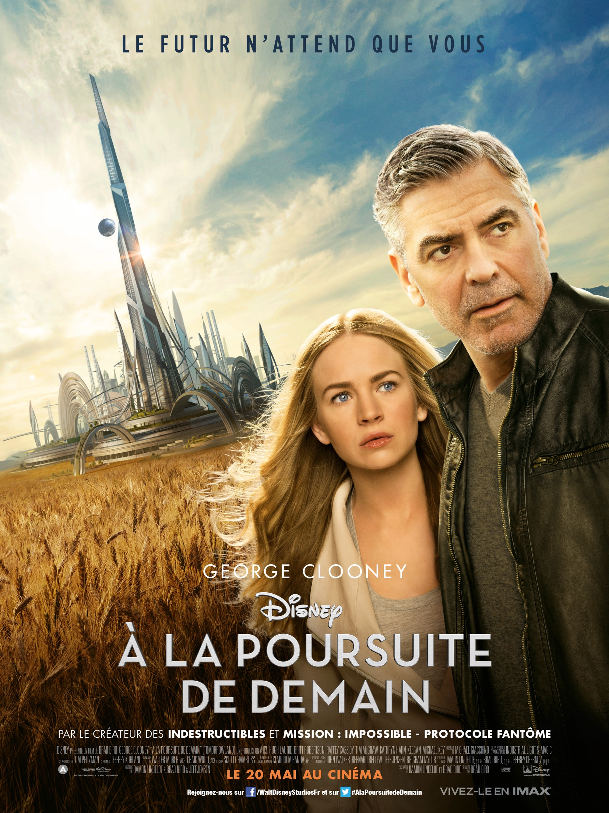
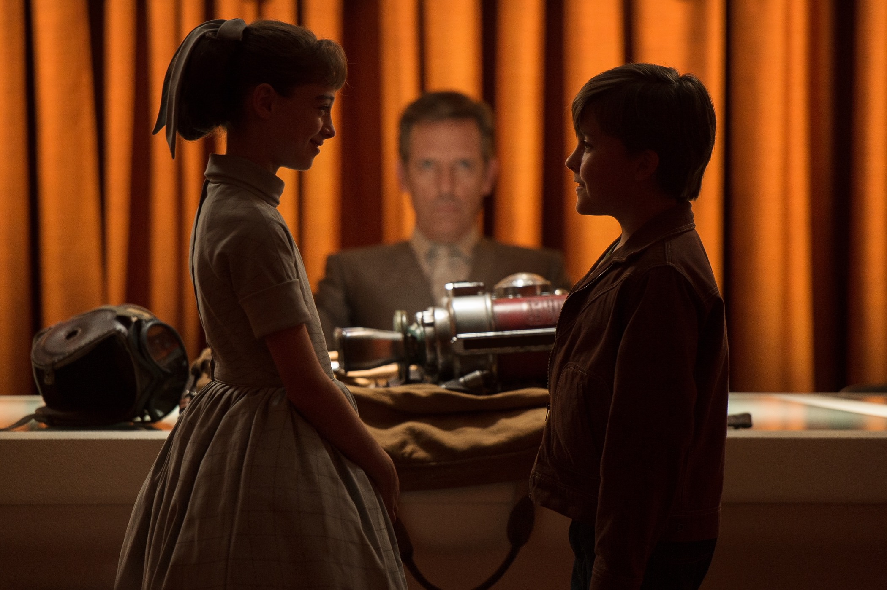
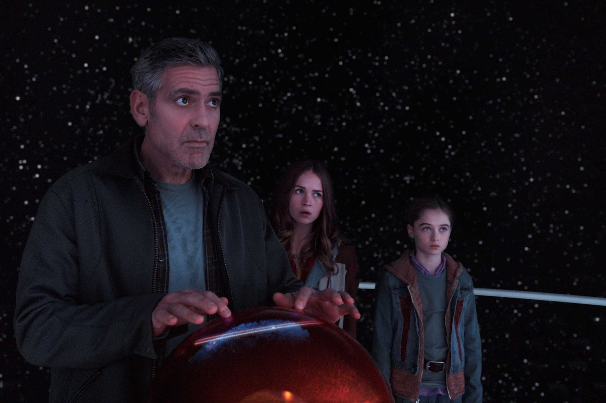

+++
titre = "<em>À la poursuite de demain</em>, Brad Bird"
title = "À la poursuite de demain, Brad Bird"
url = "/poursuite-demain-bird"
date = "2015-05-20T23:44:38"
Lastmod = "2015-05-20T23:48:46"
cover = "poursuite-demain-brad-bird.jpg"
categorie = [ "À voir" ]
tag = [ "Blockbuster", "Écologie", "Futur", "Science-Fiction", "Société", "Sorties du mois", "Utopie", "Vite oublié" ]
createur = [ "Brad Bird" ]
acteur = [ "Britt Robertson", "George Clooney", "Hugh Laurie", "Raffey Cassidy", "Thomas Robinson" ]
annee = [ "2015" ]
weight = 2015
pays = [ "États-Unis" ]
original = "Tomorrowland"

+++

Brad Bird revient au film en images réelles, quatre ans après le convaincant <a href="http://voiretmanger.fr/mission-impossible-protocole-fantome-bird/" title="Mission : Impossible – Protocole Fantôme, Brad Bird"><em>Mission : Impossible – Protocole Fantôme</em></a>. Le réalisateur avait pourtant fait ses armes sur l&rsquo;animation, chez Pixar, avec en particulier l&rsquo;excellent <a href="http://voiretmanger.fr/indestructibles-bird/" title="Les Indestructibles, Brad Bird"><em>Les Indestructibles</em></a>. Mais pour ce nouveau film, il change totalement de genre et opte pour de la science-fiction sous l&rsquo;égide de Disney. <em>À la poursuite de demain</em> est la nouvelle tentative du géant dans ce genre, trois ans après l&rsquo;échec fracassant de <a href="http://voiretmanger.fr/john-carter-stanton/" title="John Carter, Andrew Stanton"><em>John Carter</em></a>. Cette fois, Disney est reparti sur des bases connues en s&rsquo;inspirant à nouveau de ses parcs d&rsquo;attraction. Après les pirates pour la <a href="http://voiretmanger.fr/saga/pirates-des-caraibes/">saga <em>Pirates des Caraïbes</em></a>, c&rsquo;est la section « Tomorrowland<a href="#fn-13738-1" rel="footnote">1</a> » des parcs qui a servi de base au long-métrage de Brad Bird. Mais ce qui a parfaitement fonctionné dans le cas précédent peine ici à convaincre : malgré quelques bonnes idées, le projet est handicapé par sa naïveté, pour ne pas dire sa niaiserie.

<em>À la poursuite de demain</em> surprend par une première séquence plutôt originale dans cette catégorie habituellement si codée. On pensait que le film allait ouvrir sur une introduction à un univers, alors que l&rsquo;on a Frank, l&rsquo;un des personnages principaux de l&rsquo;histoire, face caméra. Il commence à raconter son histoire, mais il est constamment interrompue par une voix féminine qui est celle de Casey, l&rsquo;héroïne du long-métrage. Ces premières minutes sont étonnamment libres et elles laissent présager une bonne surprise, mais Brad Bird est vite obligé de reprendre la voie habituelle des blockbusters Disney. Passée cette introduction, l&rsquo;intrigue se met en place autour d&rsquo;un monde parallèle au nôtre : alors que la Terre se meure à cause du réchauffement climatique et des guerres, Casey reçoit un mystérieux pin&rsquo;s qui lui montre une autre réalité. Une vision futuristique avec une grande ville moderne, où tout le monde vit en harmonie avec la nature et avec les autres, bref, une utopie. S&rsquo;agit-il d&rsquo;une autre planète ou du futur ? <em>À la poursuite de demain</em> semble tendre vers la deuxième option par son titre, mais on découvre vite que les choses sont plus complexes. On ne dévoilera pas toute l&rsquo;intrigue, car elle contient une ou deux surprises qu&rsquo;il ne faudrait pas gâcher, mais disons simplement que Brad Bird déploie un film plus complexe qu&rsquo;au premier abord. Non pas que le scénario soit difficile à comprendre, mais plutôt que rien n&rsquo;est aussi simple qu&rsquo;on pourrait le croire. Sur le papier, c&rsquo;est une bonne chose, mais l&rsquo;univers imaginé à partir d&rsquo;un concept de parc d&rsquo;attraction atteint bien vite ses limites.

Il faut reconnaître que Brad Bird a quelques excellentes idées. Parmi les meilleurs moments, citons cette découverte en parallèle de l&rsquo;univers futuriste, où l&rsquo;héroïne est plongée dans un monde parallèle, tout en dépendant toujours des contraintes physiques de la Terre. <em>À la poursuite de demain</em> bénéficie ainsi de quelques fulgurances, mais le long-métrage souffre aussi de beaucoup de défauts, trop pour qu&rsquo;on puisse les oublier. Il y a d&rsquo;abord d&rsquo;énormes incohérences dans le scénario, ce qui est déjà problématique, mais aussi dans l&rsquo;univers, ce qui est pour le moins gênant. On ne comprend quasiment rien à cette machine qui montre le futur et qui est pourtant au cœur de l&rsquo;histoire. À quoi sert-elle exactement, comment fonctionne-t-elle et quel est son rôle vis-à-vis des humains… autant de questions qui n&rsquo;ont jamais de réponse. Et si on peut apprécier les scénarios qui font le pari de l&rsquo;intelligence des spectateurs, il y a trop de trous noirs ici pour que l&rsquo;on ne se dise pas plutôt que l&rsquo;univers n&rsquo;a pas été suffisamment pensé. Brad Bird filme des séquences sans jamais rien expliquer, sans offrir à ces scènes la crédibilité nécessaire. Résultat, on ne comprend souvent rien et c&rsquo;est d&rsquo;autant plus pénible qu&rsquo;<em>À la poursuite de demain</em> avait l&rsquo;intention manifeste de vulgariser le réchauffement climatique. Le film est écologique, mais il prend le sujet avec tant de légèreté et offre un arrangement si naïf à la fin qu&rsquo;il dessert totalement la cause qu&rsquo;il voulait défendre. À ce sujet, on apprécie les pointes d&rsquo;humour — le robot avec son sourire de Ken, les clins d&rsquo;œil à d&rsquo;autres univers et notamment à <em>Star Wars</em> — qui sont souvent bien vues, mais qui ne semblent pas toujours à leur place, tant ce film peut être sérieux.

À l&rsquo;heure des bilans, c&rsquo;est peut-être ça qui gêne le plus avec <em>À la poursuite de demain</em> : le film est sérieux, beaucoup trop sérieux pour son bien. L&rsquo;humour qui transparait ici ou là ne fait que renforcer le malaise ressenti par le spectateur, qui a bien du mal à comprendre pourquoi le message écologique véhiculé par le long-métrage est associé à une telle naïveté. Brad Bird donne le sentiment de ne s&rsquo;adresser qu&rsquo;aux plus jeunes, mais en plus de le faire comme s&rsquo;ils étaient débiles. C&rsquo;est surprenant, quand on pense que le réalisateur a fait ses armes chez Pixar, où l&rsquo;on raconte des histoires aux enfants et aux grands de la même manière. George Clooney a beau s&rsquo;investir comme il peut dans ce projet qui lui tenait sans doute à cœur, le résultat est le même : <em>À la poursuite de demain</em> est niais et vite oublié.

<ol>
<li id="fn-13738-1">
Qui, étrangement, se nomme Discoveryland à Disneyland Paris. C&rsquo;est dans cette section du parc que l&rsquo;on trouve toutes les attractions futuristes, avec notamment le célèbre Space Mountain.&#160;<a href="#fnref-13738-1" rev="footnote">&#8617;</a>
</li>
</ol>

