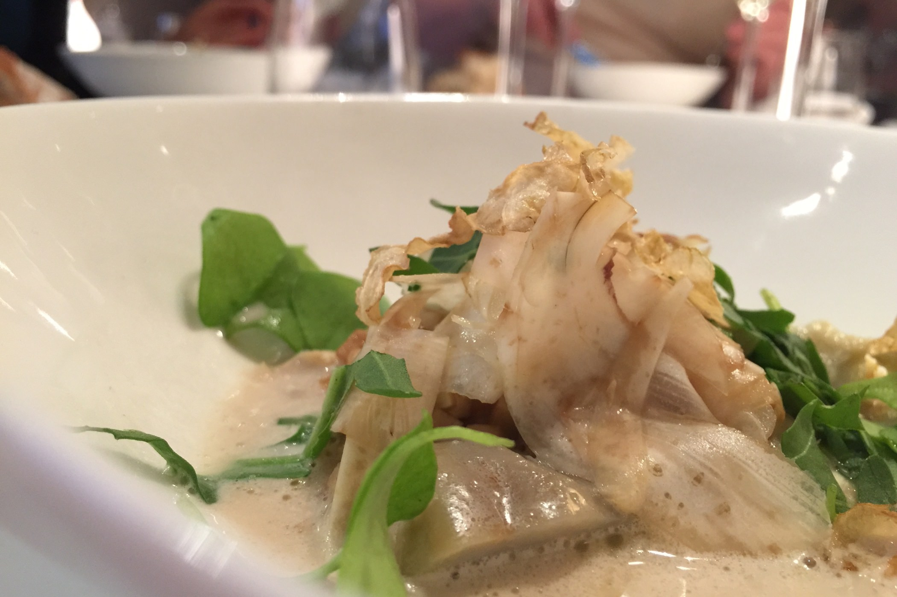
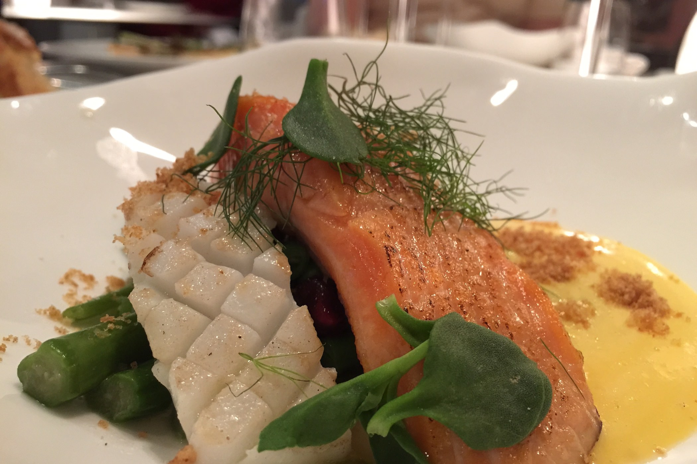
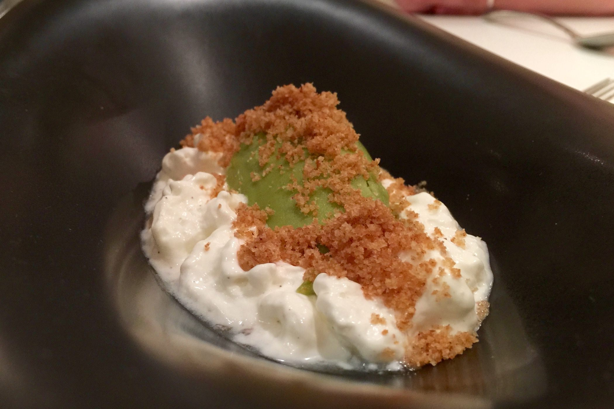
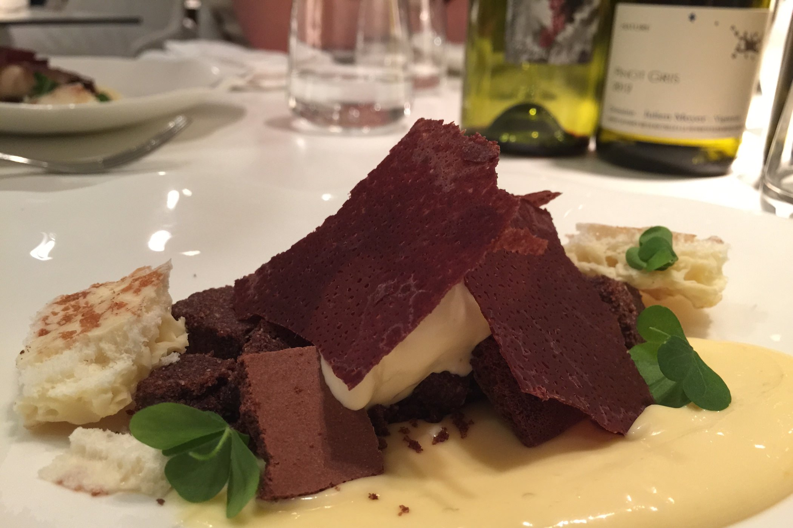

+++
type = "post"
titre =  "Le Prairial à Lyon"
title =  "Le Prairial à Lyon'"
url = "/prairial-lyon"
date = "2015-05-24T13:30:27"
Lastmod = "2015-05-24T15:33:40"
cover = "prairial-lyon.jpg"
categorie = [ "À manger" ]
tag = [ "69001", "Association plat/vin", "Cuisine contemporaine", "Cuisine française" ]
latitude = "45.76494"
longitude = "4.832351"
+++

Nouvelle adresse sur la presqu&rsquo;île lyonnaise, le <a href="http://www.prairial-restaurant.com"><strong>Prairial</strong></a> promeut une « gastronomie décomplexée » et met en avant les légumes, sans être une adresse strictement végétarienne. Derrière les fourneaux et dans la petite salle, une jeune équipe dynamique et formée auprès des plus grands, pour une cuisine moderne et inventive. Ce restaurant est très prometteur et la carte en perpétuelle évolution donne envie d&rsquo;y revenir : à découvrir !

Le Prairial a repris la place de l&rsquo;<a href="/eskis-lyon/" title="Eskis à Lyon"><em>Eskis</em></a>, restaurant spécialisé dans la cuisine moléculaire. Les nouveaux propriétaires ont a peine récupéré les clés et ils n&rsquo;ont pas encore eu le temps d&rsquo;imposer leur marque : la salle est donc identique à celle de l&rsquo;ancien restaurant. On y retrouve les <a href="/wp-content/2012/01/eskis-cadre-restaurant.jpg">murs végétaux</a> et les <a href="/wp-content/2015/05/prairial-salle.jpg">lampes bizarres</a> (et, honnêtement, assez moches) qui descendent presque jusqu&rsquo;au niveau des tables. Des travaux sont prévus, mais d&rsquo;ici là, on ne vient pas pour une salle — qui est au demeurant bien aménagée, même si les tables sont assez proches les unes des autres —, mais pour une cuisine. La promesse du chef cuisinier est simple : la fraicheur avant tout. Ainsi, il n&rsquo;y a pas de menu fixe au Prairial, ce que l&rsquo;on mange dépendra exclusivement de la saison et des produits disponibles. En revanche, on a des formules qui ne changeront pas d&rsquo;un jour à l&rsquo;autre : le midi et les soirs de semaine, on peut se contenter de trois ou quatre services.

Mais on aurait tort de passer à côté des menus plus copieux, qui permettront de découvrir toute la palette du restaurant. Au choix, <a href="/wp-content/2015/05/prairial-menu.jpg">deux menus en six services</a> et un menu mystère en huit services, servi uniquement pour la table entière. Nous nous tournons vers la formule plus raisonnable en six plats, avec un choix d&rsquo;emblée à faire : veut-on le menu végétarien ou pas ? Le Prairial met l&rsquo;accent sur les légumes quoi qu&rsquo;il arrive, mais par défaut, ils accompagnent aussi de la viande ou du poisson. On peut aussi opter pour un menu entièrement végétarien si on le souhaite, un choix qui plaira à ceux qui ne mangent pas d&rsquo;animaux, mais aussi à ceux qui veulent découvrir de nouvelles saveurs. Chaque menu peut être accompagné de vins, avec l&rsquo;excellente idée de proposer des accords pour la majorité des assiettes. Pour le menu en six services, on a quatre verres de vin, par exemple. La sommelière — une québécoise enjouée qui parle des vins avec passion — a sélectionné des bouteilles, toutes naturelles et biologiques, pour accompagner les plats, parfois en harmonie, parfois pour surprendre. Tout n&rsquo;est pas aussi réussi, mais c&rsquo;est une option à recommander si vous êtes amateur de vin et les associations permettent parfois à un plat de se révéler.

Le repas commence pour les deux menus avec une entrée à base d&rsquo;artichaut, sous plusieurs formes. Il y a de petits cœurs d&rsquo;artichaut cuits et des lamelles du même légume, mais crues cette fois. Et en-dessous, un risotto d&rsquo;épeautre et un bouillon de tilleul et laurier. Une entrée tout en finesse, avec un assemblage de goûts différents qui se combinent parfaitement. La suite est plus conventionnelle, mais réalisée à la perfection : une truite à peine cuite comme il se doit, un petit peu de sèche et des légumes verts croquants et savoureux. En cette fin de mois de mai, l&rsquo;asperge est à l&rsquo;honneur et le menu végétarien met lui aussi ce légume en avant, avec une deuxième assiette qui joue sur les oignons caramélisés, les olives noires et une pointe de réglisse. Vient ensuite le deuxième plat, une pièce de bœuf encore une fois cuite exactement comme il faut, accompagnée de poireaux légèrement carbonisés sur le dessus pour donner à l&rsquo;ensemble un arrière-goût de fumée. Encore une fois, l&rsquo;assiette est très bien travaillée, moderne sans être gratuite… un régal. Pour les amateurs de légumes, le deuxième plat est composé essentiellement de morilles et de pommes de terre, avec un bouillon d&rsquo;épluchures de pommes de terre moins convaincant.

On approche alors des desserts, mais dans le respect de la tradition lyonnaise, le Prairial propose d&rsquo;abord un fromage. Ce soir-là, un <a href="/wp-content/2015/05/prairial-fromage.jpg">Saint Marcelin</a> affiné par un meilleur ouvrier de France ; le fromage est si bon qu&rsquo;il se suffit à lui-même, on peut se passer de l&rsquo;accompagnement à base de sureau et d&rsquo;agrumes… les amateurs de sucré avec le fromage pourront toutefois tester le mélange. Deux desserts sont ensuite proposés, avec un très classique pour le menu standard et un très original pour le menu végétarien. Le <a href="/wp-content/2015/05/prairial-dessert-fruits-rouge.jpg">premier</a> mêle fruits rouge, biscuit sablé et glace à la fleur de sureau : un dessert peu sucré et bien maîtrisé, mais assez conventionnel. Dans l&rsquo;autre menu en revanche, le chef s&rsquo;est fait plaisir avec un dessert à base… d&rsquo;asperges. Au milieu trône une quenelle de glace à l&rsquo;asperge, autour il y a de la chantilly parfumée à la cardamome et en-dessous, des suprêmes de pamplemousse. C&rsquo;est surprenant et ce dessert ne plaira pas à tout le monde, mais l&rsquo;équilibre est pourtant parfait et tous ces éléments se combinent pour un plat vraiment réussi. Pour finir le repas, on revient sur quelque chose de plus traditionnel, avec un dessert qui mélange le chocolat sous toutes ses formes et une crème au Yuzu. Classique, mais gourmand et excellent, sans être trop lourd : une excellente manière de finir le repas.

Le Prairial n&rsquo;a pas encore la reconnaissance du milieu, mais cela ne devrait pas tarder : ce restaurant est manifestement très ambitieux et digne d&rsquo;obtenir quelques étoiles. Autant en profiter avant, car on peut encore y manger sans réserver des semaines à l&rsquo;avance et les tarifs sont relativement raisonnables. On mange très bien pour moins de 90 € par personne, boissons comprises et à ce tarif là, les prestations sont remarquables. Une adresse à ne pas rater !

