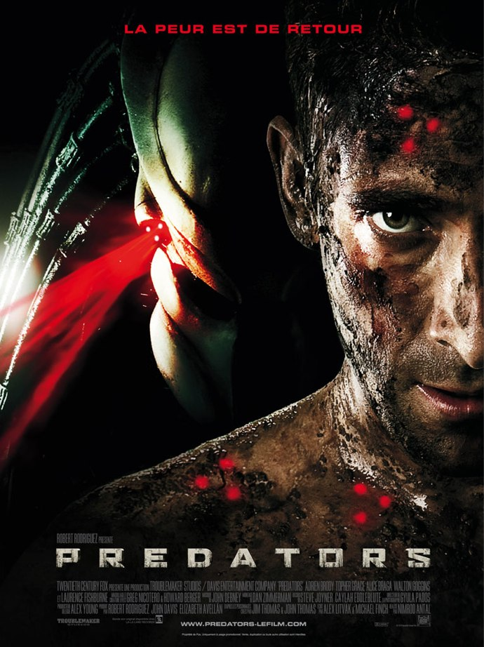
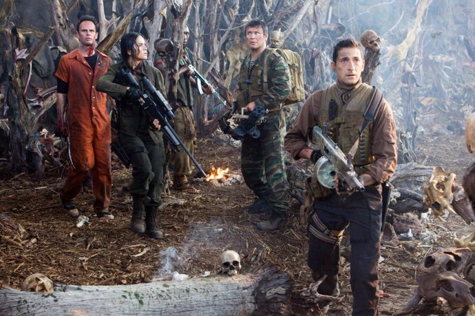

+++
type = "post"
titre = "Predators, Nimrod Antal"
title = "Predators, Nimrod Antal"
url = "/predators-antal"
date = "2010-07-19T00:01:21"
Lastmod = "2013-03-15T15:17:11"
cover = "predators-antal.jpg"
categorie = [ "À voir" ]
tag = [ "Action", "Blockbuster", "Remake", "Science-Fiction", "Vite oublié" ]
createur = [ "Nimrod Antal" ]
acteur = [ "Adrien Brody", "Alice Braga", "Laurence Fishburne" ]
annee = [ "2010" ]
weight = 2010
pays = [ "États-Unis" ]

+++

<em>Predator</em>, sorti en 1987, proposait un hallucinant duel entre un soldat bodybuildé (Schwarzy) et une créature extra-terrestre aussi puissante qu&rsquo;intelligente. Se déroulant entièrement dans la jungle, le film créait une ambiance très stressante en ne montrant presque jamais le predator. En 2010, les studios ont manifestement du mal à trouver de nouvelles idées et ont décidé de faire un remake de l&rsquo;original. Mais <em>Predators</em> a des moyens techniques que n&rsquo;avait pas son prédécesseur, et cela nuit grandement au film qui n&rsquo;est plus qu&rsquo;une mise à mort sur des rails. Décevant.

<em>Predators</em> ne s&rsquo;embarrasse pas avec les détails quand il s&rsquo;agit de construire un scénario. Prenez un groupe d&rsquo;humains et balancez-les dans une jungle infestée de predators. Une fois que l&rsquo;on a dit ça, on a en gros dit tout ce qu&rsquo;il fallait savoir sur l&rsquo;histoire du film. On ne saura jamais pourquoi ils ont été envoyés ici, ni ce que font les predators sur cette planète, ni même où se situe l&rsquo;action… le film de Nimrod Antal s&rsquo;embarrasse peu d&rsquo;explications. Après tout, pourquoi pas, je défends toujours les films qui n&rsquo;explicitent pas tout et ménagent une part de mystère. <em>Predators</em> suit donc sept hommes et une femme qui ne se connaissent pas, viennent des quatre coins de la planète même s&rsquo;ils sont majoritairement américains et sont réunis par une seule caractéristique : ce sont des tueurs. On a ainsi un mercenaire bodybuildé qui remplace Arnold (enfin, tente, au moins), une femme qui manie comme personne le sniper, un russe à la grosse sulfateuse, un Sud-Américain avec sa barbichette, un condamné à mort tout droit sorti d&rsquo;une prison américaine, un yakusa en smoking, un &laquo;&nbsp;membre d&rsquo;escadrons de la mort&nbsp;&raquo; (sic) africain et un médecin.

Tous, sans exception (même le médecin apparemment doux comme un agneau) sont des tueurs largués sur cette planète pour servir de gibier aux predators qui sont d&rsquo;excellents chasseurs qui cherchent un peu de fun. Tuer sans chasser, ce n&rsquo;est pas drôle et ils aiment avoir un peu de fil à retordre. Des cargaisons entières d&rsquo;humains leur sont ainsi envoyées (par qui, on ne sait pas) régulièrement et ils les massacrent gentiment, ne gardant en souvenir que des ossements. Comme le &laquo;&nbsp;s&nbsp;&raquo; du titre l&rsquo;indique clairement, <em>Predators</em> multiplie ces guerriers extraterrestres puisque l&rsquo;on doit en croiser entre 5 et 10 pendant le film, peut-être exactement autant que d&rsquo;humains. Au début ils se cachent, profitant de leur capacité à être invisibles, mais ils finissent par se découvrir et on a alors tout le loisir de découvrir ces êtres très humanoïdes, nonobstant une gueule à la dentition originale. Ces predators sont bien jolis, mais je préfère les crevettes de <em><a href="http://voiretmanger.fr/2009/09/20/district-9-neill-blomkamp/">District 9</a></em>, dans le genre. Ils sont en tout cas très efficaces pour tuer les humains et multiplient les jeux avec leur nourriture, s&rsquo;amusant à les tuer tranquillement, l&rsquo;un après l&rsquo;autre. On comprend vite que l&rsquo;on est dans ce genre de films où l&rsquo;essentiel, pour les personnages, est de survivre le plus longtemps possible alors que tout le monde se fait joyeusement massacrer.

<em>Predators</em> aurait pu être un bon film, s&rsquo;il n&rsquo;était pas aussi sérieux et si proche de l&rsquo;original. Le film n&rsquo;avait pas pour lui l&rsquo;originalité, ce qui est logique quand on passe après deux films et divers produits dérivés (les deux <em>Aliens vs Predators</em> notamment). Le predator est entré dans la culture populaire depuis <em>Predator</em> qui bénéficiait par contre de l&rsquo;effet de surprise. Ces créatures font partie des gros monstres imaginés par le cinéma de ces dernières années, avec les aliens qui précèdent même les predator. <em>Predators</em> souffre en fait des mêmes symptômes que les globalement décevantes suites d&rsquo;<em>Alien</em>, le film original de Ridley Scott. Ce dernier l&rsquo;a tourné en 1979, une époque où les effets spéciaux numériques n&rsquo;étaient encore bien souvent qu&rsquo;un rêve et où il fallait bricoler avec les moyens du bord. La contrainte est toujours un excellent moyen de réussir, au cinéma comme dans autres arts et cette pauvreté technique est certainement un élément essentiel dans la réussite des ancêtres, que ce soit <em>Alien</em> ou <em>Predator</em>. À chaque fois, les réalisateurs ne peuvent se permettre de montrer leurs créatures faute de moyen, mais cette absence est justement la clé du suspense : la menace est réelle, mais jamais vraiment sensible et elle est d&rsquo;autant plus forte qu&rsquo;invisible. Tout comme les trois épisodes qui suivirent <em>Alien</em>, le <em>Predators</em> de Nimrod Antal souffre de moyens techniques trop courants et trop simples à implémenter. Le film donne dans une exubérance de moyens qui ne met que mieux en valeur ses faiblesses. Les predators, trop souvent à l&rsquo;écran, ne sont vraiment pas impressionnants et la peur promise par l&rsquo;affiche ne vient jamais. On ne sursaute même pas devant ce qui n&rsquo;est plus qu&rsquo;une méthodique et lassante mise à mort des personnages. Ces derniers, caricaturaux au possible — on retrouve la manie du cinéma américain de vouloir représenter une population dans toute sa diversité, avec un jaune, un noir, une femme… — ne nous intéressent jamais vraiment et sont loin d&rsquo;être tous crédibles. Mention spéciale dans ce domaine à Adrien Brody qui fait un bien piètre successeur à Arnold Schwarzenegger.

Il manque en fait à <em>Predators</em> une bonne dose d&rsquo;humour ou au moins un recul suffisant par rapport à l&rsquo;original. Le film se prend bien trop au sérieux là où il aurait pu susciter le plaisir coupable des séries B. Le réalisateur ne prend jamais de recul par rapport au film de 1987 et préfère au contraire le suivre à la lettre, jusqu&rsquo;au choix de la jungle comme terrain de jeu. Les scènes vues par les predators sont plutôt bien fichues, mais manquent, là encore, d&rsquo;originalité et ne sont pas tellement exploitées. Le film suit timidement une piste proche des films d&rsquo;horreur avec notamment le camp ennemi bourré de cadavres et de chairs sanguinolentes (qui justifient sans doute l&rsquo;interdiction au moins de 12 ans), mais cela ne va pas bien loin. Le film se résume à une série de mises à mort et parfois de combats (le yakuza qui se bat au sabre contre un predator qui ne savait apparemment pas qu&rsquo;un yakuza est un expert du sabre). Dommage, d&rsquo;autant que Robert Rodriguez est dans l&rsquo;équipe en tant que producteur : il a réalisé <em>Planète Terreur</em>, film se série B totalement assumée beaucoup plus fun que ce <em>Predators</em>. Je me demande ce que cela aurait donné s&rsquo;il l&rsquo;avait réalisé…

Réaliser le remake d&rsquo;un film n&rsquo;est jamais facile, mais une grande règle est que la copie parfaite est une impasse. À quoi bon réaliser un film s&rsquo;il n&rsquo;apporte rien, surtout quand on parle de remake. Le cinéma américain est spécialiste du remake raté de film asiatique réussi et c&rsquo;est un peu le même phénomène que l&rsquo;on retrouve avec <em>Predators</em>. Faute d&rsquo;originalité, le film de Nimrod Antal aurait nécessité une bonne dose d&rsquo;humour, ou d&rsquo;horreur, un élément de plus en tout cas qui aurait permis d&rsquo;oublier un peu <em>Predator</em>. Las, <em>Predators</em> n&rsquo;est qu&rsquo;une mise à mort méthodique et bien peu passionnante de quelques personnages…

Avis partagé dans la blogosphère, à l&rsquo;image d&rsquo;<a href="http://www.plan-c.fr/article-critique-predators-de-nimrod-antal-53265415.html">Alexandre</a> qui demande, peiné, &laquo;&nbsp;<em>À quoi bon, vraiment, à quoi bon ?</em>&nbsp;&raquo; ou <a href="http://www.anglesdevue.com/2010/07/18/predators-de-nimrod-antal/">Boustone</a> qui évoque un &laquo;&nbsp;<em>divertissement assez passable</em>.&nbsp;&raquo; <a href="http://www.filmosphere.com/2010/07/critique-predators-2010/">Nicolas</a>, malgré quelques regrets, a plutôt apprécié de son côté. <em><a href="http://www.critikat.com/Predators.html">Critikat</a></em> n&rsquo;a pas aimé et rappelle à juste titre que la fin, très ouverte, ouvre malheureusement la voie à un nouvel épisode…

<h3>Vous voulez m&rsquo;aider ?<a href="#footnote_0_3670" id="identifier_0_3670" class="footnote-link footnote-identifier-link" title="&Agrave; propos de la publicit&eacute;&hellip;">1</a></h3>
<ul>
<li><a href="http://www.amazon.fr/gp/product/B003Z420YC/ref=as_li_ss_tl?ie=UTF8&#038;tag=leblogdenic07-21&#038;linkCode=as2&#038;camp=1642&#038;creative=19458&#038;creativeASIN=B003Z420YC">Acheter le film en Blu-Ray sur Amazon</a></li>
<li><a href="http://www.amazon.fr/gp/product/B003Z420Y2/ref=as_li_ss_tl?ie=UTF8&#038;tag=leblogdenic07-21&#038;linkCode=as2&#038;camp=1642&#038;creative=19458&#038;creativeASIN=B003Z420Y2">Acheter le film en DVD sur Amazon</a></li>
<li><a href="https://itunes.apple.com/fr/movie/predators/id386122874">Acheter ou louer le film sur l&rsquo;iTunes Store</a></li>
</ul>

<ol class="footnotes"><li id="footnote_0_3670" class="footnote"><a href="http://voiretmanger.fr/soutien/">À propos de la publicité…</a> [<a href="#identifier_0_3670" class="footnote-link footnote-back-link">&#8617;</a>]</li></ol>
