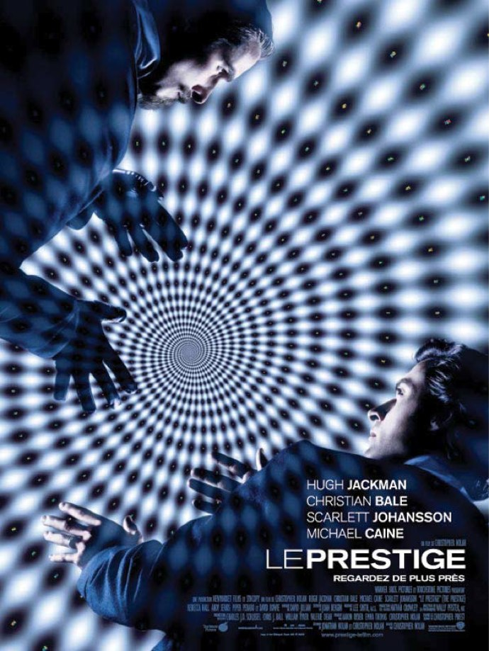
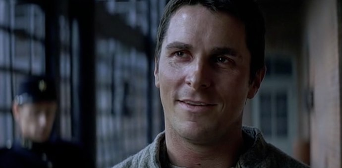
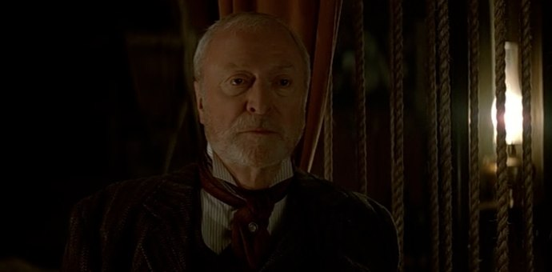

+++
titre = "<em>Le Prestige</em>, Christopher Nolan"
title = "Le Prestige, Christopher Nolan"
url = "/prestige-nolan"
date = "2010-09-06T23:54:07"
Lastmod = "2013-09-07T23:14:07"
cover = "nolan-prestige.jpg"
categorie = [ "À voir" ]
tag = [ "Amour", "Blockbuster", "Drame", "Fantastique" ]
createur = [ "Christopher Nolan" ]
acteur = [ "Christian Bale", "Hugh Jackman", "Michael Caine", "Scarlett Johansson" ]
annee = [ "2006" ]
weight = 2006
pays = [ "États-Unis" ]
original = "The Prestige"

+++

Pour son cinquième film, Christopher Nolan abandonne l&rsquo;époque contemporaine qui avait servi de cadre à tous ses films jusque-là — même <em>Batman Begins</em> se déroule dans un environnement contemporain — pour changer d&rsquo;époque et poser sa caméra au cœur du Londres du début du XXe siècle. Dans cette époque qui n&rsquo;avait pas encore la joie de connaître le cinéma et ses effets spéciaux, mais qui découvrait l&rsquo;électricité, le réalisateur filme un duel entre deux illusionnistes. Un duel terrible où tout, bien sûr, repose sur l&rsquo;illusion et le mensonge. Et pourtant, alors que <em>Le Prestige</em> donne dès les premières secondes toutes les clés pour décrypter le film, Christopher Nolan parvient à maintenir de bout en bout le suspense et offre un spectacle à nouveau bluffant.

Robert Angier et Alfred Borden sont deux magiciens très doués. Dans une société encore très marquée par le positivisme et la croyance en l&rsquo;absolue vérité de la science, l&rsquo;illusion a la côte en offrant justement un peu de mystère et ces deux illusionnistes sont promis à un brillant avenir. En attendant leur heure, ils sont les complices d&rsquo;un magicien sur le tard qui propose des tours de passe-passe assez conventionnels. Robert est marié à une assistante du même magicien et les deux jeunes hommes se font passer tous les soirs pour des messieurs tout le monde, se portent volontaire pour monter sur scène, sont bien sûr choisis et font des nœuds spéciaux autour de l&rsquo;assistante. Ces nœuds sont suffisamment solides pour que la jeune femme soit soulevée et plongée dans un cube plein d&rsquo;eau, mais suffisamment faciles à défaire pour qu&rsquo;elle se libère à l&rsquo;aide d&rsquo;un astucieux faux verrou. Le show fonctionne bien, jusqu&rsquo;au soir fatidique où un nœud trop serré l&rsquo;empêche de sortir. Le cube en verre est brisé, mais bien trop tard, la jeune femme meurt, noyée. Robert et Alfred ont toujours été en compétition, mais cette mort transforme l&rsquo;esprit de compétition sportive en duel à mort. Duel qui se traduit aussi par les spectacles : les deux hommes sont très doués, mais Alfred l&rsquo;est plus encore. Dès que l&rsquo;un a trouvé un nouveau tour, l&rsquo;autre essaie immédiatement de découvrir le secret et de le surpasser pour proposer un tour encore plus fort. Cette émulation positive se dédouble d&rsquo;un combat à mort qui passe essentiellement par des déguisements permettant tous les coups-bas possibles et imaginables. Ajouter une vraie balle dans un pistolet censé ne contenir que de la poudre, activer un mécanisme savant avant l&rsquo;heure et donc gâcher un numéro et finalement l&rsquo;attentat direct contre les personnes.

<em>Le Prestige</em> est l&rsquo;occasion de démystifier complètement l&rsquo;illusion. Christopher Nolan prend un malin plaisir pour présenter un tour, et en dévoiler ensuite toute la logique. Certains tours sont vraiment ingénieux, tout est bon pour créer l&rsquo;illusion : les trappes dans le sol, les engins pour propulser sur la scène, les câbles et autres fils, les manches trop larges, les tables creuses… tout y passe. Très réaliste, le film n&rsquo;hésite pas à évoquer le sort cruel réservé aux figurants ailés, écrasés dans des cages pliantes à une époque où la SPA et Brigitte Bardot n&rsquo;étaient pas encore passées par là. Les illusionnistes notent leurs tours dans des carnets sous une forme codée, et les revendent arrivés à l&rsquo;âge de la retraite. C&rsquo;est toute une industrie qui est ainsi présentée par <em>Le Prestige</em> et on ne peut évidemment s&rsquo;empêcher de faire le rapprochement entre l&rsquo;illusion et le cinéma. Ces prestidigitateurs sont des métaphores du metteur en scène et leur travail est finalement le même que celui d&rsquo;un réalisateur aujourd&rsquo;hui, à savoir créer l&rsquo;illusion par les effets spéciaux. À l&rsquo;époque on se contentait de foulards ou de fumée, même si les arcs électriques que l&rsquo;on découvre en même temps que l&rsquo;électricité sont très efficaces sur la société londonienne. Assister ainsi à la construction puis à la déconstruction de tours de magie est assez fascinant : on a tous eu l&rsquo;occasion d&rsquo;assister à des tours de magie, peut-être d&rsquo;en faire soi-même avec les kits qui s&rsquo;empilent sous les sapins et plus que le tour lui-même, le plaisir vient de la découverte du &laquo;&nbsp;truc&nbsp;&raquo;. Nolan offre ici un film très rationnel finalement, même si la machine de Tesla introduit une bonne dose de science-fiction en inventant ni plus ni moins qu&rsquo;une machine à cloner diablement efficace.

Quand un film fait de l&rsquo;illusion et du mensonge ses thèmes centraux, on se doute qu&rsquo;il y a anguille sous roche concernant le récit. Je ne révèle rien si je dis que <em>Le Prestige</em> est tout entier un tour de magie géant. On s&rsquo;y attend et le cinéaste le dit d&rsquo;ailleurs clairement au départ : les premières minutes du film contiennent ainsi toutes les clés pour décrypter la suite. Mais évidemment, c&rsquo;est toujours quand la solution est la plus évidente que l&rsquo;on ne la voit pas. Christopher Nolan s&rsquo;amuse à brouiller ensuite les pistes et surtout à offrir aux spectateurs plusieurs solutions qui leur donnent le sentiment plaisant d&rsquo;avoir trouvé la solution, avant de finalement les décevoir en ajoutant encore un petit peu plus de mystère. Quand on pense avoir compris, un nouvel élément surgit et remet tout en cause. Peut-être suis-je bon public, mais je n&rsquo;ai vraiment compris qu&rsquo;à la fin et j&rsquo;ai été alors bluffé, agacé de m&rsquo;être fait avoir et en même temps impressionné par la force du film à tenir, solide comme un roc, alors que son histoire se révèle finalement plus complexe qu&rsquo;il n&rsquo;y paraissait au premier abord. On nous l&rsquo;avait dit pourtant, et l&rsquo;affiche le répète encore, de &laquo;&nbsp;Regarder de plus près.&nbsp;&raquo; Mais comme l&rsquo;explique brillamment l&rsquo;ingénieur qui invente les moyens de créer l&rsquo;illusion, on ne veut pas savoir la vérité, on veut croire en l&rsquo;illusion et on ne regarde pas suffisamment, pas là où il faudrait.

Avec <em>Le Prestige</em> et après deux films plus conventionnels, Christopher Nolan renoue avec les structures complexes, ici en explosant la narration linéaire. Les époques se croisent, s&rsquo;entremêlent et même s&rsquo;entrechoquent en permanence dans le film. L&rsquo;histoire est ainsi reconstituée peu à peu, comme un puzzle, et on n&rsquo;aura tous les éléments que vraiment à la fin. Le procédé est courant, mais rarement dans un blockbuster dédié par définition au grand public. Il faut dire que le réalisateur parvient comme personne à maintenir la clarté de son film de bout en bout. Le spectateur n&rsquo;est jamais vraiment perdu, on comprend facilement que l&rsquo;on passe d&rsquo;une époque à l&rsquo;autre et on sait même facilement à quelle époque dans le récit on se situe. L&rsquo;ensemble est, comme toujours, extrêmement fluide et dénote d&rsquo;une maîtrise totale du sujet et de l&rsquo;histoire. En cela, <em>Le Prestige</em> est très proche d&rsquo;<em><a href="http://voiretmanger.fr/2010/07/17/inception-nolan/">Inception</a></em>, par cette capacité à proposer en même temps une structure complexe et un film totalement accessible.

Avec <em>Le Prestige</em>, Christopher Nolan propose pour la première fois une sorte de synthèse entre les constructions complexes des débuts (<em><a href="http://voiretmanger.fr/2010/08/10/memento-nolan/">Memento</a></em> ou <em><a href="http://voiretmanger.fr/2010/08/02/following-nolan/">Following</a></em>) et les blockbusters grand public qui ont suivi (<em><a href="http://voiretmanger.fr/2010/08/23/insomnia-nolan/">Insomnia</a></em> en partie, mais surtout <em><a href="http://voiretmanger.fr/2010/08/30/batman-begins-nolan/">Batman Begins</a></em>). Une voie originale, pas si évidente à tenir que cela en a l&rsquo;air et qui a plutôt réussi au réalisateur par la suite. <em>Le Prestige</em> est un film prenant, tenu d&rsquo;une main de maître et qui entretient le mystère pendant très longtemps, tout en donnant toutes les clés, ou presque, pour comprendre dès les premières minutes. À ne pas rater, surtout si vous ne l&rsquo;avez encore jamais vu.

<h3>Vous voulez m&rsquo;aider ?<a href="#footnote_0_3982" id="identifier_0_3982" class="footnote-link footnote-identifier-link" title="&Agrave; propos de la publicit&eacute;&hellip;">1</a></h3>
<ul>
<li><a href="http://www.amazon.fr/gp/product/B000OFOUAW/ref=as_li_ss_tl?ie=UTF8&#038;tag=leblogdenic07-21&#038;linkCode=as2&#038;camp=1642&#038;creative=19458&#038;creativeASIN=B000OFOUAW">Acheter le film en Blu-Ray sur Amazon</a></li>
<li><a href="http://www.amazon.fr/gp/product/B000OFOUA2/ref=as_li_ss_tl?ie=UTF8&#038;tag=leblogdenic07-21&#038;linkCode=as2&#038;camp=1642&#038;creative=19458&#038;creativeASIN=B000OFOUA2">Acheter le film en DVD sur Amazon</a></li>
<li><a href="https://itunes.apple.com/fr/movie/le-prestige/id379808440">Acheter ou louer le film sur l&rsquo;iTunes Store</a></li>
</ul>

<ol class="footnotes"><li id="footnote_0_3982" class="footnote"><a href="http://voiretmanger.fr/a-propos/publicite/">À propos de la publicité…</a> [<a href="#identifier_0_3982" class="footnote-link footnote-back-link">&#8617;</a>]</li></ol>
