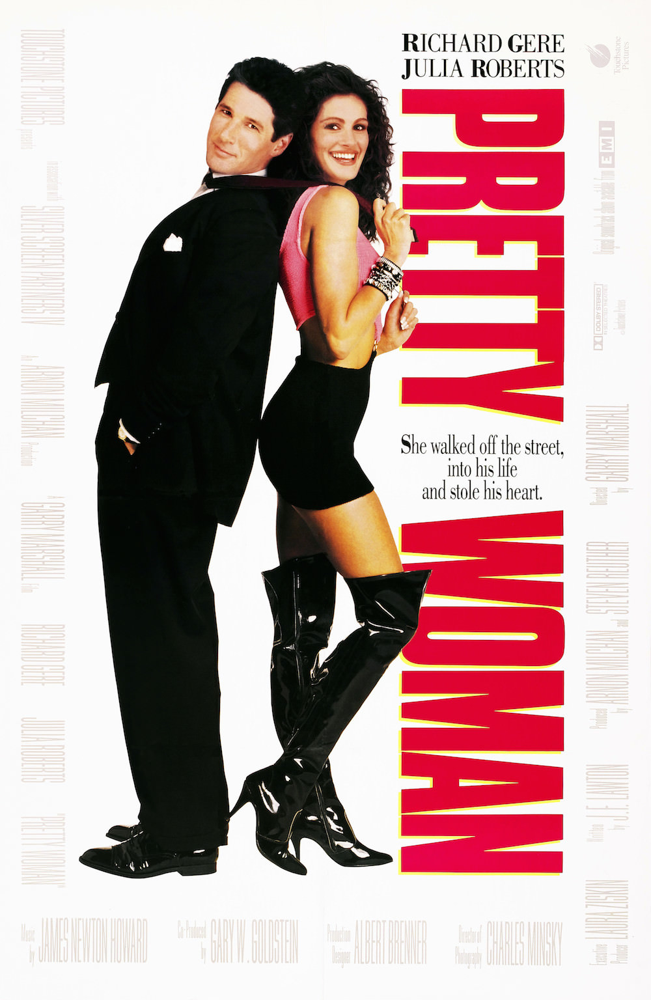
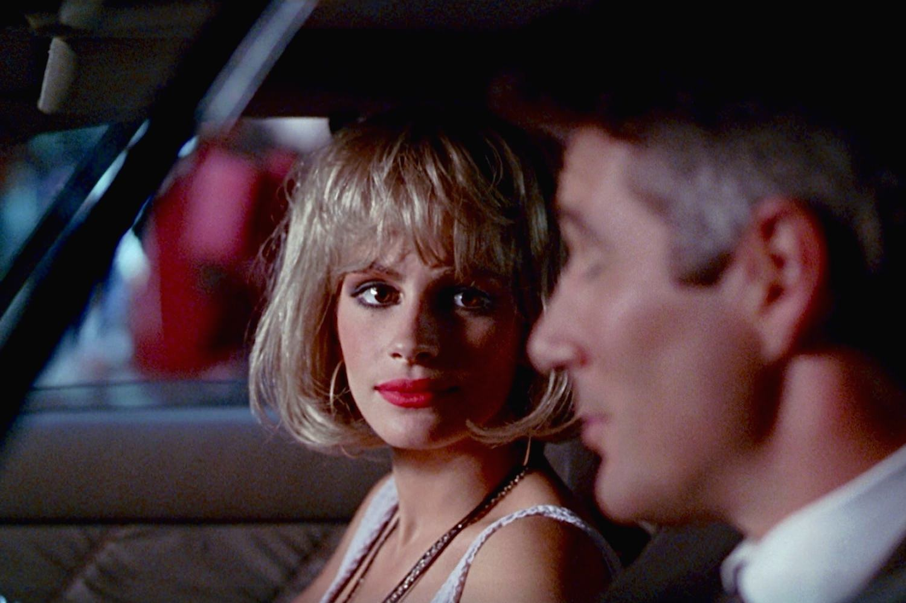
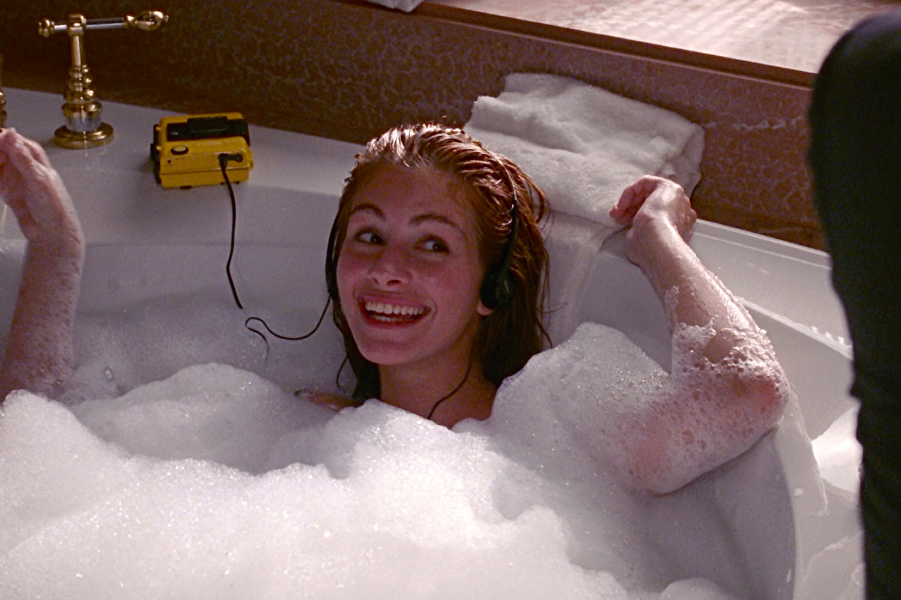

+++
titre = "<em>Pretty Woman</em>, Garry Marshall"
title = "Pretty Woman, Garry Marshall"
url = "/pretty-woman-marshall"
date = "2014-04-07T10:38:43"
Lastmod = "2014-04-05T18:41:59"
cover = "pretty-woman-ricgard-gere-julia-roberts.jpeg"
categorie = [ "À voir" ]
tag = [ "Amour", "Argent", "Comédie romantique", "Humour", "Prostitution", "Société" ]
createur = [ "Gary Marshall" ]
acteur = [ "Jason Alexander", "Julia Roberts", "Laura San Giacomo", "Ralph Bellamy", "Richard Gere" ]
annee = [ "1990" ]
weight = 1990
pays = [ "États-Unis" ]

+++

À bien des égards, <em>Pretty Woman</em> ressemble à l’archétype même de la comédie romantique. Le film de Garry Marshall rassemble tous les ingrédients du genre et le film s’est imposé au fil des années, avec la <a href="https://itunes.apple.com/fr/album/oh-pretty-woman/id195806030?i=195806246">célèbre chanson de Roy Orbison</a> qui lui a donné son titre. En 1990, Julia Roberts n’était pas encore l’actrice que l’on sait et c’est avec ce rôle qu’elle s’est fait vraiment connaître pour la première fois. À défaut d’être très original, surtout une vingtaine d’années après, le long-métrage reste très plaisant à regarder, même s’il collectionne les clichés. Un bon divertissement, porté par une actrice déjà exceptionnelle.

Le scénario original de <em>Pretty Woman</em> a choqué à l’époque plusieurs actrices qui ont d’ailleurs refusé le rôle. Aujourd’hui, cette histoire d’amour entre un homme d’affaires et une prostituée ne choquerait plus grand monde, mais il faut reconnaître que l’ouverture sur les formes généreuses de Julia Roberts — ou plutôt celles d’Andrea Parker, sa doublure… — est osée. Garry Marshall n’a pas loupé son personnage principal et tant qu’elle est une prostituée, elle a de quoi choquer les âmes puritaines avec ses vêtements très allégés et surtout très suggestifs. L’actrice s’en donne à cœur joie dans ce rôle, mais on sait bien qu’elle n’en restera pas là. De fait, toute l’idée du film est de former un couple aussi improbable que possible entre cette fille des rues, Vivian, et Edward, un homme d’affaires immensément riche qui gagne sa vie en achetant des entreprises au bord de la faillite pour les revendre en petits morceaux et réaliser une plus-value. Très chic dans son costume que l’on imagine très coûteux, Richard Gere est le parfait contrepoint à sa partenaire et il impose sa prestance pour l’éloigner au maximum de la joyeuse simplicité de Vivian. Tout oppose les deux personnages, et pas uniquement l’argent : elle n’a pas fait d’études, elle est exubérante et vit l’instant présent sans jamais rien prévoir. Lui, au contraire, a fait les études les plus longues et les meilleures qui soient, il aime tout organiser et tout contrôler dans sa vie, c’est un travailleur acharné qui ne s’autorise aucun plaisir. Et naturellement, il est malheureux en amour : divorcé, il se fait plaquer par sa copine du moment dès l’ouverture de <em>Pretty Woman</em>.

Gary Marshall n’est pas là pour entretenir le suspense et on sait bien que ces deux-là que tout oppose, vont finir par tomber amoureux. La première rencontre fortuite commence sur un malentendu : il cherche sa route, elle pense qu’il veut du sexe facile. Pourtant, même si on peut difficilement parler de coup de foudre, on sent que le courant passe et une fois de retour à son palace des beaux quartiers de Los Angeles, Edward demande à Vivian de monter avec lui. Il la paye une heure, puis une nuit et finalement l’embauche une semaine. Officiellement, il ne s’agit que d’un contrat purement professionnel, mais il ne fait strictement aucun doute qu’il y a autre chose qui se prépare. On ne dévoile rien de l’intrigue de <em>Pretty Woman</em> en indiquant ainsi qu’ils finiront par tomber amoureux, c’est le principe même du film. Dès lors que c’est acquis, on peut noter que le cinéaste mène son scénario de manière assez fine et parvient à faire vivre ses deux personnages très caricaturaux, mais qui savent garder une part de subtilité. Vivian pourrait simplement passer de la prostitution à la potiche entretenue, mais elle résiste jusqu’au bout aux demandes d’Edward qui voudrait simplement lui donner tout ce qu’elle veut et la garder pour lui. À l’inverse, l’ultra-capitaliste sans honte qu’il est au début évolue sous l’influence de Vivian et finit par travailler différemment. Garry Marshall ne s’éloigne jamais totalement des stéréotypes et c’est, après tout, ce qui fait aussi que son film soit devenu un classique. Mais on note au moins une envie de ne pas en rester uniquement aux clichés et de surprendre un petit peu. Cela ne fait pas de <em>Pretty Woman</em> un film original et étonnant, mais le postulat de départ aurait pu donner quelque chose de bien pire. Et puis le cinéaste peut compter sur Julia Roberts qui fait déjà, ici, preuve d’une maturité surprenante et parvient à jouer à la perfection sur tous les registres. De quoi pardonner quelques scènes un peu faciles et retenir les meilleures, à l’image de la session de <a href="https://www.youtube.com/watch?v=jT5rMvo3Clc">shopping sur Rodeo Drive</a> sur fond de Roy Orbison.

<em>Pretty Woman</em> est un film culte pour beaucoup d’amateurs de comédies romantiques et ce n’est sans doute pas un hasard. Garry Marshall a su rassembler tous les éléments qui font le succès du genre, mais il profite aussi et surtout de deux excellents acteurs. Au-delà des clichés, au-delà des défauts que l’on peut relever, c’est au fond cela que l’on retient. Et la fameuse chanson qui a donné au long-métrage son titre, naturellement…

<h3>Vous voulez <a href="http://voiretmanger.fr/soutien/">m’aider</a> ?</h3>
<ul>
<li><a href="http://www.amazon.fr/gp/product/B001L7TEF8/ref=as_li_ss_tl?ie=UTF8&amp;tag=leblogdenic07-21&amp;linkCode=as2&amp;camp=1642&amp;creative=19458&amp;creativeASIN=B001L7TEF8">Acheter le film en Blu-ray sur Amazon</a></li>
<li><a href="http://www.amazon.fr/gp/product/B00006470Y/ref=as_li_ss_tl?ie=UTF8&amp;tag=leblogdenic07-21&amp;linkCode=as2&amp;camp=1642&amp;creative=19458&amp;creativeASIN=B00006470Y">Acheter le film en DVD sur Amazon</a></li>
<li><a href="https://itunes.apple.com/fr/movie/pretty-woman/id734473324">Acheter ou louer le film sur l’iTunes Store</a></li>
</ul>

