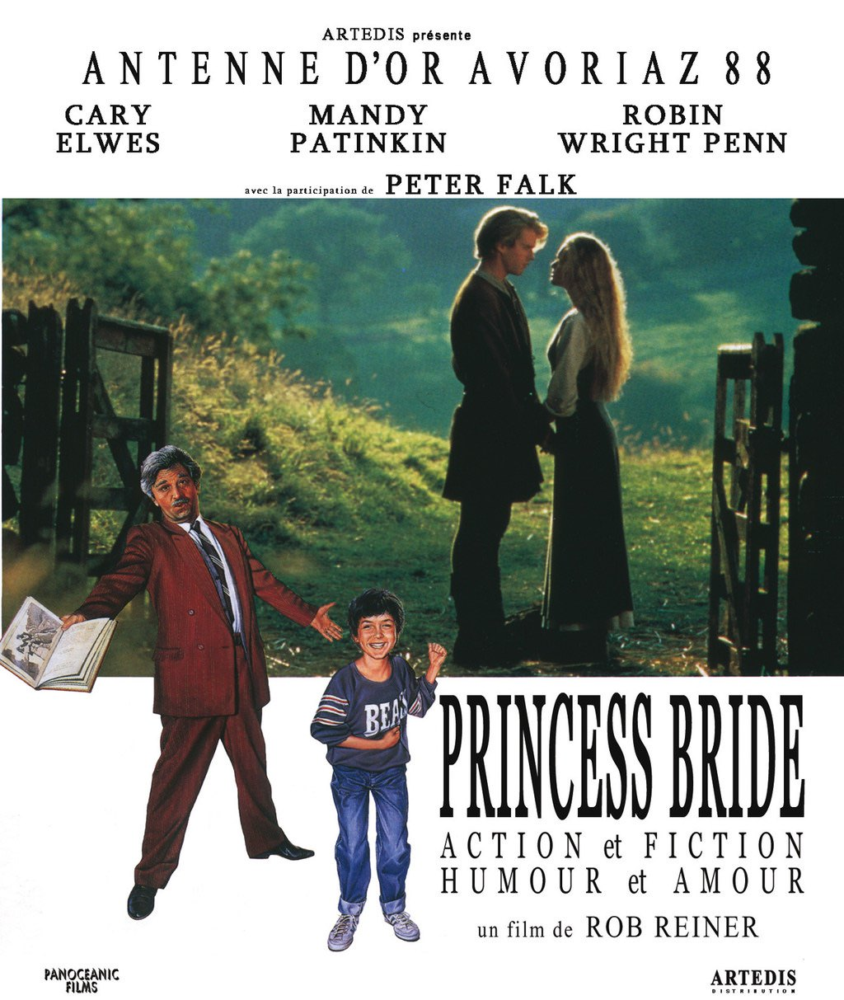
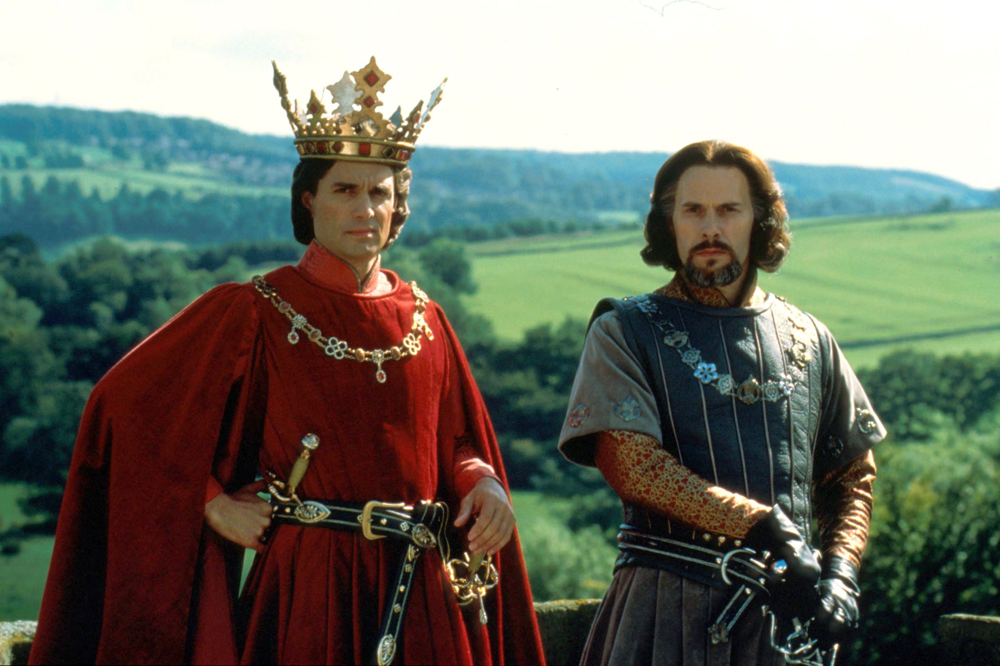
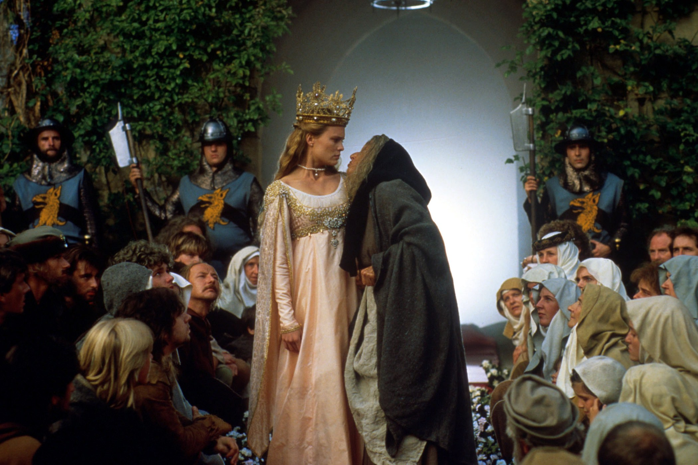

+++
type = "post"
titre = "<em>Princess Bride</em>, Rob Reiner"
title = "Princess Bride, Rob Reiner"
url = "/princess-bride-reiner"
date = "2015-01-10T19:51:12"
Lastmod = "2015-01-10T19:56:56"
cover = "princess-bride-cary-elwes-robin-wright.jpg"
categorie = [ "À voir" ]
tag = [ "Adaptation littéraire", "Amour", "Aventure", "Cape et épée", "Conte", "Drame", "Fantastique", "Humour", "Parodie", "Princesse" ]
createur = [ "Rob Reiner" ]
acteur = [ "Cary Elwes", "Chris Sarandon", "Christopher Guest", "Mandy Patinkin", "Peter Falk", "Robin Wright" ]
annee = [ "1988" ]
weight = 1988
pays = [ "États-Unis" ]
original = "The Princess Bride"

+++

Les adaptations de conte sont plus rares en images réelles qu&rsquo;en animation, mais <em>Princess Bride</em> fait partie des exceptions. Ce long-métrage réalisé par Rob Reiner a un scénario digne d&rsquo;un Disney avec son histoire de princesse sauvée par son grand amour, mais ce n&rsquo;est pas un dessin animé. Utilisant un artifice bien pratique, le film adopte une posture un petit peu plus distance face au conte et devient presque une parodie. « Presque », car à l&rsquo;image du roman de William Goldman qu&rsquo;il adapte, ce long-métrage peut se lire autant au second degré qu&rsquo;au premier. Les plus jeunes seront émerveillés ou effrayés par cet univers parfois impressionnant, les plus grands s&rsquo;amuseront des clichés de contes de princesse accumulés tout au long du film. Depuis sa sortie à la fin des années 1980, <em>Princess Bride</em> est devenu culte et on pardonne facilement ses effets spéciaux qui devaient, déjà à l&rsquo;époque, paraître bien pauvres, pour mieux se concentrer sur une formidable histoire de princesse teintée de second degré. Un classique !

<em>Princess Bride</em> n&rsquo;est directement un conte : si l&rsquo;intrigue principale évoque bien une histoire de princesse, de prince charmant, d&rsquo;épée et de divers éléments issus du genre, le film comme le roman dont il est issu exploite une petite astuce scénaristique. Ils commencent tous deux au présent, dans notre réalité : un enfant malade reste à la maison et son grand-père venu le surveiller lui raconte une histoire. Il a amené un livre et c&rsquo;est ce récit qui sera celui du film : dans la majorité des contes, il y a un narrateur et c&rsquo;est aussi le cas ici, mais il ne reste pas inconnu. En plus de l&rsquo;entendre, on le voit au début, puis à plusieurs moments pendant qu&rsquo;il raconte l&rsquo;histoire. En effet, cette mise à distance n&rsquo;est pas qu&rsquo;un prétexte initial et Rob Reiner fait intervenir ces deux personnages extérieurs au récit plus d&rsquo;une fois. En général, c&rsquo;est l&rsquo;enfant qui pose une question, proteste parce qu&rsquo;il y a trop de romantisme, ou parce qu&rsquo;un personnage meurt un peu trop tôt. Il joue le rôle du jeune spectateur qui, immanquablement, se posera les mêmes questions et il justifie aussi le second degré qui traverse <em>Princess Bride</em>. De fait, le film tend régulièrement à la parodie, avec un sens de l&rsquo;humour très britannique qui n&rsquo;est pas sans rappeler celui des <a href="/createur/monty-pythons/">Monty Pythons</a>. Il y a ainsi un peu d&rsquo;absurde, mais surtout une prise de distance par rapport au récit. Quand il se passe quelque chose de trop anormal ou étonnant, la réalité revient au premier plan, cassant ainsi l&rsquo;illusion du conte. Ce qui permet aussi, au passage, d&rsquo;éviter un côté trop premier degré qui aurait été sans doute assez lourd dans ce film qui manque clairement de budget pour s&rsquo;assurer une réalisation spectaculaire.

De fait, <em>Princess Bride</em> est un film assez pauvre sur le plan technique, et cela se voit. Le poids des années n&rsquo;a pas aidé, incontestablement, mais on imagine qu&rsquo;il était déjà assez limite sur ce point à sa sortie. Les effets spéciaux sont assez chiches, les décors artificiels ressemblent à du carton pâte et les créatures du marais du feu sont visiblement des peluches animées par un homme à quatre pattes. Toutefois, on pardonne vite ces faiblesses techniques qui renforcent l&rsquo;aspect parodique du conte et qui confèrent même à l&rsquo;ensemble un côté artificiel qui est finalement presque touchant. Et puis toutes ces considérations échapperont totalement aux plus jeunes qui seront pris par une histoire de princesse atypique, tout en étant composée exclusivement de scènes clichés. Dans les grandes lignes, l&rsquo;histoire d&rsquo;amour fou perturbé par un méchant n&rsquo;est pas très originale, mais le long-métrage de Rob Reiner vient perturber cette histoire par plusieurs éléments étranges. Le couple est pauvre et la princesse ne l&rsquo;est que par la force des choses, parce que le prince, le vrai, voulait l&rsquo;épouser. Il y a aussi le trio de brigand qui enlève la princesse au début pour des raisons géopolitiques assez complexes, et puis il y a le machiavélisme du prince qui échappe au cadre traditionnel du conte. Sans compter que <em>Princess Bride</em> ne manque pas de scènes assez terrifiantes, avec notamment une scène de torture que l&rsquo;on n&rsquo;attendait pas forcément dans un tel film. Pour toutes ces raisons, derrière le vernis du conte pour enfant, le film est plus complexe qu&rsquo;il n&rsquo;y paraît. Ne faisons pas du projet une œuvre majeure pour autant, mais Rob Reiner s&rsquo;adresse incontestablement à la fois à l&rsquo;enfant malade dans son lit, qu&rsquo;au grand-père qui lui raconte l&rsquo;histoire.

De la musique composée par Mark Knopfler aux répliques devenues cultes, <em>Princess Bride</em> ne manquait pas de raisons de rester en mémoire. De fait, après un démarrage assez lent au cinéma, le film de Rob Reiner est vite devenu culte après sa sortie dans le commerce. Près de trente ans après sa sortie, ses effets spéciaux un peu <em>cheap</em> n&rsquo;ont pas très bien vieilli, mais qu&rsquo;importe : il reste un long-métrage drôle pour les uns, passionnant pour les autres, et c&rsquo;est bien là sa réussite. Ce film est un peu un dessin-animé Disney qui aurait été filmé en images réelles, un projet étrange, mais qui fonctionne plutôt bien au total. <em>Princess Bride</em> n&rsquo;est pas un chef-d&rsquo;œuvre, mais un conte solide et drôle à la fois, un film culte !

<h3>Vous voulez <a href="/soutien/">m&rsquo;aider</a> ?</h3>
<ul>
<li><a href="http://www.amazon.fr/gp/product/B00FAWEAD6/ref=as_li_ss_tl?ie=UTF8&amp;tag=leblogdenic07-21&amp;linkCode=as2&amp;camp=1642&amp;creative=19458&amp;creativeASIN=B00FAWEAD6">Acheter le film en Blu-ray sur Amazon</a></li>
<li><a href="http://www.amazon.fr/gp/product/B00FAWEAYA/ref=as_li_ss_tl?ie=UTF8&amp;tag=leblogdenic07-21&amp;linkCode=as2&amp;camp=1642&amp;creative=19458&amp;creativeASIN=B00FAWEAYA">Acheter le film en DVD sur Amazon</a></li>
<li><a href="https://itunes.apple.com/fr/movie/princess-bride/id716836191">Acheter ou louer le film sur l&rsquo;iTunes Store</a></li>
</ul>

