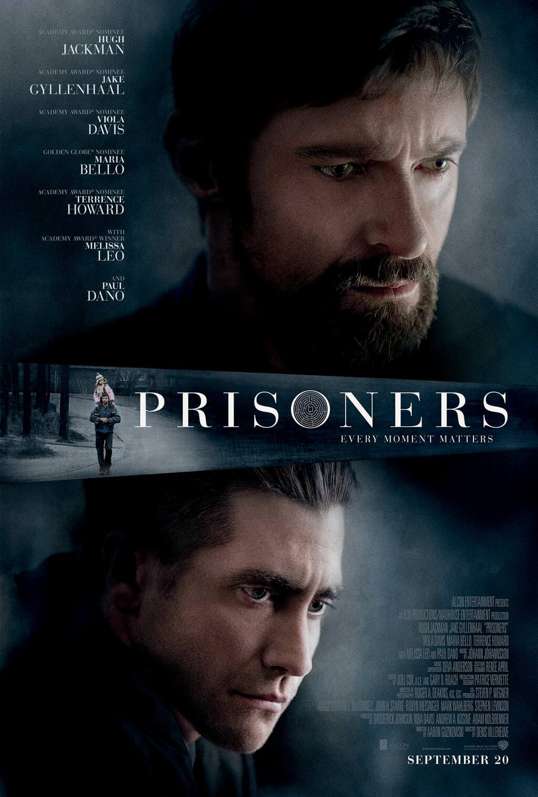
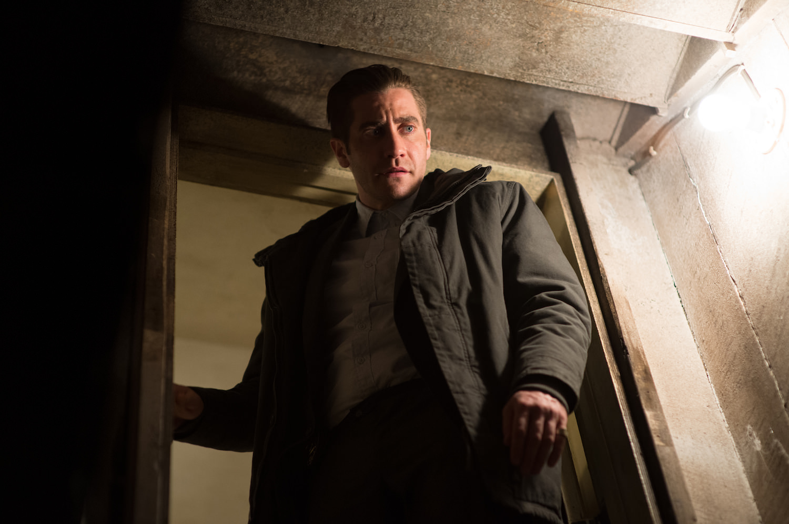
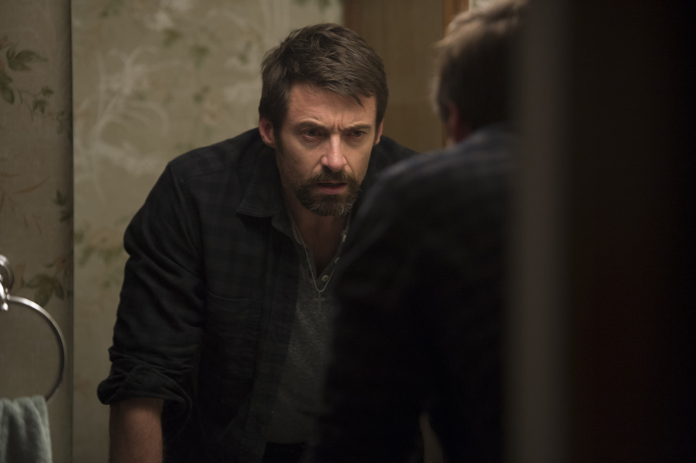

+++
type = "post"
titre = "<em>Prisoners</em>, Denis Villeneuve"
title = "Prisoners, Denis Villeneuve"
url = "/prisoners-villeneuve"
date = "2013-10-13T17:07:53"
Lastmod = "2014-08-30T21:20:19"
cover = "prisoners-villeneuve-hugh-jackman-paul-dano.jpg"
categorie = [ "À voir" ]
tag = [ "Police", "Société", "Suspense", "Thriller", "Vengeance" ]
createur = [ "Denis Villeneuve" ]
acteur = [ "Dylan Minnette", "Hugh Jackman", "Jake Gyllenhaal", "Maria Bello", "Melissa Leo", "Paul Dano", "Terrence Howard", "Viola Davis" ]
annee = [ "2013" ]
weight = 2013
pays = [ "États-Unis" ]

+++

Cinéaste québécois, Denis Villeneuve a franchi la frontière pour son dernier long-métrage. Comme son titre anglophone — qui n’a, très bizarrement, pas été traduit — le laisse entendre, <em>Prisoners</em> se passe aux États-Unis. Avec son casting également américain, il ressemble à n’importe quel blockbuster comme Hollywood en produit par dizaines, mais on aurait tort de s’arrêter à un synopsis ou même à une <a href="http://www.youtube.com/watch?v=KE4Dp2ryXc0">bande-annonce</a>. Tous deux n’ont aucune originalité, certes, mais Denis Villeneuve en tire un thriller particulièrement intense. Pendant 2h30, il tient son public en haleine avec une tension permanente, dans ce long-métrage où la résolution de l’énigme compte moins que l’ambiance ou que l’épineuse question de la vengeance personnelle. <em>Prisoners</em> est un film dense et passionnant, à ne pas rater.

<em>Prisoners</em> commence de manière assez surprenante avec une scène de chasse. Keller emmène pour la première fois Ralph, son fils, chasser et ce dernier tue sa première biche. Denis Villeneuve enchaîne sur des scènes tout à fait banales : on est dans une banlieue comme il y en a un peu partout aux États-Unis, la famille Dover se rend chez les Birch, leurs voisins, pour fêter Thanksgiving. Tout semble parfaitement normal, mais le ton du film laisse d’emblée pressentir que quelque chose va se passer. La musique est inquiétante et il y a ce camping-car boueux qui vient s’arrêter devant une maison inhabitée. La fête se poursuit pourtant, les deux fillettes jouent ensemble, mais elles finissent par disparaître. Les familles cherchent d’abord dans leurs maisons et leurs jardins, mais il faut vite se rendre à l’évidence : elles ont vraiment disparu et ils appellent la police. <em>Prisoners</em> commence alors le cœur de son récit, une enquête policière et une course contre la montre pour retrouver au plus vite les deux enfants. L’inspecteur Loki, célèbre dans la police pour n’avoir jamais échoué dans ses enquêtes, se charge de l’affaire qui commence tout naturellement par se concentrer sur le camping-car et son propriétaire. S’ils sont rapidement retrouvés, la piste ne mène nulle part et l’enquête patine : la police doit relâcher le suspect, mais Keller ne l’entend pas de cette manière et prend les choses en main. Le scénario mis en scène par Denis Villeneuve est beaucoup plus complexe qu’on pourrait le croire au premier abord et il est important de ne pas le dévoiler entièrement pour préserver la surprise. Cette densité est incontestablement un point fort : on ne s’ennuie jamais pendant les deux heures et demie que dure <em>Prisoners</em> et même si on peut deviner assez vite qui est derrière l’enlèvement des fillettes, le long-métrage lance suffisamment d’hypothèses crédibles pour nous perdre dans un labyrinthe, une figure récurrente ici, d’ailleurs.

Denis Villeneuve raconte son histoire sans artifice, il ne s’amuse pas à jouer sur les ellipses ou sur la chronologie, mais <em>Prisoners</em> n’en est pas moins passionnant. Sa construction est finalement assez simple, mais le long-métrage paraît toujours touffu : il y a les multiples pistes, souvent fausses, qui sont lancées par le scénario, à l’image du prêtre qui finit par avoir un lien distant avec l’intrigue principale, mais qui sert surtout à détourner l’attention. Comme souvent, l’identité du coupable n’est pas le plus important dans ce thriller : Denis Villeneuve construit d’abord une ambiance extrêmement prenante qui est la vraie réussite de son long-métrage. Entre la pluie qui tombe presque en permanence et en grande quantité, le brouillard parfois et les paysages gris d’hiver, <em>Prisoners</em> impose un cadre déprimant très efficace. Le cinéaste multiplie les plans à travers des vitres, un procédé répété tout au long du film qui crée une sorte de liant très réussi. On retiendra surtout la <a href="http://www.amazon.fr/gp/product/B00F5U7E6S/ref=as_li_ss_tl?ie=UTF8&tag=leblogdenic07-21&linkCode=as2&camp=1642&creative=19458&creativeASIN=B00F5U7E6S">bande originale</a> de Jóhann Jóhannsson, stressante à souhait et toujours utilisée à bon escient. Elle n’est pas systématiquement associée à un danger, au contraire même, le réalisateur aime annoncer un problème en amont en utilisant cette musique dans une scène banale. Véritable personnage à part entière, elle sert aussi à détourner l’attention et à pointer du doigt des coupables qui n’en sont pas vraiment. Au-delà du « <em>whodunit</em> », au-delà aussi de l’ambiance, <em>Prisoners</em> interroge la vengeance personnelle avec le personnage de Keller : quand il constate que l’inspecteur ne fait pas ce qu’il veut — Alex, le suspect, doit rapidement être relâché, faute de preuves —, il décide de prendre les choses en main et de kidnapper le jeune homme pour l’interroger. Dans sa quête pour retrouver sa fille, il est prêt à tout, quitte à tomber dans la folie pure et il convient ici de saluer la performance remarquable de Hugh Jackman, parfait en père aveuglé par la colère. À côté, Jake Gyllenhaal est très bien aussi en inspecteur, mais on retiendra surtout Paul Dano dans le rôle du premier suspect. L’acteur offre une présence vraiment exceptionnelle et on aimerait le voir plus souvent à l’écran.

<em>Prisoners</em> n’est sans doute pas le chef d’œuvre de l’année, mais le dernier film de Denis Villeneuve n’est certainement pas un blockbuster de plus. Avec ce thriller intense, le cinéaste compose un long-métrage particulièrement prenant, au scénario dense et bien écrit, et à l’ambiance étouffante à souhait. Sans en avoir l’air, le réalisateur canadien signe un excellent film, à ne pas rater…

<h3>Vous voulez <a href="/soutien/">m&rsquo;aider</a> ?</h3>
<ul>
<li><a href="http://www.amazon.fr/gp/product/B00GXDRG2I/ref=as_li_ss_tl?ie=UTF8&amp;tag=leblogdenic07-21&amp;linkCode=as2&amp;camp=1642&amp;creative=19458&amp;creativeASIN=B00GXDRG2I">Acheter le film en Blu-ray sur Amazon</a></li>
<li><a href="http://www.amazon.fr/gp/product/B00FQLSJII/ref=as_li_ss_tl?ie=UTF8&amp;tag=leblogdenic07-21&amp;linkCode=as2&amp;camp=1642&amp;creative=19458&amp;creativeASIN=B00FQLSJII">Acheter le film en DVD sur Amazon</a></li>
<li><a href="https://itunes.apple.com/fr/movie/prisoners/id789467884">Acheter ou louer le film sur l&rsquo;iTunes Store</a></li>
</ul>

