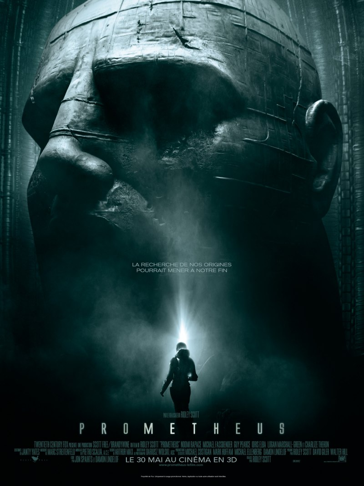
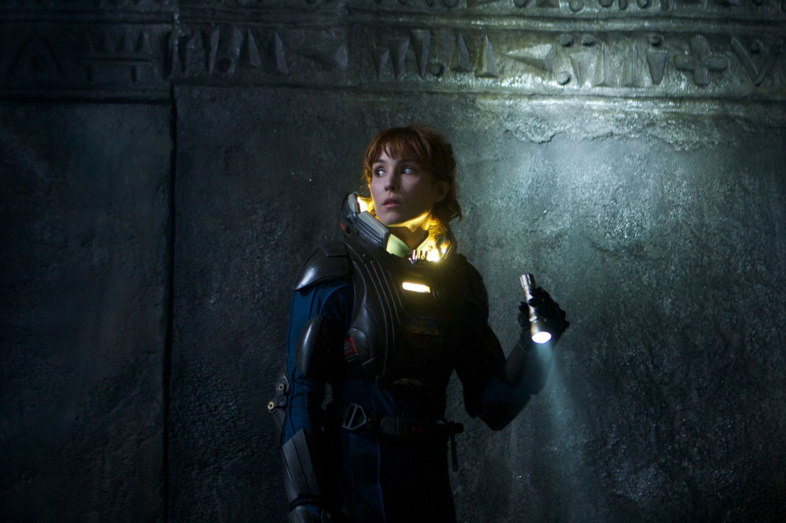
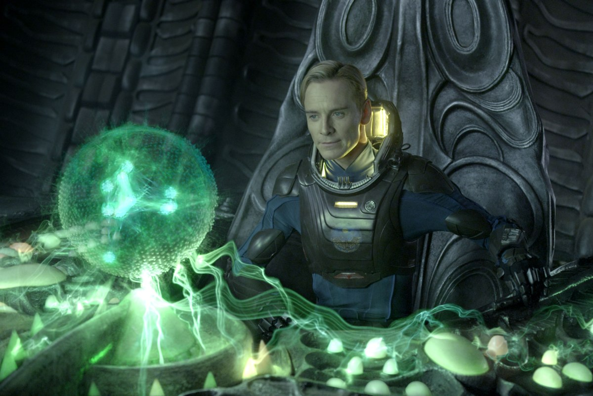

+++
type = "post"
titre = "Prometheus, Ridley Scott"
title = "Prometheus, Ridley Scott"
url = "/prometheus-scott"
date = "2012-05-31T00:16:50"
Lastmod = "2012-10-30T13:55:44"
cover = "prometheus-ridley-scott.jpg"
categorie = [ "À voir" ]
tag = [ "Blockbuster", "Extra-terrestre", "Horreur", "Religion", "Science-Fiction" ]
createur = [ "Ridley Scott" ]
acteur = [ "Michael Fassbender", "Noomi Rapace" ]
annee = [ "2012" ]
weight = 2012
pays = [ "États-Unis" ]

+++

En 1979, Ridley Scott créait l&rsquo;une des sagas les plus marquantes au cinéma avec <a href="/2011/11/17/alien-huitieme-passager-scott/"><em>Alien, le huitième passager</em></a>. Depuis, la licence a dérivé vers des horizons bien éloignés du huis clos horrifique original. Après trois suites et après quelques produits dérivés mêlés de Predators, le cinéaste revient aux commandes. <em>Prometheus</em> se déroule avant <em>Alien, le huitième passager</em> et même si Ridley Scott ne veut l&rsquo;avouer qu&rsquo;à mi-voix et a préféré soigneusement entretenir le doute pendant la période de promotion, il s&rsquo;agit bel et bien d&rsquo;une préquelle. <em>Prometheus</em> offre ainsi quelques explications, mais c&rsquo;est aussi un film d&rsquo;action très efficace qui tend parfois à l&rsquo;horreur. Un excellent divertissement…

<strong>Article à ne pas lire sans avoir vu la saga <em>Alien</em>, voire sans avoir vu <em>Prometheus</em>.</strong>

2089, quelque part en Écosse. Une équipe d&rsquo;archéologues a découvert une cavité restée jusque-là secrète. À l&rsquo;intérieur, des peintures rupestres vieilles de plusieurs dizaines de milliers d&rsquo;années, mais c&rsquo;est surtout un détail qui attire les scientifiques. Des figures humaines qui pointent toutes vers un ensemble de disques. Ce schéma qui représente en fait des planètes et un système solaire similaire au nôtre a été retrouvé à des dizaines de localisations sur le globe, sur des représentations d&rsquo;âges variés. Les connaissances astronomiques d&rsquo;alors étaient limitées et ces civilisations ne pouvaient pas communiquer : pour ces chercheurs, il est évident que ces dessins sont des invitations laissées par nos ancêtres. Suivre cette invitation, c&rsquo;est revenir sur notre histoire et même plus, sur notre origine. Et si la science s&rsquo;était trompée ? Et si l&rsquo;homme avait été créé par des êtres venus de l&rsquo;espace ? C&rsquo;est cette idée un peu folle qui motive une gigantesque expédition dans l&rsquo;espace vers le seul système solaire connu qui ressemble à celui des dessins. L&rsquo;objectif avoué : découvrir s&rsquo;il existe effectivement une civilisation extra-terrestre et le cas échéant, comprendre d&rsquo;où vient l&rsquo;homme…

Ridley Scott a commencé par imaginer une préquelle à l&rsquo;univers de la saga <em>Aliens</em> qu&rsquo;il a contribué à créer, avant d&rsquo;indiquer à qui voulait l&rsquo;entendre qu&rsquo;il s&rsquo;agissait finalement d&rsquo;un projet à part, plus ambitieux. Pour qui a vu <em>Alien, le huitième passager</em> et ses successeurs, <em>Prometheus</em> apparaît bien comme une œuvre située juste avant et une œuvre qui éclaire de nombreux points restés obscurs. Ridley Scott avait tenu à garder le mystère dans son premier film et on ignorait tout de l&rsquo;origine de ces Aliens. Il ne faut pas attendre de réponses directes ici, mais <em>Prometheus</em> explique beaucoup de choses. Quand l&rsquo;équipage arrive sur la planète repérée préalablement, la forme de la construction près de laquelle il se pose rappelle d&rsquo;emblée des souvenirs. On reconnaît sans peine le vaisseau où le premier contact entre un humain et un Alien a lieu dans le premier film de Ridley Scott. Ceci posé, <em>Prometheus</em> fonctionne ensuite comme un puzzle et toutes les pièces se mettent en place pour aboutir à la situation initiale d&rsquo;<em>Alien, le huitième passager</em>. Certaines questions restent en suspens, la plus importante étant sans doute « pourquoi ? », mais on découvre d&rsquo;où viennent exactement les Aliens, mais aussi ce qu&rsquo;est la grande construction humanoïde qui restait une énigme dans le film de 1979.

S&rsquo;il est indéniable que <em>Prometheus</em> fonctionne comme la préquelle de la saga <em>Aliens</em>, il faut reconnaître que le dernier film de Ridley Scott est aussi plus ambitieux. En introduisant les Ingénieurs et en faisant de ces grands humanoïdes pâlots les créatures de l&rsquo;humanité, le film entend remettre en cause non seulement la religion, mais aussi la science moderne qui a expliqué de manière rationnelle la naissance de l&rsquo;homme dérivé du singe par une lente mutation. L&rsquo;idée n&rsquo;est pas très originale dans la littérature, mais le cinéma ne s&rsquo;était pas encore vraiment engagé sur cette voie follement ambitieuse. Faire d&rsquo;une civilisation extra-terrestre l&rsquo;inventeur de la vie terrestre, c&rsquo;est ouvrir la possibilité de discuter avec son créateur et d&rsquo;obtenir les réponses réservées traditionnellement à la religion ou la philosophie. Ce fantasme est ainsi la motivation principale du couple de scientifiques qui a permis l&rsquo;expédition et <em>Prometheus</em> va jusqu&rsquo;à la confrontation tant attendue. L&rsquo;ambition de Ridley Scott sur ces sujets est louable et elle fait en grande partie l&rsquo;originalité du film, donnant à ce dernier une ampleur inattendue pour un blockbuster. C&rsquo;est aussi la limite et peut-être la faiblesse du long-métrage qui donne par moment le sentiment d&rsquo;en faire trop, voire de faire preuve d&rsquo;un peu d&rsquo;orgueil. L&rsquo;introduction est à cet égard intéressante : Ridley Scott filme des paysages déserts où la vie humaine n&rsquo;a pas laissé de trace, avant de montrer un Ingénieur et d&rsquo;expliquer, on suppose, la naissance de la vie sur Terre. La séquence rappelle assez <a href="/2011/05/17/tree-of-life-malick/"><em>The Tree of Life</em></a> et ce n&rsquo;est certainement pas la meilleure idée du film, mais <em>Prometheus</em> a la bonne idée de ne pas s&rsquo;y attarder.

<em>Prometheus</em> signe le retour de Ridley Scott à la science-fiction, mais aussi son retour à l&rsquo;univers d&rsquo;<em>Aliens</em>. La réalisation est toutefois bien éloignée de celle du film qui avait ouvert la saga : le budget est ici digne des plus gros blockbusters et le film offre le grand spectacle attendu. Le cinéaste a su malgré tout conserver l&rsquo;ambiance qui tend à l&rsquo;horreur avec quelques scènes particulièrement prenantes dans le vaisseau spécial extra-terrestre ou dans le vaisseau humain. On n&rsquo;est plus dans le huis clos, mais le nombre de décors reste limité et ils sont toujours aussi sombres et fermés. Avis aux âmes sensibles, <em>Prometheus</em> n&rsquo;est pas particulièrement gore, mais certaines scènes sont impressionnantes et stressantes… Ridley Scott aime certains types de personnages et cela se voit dans ce nouveau film qui reprend comme personnage principal une femme, une scientifique à fort caractère qui n&rsquo;est pas sans rappeler l&rsquo;héroïne d&rsquo;<em>Alien, le huitième passager</em>. C&rsquo;est d&rsquo;ailleurs la principale critique que l&rsquo;on pourra faire au scénario de <em>Prometheus</em> : nonobstant l&rsquo;originalité de l&rsquo;univers, il reprend quasiment <em>stricto sensu</em> l&rsquo;histoire du film de 1979. La progression est la même jusqu&rsquo;à la fin troublante de similitude et Ridley Scott est allé jusqu&rsquo;à reprendre des scènes de son premier film… La comparaison est dès lors inévitable et Noomi Rapace s&rsquo;en sort plutôt bien pour succéder à Sigourney Weaver, même si la jeune actrice se fait éclipser par un Michael Fassbender encore très impressionnant dans son rôle de robot. Dès les premiers plans, il impose son jeu froid et mécanique qui ne laisse aucun doute sur son identité.

Préquelle ou pas, peu importe : <em>Prometheus</em> est un blockbuster très bien réalisé qui offre un spectacle de qualité et ce qu&rsquo;il faut d&rsquo;ambiance horrifique pour serrer fortement la main de votre voisin(e) pendant la séance. Ridley Scott s&rsquo;offre en outre le luxe d&rsquo;un univers beaucoup plus ambitieux qui pourrait ouvrir sur une nouvelle saga si l&rsquo;on s&rsquo;en tient à la très ouverte fin. En attendant, ne ratez pas <em>Prometheus</em> si vous aimez la science-fiction : une séance au cinéma avec lunettes 3D est alors recommandée.

<h3>Vous voulez m&rsquo;aider ?<a href="#footnote_0_6598" id="identifier_0_6598" class="footnote-link footnote-identifier-link" title="&Agrave; propos de la publicit&eacute;&hellip;">1</a></h3>
<ul>
<li><a href="http://www.amazon.fr/gp/product/B002L6UMF4/ref=as_li_ss_tl?ie=UTF8&tag=leblogdenic07-21&linkCode=as2&camp=1642&creative=19458&creativeASIN=B002L6UMF4">Acheter le film en Blu-Ray et DVD sur Amazon</a></li>
<li><a href="http://www.amazon.fr/gp/product/B002L6SKIK/ref=as_li_ss_tl?ie=UTF8&tag=leblogdenic07-21&linkCode=as2&camp=1642&creative=19458&creativeASIN=B002L6SKIK">Acheter le film en DVD sur Amazon</a></li>
<li><a href="http://itunes.apple.com/fr/movie/prometheus/id548584620">Acheter ou louer le film sur l&rsquo;iTunes Store</a></li>
</ul>

<ol class="footnotes"><li id="footnote_0_6598" class="footnote"><a href="http://nicolinux.fr/soutien/">À propos de la publicité…</a> [<a href="#identifier_0_6598" class="footnote-link footnote-back-link">&#8617;</a>]</li></ol>
