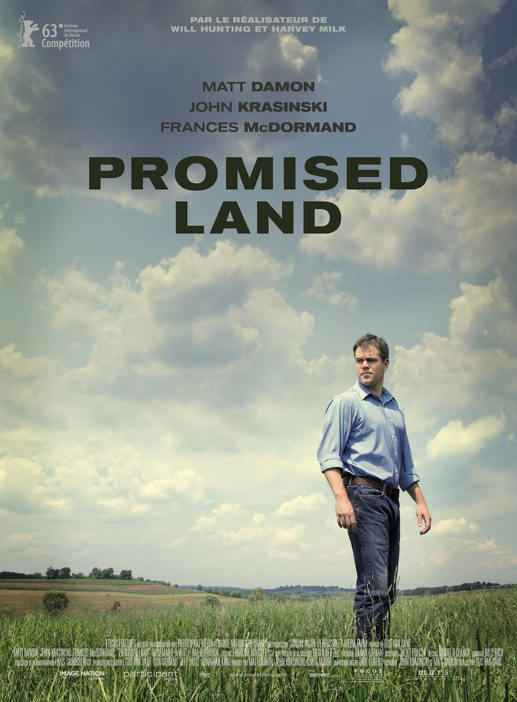
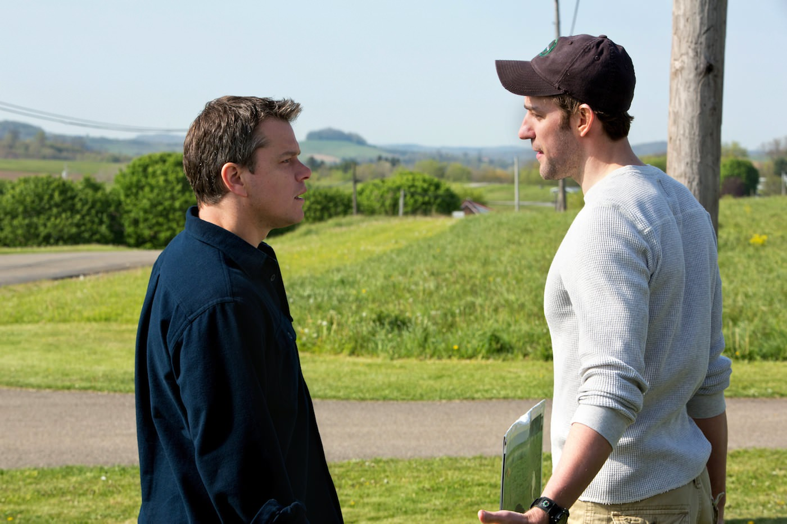

+++
type = "post"
titre = "Promised Land, Gus Van Sant"
title = "Promised Land, Gus Van Sant"
url = "/promised-land-van-sant"
date = "2013-04-17T00:12:57"
Lastmod = "2013-04-17T00:20:37"
cover = "promised-land-matt-damon-van-sant.jpg"
categorie = [ "À voir" ]
tag = [ "Argent", "Crise", "Écologie", "Économie", "Société" ]
acteur = [ "Frances McDormand", "John Krasinski", "Matt Damon", "Rosemarie DeWitt" ]
annee = [ "2013" ]
weight = 2013
pays = [ "États-Unis" ]

+++

Après avoir expérimenté avec plusieurs films, une phase expérimentale qui a culminé en 2003 avec le chef-d’œuvre <a href="/2011/06/06/elephant-van-sant/" title="Elephant, Gus Van Sant (Palme d'or 2003) - À voir et à manger"><em>Elephant</em></a>, Gus Van Sant aborde une nouvelle phase de sa carrière depuis le très conventionnel biopic <a href="/2009/03/07/harvey-milk-gus-van-sant/" title="Harvey Milk de... Gus Van Sant ? - À voir et à manger"><em>Harvey Milk</em></a>. Moins troublés, ses films sont dorénavant très sages sur le plan formel, quitte à laisser assez indifférents, alors que son cinéma jusque-là était détesté ou adoré. On ne garde qu’un souvenir très vague de <a href="/2011/09/29/restless-van-sant/" title="Restless, Gus Van Sant - À voir et à manger"><em>Restless</em></a> et on attendait ce <em>Promised Land</em> avec une certaine appréhension. La terre promise par le titre allait-elle enfin permettre au cinéaste de trouver un nouveau départ ? Le résultat est très plaisant et ce petit film parvient à nous surprendre en nous emmenant là on ne pensait pas le trouver. C’est un excellent divertissement, mais Gus Van Sant ne renoue pas avec le cinéma qui a fait son succès à ses débuts. 

Par un étonnant hasard de calendrier, <em>Promised Land</em> sort alors que l’on a justement connu des débats autour du gaz de schiste en France. Steve Butler est employé par l’entreprise pétrolière Global et il est envoyé par son employeur dans l’Amérique rurale la plus profonde pour y acheter des terres, ou plutôt des droits d’exploitation pour exploiter le gaz de schiste contenu sous la terre. Le film s’intéresse au cas d’une toute petite ville située dans le nord-est du pays, une région pauvre et largement déserte. Steve est un homme efficace, il a déjà réussi à convaincre de nombreuses communes et il pense que la partie sera facile. Gus Van Sant prend le temps de poser une ambiance particulière : <em>Promised Land</em> survole régulièrement un espace très vert, mais aussi très vide, où l’on vit de manière modeste. Les propriétés sont vastes, mais les exploitations limitées et les agriculteurs ont visiblement du mal à joindre les deux bouts. Steve entre chez eux et leur promet des centaines de milliers de dollars, des millions même pour les plus gros propriétaires. Comment résister face à une telle offre, sachant que le commercial assure aux propriétaires que l’exploitation du gaz de schiste est absolument sans risque. On le suit ainsi, à signer contrat après contrat, à offrir au maire du coin un gros chèque pour le convaincre lui aussi… tout semble aller pour le mieux, jusqu’à la réunion publique. Un vieil homme ose se lever et remettre en cause le projet avec de solides arguments. Cet ancien chercheur à la retraite appelle à un vote public et brutalement, tout le travail de Steve est remis en cause, d’autant que <em>Promise Land</em> ajoute à l’équation un écologiste qui s’oppose farouchement à Global. Une véritable course contre la montre est lancée entre les deux camps, avant le vote deux semaines après.

On pourrait croire que Gus Van Sant se lance dans un film didactique sur les aspects positifs et négatifs du gaz de schiste, mais si c’est un petit peu le cas dans un premier temps, on comprend très vite qu’il ne s’agit que d’une fausse piste. Certes, <em>Promised Land</em> évoque les arguments des uns et des autres, mais le scénario finement écrit par Matt Damon et John Krasinski qui interprètent respectivement le personnage principal et l’opposant écologiste évite tout didactisme. Mieux, le cinéaste brouille les pistes au point, sans trop en dire, le spectateur ne sait plus trop à quoi s’en tenir. À cet égard, mais de façon plus mesurée, le long-métrage de Gus Van Sant rappelle <a href="/2013/04/03/effets-secondaires-soderbergh/" title="Effets secondaires, Steven Soderbergh - À voir et à manger"><em>Effets secondaires</em></a> : on retrouve cette même volonté de perdre les spectateurs, de les mener vers de fausses pistes pour mieux les en détourner par la suite. On n’est pas chez Steven Soderbergh ici toutefois, et <em>Promised Land</em> est beaucoup plus sage, mais son vrai sujet, ce n’est pas le gaz de schiste finalement, c’est le portrait d’un homme. Steve Butler est l’employé modèle convaincu des bienfaits de son action et à ce titre, très naïf. Il sait que son employeur pèse plusieurs milliards de dollars, c’est même une source de fierté pour cet homme issu d’un milieu assez pauvre. Comme il aime à le répéter aux gens qu’il vient démarcher, il a connu la fin de sa région natale quand l’usine qui faisait vivre la ville a fermé. On sent qu’il est sincère quand il vent l’offre de Global, mais aussi quand il ne comprend pas pourquoi ces propriétaires terriens si pauvres la refusent. On pourrait croire à sa volonté de bien faire, mais Gus Van Sant intègre quelques touches qui viennent noircir ce tableau idyllique. Le héros de <em>Promised Land</em> n’hésite pas à mentir pour gonfler sa prime et il est prêt à tout pour imposer ses idées, quitte à menacer plus ou moins ouvertement ses adversaires. Un personnage plus complexe qu’au premier abord donc, d’autant qu’il va évoluer tout au long du film, mais là encore pas nécessairement pour les meilleures raisons.

<em>Promised Land</em> n’est pas un film parfait : l’histoire d’amour qui vient s’immiscer est vraiment trop artificielle, le scénario n’en dit parfois pas assez, ou trop, sur le gaz de schiste et la fin est assez bancale. Gus Van Sant signe toutefois un petit film réussi, filmé souvent d’une très belle façon avec une multiplication des plans aériens qui contribue à cette ambiance d’Amérique rurale particulièrement convaincante. Les acteurs sont tous très bons, à commencer par un Matt Damon parfait, les touches d&rsquo;humour sont inattendues et bien vues et la <a href="http://www.amazon.fr/gp/product/B00AS50CI2/ref=as_li_ss_tl?ie=UTF8&tag=leblogdenic07-21&linkCode=as2&camp=1642&creative=19458&creativeASIN=B00AS50CI2">bande originale</a> de Danny Elfman ajoute une touche mystérieuse très bien vue. Un bilan plutôt positif donc, même si <em>Promised Land</em> n’est en rien le grand film que certains pourront attendre. Gus Van Sant reste sur sa veine très classique, mais cette fois c’est plutôt une réussite.

