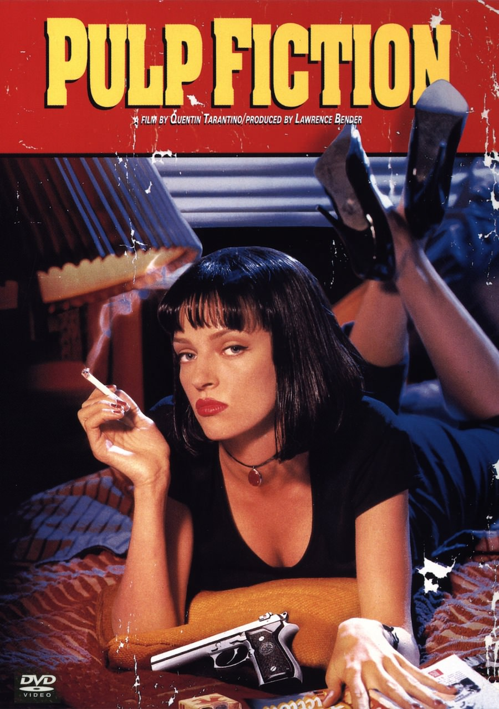
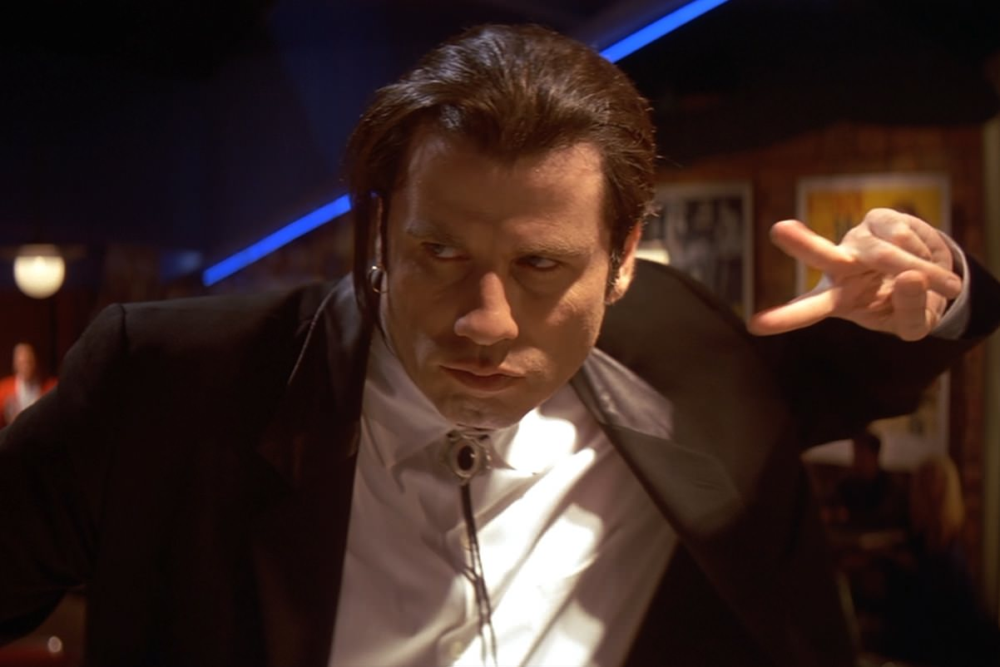
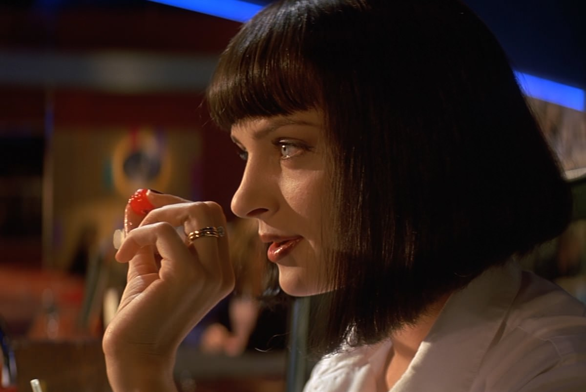

+++
type = "post"
titre = "<em>Pulp Fiction</em>, Quentin Tarantino (Palme d&rsquo;or 1994)"
title = "Pulp Fiction, Quentin Tarantino (Palme d'or 1994)"
url = "/pulp-fiction-tarantino"
date = "2012-09-29T15:32:43"
Lastmod = "2015-05-28T18:14:17"
cover = "pulp-fiction-samuel-l-jackson-travolta.jpg"
categorie = [ "À voir" ]
tag = [ "Film de gangsters", "Mafia", "Palme d'or", "Thriller", "Violence" ]
createur = [ "Quentin Tarantino" ]
acteur = [ "Bruce Willis", "John Travolta", "Samuel L Jackson", "Uma Thurman" ]
annee = [ "1994" ]
weight = 1994
saga = [ "Palmes d'or" ]
pays = [ "États-Unis" ]

+++

S&rsquo;il fallait résumer la carrière de Quentin Tarantino à un seul film, ce serait sans doute celui-ci. Film immédiatement culte, <em>Pulp Fiction</em> est même couronné par la récompense cannoise ultime avec la Palme d&rsquo;or en 1994, mais ce sont surtout ses dialogues parfaitement écrits qui l&rsquo;ont fait entrer dans l&rsquo;histoire du cinéma. Quentin Tarantino n&rsquo;en est alors qu&rsquo;à son deuxième film après le déjà remarqué <em>Reservoir Dogs</em>, mais ce n&rsquo;est qu&rsquo;avec <em>Pulp Fiction</em> qu&rsquo;il rencontre la gloire et le succès populaire. Un succès tout à fait mérité tant ce film si particulier, construit autour de longs dialogues, est une réussite réjouissante. Un classique, à voir et à revoir !

<em>Pulp Fiction</em> ne raconte pas vraiment une histoire, ce serait trop simple de résumer le film à cela. Quentin Tarantino semble poser ses caméras dans un univers et se contenter de suivre plusieurs malfrats à Los Angeles. Le film ouvre sur une discussion d&rsquo;un couple de petits malfrats qui vit en attaquant des petites boutiques et qui décide de récupérer de l&rsquo;argent dans le restaurant où ils sont en train de prendre leur petit-déjeuner. Plus tard, on découvre deux autres malfrats, beaucoup plus sérieux cette fois : Vincent et Jules travaillent pour le compte de Marsellus, une sorte de parrain de la mafia locale, pour lequel ils accomplissent les sales besognes. On rencontrera par la suite encore un autre personnage, Butch, un boxeur cette fois qui travaille aussi sous les ordres de Marsellus et qui doit perdre son prochain match contre une belle somme d&rsquo;argent. Marsellus demande à Vincent de sortir sa femme pour l&rsquo;occuper et le couple va au restaurant et danse un peu, au risque de trop se rapprocher.

En apparence, <em>Pulp Fiction</em> ressemble à un vaste foutoir. Quentin Tarantino a beau placer de temps en temps des panneaux qui expliquent ce qui va suivre, l&rsquo;ensemble paraît totalement décousu et c&rsquo;est bien sûr précisément l&rsquo;effet recherché. Le scénario du film évite la linéarité ou la chronologie, même si le cinéaste reste bien plus raisonnable que Gus Van Sant et son <a title="Elephant, Gus Van Sant (Palme d’or 2003)" href="/2011/06/06/elephant-van-sant/"><em>Elephant</em></a> qui a également gagné une palme près de dix ans après. Le spectateur ne comprend pas immédiatement que le scénario n&rsquo;est pas chronologique, il l&rsquo;apprend même assez tard dans le long-métrage. Au départ, <em>Pulp Fiction</em> ressemble plus à une collection de malfrats qui semblent évoluer dans des histoires parallèles, même si la figure de Marsellus fait rapidement le lien entre elles. Quentin Tarantino s&rsquo;amuse toutefois à brouiller les pistes en donnant le sentiment de faire avancer une histoire logique qui mènera quelque part, quand il ne s&rsquo;agit finalement que d&rsquo;une plongée dans un univers, sans fin spectaculaire ou particulièrement intéressante d&rsquo;ailleurs. Quentin Tarantino fait partie de ces cinéastes qui ne laissent rien au hasard et qui multiplient références et clins d&rsquo;œil ; l&rsquo;absence de chronologie dans <em>Pulp Fiction</em> est en fait expliquée dès le titre du film, mais aussi par un premier carton qui définit le terme &laquo;&nbsp;<em>pulp</em>&laquo;&nbsp;. Le cinéaste fait référence aux romans à feuilleton bon marché qui étaient souvent assemblés dans le mauvais ordre, plaçant la fin au mauvais endroit. C&rsquo;est exactement le même processus ici, avec plusieurs intrigues entremêlées et assemblées dans le désordre.

Pour tout dire, l&rsquo;intérêt n&rsquo;est pas vraiment l&rsquo;histoire racontée par <em>Pulp Fiction</em>, il faut le chercher ailleurs. <em>Pulp Fiction</em> est un film de dialogues, comme tous les films de Quentin Tarantino d&rsquo;ailleurs et c&rsquo;est parfaitement sensible ici. Le cinéaste fait s&rsquo;enchaîner plusieurs scènes de dialogue, le plus souvent entre deux personnages seulement : les deux malfrats qui veulent attaquer le restaurant ouvrent le bal, avant une longue discussion entre Vincent et Jules, puis la discussion au restaurant de Vincent et la femme de Marsellus, etc. On peut en fait résumer le film à une série de dialogues plus ou moins longs, mais qui constituent au total l&rsquo;essentiel des 2h30 du long-métrage. Au cinéma, les dialogues servent en général à faire avancer l&rsquo;intrigue, ou à introduire un personnage ou une situation. Quentin Tarantino en fait un tout autre usage dans <em>Pulp Fiction</em> : la plupart des dialogues n&rsquo;ont aucun rapport avec l&rsquo;histoire, ils existent pour eux-mêmes et n&rsquo;ont aucune utilité pour le récit. L&rsquo;exemple le plus caractéristique est sans conteste le dialogue entre Vincent et Jules sur la dénomination des hamburgers dans les MacDonald&rsquo;s européens. Quelques phrases qui sont devenues cultes, mais que Quentin Tarantino aurait très bien pu enlever sans nuire à la compréhension de son histoire. Ce sont toutefois ces dialogues qui font tout l&rsquo;intérêt du film, qui lui donnent cette ambiance décalée si particulière qui a fait son succès. Certains ont <a href="http://fr.wikipedia.org/wiki/Pulp_Fiction#Analyse">analysé</a> en profondeur le film, ses dialogues et ses références, mais on peut se contenter de retenir la forme de jouissance que l&rsquo;on ressent en écoutant ces lignes de dialogue parfaitement écrites. Les dialogues sont nombreux et ils font encore mieux ressortir la violence qui les sépare. <em>Pulp Fiction</em> fait éclater une violence crue brutalement, parfois sans prévenir (coup de feu dans la voiture), parfois après une longue entrée en matière (la citation biblique de Jules). Le contraste entre les dialogues totalement anodins et la violence qui éclate et éclabousse est l&rsquo;un des points sur lequel le deuxième film de Quentin Tarantino excelle.

Quentin Tarantino a un style particulièrement marqué qui se remarque dès son premier film et se confirme avec <em>Pulp Fiction</em>. La place et surtout l&rsquo;écriture des dialogues est l&rsquo;élément le plus évident chez ce cinéaste qui poussera ce principe à son paroxysme quelques années plus tard, dans <a title="Boulevard de la Mort, Quentin Tarantino" href="/2011/06/26/boulevard-de-la-mort-tarantino/"><em>Boulevard de la Mort</em></a>. À la manière des films d&rsquo;Audiard en France, les répliques de ce film sont devenues cultes et font l&rsquo;objet de nombreuses citations ou références, preuve de leur efficacité. Quentin Tarantino est lui-même un cinéaste de la citation et les références abondent dans son propre film. On note aussi le soin particulier apporté à la mise en scène et aux cadres, avec des plans souvent très contrastés, mais aussi des couleurs vives. <em>Pulp Fiction</em> navigue entre les genres et fonde son propre genre, plutôt que de se limiter à un seul d&rsquo;entre eux. Un mélange détonnant qui fonctionne vraiment bien et c&rsquo;est d&rsquo;ailleurs peut-être avec ce film que Quentin Tarantino a trouvé le meilleur équilibre. Il bénéficie il faut dire du talent de plusieurs excellents acteurs, à commencer par John Travolta qui trouve là le dernier grand rôle de sa carrière, ressuscitée le temps d&rsquo;un seul film. Autour de lui, Samuel L. Jackson et Bruce Willis sont parfaits, tout comme Uma Thurman, actrice fétiche du cinéaste qui prépare ici sa performance dans <a title="Kill Bill, Quentin Tarantino" href="/2012/05/12/kill-bill-tarantino/"><em>Kill Bill</em></a>. Comme toujours également, la musique est omniprésente et Quentin Tarantino a popularisé grâce à son film la plupart des titres de l&rsquo;excellente <a href="http://www.amazon.fr/gp/product/B00006H1ER/ref=as_li_ss_tl?ie=UTF8&amp;tag=leblogdenic07-21&amp;linkCode=as2&amp;camp=1642&amp;creative=19458&amp;creativeASIN=B00006H1ER">bande originale</a>. Le titre de générique d&rsquo;ouverture en particulier reste dans les annales du cinéma…

<em>Pulp Fiction</em> n&rsquo;a pas volé son statut de film culte. Quentin Tarantino réalise un coup de maître avec ce deuxième long-métrage ambitieux, gonflé et réussi. Son rythme assez lent et sa longueur importante peuvent détourner certains du film, mais le plaisir est bien au rendez-vous si on accepte qu&rsquo;il se trouve d&rsquo;abord dans les dialogues. Un classique, à voir et à revoir !

<h3>Vous voulez m&rsquo;aider ?</h3>
<ul>
<li><a href="http://www.amazon.fr/gp/product/B001CRVY0K/ref=as_li_ss_tl?ie=UTF8&amp;tag=leblogdenic07-21&amp;linkCode=as2&amp;camp=1642&amp;creative=19458&amp;creativeASIN=B001CRVY0K">Acheter le film en Blu-Ray sur Amazon</a></li>
<li><a href="http://www.amazon.fr/gp/product/B000YSGK84/ref=as_li_ss_tl?ie=UTF8&amp;tag=leblogdenic07-21&amp;linkCode=as2&amp;camp=1642&amp;creative=19458&amp;creativeASIN=B000YSGK84">Acheter le film en DVD sur Amazon</a></li>
<li><a href="http://clk.tradedoubler.com/click?p=23753&amp;a=2101596&amp;g=0&amp;td_partnerId=2003&amp;url=http://itunes.apple.com/fr/album/pulp-fiction-music-from-motion/id16276387">Acheter la bande originale sur l&rsquo;iTunes Store</a></li>
</ul>

