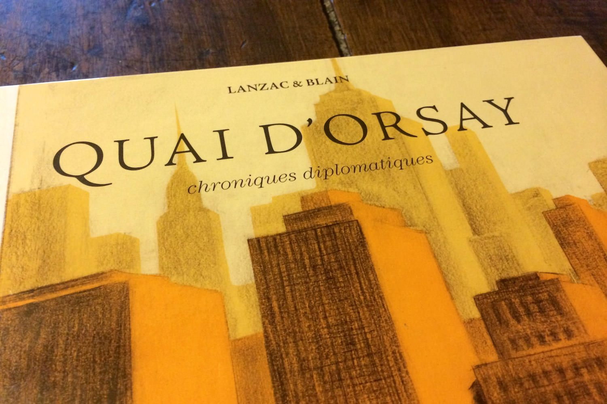
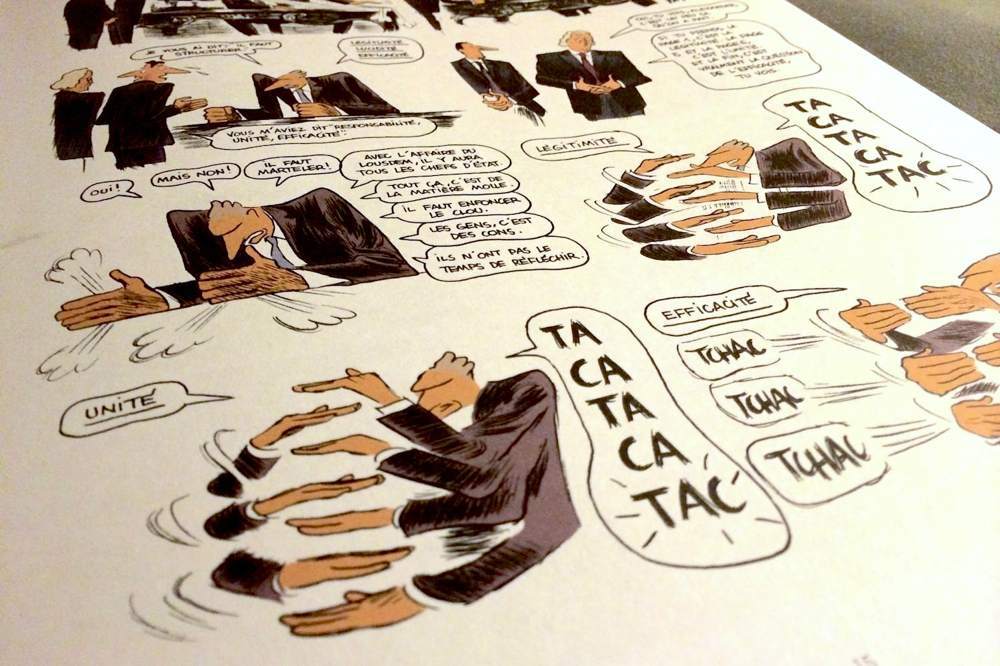
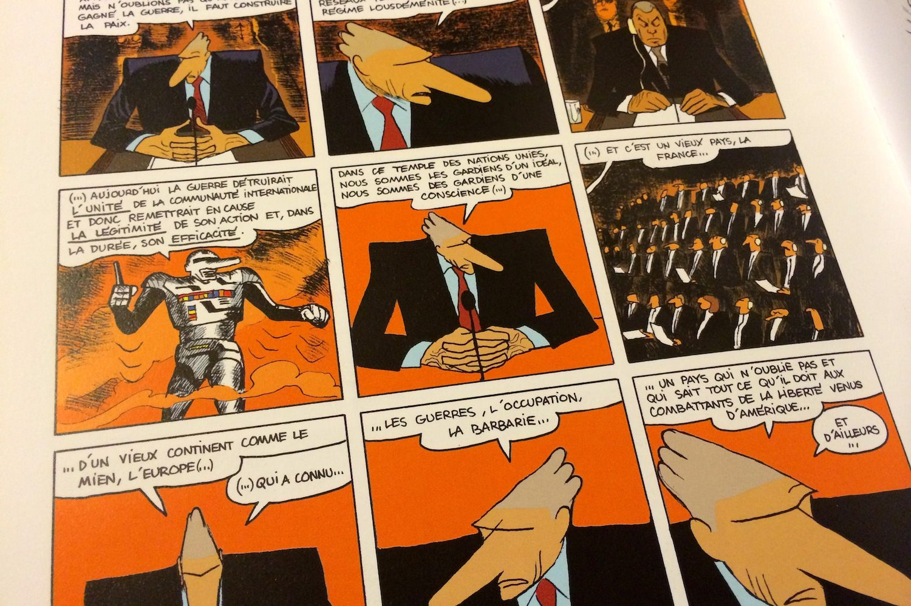

+++
type = "post"
titre = "<em>Quai d&rsquo;Orsay : chroniques diplomatiques</em>, Abel Lanzac et Christophe Blain"
title = "Quai d'Orsay : chroniques diplomatiques, Abel Lanzac et Christophe Blain"
url = "/quai-orsay-chroniques-diplomatiques-lanzac-blain"
date = "2013-11-25T12:52:31"
Lastmod = "2014-03-26T23:35:20"
cover = "quai-orsay-chroniques-diplomatiques-blain-lanzac.jpg"
categorie = [ "À lire" ]
tag = [ "Bande dessinée", "Caricature", "Humour", "Politique" ]
createur = [ "Abel Lanzac", "Christophe Blain" ]
annee = [ "2010" ]
weight = 2010
pays = [ "France" ]

+++

De mai 2002 à mars 2004, Dominique de Villepin a officié en tant que ministre des Affaires étrangères. C’est à cette occasion qu’il a engagé la France dans un combat diplomatique contre les États-Unis autour de la guerre en Irak et des fameuses armes de destruction massive qui n’ont jamais existé. C’est précisément à cette période que renvoie <em>Quai d’Orsay : chroniques diplomatiques</em>. En deux tomes et environ deux cents pages, cette bande dessinée raconte les années Villepin au Quai d’Orsay, c’est-à-dire au ministère des Affaires étrangères. Des chroniques qui suivent Arthur Vlaminck, jeune homme embauché pour écrire les discours du ministre. Abel Lanzac qui co-écrit le scénario avec Christophe Blain à qui l’on doit les dessins ne s’est pas caché longtemps : derrière ce pseudonyme, un diplomate qui a bien connu Dominique de Villepin et qui s’en est inspiré pour son personnage. À la clé, une bande dessinée énergique et surtout très drôle, vacharde par moment, mais aussi assez juste et intéressante sur le travail d’un ministère. Une vraie réussite, à ne pas rater. 

<blockquote class="pull-quote">
Le staff du Secrétaire d’État américain, c’est quatre-vingts personnes. Ce sont des moyens énormes. Nous, on est à peine une dizaine. C’est un tout petit navire. C’est pas un navire, c’est une barque. C’est pas une barque d’ailleurs, c’est un radeau. Mais sur le radeau, j’ai choisi les meilleurs.  Vous êtes jeune, mais vous savez analyser les choses. J’ai confiance en vous. J’ai besoin de vous à bord.<cite class="author"> — Abel Lanzac et Christophe Blain, Quai d’Orsay, tome 1 : chroniques diplomatiques</cite>

</blockquote>

Remplacez Dominique de Villepin par Alexandre Taillard de Vorms, le Lousdem par l’Irak : <em>Quai d’Orsay : chroniques diplomatiques</em> évoque sans contexte les quelques mois qui précèdent l’intervention du ministre des Affaires étrangères à l’ONU, le 14 février 2003. Un discours qui n’a pas empêché la guerre, mais qui avait été salué par des applaudissements, fait rare dans cette enceinte. Composée de deux tomes, cette bande dessinée d’Abel Lanzac et Christophe Blain se termine sur cette victoire symbolique du ministre, mais elle commence par l’embauche d’Arthur Vlaminck. Ce jeune homme que l’on connaît finalement assez mal — le vrai personnage principal, ce n’est pas lui, c’est le ministre — sort probablement d’une grande école. Il est très impressionné par la confiance qu’Alexandre Taillard de Vorms semble lui porter, flatté par cette proposition de travailler dans un ministère et il accepte sans discuter longtemps. Le premier tome de <em>Quai d’Orsay : chroniques diplomatiques</em> consiste en quelque sorte à découvrir les coulisses de la politique française. C’est dans un ministère comme celui qui est décrit sur ces pages que la politique se décide et que les décisions politiques se forgent. On le disait en préambule, Abel Lanzac n’est que le pseudonyme d’Antonin Baudry, diplomate qui a révélé sa vraie identité au début de l’année 2013, deux ans après la publication du deuxième tome. Son statut proche de Dominique de Villepin et du ministère lui a permis de décrire cet univers avec beaucoup de précision et de justesse. Même si on est souvent dans le domaine de la caricature, le fond de ce que Christophe Blain a dessiné est souvent véridique, au point que l’on dit que Pierre Schoeller s’en est inspiré pour <a href="http://voiretmanger.fr/exercice-etat-schoeller/" title="L’Exercice de l’État, Pierre Schœller"><em>L’exercice de l’État</em></a>. Même si elle n’a aucune prétention pédagogique, <em>Quai d’Orsay : chroniques diplomatiques</em> est aussi une bande dessinée passionnante pour qui s’intéresse à la politique.

Avant d’être une œuvre sérieuse, <em>Quai d’Orsay : chroniques diplomatiques</em> est d’abord humoristique et c’est une bande dessinée extrêmement drôle. Alexandre Taillard de Vorms est une caricature très réussie de Dominique de Villepin : le personnage est très grand et imposant, il a un nez démesurément allongé et surtout il est extrêmement nerveux. Dès qu’il se déplace, Christophe Blain le présente comme un courant d’air qui fait voler tous les papiers de la pièce, tandis qu’il exagère avec d’énormes onomatopées les bruits de portes qui claquent quand il entre ou sort. Par ailleurs, le personnage passe son temps à expliquer à Arthur, l’homme qu’il engage au début pour ses discours, ce qu’il veut dire. Les explications sont systématiquement incompréhensibles et en même temps très dirigistes : il faut faire ceci ou cela, vous n’avez qu’à, c’est facile… Abel Lanzac n’est pas toujours tendre avec ce personnage qui ne prend même pas la peine de lire ce qu’on lui donne avant de critiquer et qui ne sait pas dire non quand un ami écrivain ou philosophie lui donne son avis. <em>Quai d’Orsay : chroniques diplomatiques</em> le dépeint comme un minotaure, mais aussi comme une sorte de grand gamin capricieux qui ne sait pas ce qu’il veut, mais qui sait très bien tout ce qu’il ne veut pas. C’est assez dur pour l’ancien ministre, même si la bande dessinée n’est pas méchante, elle juge avec une certaine tendresse ce personnage tout en lui reconnaissant une vision générale justifiée, notamment sur la guerre en Irak. Derrière le ministre, un ministère est composé d’individus qui veulent avoir leur mot à dire et Abel Lanzac et Christophe Blain se sont amusés avec une galerie de personnages hauts en couleur. On retiendra surtout le personnage de Claude Maupas, directeur de cabinet du ministre, qui sait rester parfaitement impassible et calme quand son patron s’énerve en permanence. Les différents membres du ministère, chacun spécialiste d’une région, se tirent également entre eux pour avoir les faveurs du ministre tout en nuisant aux autres employés. Un tableau très drôle, même si l’on est un peu surpris de constater que c’est au fond ainsi que l’on dirige un pays.

<em>Quai d’Orsay : chroniques diplomatiques</em> est une très belle réussite. Le scénario inspiré par l’expérience d’Abel Lanzac est très documenté et très réussi, surtout dans le premier tome qui nous fait découvrir un ministère de l’intérieur. Le dessin de Christophe Blain est très expressif, tantôt très simple façon caricature d’actualité, tantôt plus travaillé. En quelques traits de plume et avec quelques idées fortes, comme ces bourrasques derrière son personnage, il parvient à offrir une vision très imagée et très amusante du ministère des Affaires à l’époque de Dominique de Villepin. <em>Quai d’Orsay : chroniques diplomatiques</em> est une œuvre très visuelle et on comprend sans peine pourquoi Bertrand Tavernier a voulu l’adapter au cinéma avec <em>Quai d’Orsay</em>…

<h3>Vous voulez m’aider ?<a href="#footnote_0_10610" id="identifier_0_10610" class="footnote-link footnote-identifier-link" title="&Agrave; propos de la publicit&eacute;&hellip;">1</a></h3>
<ul>
<li><a href="http://www.amazon.fr/gp/product/220507167X/ref=as_li_ss_tl?ie=UTF8&tag=leblogdenic07-21&linkCode=as2&camp=1642&creative=19458&creativeASIN=220507167X">Acheter l’intégrale de <em>Quai d’Orsay</em> sur Amazon</a></li>
<li><a href="http://www.amazon.fr/gp/product/2205061321/ref=as_li_ss_tl?ie=UTF8&tag=leblogdenic07-21&linkCode=as2&camp=1642&creative=19458&creativeASIN=2205061321">Acheter le tome 1 sur Amazon</a></li>
<li><a href="http://www.amazon.fr/gp/product/220506679X/ref=as_li_ss_tl?ie=UTF8&tag=leblogdenic07-21&linkCode=as2&camp=1642&creative=19458&creativeASIN=220506679X">Acheter le tome 2 sur Amazon</a></li>
</ul>

<ol class="footnotes"><li id="footnote_0_10610" class="footnote"><a href="http://voiretmanger.fr/soutien/">À propos de la publicité…</a> [<a href="#identifier_0_10610" class="footnote-link footnote-back-link">&#8617;</a>]</li></ol>
