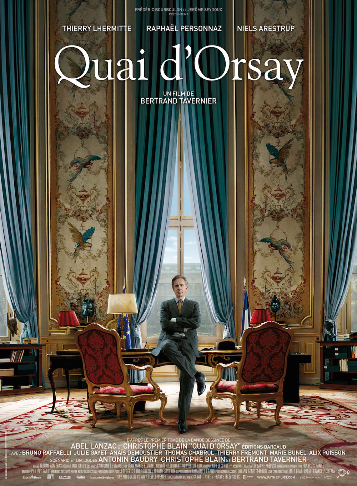
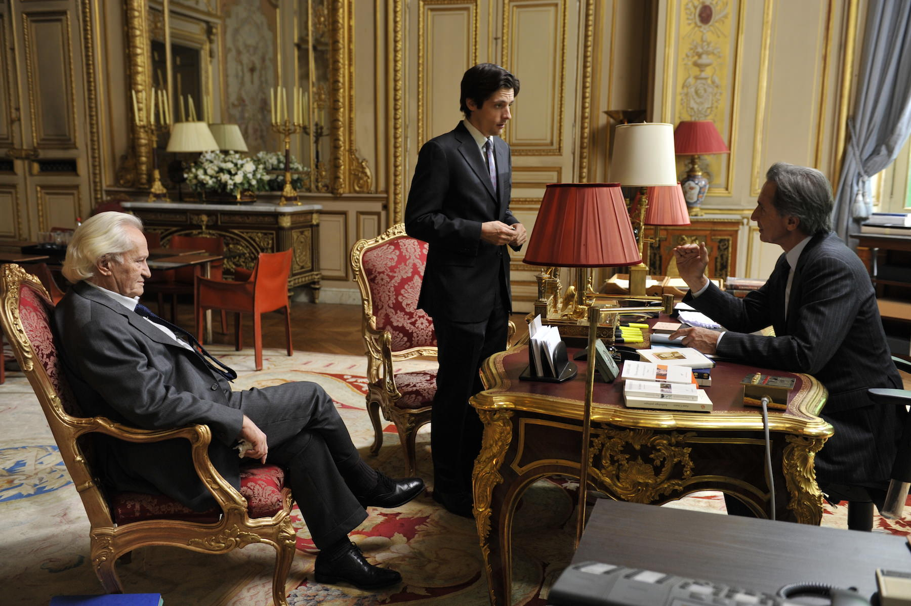

+++
titre = "<em>Quai d&rsquo;Orsay</em>, Bertrand Tavernier"
title = "Quai d'Orsay, Bertrand Tavernier"
url = "/quai-orsay-tavernier"
date = "2014-03-27T08:12:37"
Lastmod = "2014-03-27T08:18:06"
cover = "quai-orsay-thierry-lhermitte.jpg"
categorie = [ "À voir" ]
tag = [ "Adaptation bande-dessinée", "Comédie", "Histoire vraie", "Humour", "Politique" ]
createur = [ "Bertrand Tavernier" ]
acteur = [ "Bruno Raffaelli", "Julie Gayet", "Niels Arestrup", "Raphaël Personnaz", "Thierry Lhermitte" ]
annee = [ "2013" ]
weight = 2013
pays = [ "France" ]

+++

Avant d’être un film, <em>Quai d’Orsay</em> était une <a href="http://voiretmanger.fr/quai-orsay-chroniques-diplomatiques-lanzac-blain/" title="Quai d’Orsay : chroniques diplomatiques, Abel Lanzac et Christophe Blain">excellente bande dessinée</a> sur l’envers du décor au cœur du ministère des Affaires étrangères, dans les mois qui précèdent le désormais <a href="https://www.youtube.com/watch?v=RNxU-tN8qNc">célèbre discours</a> de Dominique de Villepin à l’ONU. L’œuvre originale était marquée par un style très tranché, proche de la caricature, et quelques idées très bien trouvées, pour un résultat aussi drôle que passionnant. Bertrand Tavernier n’a pas manqué d’en voir le potentiel et le cinéaste a choisi de l’adapter avec plus de réalisme, certes, mais sans perdre l’esprit humoristique original. Le résultat est aussi réussi, dans un autre genre : <em>Quai d’Orsay</em> est une comédie vraiment drôle, avec quelques séquences d’anthologie, mais c’est toujours une plongée fascinante dans un ministère. Un excellent divertissement !

<em>Quai d’Orsay</em> n’est pas le biopic de Dominique de Villepin, et d’ailleurs le personnage qui représente l’ancien ministère des Affaires étrangères se nomme ici Alexandre Taillard de Worms. L’angle choisi par <em>Quai d’Orsay : chroniques diplomatiques</em> et suivi par Bertrand Tavernier n’est pas de raconter le mandat du ministre, mais les quelques mois qui précèdent son apogée : son discours contre l’entrée en guerre voulue par les États-Unis en Irak. Prononcé en septembre 2003 à l’ONU, ce discours est resté dans les annales par son souffle et sa vision et le long-métrage suit les pas de la personne sans doute la plus importante, nonobstant le ministre : celui qui a écrit le discours. Le film commence ainsi avec l’embauche d’Arthur Vlaminck, jeune diplômé de l’ENA qui est chargé par le ministre du langage, c’est-à-dire d’écrire ses discours. Aussi déboussolé que les spectateurs, ses errements dans les longs couloirs du Quai d’Orsay, tantôt sous les dorures du XIXe siècle, tantôt sombres et étroits. On s’y perd géographiquement, mais on se perd surtout dans la masse de personnes qui agissent pour le ministre et autour de lui. Il y a tout d’abord le directeur du cabinet, Claude Maupas, qui est certainement celui qui en fait le plus dans l’ombre, mais il y a aussi tous les conseillers spécialisés dans une région du monde, et encore toute une hiérarchie incompréhensible avec laquelle Arthur — et nous-mêmes ! — doit se débrouiller. Comme dans l’œuvre originale, <em>Quai d’Orsay</em> réussit à nous perdre et le film est tout aussi intéressant pour comprendre comment un ministère fonctionne et, finalement, comment un gouvernement fonctionne. Derrière le ministre qui est extrêmement médiatisé, ce sont des hommes et des femmes qui orientent les décisions et font parfois tout le travail que l’on attribuera ensuite au ministre. À cet égard, Bertrand Tavernier trouve l’illustration parfaite avec la gestion d’une crise réglée en toute discrétion par le directeur du cabinet, sans que le ministre n’intervienne, si ce n’est pour s’agiter.

De fait, même si <em>Quai d’Orsay</em> est parfaitement documenté, même si le long-métrage offre une plongée saisissante de réalisme dans l’univers d’un ministère, il s’agit aussi d’une comédie. Pendant comique de <a href="http://voiretmanger.fr/exercice-etat-schoeller/" title="L’Exercice de l’État, Pierre Schœller"><em>L’Exercice de l’État</em></a>, le long-métrage de Bertrand Tavernier reprend les meilleures idées de la bande dessinée pour faire rire, et cela fonctionne parfaitement. Le gag répétitif des portes qui claquent quand le ministre passe et qui font voler toutes les feuilles de papier sur son passage était déjà très visuel dans l’œuvre originale, il passe à nouveau très bien devant les caméras. Le sketch du stabilo est aussi drôle filmé que sur le papier et on peut dire que le film a bien cerné la caricature du ministre, sans aller aussi sur le plan physique naturellement. À ce propos, Thierry Lhermitte ne ressemble pas du tout à Dominique de Villepin, mais ce n’est absolument pas gênant. Toujours en mouvement, hyperactif en permanence, l’acteur est parfait dans ce rôle qui lui va à merveille : cela faisait longtemps qu’on ne l’avait pas vu aussi bon. À ses côtés, tout en douceur, Niels Arestrup est fidèle à lui-même, c’est-à-dire excellent et il offre tout le contraste nécessaire avec le ministre. Difficile de se faire une place à côté de ce duo comique parfaitement calibré, mais Raphaël Personnaz fait bien son travail en incarnant un jeune énarque déboussolé, mais brillant. Le casting est bon, ce qui était essentiel pour réussir cette adaptation, et <em>Quai d’Orsay</em> lui doit sûrement beaucoup. La réussite du film, au fond, c’est qu’il fait vraiment rire. Bertrand Tavernier aurait peut-être gagné à raccourcir légèrement son film — il dure près de deux heures —, mais on n’a jamais vraiment le temps de s’ennuyer et le bilan est tout à fait positif.

<em>Quai d’Orsay : chroniques diplomatiques</em> était une bande dessinée si forte que l’on pouvait craindre l’adaptation un peu faible en comparaison. À l’heure des bilans, force est de constater que Bertrand Tavernier a parfaitement su capter l’essence même de l’œuvre originale. <em>Quai d’Orsay</em> n’est peut-être pas aussi forte que le modèle, mais cette comédie vraiment drôle est un divertissement extrêmement plaisant. Une belle réussite…

<h3>Vous voulez m’aider ?</h3>
<ul>
<li><a href="http://www.amazon.fr/gp/product/B00GME4PYA/ref=as_li_ss_tl?ie=UTF8&#038;tag=leblogdenic07-21&#038;linkCode=as2&#038;camp=1642&#038;creative=19458&#038;creativeASIN=B00GME4PYA">Acheter le film en Blu-Ray sur Amazon</a></li>
<li><a href="http://www.amazon.fr/gp/product/B00GME4OXM/ref=as_li_ss_tl?ie=UTF8&#038;tag=leblogdenic07-21&#038;linkCode=as2&#038;camp=1642&#038;creative=19458&#038;creativeASIN=B00GME4OXM">Acheter le film en DVD sur Amazon</a></li>
<li><a href="https://itunes.apple.com/fr/movie/quai-dorsay/id803433914">Acheter ou louer le film sur l’iTunes Store</a></li>
</ul>

