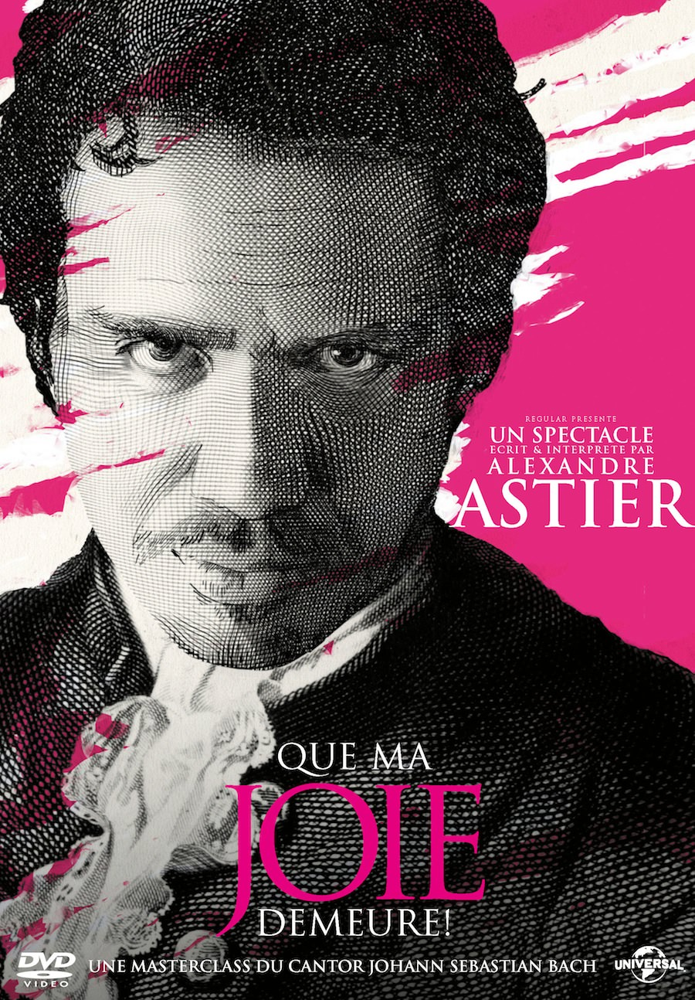
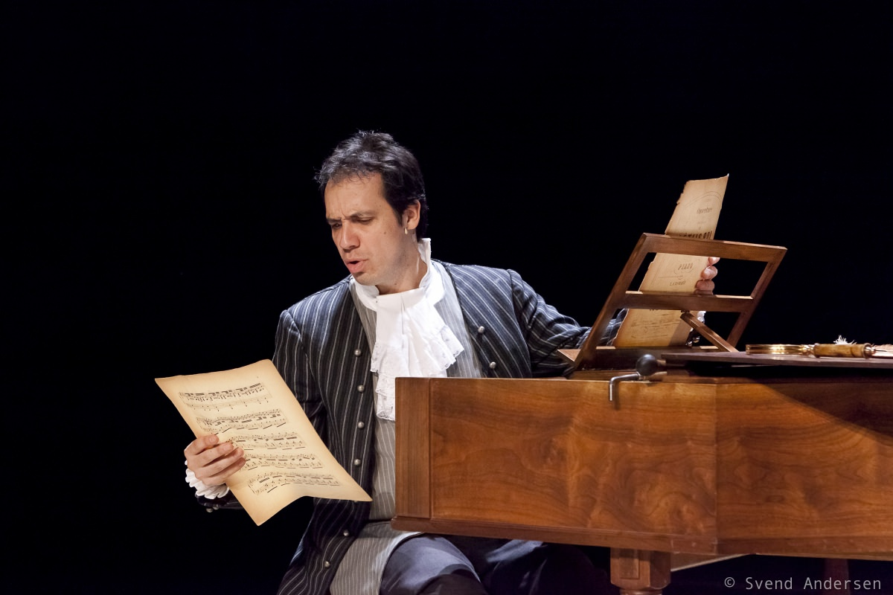
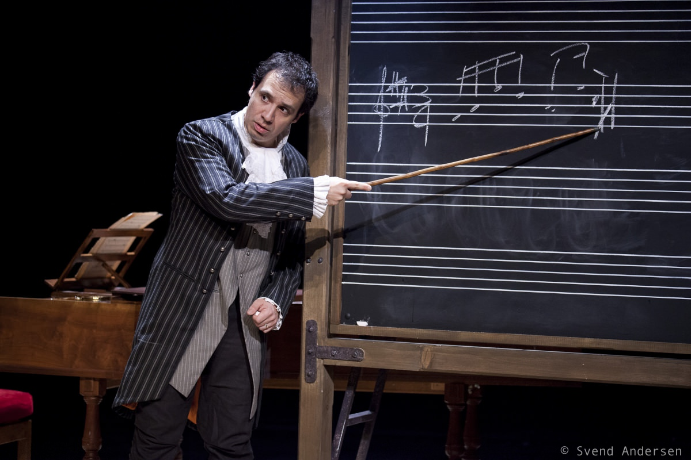

+++
type = "post"
titre = "<em>Que ma joie demeure !</em>, Alexandre Astier à la Bourse du travail (22 décembre 2012)"
title = "Que ma joie demeure !, Alexandre Astier à la Bourse du travail (22 décembre 2012)"
url = "/que-ma-joie-demeure-astier-lyon"
date = "2012-12-24T09:58:21"
Lastmod = "2014-11-26T21:26:10"
cover = "alexandre-astier-que-ma-joie-demeure.jpg"
categorie = [ "À voir… en live" ]
tag = [ "Histoire", "Humour", "Musique", "Spectacle" ]
createur = [ "Alexandre Astier" ]
annee = [ "2012" ]
weight = 2012
pays = [ "France" ]
lieu = [ "Bourse du Travail" ]

+++

Alexandre Astier n’est pas que le roi du château de <em>Kaamelott</em>, c’est aussi et même d’abord un musicien confirmé. C’est aussi un grand amateur de Johann Sebastian Bach et c’est justement le sujet de son spectacle <em>Que ma joie demeure !</em>, toujours en tournée. Un spectacle comique, certes, mais aussi une introduction à la musique tout à fait sérieuse et un bref aperçu de la vie du compositeur au début du XVIIIè siècle. Ce mélange étonnant entre rudiments de musique, morceaux de vie de Bach et humour à la Astier fonctionne parfaitement bien. On apprend un peu, s’amuse beaucoup et rigole souvent : en bref, un spectacle complet, à ne pas rater !

<em>Que ma joie demeure !</em> débute avec la lecture d’une lettre de Johan Sebastian Bach à son prince pour se plaindre d’une journée portes ouvertes qu’il doit organiser, comme tous les ans, pour offrir au peuple un aperçu des rudiments de la musique. Le compositeur se plaint de cette journée qui attire surtout des gens intéressés par les tapis et autres argenteries du palais, plus que par la musique. Une réclamation à laquelle le prince répond par une lettre tout à fait polie, mais ferme qui s’avère déjà assez drôle, alors même qu’Alexandre Astier n’est pas encore entré sur scène. Quand le comédien arrive enfin, c’est justement dans ce rôle du cantor Bach qui doit donner son cours au peuple, le public donc. Une entrée en matière efficace, d’autant que l’acteur n’a pas son pareil pour plonger son audience dans l’ambiance de l’époque. Sur scène, un clavecin et un tableau noir avec des portées et le personnage commence à nous expliquer les rudiments de la musique. Les notes, le rythme, les tons… tout y passe et le cours avance très vite, avec quelques exercices pratiques à réaliser. La salle est globalement perdue et Alexandre Astier dans la peau de Bach prend un malin plaisir à perdre son public pour mieux le ridiculiser.

On pourrait croire qu’une formation de solfège intégrale est nécessaire pour comprendre quelque chose à <em>Que ma joie demeure !</em> Il n’en est rien : loin d’être un vrai cours de musique sérieux, il s’agit bien d’un spectacle comique et d’ailleurs très drôle. Alexandre Astier multiplie les scènes humoristiques à partir de son cours, passant à l’occasion de la musique à tout autre chose, à l’image de cette impressionnante leçon de composition de sandwichs. Avant cela, on aura eu droit à une très drôle inspection d’un orgue qui sert aussi de ruche et à quelques scènes amusantes dans l’église. On retrouve l’humour si typique de Kaamelott, quelques intonations de l’acteur également, mais les thèmes sont ici nouveaux et on découvre un personnage et un univers différents. Quand le cours commence, le professeur de musique signale que, par un hasard de calendrier, la taverne du coin offre une saucisse pour tout achat de deux bières. Un humour que les amateurs de la série télévisée d’Alexandre Astier reconnaîtront sans peine, et qui fait encore parfaitement effet ici.

La différence, c’est justement la vie de Bach et l’ongle original de <em>Que ma joie demeure !</em> Ce spectacle comique n’oublie pas son idée originale et la leçon de musique donnée au public de la salle est entrecoupée de manière assez originale de moments de la vie du musicien, des moments tantôt drôles — l’inspection de l’orgue —, tantôt émouvants, comme la mort de l’un de ses enfants. Souvent, Alexandre Astier interrompt brutalement son cours pour une anecdote piochée dans la vie du compositeur, toujours racontée à la première personne. Tout est vrai dans la leçon de musique dispensée par le spectacle, les grandes lignes de la vie de Johan Sebastian Bach sont aussi vraies, même si le comique a judicieusement pris quelques libertés pour en améliorer le comique. Bon nombre de ses enfants sont vraiment morts en bas âge, mais les miettes de pain dans la boîte de son déjeuner qui lui inspirent un morceau sont plus douteuses (quoique ?). Ses relations houleuses avec le prince du coin sont certainement réelles, tandis que son regard négatif sur l’interprétation de ses propres œuvres qu’il juge mauvaise est très certainement avéré. Il faut dire que la musique de Bach n’est pas la plus simple et on aimerait d’ailleurs l’entendre plus, mais surtout la comprendre mieux. <em>Que ma joie demeure !</em> n’est pas un cours de musicologie, c’est donc logique que les enseignements purs n’y prennent pas une place trop grande, mais Alexandre Astier titille notre curiosité sans la satisfaire tout à fait. Sur les contrepoints par exemple, grande spécialité de Bach comme on le sait, le comédien donne quelques informations, mais pas d’exemples et c’est un peu frustrant.

Il faut dire que le clavecin positionné sur la scène n’est pas là que pour décorer. Alexandre Astier en joue et une bonne partie de la musique entendue dans <em>Que ma joie demeure !</em> est en fait jouée directement sur scène. Outre le clavecin, on a droit à un peu de violoncelle sur la fin, un extrait des <a href="http://www.amazon.fr/gp/product/B00000C2B4/ref=as_li_ss_tl?ie=UTF8&amp;tag=leblogdenic07-21&amp;linkCode=as2&amp;camp=1642&amp;creative=19458&amp;creativeASIN=B00000C2B4">Suites pour violoncelle</a> de J.S. Bach qui font indéniablement partie des chefs-d’œuvre du genre avec cet instrument. Le spectacle exploite aussi quelques bandes sonores enregistrées, d’autres extraits issus de l’énorme œuvre de Bach, mais on aurait à ce propos en entendre encore plus. Reste qu’il s’agit d’un spectacle comique et que l’humour est au rendez-vous, mais pas sur le mode du sketch de one-man-show. Si Alexandre Astier est effectivement seul sur scène, son spectacle est très construit, avec une mise en scène travaillée et un scénario logique de bout en bout. Le décor est minimaliste — un clavecin et un tableau noir pour les cours, une fenêtre avec une croix et un banc qui figurent une église —, mais il suffit à plonger les spectateurs dans l’ambiance et permet au comédien d’exploiter ses talents d’acteur. Qu’il monte sur une estrade derrière le tableau et on comprend avec quelques gestes et mimiques qu’il inspecte l’orgue du haut du balcon que l’on imagine très haut. Un éclairage particulier et on sait immédiatement qu’il se confesse dans une église. C’est simple, mais réussi.

<em>Que ma joie demeure !</em> est un spectacle original qui mêle leçons de musique, vie de J.S. Bach et comédie façon <em>Kaamelott</em>. Un mélange original qui fonctionne parfaitement bien. Le spectacle d’Alexandre Astier est parfaitement rodé avec une mise en scène parfaitement calibrée et un texte qui manie à merveille l’humour de cet artiste décidément complet. Une vraie réussite à ne surtout pas rater, en <a href="http://www.amazon.fr/gp/product/B008S8BGC2/ref=as_li_ss_tl?ie=UTF8&amp;tag=leblogdenic07-21&amp;linkCode=as2&amp;camp=1642&amp;creative=19458&amp;creativeASIN=B008S8BGC2">DVD</a> si vous ne pouvez pas le voir dans une salle près de chez vous.

<em>Image de couverture : © Svend Andersen</em>

<h3>Vous voulez m’aider ?</h3>
<ul>
<li><a href="http://www.amazon.fr/gp/product/B008S8BGC2/ref=as_li_ss_tl?ie=UTF8&amp;tag=leblogdenic07-21&amp;linkCode=as2&amp;camp=1642&amp;creative=19458&amp;creativeASIN=B008S8BGC2">Acheter le spectacle en DVD sur Amazon</a></li>
<li><a href="https://itunes.apple.com/fr/tv-season/alexandre-astier-que-ma-joie/id568537138">Acheter le spectacle sur l’iTunes Store</a></li>
</ul>

