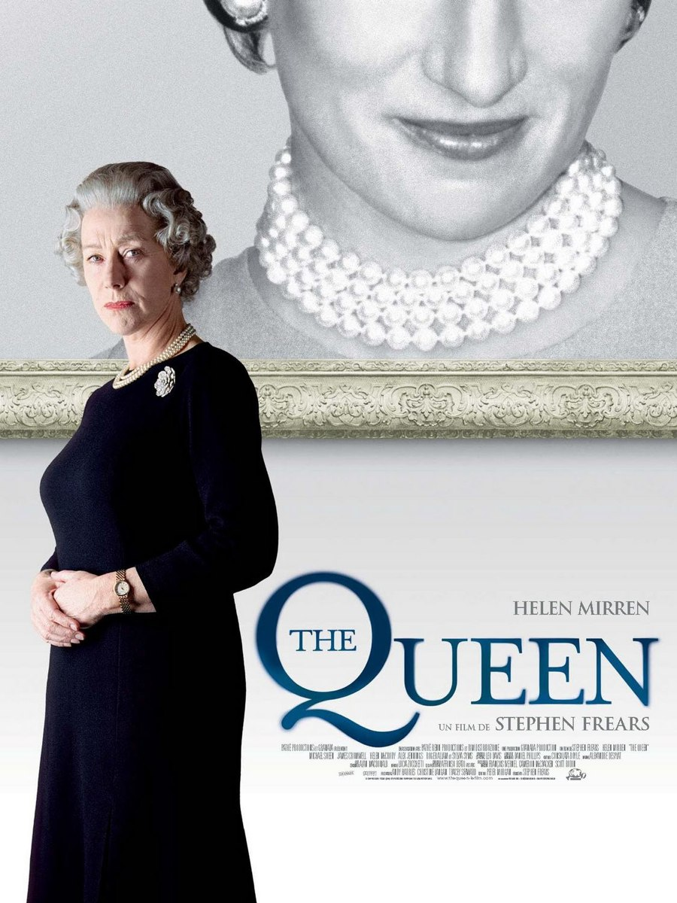
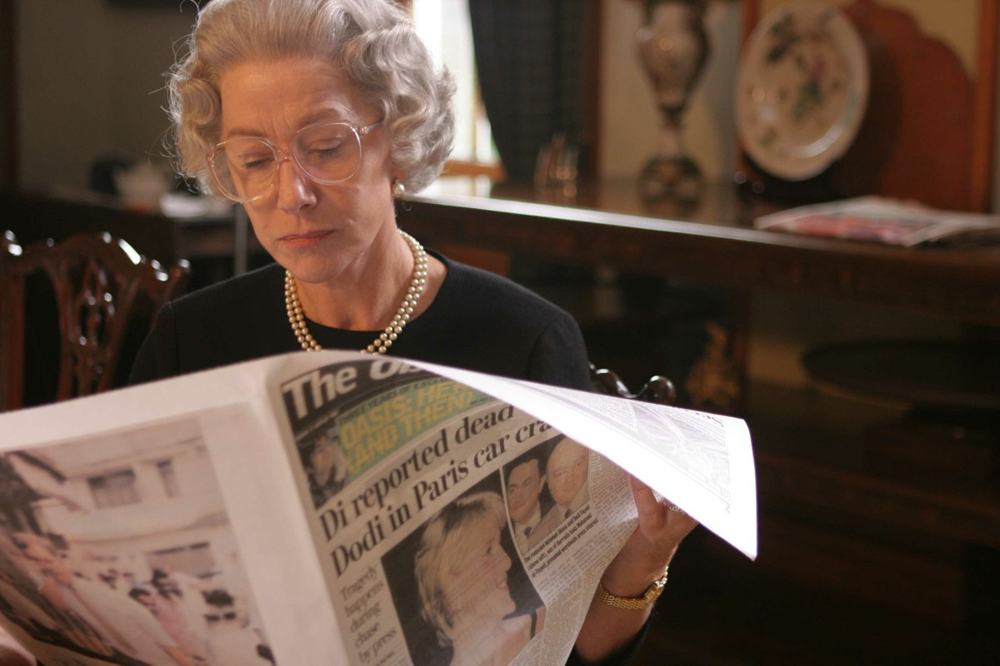
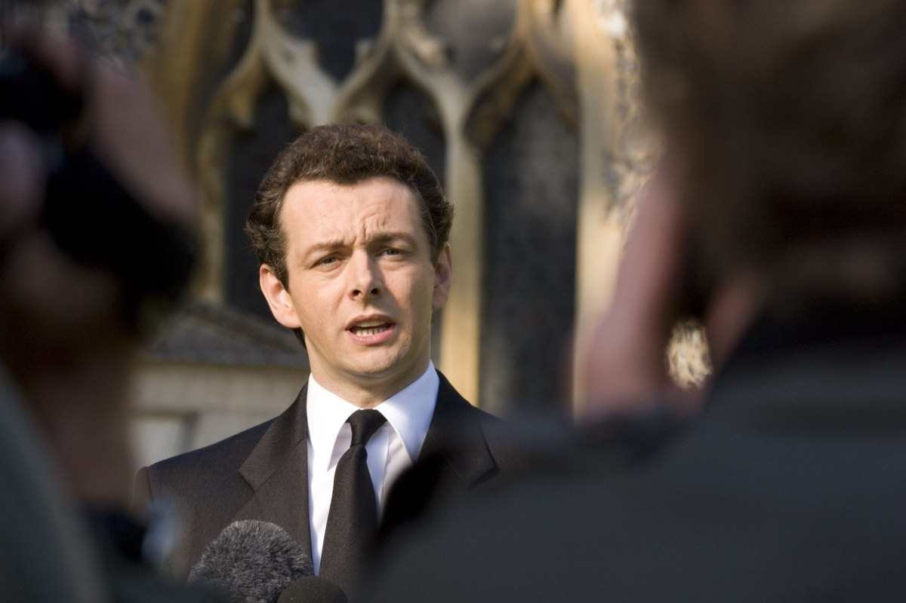

+++
type = "post"
titre = "<em>The Queen</em>, Stephen Frears"
title = "The Queen, Stephen Frears"
url = "/queen-frears"
date = "2012-06-26T09:44:40"
Lastmod = "2015-01-26T13:54:39"
cover = "the-queen-helen-mirren-frears.jpg"
categorie = [ "À voir" ]
tag = [ "Drame", "Histoire", "Politique", "Presse", "Société" ]
createur = [ "Stephen Frears" ]
acteur = [ "Helen Mirren", "James Cromwell", "Michael Sheen" ]
annee = [ "2006" ]
weight = 2006
pays = [ "États-Unis", "France" ]

+++

La mort de Lady Di vécue de l&rsquo;intérieur, tel est le sujet passionnant de <em>The Queen</em>. Stephen Frears filme la Reine d&rsquo;Angleterre au plus près, mais aussi le tout nouveau Premier ministre Tony Blair. Deux générations s&rsquo;opposent dans les coulisses, une plongée fascinante dans l&rsquo;envers du décor pour un film intense et parfaitement maîtrisé. Une réussite.

Été 1997. La Reine Elizabeth II en est à sa cinquante-cinquième année de règne et Tony Blair vient juste d&rsquo;être élu Premier ministre. Le temps est au changement, à la modernisation promise par ce représentant du Parti travailliste après des années de pouvoir sans partage pour le Parti conservateur. Les premiers contacts entre la Reine et son Premier ministre sont assez peu chaleureux, pour ne pas dire plus. Le monarque n&rsquo;aime pas trop ce jeune homme qui entend bouleverser des institutions en place depuis plusieurs siècles. Tony Blair de son côté est plus enthousiaste, mais il doit se contenter du strict minimum. Son mandat commence à peine qu&rsquo;un drame terrible l&rsquo;oblige à une pause : Diana, l&rsquo;ex-femme du prince Charles, meurt dans un accident à Paris. Le Premier ministre sent immédiatement qu&rsquo;il s&rsquo;agit d&rsquo;une annonce extrêmement importante, il interrompt ses vacances et prononce très rapidement un message de soutien. La Reine, de son côté, n&rsquo;entend pas bouger le petit doigt, encore moins réagir officiellement. Selon elle, l&rsquo;affaire est entendue, Diana ayant divorcé, elle n&rsquo;appartient plus à la famille royale. Le peuple britannique commence pourtant à s&rsquo;amasser devant les portes de son palais à Londres et à s&rsquo;inquiéter de l&rsquo;absence de leur monarque…

<em>The Queen</em> est un film politique, sur les coulisses du monde politique. L&rsquo;enjeu ici est la réponse à apporter à la mort de Lady Di avec deux camps opposés. D&rsquo;un côté, Tony Blair soutenu par le Prince Charles qui comprend l&rsquo;importance de l&rsquo;évènement et qui sait que les Anglais attendent un enterrement et des hommages dignes de ce nom. Diana est alors extrêmement populaire et les gens viennent se recueillir et pleurer devant les grilles de Buckingham. Le Premier ministre sent qu&rsquo;il peut profiter de l&rsquo;évènement par sa simple présence et en manifestant son soutien. Il prépare à cet effet un discours qui marque les esprits par une formule bien trouvée : « la princesse du peuple ». À l&rsquo;inverse, Stephen Frears montre bien que la famille royale n&rsquo;entend pas réagir. La Reine et sa famille sont dans leur résidence d&rsquo;été à Balmoral, en Écosse. S&rsquo;ils apprennent très rapidement la nouvelle, leur hostilité à l&rsquo;égard de Diana est patente dès les premières minutes. La chose est entendue, il n&rsquo;y a pas lieu d&rsquo;organiser quoi que ce soit et la famille reste en congés, loin de Londres. <em>The Queen</em> montre bien comment le Premier ministre va essayer de convaincre Elizabeth II de se montrer, d&rsquo;accompagner le deuil national qu&rsquo;elle ne souhaitait pas, mais qui a lieu malgré tout. Un vrai jeu politique et l&rsquo;opposition de deux générations et de deux univers totalement différents.

Stephen Frears n&rsquo;a pas choisi <em>The Queen</em> par hasard : plus que la mort de Lady Di, ce qui intéresse le cinéaste est la Reine d&rsquo;Angleterre. Chef d&rsquo;État depuis 1952, elle a connu la Seconde Guerre mondiale et y a même joué un rôle actif. Son règne a été occupé par dix Premiers ministres différents quand le film commence et il est indéniable qu&rsquo;elle fait d&rsquo;ores et déjà partie de l&rsquo;histoire du pays. Pourtant, si elle se targue de connaître mieux que quiconque le peuple britannique, c&rsquo;est une femme totalement dépassée par les évènements et par l&rsquo;époque que l&rsquo;on découvre dans <em>The Queen</em>. La Reine ne comprend plus ses sujets, elle ne voit pas que la mort de Diana touche les Anglais et qu&rsquo;elle dépasse le strict cadre privé. Le divorce ne coupe pas totalement les liens qu&rsquo;elle entretenait avec la famille royale, il reste encore ses enfants, les petits-enfants de la Reine. Le film de Stephen Fears est brillant quand il montre la réaction de la famille dans la semaine qui suit la mort de Diana dans un tunnel parisien. Les fleurs et les bougies s&rsquo;accumulent par milliers à Londres, mais la Reine et sa famille préfèrent rester dans le château écossais à chasser le cerf. Le décalage est saisissant et voir les hommes habillés en kilt écossais pour partir à la chasse au moment même où les Anglais commencent à fustiger la famille royale pour leur manque de réponse. Au milieu du tumulte, <em>The Queen</em> filme une Reine fatiguée, usée par les décennies de règne, par un travail qu&rsquo;elle n&rsquo;a jamais choisi, mais qu&rsquo;elle doit malgré tout assumer. Un demi-siècle à diriger un pays est fatigant et Stephen Frears est parvenu à montrer son désarroi face aux réactions des Anglais. Au-delà de la fatigue, Elizabeth II ne parvient plus à comprendre le peuple qu&rsquo;elle dirige…

Passionnant sur le fond, <em>The Queen</em> est plus commun sur la forme et il tient surtout grâce au talent de ses acteurs. Stephen Frears réalise un travail tout à fait correct derrière la caméra, mais on retiendra surtout le rôle de Helen Mirren pour interpréter la Reine d&rsquo;Angleterre. L&rsquo;actrice oscarisée pour ce rôle est une habituée des monarques anglais, elle a notamment joué Elizabeth I dans une série diffusée un an avant ce long-métrage. Elle est ici encore impeccable et rend à merveille à la fois la dignité de son poste et ce sentiment de ne plus être à la hauteur, d&rsquo;être dépassé par les évènements. En face, Michael Sheen — lui aussi habitué au rôle — compose un Tony Blair convaincant. <em>The Queen</em> utilise astucieusement les images d&rsquo;archive et notamment les micros-trottoirs réalisés à l&rsquo;époque, mais n&rsquo;en abuse pas, tandis que le montage alterné entre Balmoral et Londres est classique, mais très efficace.

Le sujet de <em>The Queen</em> est passionnant et Stephen Frears a parfaitement réussi à le retranscrire. La mort de Lady Di vécue depuis la résidence estivale de la famille royale offre un éclairage rare sur la question, mais cet évènement est aussi un bon moyen de mettre en valeur la difficulté qu&rsquo;il y a à régner. Elizabeth II n&rsquo;a pas choisi ce travail et elle se sent totalement en rupture avec son peuple à l&rsquo;occasion de ce drame. <em>The Queen</em> est indéniablement un très beau film, une réussite à (re)voir…

<h3>Vous voulez m&rsquo;aider ?</h3>
<ul>
<li><a href="http://www.amazon.fr/gp/product/B000MZGSGS/ref=as_li_ss_tl?ie=UTF8&amp;tag=leblogdenic07-21&amp;linkCode=as2&amp;camp=1642&amp;creative=19458&amp;creativeASIN=B000MZGSGS">Acheter le film en DVD sur Amazon</a></li>
<li><a href="http://itunes.apple.com/fr/movie/the-queen-vost/id425062226">Acheter ou louer le film sur l&rsquo;iTunes Store</a></li>
</ul>

