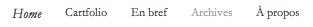

+++
type = "post"
titre = "Quelques nouveautés sur le blog de Nicolinux"
title = "Quelques nouveautés sur le blog de Nicolinux"
url = "/quelques-nouveautes-blog-nicolinux"
date = "2010-08-22T19:31:12"
Lastmod = "2010-08-22T19:35:46"
cover = "autofocus+.jpg"
categorie = [ "Le blog" ]
tag = [ "Wordpress" ]

+++

Les habitués l&rsquo;auront sans doute remarqué, le blog a un peu changé. Oh, rien de révolutionnaire, le thème reste globalement le même qu&rsquo;avant puisqu&rsquo;il me convient bien. J&rsquo;ai simplement mis à jour du thème devenu <a href="http://fthrwght.com/autofocus/">Autofocus+</a>. Mine de rien, cela a demandé pas mal de travail simplement pour revenir au design précédent, son auteur ayant décidé de faire évoluer son thème dans des directions qui ne me convenaient pas.

Cela fait donc quelques semaines, et même mois, que je travaille sur cette nouvelle version. Disons-le, je n&rsquo;ai pas réussi à faire grand-chose, la faute à mes trop faibles connaissances techniques, mais aussi à un manque constant de temps. Je préfère toujours créer du contenu que travailler sur le contenant, ce qui explique le peu d&rsquo;avancées. À dire vrai, il y a même des choses qui manquent, ou qui sont en retrait par rapport à la précédente version, notamment dans les archives. Je ne suis pas très content non plus de la façon dont les titres et extraits s&rsquo;affichent en première page, mais je ne veux pas repousser encore la nouvelle version qui est malgré fonctionnelle.

La nouveauté la plus visible et la plus importante sans doute est cette section &laquo;&nbsp;En bref&nbsp;&raquo; dans laquelle s&rsquo;insère cet article. C&rsquo;est une section intégrée au blog, mais à part, qui contiendra des articles plus brefs sur l&rsquo;actualité du blog comme celui-ci, ou bien d&rsquo;autres types d&rsquo;articles… Vous en saurez plus très prochainement, j&rsquo;ai une petite surprise pour tous mes lecteurs… Plus d&rsquo;information à ce propos cette semaine.

Cette partie n&rsquo;apparaît pas en première page du blog. Pour y accéder, il vous faudra en passer par le lien &laquo;&nbsp;En bref&nbsp;&raquo; en haut à droite. Si vous suivez le blog via RSS, l&rsquo;ancien flux contiendra les articles &laquo;&nbsp;En bref&nbsp;&raquo;. Plusieurs options s&rsquo;offrent à vous :

<ul style="text-align: justify;">
<li style="text-align: justify;"><a href="/category/critiques/feed/">ne suivre que les critiques</a></li>
<li><a href="/category/enbref/feed/">ne suivre que les articles &laquo;&nbsp;en bref&nbsp;&raquo;</a></li>
<li><a href="/feed?cat=-655">suivre tout le blog sauf les articles &laquo;&nbsp;en bref&nbsp;&raquo;</a></li>
</ul>

Le blog devrait continuer doucement, mais sûrement, d&rsquo;évoluer. J&rsquo;ai des dizaines et des dizaines d&rsquo;idées, mais malheureusement absolument pas le temps de m&rsquo;en occuper et de les concrétiser. On verra donc ce que je pourrai faire… En attendant, si vous voyez quelque chose qui ne fonctionne plus, n&rsquo;hésitez pas à me le signaler ici même.

