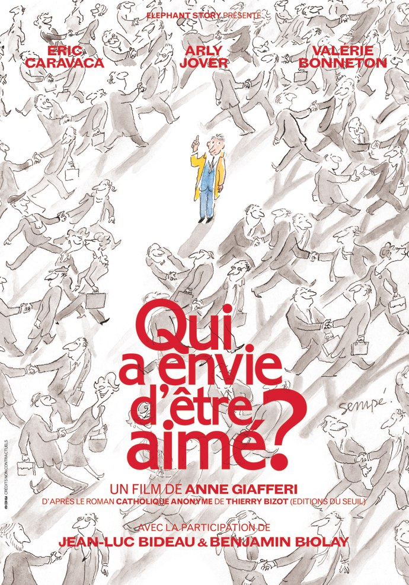
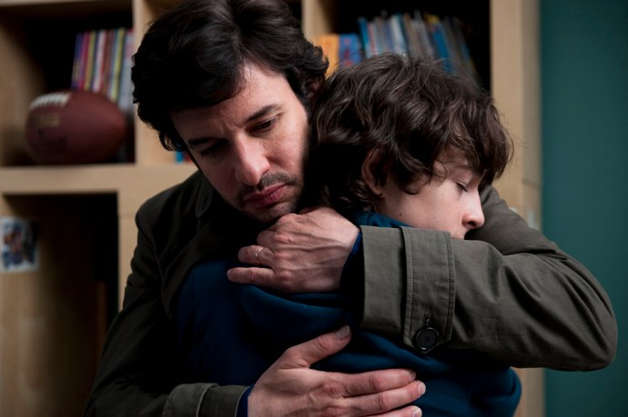

+++
type = "post"
titre = "Qui a envie d’être aimé ?, Anne Giafferi"
title = "Qui a envie d’être aimé ?, Anne Giafferi"
url = "/qui-a-envie-etre-aime-giafferi"
date = "2010-12-24T00:30:05"
Lastmod = "2012-03-14T09:49:57"
cover = "giafferi-qui-a-envie-etre-aime.jpg"
categorie = [ "À voir" ]
tag = [ "Amour", "Drame", "Famille", "Religion", "Vite oublié" ]
createur = [ "Anne Giafferi" ]
acteur = [ "Eric Caravaca" ]
annee = [ "2011" ]
weight = 2011
pays = [ "France" ]

+++

<em>Qui a envie d&rsquo;être aimé ?</em> raconte l&rsquo;histoire de la rencontre improbable entre un avocat quarantenaire et… Dieu. Idée intéressante, mais qui manque malheureusement de finesse : le film d&rsquo;Anne Giafferi semble un peu concentrer tous les défauts d&rsquo;un cinéma français. Personnages caricaturaux, situations improbables, scénario téléphoné… impossible décidément de croire en cette conversion un peu prosélytique.

Antoine, avocat parisien talentueux, 40 ans, marié, un garçon et une fille… la vie parfaite en somme. Vaste appartement au cœur de Paris, le garçon va au collège à Henri IV où son père l&rsquo;amène tous les matins en voiture. Son père possède aussi une maison familiale, en Bretagne évidemment. Tout semble aller pour le mieux pour ce prototype parfait du bobo parisien, sauf qu&rsquo;il a un père qui ne l&rsquo;aime pas vraiment ou en tout cas ne lui fait pas suffisamment preuve d&rsquo;amour à son goût. Et un frère violent, insouciant, irresponsable, mais adoré par le père. Manifestation de la crise de la quarantaine sans doute, Antoine ne se sent pas très bien et c&rsquo;est sur ces états d&rsquo;âme qu&rsquo;il fait la fameuse rencontre inattendue avec Dieu. Alors qu&rsquo;il se promène sur la côte, il voit par l&rsquo;entrebâillement de la porte d&rsquo;une chapelle la statue de Jésus sur la croix. Et comme les coups de foudre des romans à l&rsquo;ancienne, Antoine succombe devant cette statue et connaît une sorte de révélation. Le voilà qui se met aussi à suivre des cours de catéchisme pour adulte, deux fois par semaine, il achète même une Bible qu&rsquo;il se met à lire en cachette à son travail. Rien ne va plus, sa femme commence à croire qu&rsquo;il a rencontré une autre femme et c&rsquo;est bientôt toute sa vie qui est bouleversée. Antoine a envie d&rsquo;être aimé et manifestement l&rsquo;amour de sa femme ne lui suffit plus. Mais sa femme va-t-elle accepter ce nouvel amour soudain de la part de son mari ?

Rien ne fonctionne vraiment dans <em>Qui a envie d&rsquo;être aimé ?</em> Les personnages manquent de finesse psychologique, ils semblent tous réduits à leur type : le couple bobo, le père qui ne sait pas exprimer son amour, le frère chiant… Certes, le père aimerait changer, mais cela ne suffit pas, il restera de bout en bout le même. On comprend également mal pourquoi tous ces personnages devaient absolument être des caricatures. Ces bobos sont beaucoup trop bobo pour être un tant soit peu crédible : le grand appartement parisien dans les quartiers centraux, passe encore, après tout Antoine travaille au Palais de Justice sur l&rsquo;île de la Cité, mais fallait-il vraiment que le fils soit au collège à Henri IV ? Le plus gros problème de <em>Qui a envie d&rsquo;être aimé ?</em> reste du côté de la religion. La conversion subite d&rsquo;Antoine peine à convaincre tant elle rappelle les conversions de la <em>Bible</em> : cette révélation subite est trop belle pour être vraie, si bien que l&rsquo;on n&rsquo;y croit pas vraiment. Comment cet homme qui se proclame athée, voire agnostique, peut-il brusquement découvrir les messages bibliques, se convertir et décider d&rsquo;aller à la messe tous les dimanches ? Ce changement brusque est d&rsquo;autant plus gênant que le film semble ouvertement favorable à la religion catholique. On est ainsi frappé d&rsquo;entendre &laquo;&nbsp;<em>Sex and drugs and rock&rsquo;n roll</em>&nbsp;&raquo; juste avant l&rsquo;entrée d&rsquo;Antoine dans son groupe de catéchisme, faisant ainsi une opposition très nette entre les deux univers, comme si l&rsquo;on revenait à l&rsquo;époque où l&rsquo;Église considérait le rock comme une musique diabolique. Dans le même ordre d&rsquo;idée, Anne Giafferi fait dire à plusieurs reprises à son personnage principal qu&rsquo;Orelsan est une musique de sauvages… Sans être pour autant ouvertement pro-catholique, le film a un rapport plutôt premier degré avec la religion, un rapport bien moins intéressant que celui que proposait <em><a href="http://voiretmanger.fr/2010/08/07/poison-violent-quillevere/">Un poison violent</a></em>, par exemple. À côté, <em>Qui a envie d&rsquo;être aimé ?</em> ressemble plus à un cours de catéchisme pour les nuls…

<em>Qui a envie d&rsquo;être aimé ?</em> est un film français issu de la télévision par le biais de ses créateurs, et cela se voit. S&rsquo;il serait injuste de qualifier le film d&rsquo;Anne Giafferi de téléfilm, on retrouve quand même une esthétique proche de la télévision, même si un effort a été manifestement consacré aux cadres et éclairages. La réalisation n&rsquo;est pourtant pas très palpitante, ce qui n&rsquo;aide pas à renforcer l&rsquo;intérêt du film, également plombé par son acteur principal. Éric Caravaca donne ainsi le sentiment de ne jamais croire à son rôle, d&rsquo;y être étranger et de réciter de manière scolaire un texte appris par cœur. Son rôle a dès lors un côté théâtre amateur qui rappelle un peu le cinéma de la Nouvelle Vague, sans pour autant être certain que l&rsquo;effet est voulu et assumé. En tout cas, à l&rsquo;image de cet acteur qui ne semble pas croire à Antoine, on ne croit guère plus au film.

Vous l&rsquo;aurez compris, je n&rsquo;ai pas aimé <em>Qui a envie d&rsquo;être aimé ?</em>. Ce n&rsquo;est pas faute d&rsquo;avoir essayé, mais rien n&rsquo;y fait : ce film est trop gros, trop caricatural, trop incroyable, trop… français peut-être ? Dommage, car l&rsquo;idée était intéressante et aurait pu donner un bon film, mais il aurait fallu pour cela plus de finesse psychologique, des acteurs plus « <em>actors studio</em> », entre autres. Le film a peut-être envie d&rsquo;être aimé, mais ce sera donc sans moi.

<strong>Mise à jour au 13/02/2011</strong> : le succès de cet article ayant, de loin, dépassé mes attentes, la polémique ayant fait rage dans les commentaires, je tenais à préciser que cet article a été rédigé immédiatement après avoir vu le film, alors que j&rsquo;étais encore agacé parce que j&rsquo;avais vu. Je ne nie pas avoir pratiqué un peu de troll, une technique <a href="http://fr.wikipedia.org/wiki/Troll_(Internet)">courante sur Internet</a>. Même si mon avis n&rsquo;a en rien changé sur le film que je trouve toujours aussi grossier dans sa démonstration, je reconnais avoir été un peu dur sur la religion catholique. À défaut de faire amende honorable, je renverrai vers <a href="http://www.enmanquedeglise.com/article-qui-a-envie-d-etre-aime-66954521.html">cette interview</a> d&rsquo;Anne Gafieri et de son mari, auteur du roman à l&rsquo;origine du film. Une interview intéressante, car plus nuancée que le film lui-même.

<h3>Vous voulez m&rsquo;aider ?<a href="#footnote_0_4421" id="identifier_0_4421" class="footnote-link footnote-identifier-link" title="&Agrave; propos de la publicit&eacute;&hellip;">1</a></h3>
<ul>
<li><a href="http://www.amazon.fr/gp/product/B0051SNVL6/ref=as_li_ss_tl?ie=UTF8&tag=leblogdenic07-21&linkCode=as2&camp=1642&creative=19458&creativeASIN=B0051SNVL6">Acheter le film en DVD sur Amazon</a></li>
</ul>

<ol class="footnotes"><li id="footnote_0_4421" class="footnote"><a href="http://voiretmanger.fr/a-propos/publicite/">À propos de la publicité…</a> [<a href="#identifier_0_4421" class="footnote-link footnote-back-link">&#8617;</a>]</li></ol>
