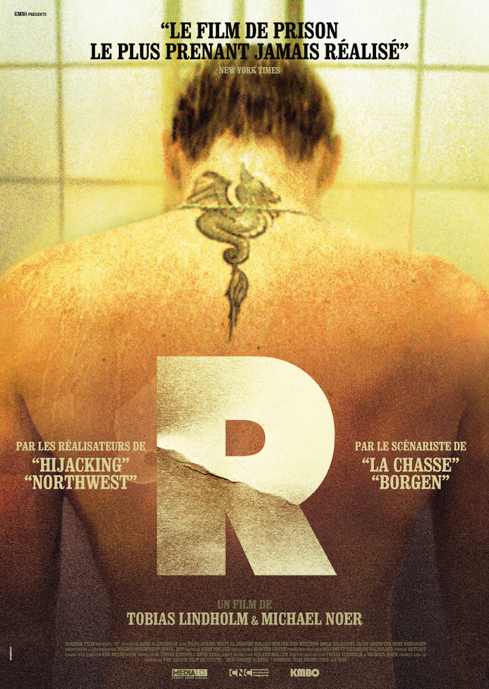
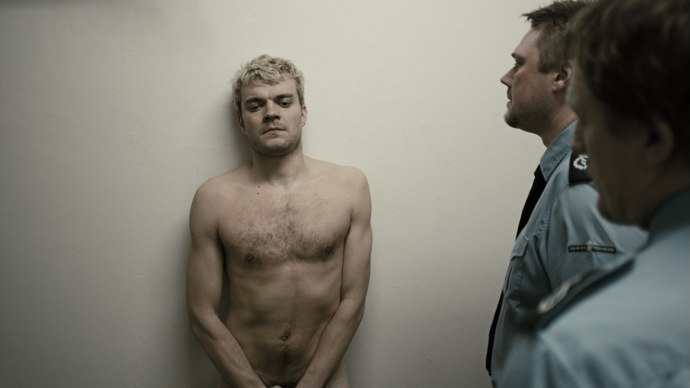
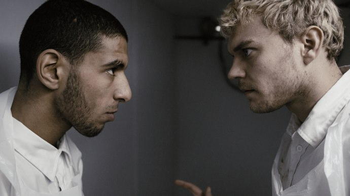

+++
type = "post"
titre = "<em>R</em>, Michael Noer et Tobias Lindholm"
title = "R, Michael Noer et Tobias Lindholm"
url = "/r-noer-lindholm"
date = "2010-12-17T00:27:41"
Lastmod = "2014-01-15T11:57:57"
cover = "r-johan-philip-asbaek.jpg"
categorie = [ "À voir" ]
tag = [ "Arcs 2010", "Drame", "Festival", "Huis clos", "Prison", "Société", "Violence" ]
createur = [ "Michael Noer", "Tobias Lindholm" ]
acteur = [ "Dulfi Al-Jabouri", "Johan Philip Asbæk" ]
annee = [ "2014" ]
weight = 2014
pays = [ "Danemark" ]

+++

Les films de prison constituent un genre cinématographique à part entière, un genre qui semble regagner en popularité ces dernières années. <em>R</em> en est la dernière manifestation : ce film danois de Michael Noer et Tobias Lindholm ne s&rsquo;éloigne pas vraiment des canons du genre. Tout y est, le jeune arrivant, les bizutages, la drogue, la violence, les conflits entre groupes sociaux… Classique, mais extrêmement efficace avec son ambiance oppressante. Quand le générique final arrive enfin, on est bien content de sortir de prison, preuve de la réussite de <em>R</em>.

Rune, aussi connu plus simplement sous le surnom plus simple de R, entre en prison. D&rsquo;emblée le ton est donné : les gardes hurlent les ordres, il se dévêtit complètement pour la traditionnelle fouille à l&rsquo;entrée. On ne sait pas encore ce qu&rsquo;il a fait pour entrer en prison, mais on comprendra par la suite qu&rsquo;il a poignardé un homme. La raison importe peu, le plus important est qu&rsquo;il est en prison pour deux ans et qu&rsquo;il ne va pas s&rsquo;agir d&rsquo;un séjour de tout repos. Et en effet, les bizutages commencent vite : vol de matelas, nettoyage forcé des cellules puis des toilettes et le classique règlement de compte commandité par un groupe. C&rsquo;est que cette prison danoise est partagée entre deux communautés bien distinguées et réparties sur un étage différent : les Danois de souche et ceux d&rsquo;origine arabe ou musulmans ne se mélangent ainsi jamais, si ce n&rsquo;est lors des promenades. Chaque communauté a ses règles, son organisation interne plus ou moins mafieuse et les mélanges ne sont pas envisageables. Il y a néanmoins des interactions et R va justement commencer à dealer de l&rsquo;herbe avec l&rsquo;étage du dessous. Cet échange va lui valoir successivement les faveurs du caïd danois et les pires ennuis dans un univers carcéral où l&rsquo;on rigole rarement.

<em>R</em> propose un portrait assez dur d&rsquo;une prison contemporaine standard dans un pays civilisé. D&rsquo;ailleurs, ce n&rsquo;est pas une prison à l&rsquo;ancienne infâme comme <em><a href="http://voiretmanger.fr/2008/11/30/hunger/">Hunger</a></em> la filmait, mais une prison moderne où les cellules sont propres et ouvertes par de larges fenêtres, où les prisonniers sont assez libres, travaillent ou jouent tout simplement au billard ou au poker. Ils ont des fauteuils en cuir confortables, des télévisions, un vaste espace pour sortir. Le lieu n&rsquo;en est pas moins terriblement négatif et sinistre, mais il apporte au moins aux détenus un peu de confort et de liberté, même si les gardiens veillent et n&rsquo;hésitent pas à frapper. La description de la prison dans <em>R</em> brille par son réalisme. Michael Noer est un documentariste à l&rsquo;origine, et cela se voit à l&rsquo;écran : on sent qu&rsquo;un important travail de documentation a été réalisé avant le film et l&rsquo;univers carcéral est extrêmement bien rendu et évite la caricature ou la surenchère. Si le héros subit des bizutages à son arrivée, il ne se fait pas violer dans la demi-seconde qui suit et, certes parce qu&rsquo;il est docile, il est plutôt convenablement traité par ses voisins. Même l&rsquo;opposition entre les &laquo;&nbsp;Arabes&nbsp;&raquo; et les &laquo;&nbsp;Danois&nbsp;&raquo; n&rsquo;est pas dans la surenchère ou dans le conflit total et absolu : quand l&rsquo;occasion se présente, les deux groupes peuvent s&rsquo;allier et agir de concert. En outre, Rune n&rsquo;est pas hostile par défaut au groupe adverse et il se lie d&rsquo;ailleurs d&rsquo;amitié avec un jeune détenu musulman. <em>R</em> est donc un film carcéral très juste, et assez suffocant pour cette raison. La liberté des détenus n&rsquo;est qu&rsquo;apparente et elle permet surtout de mieux mettre en valeur l&rsquo;oppression de cet espace d&rsquo;où on ne ressort pas indemne, mentalement quand ce n&rsquo;est pas physiquement.

Inutile de le nier, <em>R</em> rappelle fortement un autre film de prison, le célèbre film de Jacques Audiard, <em><a href="http://voiretmanger.fr/2009/08/28/un-prophete-audiard/">Un Prophète</a></em>. Le contexte général est différent, mais les points communs entre les deux films sont vraiment nombreux. Les deux films suivent un nouvel arrivant en prison, un nouvel arrivant qui plus est démuni pour survivre dans ce milieu hostile : Rune, comme Malick, est un jeune gringalet à côté des monstres en prison et s&rsquo;il a tué quelqu&rsquo;un, ce n&rsquo;est clairement pas un gros dur. C&rsquo;est un faible dans la prison et on sait à l&rsquo;avance qu&rsquo;il va en souffrir. Les deux films s&rsquo;ouvrent aussi sur l&rsquo;entrée en prison, avant une première scène d&rsquo;humiliation avec perte d&rsquo;un élément important (le matelas ici, les chaussures chez Audiard) et une première mission qui offre l&rsquo;opportunité aux deux arrivants d&rsquo;entrer dans le groupe. Dans les deux films, c&rsquo;est la mise à mort, d&rsquo;un traitre dans <em>Un Prophète</em>, d&rsquo;un Albanais dans <em>R</em>. Le film de Michael Noer et Tobias Lindholm pourrait ainsi constituer un remake danois du film français, mais l&rsquo;histoire dévie très rapidement à partir d&rsquo;une base commune. On a presque le sentiment que les deux réalisateurs ont vu <em>Un Prophète</em> et ont décidé d&rsquo;en proposer une alternative qui s&rsquo;éloignerait autant que possible de l&rsquo;original. Ainsi, l&rsquo;intrigue qui semble balisée dès le départ et que l&rsquo;on pourrait résumer à l&rsquo;ascension d&rsquo;un homme en prison est perturbée par un imprévu qui, sans trop en dire, contraint le film à radicalement changer. <em>R</em> se révèle finalement beaucoup plus glaçant que <em>Un Prophète</em> qui avait un point de vue finalement assez artistique sur la prison, même si le film d&rsquo;Audiard était aussi marqué par le réalisme. La fin sera terrible dans <em>R</em> et elle n&rsquo;épargnera personne avec une morale tristement réaliste : les faibles resteront faibles en prison, milieu réservé aux plus forts.

Michael Noer est un documentariste et son dernier film, co-réalisé avec Tobias Lindholm qui a notamment écrit le scénario de <em><a href="http://voiretmanger.fr/2010/08/25/submarino-vinterberg/">Submarino</a></em> semble hésiter en permanence entre documentaire et film scénarisé. L&rsquo;histoire a été entièrement écrite, ce qui rejette de toute manière l&rsquo;aspect documentaire, mais l&rsquo;hésitation se fait aussi formelle. D&rsquo;un côté, <em>R</em> est filmé essentiellement caméra à l&rsquo;épaule, au plus près de ses personnages, ce qui le rapproche bien sûr du genre du documentaire. D&rsquo;un autre côté, la photographie du film tend à une image désaturée et à des plans qui s&rsquo;éloignent du genre. Les nombreux détails sur la vie en prison, en témoigne la terrible scène du &laquo;&nbsp;Café Bouillant&nbsp;&raquo;, mélange d&rsquo;huile et de sucre bouillants que l&rsquo;on jette sur celui qui doit être puni, sont comme autant d&rsquo;informations, à l&rsquo;image de ce qu&rsquo;un documentaire pourrait proposer. Par ailleurs, la caméra ne recule pas devant les blessures béantes ou n&rsquo;hésite pas à montrer les corps et les doses de drogue contenues dans les parties intimes. Mais d&rsquo;un autre côté, <em>R</em> fait subir à son héros tout ce qu&rsquo;il est possible de subir et concentre sur un seul personnage ou presque toute la vie de prison, ce qui éloigne le film du réalisme pur.

Quand le générique de fin apparaît à l&rsquo;écran, le spectateur se sent soulagé de sortir d&rsquo;un film si oppressant. Tout, dans <em>R</em>, est pesant, du huis clos total (on ne sortira jamais des murs, si ce n&rsquo;est de manière fugace, par le regard seulement) jusqu&rsquo;à la musique, aussi rare qu&rsquo;elle oppresse les tympans. Ce n&rsquo;est pas une critique, au contraire même, c&rsquo;est certainement la grande réussite du film. Son histoire apparemment classique se révèle finalement pas si attendue que cela, de même que la réalisation hésite entre le documentaire et le film romancé. Dans l&rsquo;ensemble, <em>R</em> s&rsquo;avère extrêmement prenant, difficile même, réussi donc.

<em>Sortie en salles le 15 janvier 2014</em>

