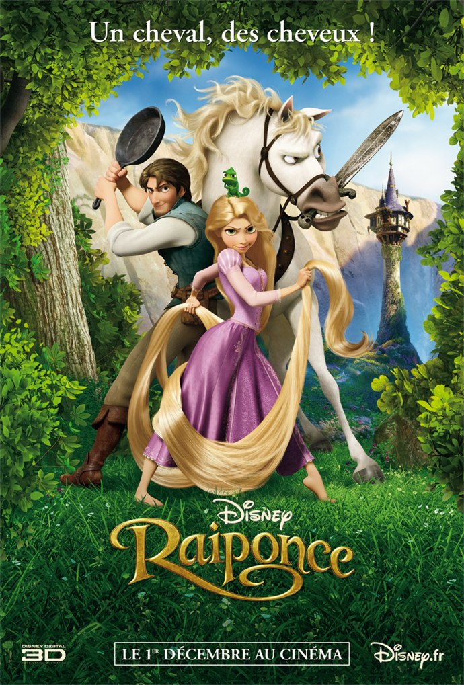
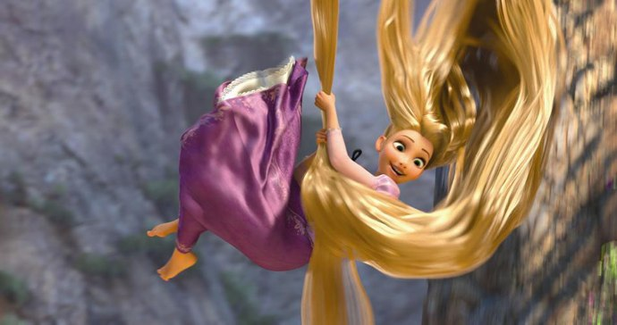
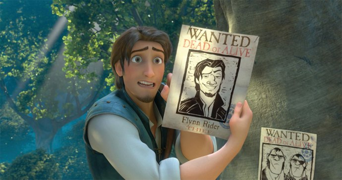

+++
type = "post"
titre = "<em>Raiponce</em>, Byron Howard et Nathan Greno"
title = "Raiponce, Byron Howard et Nathan Greno"
url = "/raiponce-disney"
date = "2010-12-05T00:00:47"
Lastmod = "2014-01-17T23:31:03"
cover = "disney-raiponce-tangled.jpg"
categorie = [ "À voir" ]
tag = [ "Amour", "Animation", "Conte", "Famille", "Vite oublié" ]
createur = [ "Byron Howard", "Nathan Greno", "Walt Disney" ]
annee = [ "2010" ]
weight = 2010
saga = [ "Classiques d'animation Disney" ]
pays = [ "États-Unis" ]
original = "Tangled"

+++

Au début de l&rsquo;année, Walt Disney créait la surprise avec <em><a href="http://voiretmanger.fr/2010/02/21/princesse-grenouille-walt-disney/">La Princesse et la Grenouille</a></em>, film d&rsquo;animation à l&rsquo;ancienne qui reprenait les vieilles recettes pour mieux les détourner. Un pari qui se révélait plutôt payant et qui m&rsquo;a poussé à voir le Disney de Noël. Pour son cinquantième long-métrage, le studio a décidé de revenir aux classiques en adaptant à nouveau un <a href="http://fr.wikipedia.org/wiki/Raiponce_(conte)">conte</a> des frères Grimm. <em>Raiponce</em> est donc un conte de princesse à l&rsquo;ancienne… sauf que <em>Shrek</em> est passé par là et la série à définitivement changé le conte. Walt Disney s&rsquo;est donc adapté, piochant certes du côté des studios Dreamworks, mais aussi beaucoup du côté de Pixar. Le résultat est plaisant, même s&rsquo;il est aussi assez convenu.

Raiponce est le prénom d&rsquo;une jeune princesse enlevée de ses parents par une vieille femme un peu sorcière qui veut l&rsquo;utiliser pour conserver la jeunesse éternelle. C&rsquo;est que raiponce est aussi le nom d&rsquo;une <a href="http://fr.wikipedia.org/wiki/Raiponce_(plante)">plante</a> et dans la mythologie de ce conte, c&rsquo;est une plante née d&rsquo;une goutte du soleil. Cette origine solaire lui confère des possibilités étonnantes, comme le rajeunissement ou encore la guérison de toutes les maladies, même les plus incurables. Or justement, la reine se meurt alors qu&rsquo;elle arrive au terme de sa grossesse : le roi, désespéré, bat ses campagnes à la recherche du remède miracle et trouve cette plante qui guérit effectivement la reine. La princesse qui nait peu après a des cheveux déjà longs à la naissance et très blonds : la sorcière comprend bien vite que la magie de la plante s&rsquo;est logée dans les cheveux de la jeune fille et qu&rsquo;il faut des cheveux vivants pour que cela fonctionne. Dès lors, ne s&rsquo;embarrassant pas trop avec les détails, elle vole le poupon à ses parents et l&rsquo;enferme dans une très haute tour inaccessible sans passer par une fenêtre tout en haut. Le film commence vraiment quand la belle a 18 ans et 20 mètres de chevelure. Elle veut sortir de sa tour, découvrir le monde, ce que sa mère adoptive refuse catégoriquement. C&rsquo;est alors que débarque un charmant jeune homme, chose que la jeune Raiponce ne peut pas connaître, n&rsquo;ayant jamais connu que sa mère et Pascal, un caméléon. Mais passée la surprise à base de coups de poêles, la jeune fille commence à trouver le jeune homme charmant et le coup de foudre ne tarde guère, même si ni l&rsquo;un ni l&rsquo;autre n&rsquo;osent se l&rsquo;avouer avant la toute fin, bien évidemment.

Comme <em>La Princesse et la grenouille</em> avant lui, <em>Raiponce</em> s&rsquo;inspire des codes du conte de princesse pour mieux les détourner. Ainsi, il y a bien une princesse (catégorie qui s&rsquo;ignore princesse) et il y a bien un prince charmant, même si ses parents n&rsquo;ont jamais porté la couronne. Il y a aussi une sorcière maléfique, une tour isolée et donc relativement inaccessible, un magnifique château perché sur une colline, des méchants, des gentils… mais tout cela évoque plus l&rsquo;accessoire parodique de contes de princesse, qu&rsquo;un vrai conte. Faire un conte au premier degré n&rsquo;est plus possible aujourd&rsquo;hui, et ce Disney ne ressemble en rien aux premiers contes adaptés par le studio, que ce soit <em>Blanche-Neige et les Sept Nains</em>, <em>Cendrillon</em> ou <em>La Belle au Bois Dormant</em>. Le second degré est désormais central, ne serait-ce que parce que le film part du principe que le spectateur connaît déjà les contes, n&rsquo;y croit plus vraiment et sait en tout cas à quoi s&rsquo;attendre. Bien sûr, il en faut pour tous les publics et <em>Raiponce</em> conserve un cheminement très classique, du récit des origines jusqu&rsquo;au mariage et les enfants, en passant par les nombreuses épreuves à affronter. Mais il y a plusieurs grains de sable dans cette mécanique d&rsquo;ordinaire huilée : le prince charmant est en fait un petit malfrat assez minable, séducteur hors pair conscient de son talent et qui en use allègrement. La princesse aussi est vite consciente de ses charmes, si bien que l&rsquo;on peut difficilement parler d&rsquo;amour fou suite à un coup de foudre : l&rsquo;amour qui lie les deux est finalement beaucoup plus réaliste, marqué sur la découverte mutuelle, mais c&rsquo;est aussi un amour perturbé par le fait que c&rsquo;est un conte conscient des clichés du conte. <em>Raiponce</em> n&rsquo;est pas dans la mythologie ou le merveilleux purs, le film est au contraire marqué par cette conscience de son statut de conte pour enfants.

Co-productions avec Pixar exclues, les studios Disney ont mis du temps à s&rsquo;adapter à ce nouveau genre de dessins animés qui s&rsquo;adressent autant aux enfants qu&rsquo;à leurs parents. Alors que le premier <em>Toy Story</em> sortait en 1995 et le premier <em>Shrek</em> en 2001, Walt Disney a continué de réaliser des grands dessins animés comme au bon vieux temps, à l&rsquo;image de <em>Kuzco, l&rsquo;empereur mégalo</em> (2001), <em>Lilo et Stitch</em> (2002) ou encore <em>Frère des ours</em> (2003). Le studio a mis du temps à changer et il fallut pour cela de cuisants échecs commerciaux et des réussites indéniables pour les films d&rsquo;animation réalisés avec des ordinateurs pour que le studio évolue. Par bien des aspects, <em>Raiponce</em> constitue une étape importante dans cette évolution, à la fois sur le plan technique et pour ses personnages. On a déjà évoqué quelques traits peu communs pour le prince et la princesse, signalons aussi que le film contient aussi les désormais traditionnels personnages secondaires, le plus souvent des personnages comiques. Il y a notamment le duo du cheval et du caméléon : s&rsquo;ils ne parlent pas, ils ont des attitudes souvent anthropomorphiques et sont effectivement à l&rsquo;origine de moments assez amusants dans le film. Le cheval est teigneux comme un chien de chasse et constitue une relecture intéressante du cheval du prince, d&rsquo;ordinaire plutôt une bête paisible et digne. Le souci, c&rsquo;est que <em>Raiponce</em> arrive en 2010 et que toutes ces idées ne semblent plus vraiment novatrices, mais ont plutôt un arrière-goût de déjà-vu. On pense bien sûr à <em>Shrek</em>, mais aussi aux autres animations de Dreamworks, ou à celles de Pixar. Alors que <em>La princesse et la Grenouille</em> apportait un univers original, parce que réaliste (La Nouvelle-Orléans des années 1930), <em>Raiponce</em> revient au cadre intemporel des contes et l&rsquo;histoire, inspirée assez librement de la version des frères Grimm, n&rsquo;apporte pas grand-chose et se contente de répéter les formules connues. En somme, s&rsquo;il y en a pour les enfants et leurs parents, les enfants y trouveront plus leur compte (il n&rsquo;y a qu&rsquo;à en juger à leurs bruyantes réactions, ils vivent l&rsquo;histoire à fond, sans second degré). Néanmoins, si l&rsquo;originalité manque un peu à ce cinquantième film du studio historique, on peut considérer que la nouveauté est maintenant bien digérée et que l&rsquo;on aura désormais droit à ce type de films, à mi-chemin entre les classiques des origines et les films d&rsquo;animation qui jouent la carte du second degré et de la parodie.

Cette sensation d&rsquo;une étape franchie se ressent aussi à l&rsquo;écran. <em>Raiponce</em> a été l&rsquo;occasion de <a href="http://en.wikipedia.org/wiki/Tangled#Production">choix très astucieux</a> sur le plan technique : si le film a été entièrement réalisé en images de synthèse fort utiles pour permettre une sortie 3D, l&rsquo;image conserve le style des dessins à la main, notamment pour les décors. Les films Disney avaient dans un premier temps tout bonnement abandonné les dessins à la main, mais depuis <em>La Princesse et la Grenouille</em>, entièrement réalisé à la main, on sent un retour en grâce de cette production à l&rsquo;ancienne qui avait, il est vrai, son charme. <em>Raiponce</em> est l&rsquo;affaire de compromis : les personnages sont nettement produits par ordinateur, ce qui n&rsquo;est pas très gênant d&rsquo;ailleurs tant les techniques ont évolué rapidement. Les décors ont été en partis dessinés à la main avec en ligne de mire les peintres français rococo du XVIIIe siècle et notamment <a href="http://fr.wikipedia.org/wiki/Jean_Honoré_Fragonard">Jean-Honoré Fragornard</a> qui est cité comme une source d&rsquo;inspiration. Le résultat est vraiment satisfaisant et permet à Disney de conserver sa marque de fabrique tout en bénéficiant des avantages de la numérisation. Le retour aux sources est par contre passé par un retour en force de la chanson, et c&rsquo;est vraiment insupportable. Mis à part une ou deux chansons, celle du bar notamment, elles sont toutes mièvres et inutiles… même s&rsquo;il faut reconnaître qu&rsquo;elles participent de l&rsquo;ambiance si caractéristique des films de Disney.

Pour son cinquantième film, Walt Disney a décidé de se renouveler dans la continuité. Alors que <em>La Princesse et la Grenouille</em> faisait le choix d&rsquo;une animation entièrement manuelle, <em>Raiponce</em> prend le meilleur des deux mondes pour offrir un film numérique, mais avec le cachet Disney. De même, le conte de prince et princesse est rénové tout en conservant ses bases : une bonne idée, mais qui arrive tout de même un peu tard pour ne pas penser que Disney répète un peu des schémas déjà vus ailleurs. Cela étant, <em>Raiponce</em> est indéniablement un Disney efficace, le film parfait pour les sorties ciné de Noël, un film familial qui plaira plus aux enfants qu&rsquo;à leurs parents, mais c&rsquo;est après tout le but.

Avis plutôt positifs chez mes confrères, même si certains, comme <a href="http://myscreens.fr/2010/cinema/raiponce-critique/">Frédérik</a>, rejoignent mon avis sur le manque d&rsquo;originalité de la relecture du conte. <a href="http://www.filmosphere.com/2010/11/critique-raiponce-tangled-2010/">Nicolas</a> de son côté regrette la niaiserie du film effectivement plus dédié aux jeunes. <a href="http://feedproxy.google.com/~r/UneSemaineUnChapitre/~3/xMP15g_92is/index.php">Ariane</a> a apprécié la réunion de Pixar (pour l&rsquo;animation numérique) et de Disney (pour le style). Je dois m&rsquo;avouer surpris par la critique traditionnelle, étonnamment positive sur ce film somme toute assez convenu.

<h3>Vous voulez m&rsquo;aider ?<a href="#footnote_0_4313" id="identifier_0_4313" class="footnote-link footnote-identifier-link" title="&Agrave; propos de la publicit&eacute;&hellip;">1</a></h3>
<ul>
<li><a href="http://www.amazon.fr/gp/product/B004CR4NW8/ref=as_li_ss_tl?ie=UTF8&amp;tag=leblogdenic07-21&amp;linkCode=as2&amp;camp=1642&amp;creative=19458&amp;creativeASIN=B004CR4NW8">Acheter le film en Blu-Ray sur Amazon</a></li>
<li><a href="http://www.amazon.fr/gp/product/B004CR4NV4/ref=as_li_ss_tl?ie=UTF8&amp;tag=leblogdenic07-21&amp;linkCode=as2&amp;camp=1642&amp;creative=19458&amp;creativeASIN=B004CR4NV4">Acheter le film en DVD sur Amazon</a></li>
<li><a href="http://itunes.apple.com/fr/movie/raiponce/id413616468">Acheter ou louer le film sur l&rsquo;iTunes Store</a></li>
</ul>

<ol class="footnotes"><li id="footnote_0_4313" class="footnote"><a href="http://voiretmanger.fr/a-propos/publicite/">À propos de la publicité…</a> [<a href="#identifier_0_4313" class="footnote-link footnote-back-link">&#8617;</a>]</li></ol>
