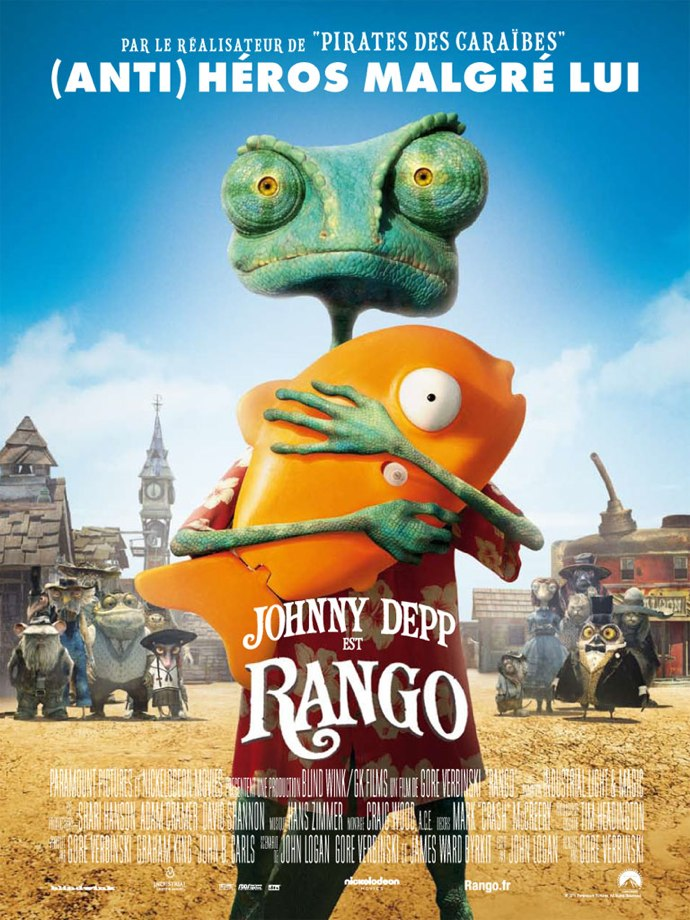
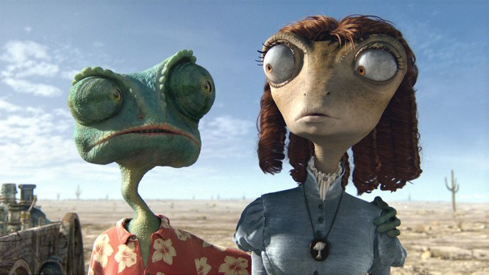
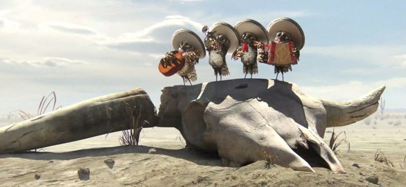

+++
type = "post"
titre = "Rango, Gore Verbinski"
title = "Rango, Gore Verbinski"
url = "/rango-verbinski"
date = "2011-03-24T00:11:29"
Lastmod = "2012-06-23T09:16:52"
cover = "johnny-depp-rango.jpg"
categorie = [ "À voir" ]
tag = [ "Animation", "Humour", "Parodie", "Western" ]
createur = [ "Gore Verbinski" ]
acteur = [ "Johnny Depp" ]
annee = [ "2011" ]
weight = 2011
pays = [ "États-Unis" ]

+++

Le projet date, dit-on, d&rsquo;avant la saga <em>Pirates des Caraïbes</em>. Gore Verbinksi est devenu maître du monde avec le succès de ses pirates et il a enfin pu mener à bien <em>Rango</em>, un film d&rsquo;animation parodie du western spaghetti. Le résultat est réjouissant, un film survolté et un peu fourre-tout, une parodie réjouissante et drôle. À voir, surtout pour les grands.

Rango est un lézard de compagnie qui vit dans son aquarium. Loin de l&rsquo;insouciance paisible associée en général à un lézard de compagnie, il connaît le doute sur sa personne et son rôle dans la vie. Il s&rsquo;imagine être un vrai héros, mais il se contente d&rsquo;imiter les héros avec une poupée Barbie décapitée et un poisson mécanique jaune. C&rsquo;est alors qu&rsquo;un grand choc perturbe littéralement sa vie en le projetant dans le terrible désert de l&rsquo;ouest des États-Unis. Notre pauvre lézard a un peu de mal à s&rsquo;adapter aux conditions terribles du lieu et manque vite de la ressource la plus rare dans ce désert, l&rsquo;eau. Il finit par tomber sur Dust, une ville qui se délite faute d&rsquo;eau et qui accueille cet étrange lézard avec sa chemise à fleurs comme un héros capable de ramener l&rsquo;eau, et donc la vie, dans la ville. Bien malgré lui, Rango va devoir assumer son ambition de héros et affronter, comme il se doit, mille dangers.

L&rsquo;intrigue est convenue, mais elle importe de toute manière peu dans <em>Rango</em>. L&rsquo;enjeu, à savoir Rango va-t-il réussir à ramener de l&rsquo;eau à Dust ?, n&rsquo;est pas très important, le film n&rsquo;est pas marqué par un suspense insoutenable et on s&rsquo;en fiche de toute façon. L&rsquo;essentiel est ailleurs, dans les méandres du récit et dans son formidable anti-héros. La formule est là encore classique, mais elle fonctionne très bien dans ce film d&rsquo;animation. L&rsquo;entrée dans le saloon est un modèle du genre, la frêle créature verte est visiblement inadaptée à l&rsquo;environnement hostile du lieu et aux diverses bestioles qui le fréquentent. Rango est l&rsquo;archétype du héros par erreur, du genre qui tire une balle au mauvais endroit, mais qui parvient à tuer un aigle deux fois plus haut que lui par un ricochet de balle bien placé. Ou qui réussit <em>in fine</em> ce que personne dans la ville n&rsquo;avait réussi, un peu par hasard et par (mal)chance. Rango est la source principale de l&rsquo;humour dans <em>Rango</em> et on sent que son interprète original, Johnny Depp (comme ne manque pas de le rappeler, de manière bien visible, l&rsquo;affiche…) s&rsquo;en est donné à cœur joie. On sait que l&rsquo;acteur aime cabotiner, il a su le prouver dans le troisième opus de <em>Pirate des Caraïbes</em>, et il en fait des tonnes ici, ce qui s&rsquo;avère très efficace. D&rsquo;ailleurs, à condition de voir <em>Rango</em> en version originale bien sûr, on pourrait voir l&rsquo;acteur jouer à la place de son personnage animé tellement son interprétation est vivante.

La deuxième source d&rsquo;humour de <em>Rango</em>, et non la moindre, est la parodie de western et en particulier de western spaghetti. La référence est sensible sitôt le lézard posé dans le terrible désert plein de cactus. Elle devient évidente quand Rango arrive à Dust : tout y est, la longue rue poussiéreuse pour les duels, les bicoques en bois de part et d&rsquo;autre, le saloon miteux où l&rsquo;on boit et joue aux cartes, la prison et son shérif… Il y a aussi les bandes armées, les règlements de compte, et même un groupe de musique hispanique, en l&rsquo;occurrence quatre hiboux hilarants. Mais les références sont beaucoup plus précises puisque Gore Verbinski s&rsquo;est amusé à reprendre des scènes ou des éléments significatifs de célèbres westerns. On reconnaît ainsi le couinement des pales d&rsquo;<em><a href="/2010/08/01/il-etait-une-fois-dans-ouest-leone/">Il était une fois dans l&rsquo;ouest</a></em>, mais <em>Rango</em> reprend aussi la musique si typique de ce cinéma (Ennio Morricone), des scènes typiques de cinéma (l&rsquo;arrivée dans la ville avec le sable qui vole)… Le film tout entier est une sorte d&rsquo;hommage au genre, même s&rsquo;il est constamment détourné ou mêlé d&rsquo;autres genres. <em>Rango</em> ne se contente pas de reprendre les westerns, il puise également ailleurs, notamment dans la saga <em>Pirates des Caraïbes</em> (on ne change pas une équipe qui gagne), par exemple en reprenant la scène du troisième où Jack Sparrow se fait transporter par des crabes blancs, mais aussi à d&rsquo;autres films comme <em>Indiana Jones</em> ou encore <em>Apocalypse Now</em> (même si utiliser les <em>Walkyries</em> était déjà une parodie chez Coppola). Le procédé est vu et revu, mais il est bien mené et efficace dans <em>Rango</em> et s&rsquo;avère plaisant.

L&rsquo;humour aurait été bien différent si <em>Rango</em> n&rsquo;avait pas été un film d&rsquo;animation. C&rsquo;est le premier film d&rsquo;animation de Gore Verbinski, mais aussi le premier film d&rsquo;animation pour ILM, la prestigieuse société d&rsquo;effets spéciaux de George Lucas qui a accepté de mettre à profit son talent sur ce film. Disons-le, le résultat est bluffant : <em>Rango</em> dispose d&rsquo;un univers personnel très marqué avec des personnages hauts en couleur très réussis. Les concepteurs du film ont réussi à créer des personnalités très différentes, avec un ton très adulte. Qu&rsquo;on se le dise, si <em>Rango</em> est un présenté comme un film tout public, il vaut mieux y aller sans les enfants. Les personnages sont tous des animaux, mais le chat n&rsquo;est pas le chaton à sa mémé, plutôt un animal sale, aux poils hirsutes, le corps parcouru de cicatrices. Ces animaux seront très impressionnants pour les plus jeunes, qui risquent de ne pas trouver le film drôle du tout, d&rsquo;autant que le second degré et les clins d&rsquo;œil leur sont rarement accessibles. Mais si ses personnages ne sont pas réalistes, les décors de <em>Rango</em> le sont totalement au contraire, à tel point que l&rsquo;on a souvent le sentiment de voir un vrai film. Le résultat est vraiment réussi, à la hauteur de ce qu&rsquo;un Pixar peut offrir. Ne terminons pas cette critique sans évoquer la bande originale composée par l&rsquo;incontournable Hans Zimmer qui fait, une fois n&rsquo;est pas coutume, preuve d&rsquo;originalité. Il compose une musique jamais sobre (Zimmer reste Zimmer), mais sans orchestre symphonique et armada de violons, avec des banjos, un accordéon ou des claquettes. Le résultat est très plaisant.

<em>Rango</em> est un projet assez improbable sur le papier, mais une agréable surprise à l&rsquo;arrivée. Certes, le film d&rsquo;animation de Gore Verbinski ne brille pas par son originalité, mais il est très efficace, drôle et adulte, un vrai divertissement en somme. Les amateurs de westerns spaghetti apprécieront les clins d&rsquo;œil appuyés, les autres pourront retrouver avec plaisir la voix de Johnny Depp. Après la saga <em>Pirate des Caraïbes</em>, Gore Verbinski prouve qu&rsquo;il est capable de faire tout autre chose, et le résultat est réussi.

<h3>Vous voulez m&rsquo;aider ?<a href="#footnote_0_4671" id="identifier_0_4671" class="footnote-link footnote-identifier-link" title="&Agrave; propos de la publicit&eacute;&hellip;">1</a></h3>
<ul>
<li><a href="http://www.amazon.fr/gp/product/B004XBJFN0/ref=as_li_ss_tl?ie=UTF8&tag=leblogdenic07-21&linkCode=as2&camp=1642&creative=19458&creativeASIN=B004XBJFN0">Acheter le film en Blu-Ray et DVD sur Amazon</a></li>
<li><a href="http://www.amazon.fr/gp/product/B004XBJFLW/ref=as_li_ss_tl?ie=UTF8&tag=leblogdenic07-21&linkCode=as2&camp=1642&creative=19458&creativeASIN=B004XBJFLW">Acheter le film en DVD sur Amazon</a></li>
<li><a href="http://itunes.apple.com/fr/movie/rango-2011/id431023352">Acheter le film sur l&rsquo;iTunes Store</a></li>
</ul>

<ol class="footnotes"><li id="footnote_0_4671" class="footnote"><a href="/soutien/">À propos de la publicité…</a> [<a href="#identifier_0_4671" class="footnote-link footnote-back-link">&#8617;</a>]</li></ol>
