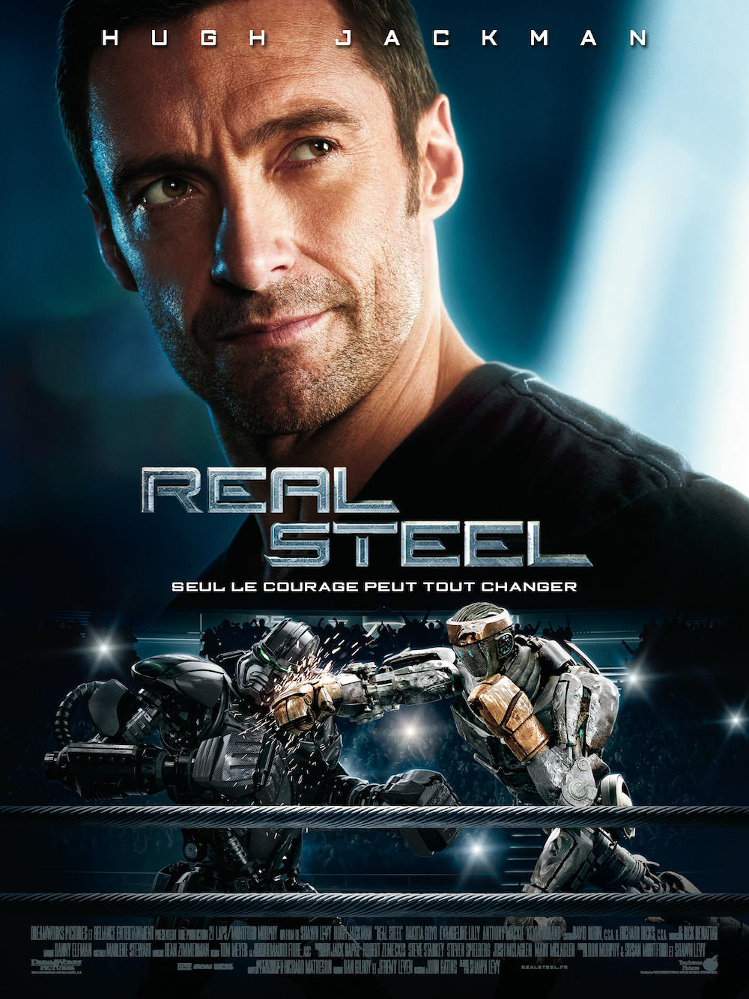
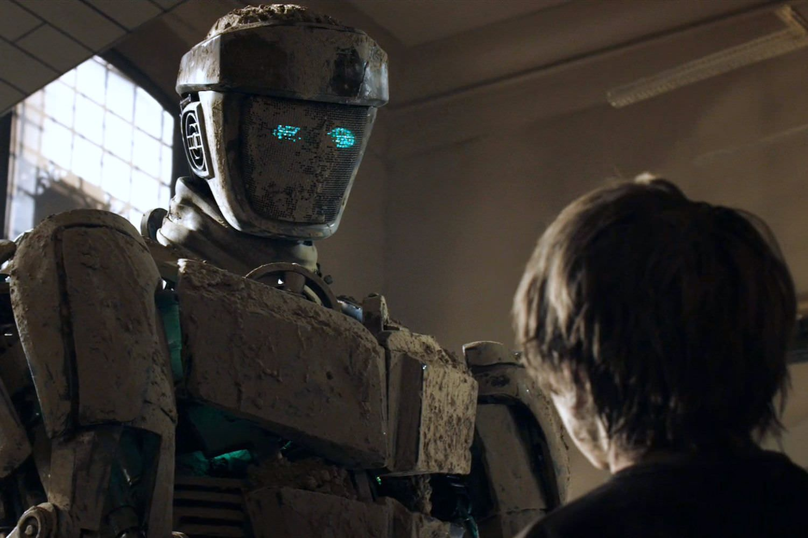

+++
type = "post"
titre = "<em>Real Steel</em>, Shawn Levy"
title = "Real Steel, Shawn Levy"
url = "/real-steel-levy"
date = "2013-10-26T16:29:54"
Lastmod = "2013-10-26T16:39:13"
cover = "real-steel-shawn-levy.jpg"
categorie = [ "À voir" ]
tag = [ "Adaptation littéraire", "Blockbuster", "Boxe", "Famille", "Robot", "Science-Fiction", "Vite oublié" ]
createur = [ "Shawn Levy" ]
acteur = [ "Dakota Goyo", "Evangeline Lilly", "Hugh Jackman" ]
annee = [ "2011" ]
weight = 2011
pays = [ "États-Unis" ]

+++

<em>Real Steel</em> est un film de boxe dans la plus grande tradition du genre côté scénario, mais renouvelé par une idée plutôt originale. L’action se déroule dans un futur proche où des robots ont remplacé les humains sur le ring. Shawn Levy exploite cette bonne idée autour d’un personnage de looser qui va évoluer pendant le film, bien évidemment. L’idée de départ mise à part, ce long-métrage est calibré comme il faut et n’a strictement aucune originalité, mais il fait preuve d’une certaine efficacité. À défaut d’être très fin ou très malin, <em>Real Steel</em> assure le spectacle, sans plus…

Avide de spectaculaire et de violences, le public a peu à peu délaissé les humains. Les combats de robots ont rapidement pris le dessus : plus impressionnants, ces monstres d’acier peuvent s’entretuer sans problème, ils ne souffrent pas et sont conçus pour se battre. <em>Real Steel</em> suit les pas de Charlie Kenton, un boxeur mis à la retraite par cette nouvelle tendance. À la fin des années 2000, il a connu la gloire grâce à ses talents, mais le public voulait des robots et il a été contraint de se reconvertir. La boxe par robots interposée n’a pas grand-chose à voir toutefois et Shawn Levy commence son film en nous montrant le looser qu’il est devenu. Autrefois gloire en une des journaux, l’homme survit comme il peu avec des robots de bric et de broc assez minables et des défis encore pires. Le cinéaste ouvre le long-métrage avec une séquence pathétique où Charlie fait affronter son robot à un taureau et perd parce qu’il a détourné deux secondes le regard vers une fille. Avec un tel début, <em>Real Steel</em> annonce forcément une suite différente et cela ne rate pas : la rencontre de Charlie avec Max, le fils qu’il a abandonné à la naissance, bouleverse notre homme et lui permet de revenir sur le devant de la scène. On ne dévoile rien en écrivant cela, le film de Shawn Levy est cousu de fil blanc et le scénario type est suivi scrupuleusement, de la première à la dernière minute. C’est la première limite de ce blockbuster attendu qui ne fait rien pour déjouer les attentes de ses spectateurs, mais c’est aussi son avantage. Débarrassé de tout enjeu scénaristique, il peut être apprécié pour ce qu’il est : un pur divertissement.

« <em>Seul le courage peut tout changer</em> » clame l’affiche. On aurait aimé que le scénariste s’en inspire pour éviter tous les écueils du genre, mais ce n’est malheureusement pas le cas. <em>Real Steel</em> est un blockbuster de divertissement qui n’assume pas ce statut jusqu’au bout. Le film commence pourtant plutôt bien : dans une première partie, tant que le père et le fils ne sont pas réconciliés, Shawn Levy tourne quelques séquences gonflées, assez amorales, où les deux personnages s’envoient mutuellement des vannes. Tant que Charlie n’assume absolument pas son statut de père, n’hésitant pas à vendre son fils pour 100 000 $ avec la promesse de s’en occuper pendant les vacances, on apprécie plutôt bien le ton du long-métrage. C’est relativement incisif et Hugh Jackman est à l’aise dans ce rôle du mauvais père, tandis que Dakota Goyo compose un garçon de 11 ans très mature assez convaincant. Sans être époustouflante, cette partie est plutôt fun et on apprécie l’univers robotisé et les quelques touches discrètes de science-fiction. Hélas, <em>Real Steel</em> bascule vite pour revenir sur le droit chemin de la morale. Sans surprise, Charlie finit par tomber sous le charme de son fils et ce dernier essaie de redonner à son père la passion du sport. Les séquences de boxe en robot restent plutôt réussies, mais l’ensemble est un peu gâché par des séquences guimauves et par une musique envahissante et caricaturale. On a connu Danny Elfman plus inspiré, il a manifestement offert son service minimum sur ce projet.

Sans être tout à fait déplaisant, <em>Real Steel</em> n’est pas une réussite pour autant. Le blockbuster commence de manière surprenante, mais Shawn Levy ne résiste pas longtemps à l’attraction de la morale et le retour du film dans le droit chemin est caricatural et sans intérêt. On apprécie les séquences de combats robotisés, mais l’ensemble s’oublie vite, très vite…

<h3>Vous voulez m&rsquo;aider ?<a href="#footnote_0_10445" id="identifier_0_10445" class="footnote-link footnote-identifier-link" title="&Agrave; propos de la publicit&eacute;&hellip;">1</a></h3>
<ul>
<li><a href="http://www.amazon.fr/gp/product/B005NH6U1S/ref=as_li_ss_tl?ie=UTF8&tag=leblogdenic07-21&linkCode=as2&camp=1642&creative=19458&creativeASIN=B005NH6U1S">Acheter le film en Blu-Ray sur Amazon</a></li>
<li><a href="http://www.amazon.fr/gp/product/B005NH6TXW/ref=as_li_ss_tl?ie=UTF8&tag=leblogdenic07-21&linkCode=as2&camp=1642&creative=19458&creativeASIN=B005NH6TXW">Acheter le film en DVD sur Amazon</a></li>
<li><a href="https://itunes.apple.com/fr/movie/real-steel/id492434096">Acheter ou louer le film sur l&rsquo;iTunes Store</a></li>
</ul>

<ol class="footnotes"><li id="footnote_0_10445" class="footnote"><a href="/soutien/">À propos de la publicité…</a> [<a href="#identifier_0_10445" class="footnote-link footnote-back-link">&#8617;</a>]</li></ol>
