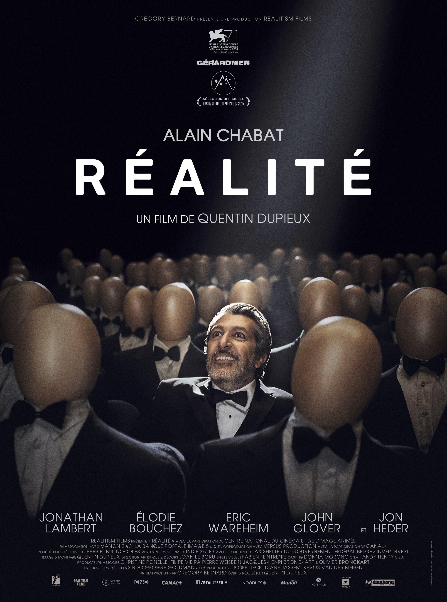
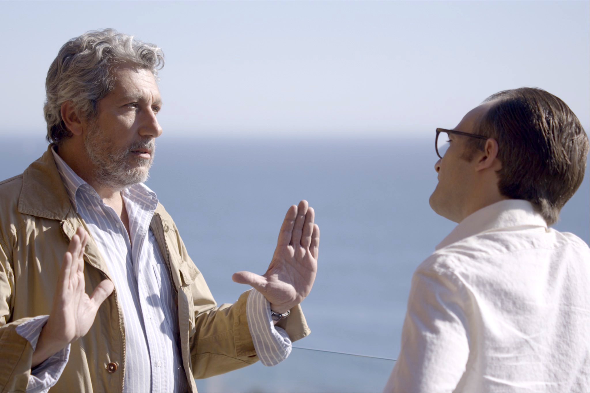

+++
titre = "<em>Réalité</em>, Quentin Dupieux"
title = "Réalité, Quentin Dupieux"
url = "/realite-dupieux"
date = "2015-02-20T00:20:18"
Lastmod = "2015-02-20T00:25:20"
cover = "realite-alain-chabat.jpg"
categorie = [ "À voir" ]
tag = [ "Absurde", "Fantastique", "Folie", "Humour", "Metafilm", "Rêve", "Sorties du mois" ]
createur = [ "Quentin Dupieux" ]
acteur = [ "Alain Chabat", "Élodie Bouchez", "Eric Wareheim", "Jonathan Lambert", "Kyla Kenedy" ]
annee = [ "2015" ]
weight = 2015
pays = [ "Belgique", "France" ]

+++

Quand Quentin Dupieux sort un film nommé <em>Réalité</em>, on se doute bien qu&rsquo;il y aura un problème quelque part. De fait, la réalité est une notion très relative dans le dernier long-métrage du cinéaste et si l&rsquo;on cherche un film cohérent, on en sera pour ses frais, comme toujours. Quentin Dupieux, qui a quand même été capable de créer un film entier sur un pneu serial-killer avec <a href="http://voiretmanger.fr/rubber-dupieux/" title="Rubber, Quentin Dupieux"><em>Rubber</em></a>, n&rsquo;a pourtant jamais été aussi cohérent. À cet égard, <em>Réalité</em> est presque un film grand public, c&rsquo;est en tout cas une œuvre parfaitement cohérente et surtout extrêmement plaisante. À ne pas rater, à condition du moins d&rsquo;accepter de lâcher prise et de ne pas chercher à tout comprendre.

<em>Réalité</em> commence comme un film tout à fait normal, avec une intrigue parfaitement compréhensible qui se met en place progressivement. Certes, il y a déjà quelques éléments étonnants — ce présentateur d&rsquo;une émission culinaire avec un costume de rongeur, ce sanglier tué avec une VHS dans les intestins, le producteur qui se contredit en permanence… —, mais on reste à peu près dans la normalité. On suit ainsi Jason, caméraman qui veut se reconvertir dans le cinéma et qui apporte à Bob, un producteur de renom, son idée de film. Nommé <em>Waves</em>, ce projet assez loufoque envisage un scénario de science-fiction où les télévisions prennent le pouvoir et tuent tous les humains. Ces débuts assez normaux ne sont toutefois qu&rsquo;une apparence, et la folie habituelle de Quentin Dupieux reprend vite le dessus. De manière assez subtile, le cinéaste introduit des éléments qui ne devraient pas exister, sans donner d&rsquo;explications. Fidèle à la réputation de son concepteur, <em>Réalité</em> est un long-métrage absurde, mais qui prend son absurdité très au sérieux. Si l&rsquo;on adhère, on le trouvera très drôle, avec quelques moments vraiment hilarants, mais il ne s&rsquo;agit pas à proprement parler d&rsquo;une comédie. On est plus proche du <em>nonsense</em> à l&rsquo;anglaise, avec un sérieux que n&rsquo;auraient pas renié les Monty Python, par exemple. Pour cette raison, quand l&rsquo;histoire commence à déraper, on ne comprend pas ce qui se passe, d&rsquo;autant que le scénario donne longtemps des justifications rationnelles qui paraissent, un temps, crédibles.

Dans un premier temps au moins, <em>Réalité</em> justifie ses accès de folie par des raisons plus ou moins logiques. Cet homme travesti qui roule en jeep et amène des fleurs à un vieux, avant de les jeter par terre en disant qu&rsquo;il n&rsquo;en avait rien à faire ? Un rêve, détaillé et justifié le lendemain par l&rsquo;homme en question avec sa psy. Cette petite fille qui trouve une VHS bleue dans le ventre d&rsquo;un sanglier ? Un tournage de film. Les amateurs de récits au premier degré seront vite déçus pourtant : si on peut expliquer une scène en disant que c&rsquo;est un rêve, comment se fait-il qu&rsquo;un autre personnage, présent dans le rêve, le mentionne dans ce qui est censé être la réalité ? Très vite, les situations s&rsquo;entremêlent jusqu&rsquo;à former un ensemble totalement incohérent : Jason a une idée de film… qu&rsquo;il retrouve à l&rsquo;identique dans une salle de cinéma. Son film a-t-il été déjà tourné ? Ce n&rsquo;est pas possible, il n&rsquo;a même pas écrit son scénario et cherche encore son cri, le plus grand cri de l&rsquo;histoire du cinéma. On finit par ne plus rien y comprendre et d&rsquo;ailleurs, toutes les histoires lancées initialement en parallèle finissent toutes par se croiser de manière totalement absurde… du moins en apparence. Car, c&rsquo;est bien là le tour de force de <em>Réalité</em>, tout n&rsquo;est pas aussi stupide qu&rsquo;on pourrait le croire. Contrairement à certaines de ses anciennes productions, Quentin Dupieux n&rsquo;a pas, cette fois, qu&rsquo;une idée qu&rsquo;il lance un peu au hasard, et qu&rsquo;il ne peut pas forcément porter assez loin pour tenir la distance. Non, son scénario est pour une fois extrêmement bien construit et on peut tout à fait le reconstituer avec une vision attentive. Le récit avance avec des cercles et des univers parallèles qui finissent par se rejoindre et derrière la cacophonie générale, on peut <em>in fine</em> découvrir un ordre savamment orchestré. Une belle prouesse, qui permet au film de tenir la distance.

Pour que <em>Réalité</em> puisse faire rire, il faut qu&rsquo;il soit le plus sérieux possible. Pour cela, Quentin Dupieux peut compter sur ses acteurs, qui sont tous excellents. On retiendra surtout la prestation impressionnante d&rsquo;Alain Chabat, parfait dans un rôle absurde interprété précisément comme il fallait, mais ce n&rsquo;est pas la seule réussite. Jonathan Lambert en producteur capricieux est, lui aussi, excellent et tous les autres rôles secondaires ont eux aussi le sérieux nécessaire. Au total, c&rsquo;est bien la cohérence du projet qui frappe : <em>Réalité</em> n&rsquo;est pas qu&rsquo;une blague potache qui amuse quelques minutes, c&rsquo;est un film très drôle de bout en bout. Et un long-métrage qui n&rsquo;est, en plus, pas si stupide qu&rsquo;il n&rsquo;en a l&rsquo;air. Si une pointe d&rsquo;absurdité ne vous fait pas fuir, vous auriez tort de rater cette réalité…

