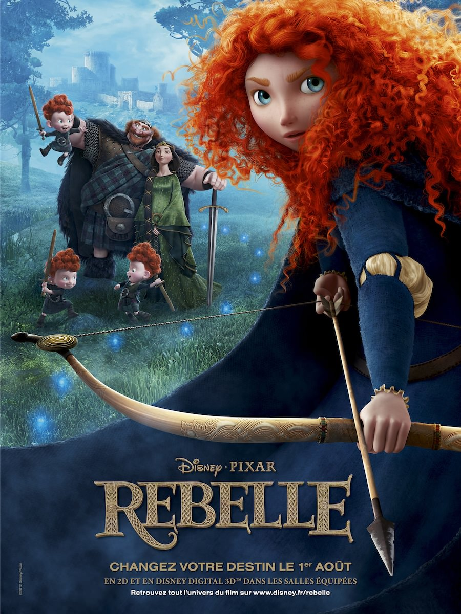
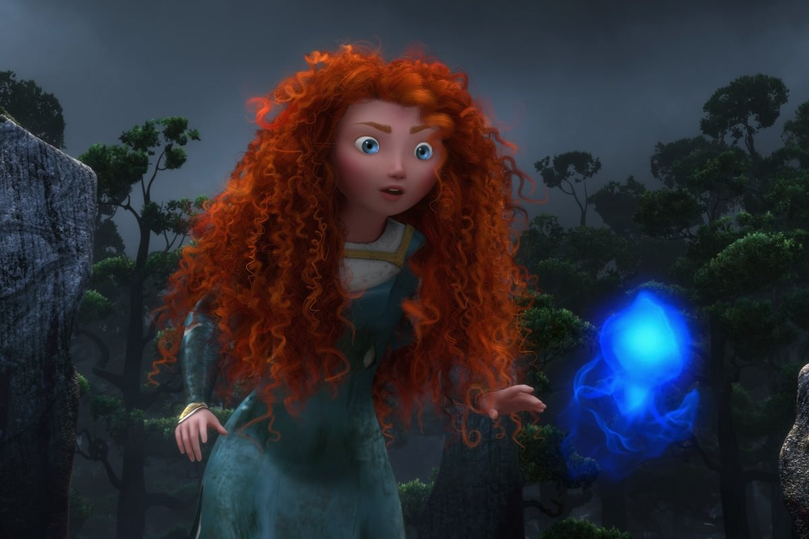
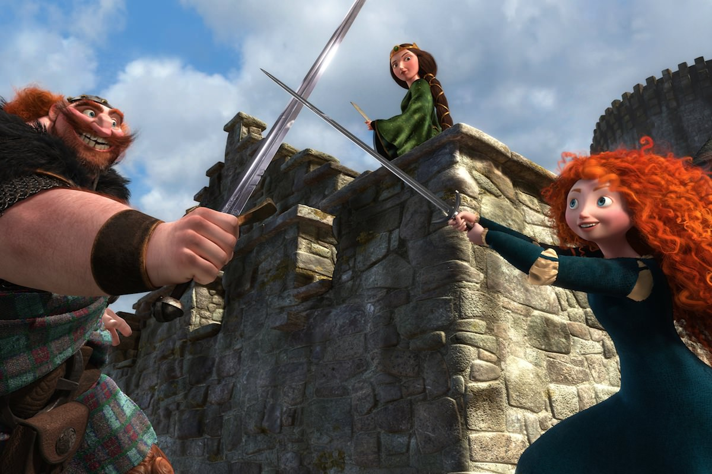

+++
type = "post"
titre = "<em>Rebelle</em>, Mark Andrews et Brenda Chapman"
title = "Rebelle, Mark Andrews et Brenda Chapman"
url = "/rebelle-andrews-chapman"
date = "2012-08-05T02:20:24"
Lastmod = "2014-10-03T10:33:12"
cover = "rebelle-brave-pixar.jpg"
categorie = [ "À voir" ]
tag = [ "Adolescence", "Animation", "Apprentissage", "Blockbuster", "Famille", "Fantastique", "Mythe", "Société" ]
createur = [ "Brenda Chapman", "Mark Andrews", "Pixar" ]
annee = [ "2012" ]
weight = 2012
pays = [ "États-Unis" ]

+++

Tous les étés, Pixar nous gratifie d&rsquo;un nouveau film et le studio a très rarement déçu depuis la sortie du premier <em>Toy Story</em> en 1995. Cette année, <em>Rebelle</em> nous emmène en Écosse pour nous parler de l&rsquo;histoire d&rsquo;une princesse qui doit rencontrer ses prétendants au mariage. À la lecture de ce résumé très rapide, Pixar semble avoir rendu les armes face à Disney… ce serait conclure un peu trop vite. Derrière cette apparente histoire de princesse et de prince charmant se cache en fait un univers détraqué plus adulte et surtout plus proche de l&rsquo;univers du scénario. Sans atteindre le niveau des meilleurs films du studio, <em>Rebelle</em> est un film divertissant et plus original qu&rsquo;il n&rsquo;y paraît…

Mérida est une princesse. Elle ne l&rsquo;a pas spécialement voulu, mais elle est la fille du roi Fergus et de la reine Elinor… elle n&rsquo;a pas vraiment le choix. D&rsquo;ailleurs, la jeune fille est en âge de se marier et dans les Highlands écossais, son mariage est essentiel. Son père a réussi à restaurer la paix sur le royaume en unissant trois clans et la main de sa fille doit renforcer et assurer cette pacification. Chaque clan présente ainsi son prétendant, mais Mérida ne se sent pas prête du tout à se marier. La jeune fille préfère partir sur son cheval avec son arc, mais elle arrive à un âge où ce n&rsquo;est plus possible, comme sa mère ne manque pas de le lui rappeler à chaque fois qu&rsquo;elle en a l&rsquo;occasion. &laquo;&nbsp;Fais pas ci, fais pas ça…&nbsp;&raquo; : la rengaine maternelle commence à énerver sérieusement l&rsquo;adolescente, si bien que Mérida n&rsquo;hésite pas à demander un sortilège pour changer sa mère quand elle croise le chemin d&rsquo;une sorcière. Sans hésiter, elle fait avaler à sa mère la potion magique, mais les changements espérés ne sont pas tout à fait ceux qui surviennent…

En apparence, <em>Rebelle</em> a tout de l&rsquo;énième conte de la princesse et de son prince charmant. Les ingrédients sont là : il y a une belle princesse, un roi et une reine, un château fort, non pas un, mais trois princes charmants, il y a aussi une sorcière, une quête à réaliser dans un temps imparti. Tout est là, mais dès le départ Pixar surprend avec un film qui semble bien trop réaliste pour un conte. La séquence d&rsquo;ouverture adopte d&rsquo;emblée un ton qui tranche avec les films traditionnels de Disney qui ont le plus contribué au genre. Cette ouverture plus grave et adulte donne le ton, la suite de <em>Rebelle</em> ne fait que le confirmer : le conte traditionnel est à nouveau détourné et caricaturé. Le père de Mérida par exemple n&rsquo;est pas l&rsquo;homme grave et sérieux que l&rsquo;on attendait, mais au contraire le plaisantin de la famille qui encourage constamment sa fille et qui se fait en permanence réprimander par sa femme. La caricature est indéniablement présente et Mark Andrews et Brenda Chapman exploitent en partie un filon que Disney avait déjà exploité avec <a title="Raiponce, Walt Disney" href="http://voiretmanger.fr/2010/12/05/raiponce-disney/"><em>Raiponce</em></a>, après la saga <em>Shrek</em> bien sûr. Cet aspect comique est assez réussi et le film parvient à faire rire à plusieurs reprises, mais il ne s&rsquo;agit pas que d&rsquo;une banale comédie calibrée pour plaire au plus grand nombre.

La princesse de <em>Rebelle</em> diffère évidemment avec les clichés et conventions du genre : le cheveu épars et particulièrement roux, elle préfère chevaucher avec son arc plutôt que… d&rsquo;être simplement belle et ne rien faire. C&rsquo;est peut-être sur ce point que le film s&rsquo;éloigne le plus des contes traditionnels : dans <em>Blanche-Neige et les Sept Nains</em>, la princesse n&rsquo;a finalement aucun rôle, si ce n&rsquo;est d&rsquo;être belle et de faire quelques tâches ménagères. Mérida devrait adopter et accepter ce rôle qu&rsquo;elle n&rsquo;a pas choisi, mais que ses origines lui imposent. Elle devrait elle aussi s&rsquo;habiller avec des habits très serrés, ranger sa chevelure rousse sous une coiffe et se contenter de sourire, mais elle n&rsquo;accepte pas d&rsquo;être réduite à ce rôle de figuration. Elle préfère tirer à l&rsquo;arc, se battre… au fond elle préférerait sans doute être un homme. <em>Rebelle</em> est un conte féministe qui renverse les rôles établis dans la société, mais aussi dans le couple. Au-delà, c&rsquo;est un appel à la liberté, contre les tractions et habitudes imposées par le groupe social. Ces thèmes ne sont pas très originaux en 2012 évidemment, mais il ne faut pas oublier que <em>Rebelle</em> devait être un conte, dans ce contexte la présence de sujets de société contemporains est surprenante. C&rsquo;est aussi ce qui différencie le travail de Mark Andrews et Brenda Chapman des films de Disney : même si le Pixar 2012 semble beaucoup plus proche du travail habituel de sa maison mère que par le passé, le long-métrage conserve une certaine originalité que l&rsquo;on pourrait résumer à son ancrage dans un contexte réaliste. Certes, il y a une sorcière et des histoires d&rsquo;humains changés en ours, mais qu&rsquo;importe : <em>Rebelle</em> se déroule dans les Highlands d&rsquo;Écosse à l&rsquo;époque médiévale.

Cet ancrage dans une réalité historique et géographique se voit dès les premières images du film, et pour cause. Pixar s&rsquo;est encore une fois surpassé en créant un univers écossais bluffant pour <em>Rebelle</em>. Quand la caméra virtuelle de Mark Andrews et Brenda Chapman survole la forêt écossaise créée pour le film, on ne peut qu&rsquo;être impressionné par le photoréalisme du plan. L&rsquo;apparition des premiers personnages casse un peu l&rsquo;illusion : si le studio s&rsquo;est amélioré depuis ses derniers essais dans <a title="Là-haut, Pixar" href="http://voiretmanger.fr/2009/08/19/la-haut-pixar/"><em>Là-haut</em></a>, il lui reste encore du travail pour atteindre un résultat qui ne choque pas l&rsquo;œil humain, selon le phénomène de la <a href="http://fr.wikipedia.org/wiki/Vallée_dérangeante">vallée dérangeante</a>. Il faut reconnaître toutefois que le travail réalisé sur la chevelure du personnage principal est remarquable. Qu&rsquo;importe, on oublie très vite cet aspect technique pour mieux se concentrer sur l&rsquo;histoire et Pixar ne faiblit pas sur cet aspect. Son apparence traditionnelle ne sert qu&rsquo;à mieux nous tromper et <em>Rebelle</em> mène ses spectateurs dans une histoire pas si banale avec une fluidité jamais mise en défaut. Le divertissement reste évidemment la base du film et vous ne serez pas déçu sur ce point. Si vous le pouvez, privilégiez la version originale qui fait entendre un magnifique accent écossais ; le film perd certainement de sa saveur en VF. Dans tous les cas, il restera malgré tout l&rsquo;excellente bande originale celtique qui accompagne parfaitement bien le récit. On peut en revanche éviter la 3D, totalement inutile…

<em>Rebelle</em> n&rsquo;est pas un Pixar qui restera dans les annales, mais le studio ne peut pas faire aussi bien, voire mieux, que ses plus grands films. Fidèle à son habitude, il choisit en tout cas de nous surprendre à nouveau, cette fois-ci avec un conte en apparence traditionnel qui le rapproche de Disney. Certains n&rsquo;aimeront pas cette proximité, mais on ne peut reprocher au studio d&rsquo;animation de ne pas changer et essayer de nouvelles choses. Qu&rsquo;il plaise ou non, <em>Rebelle</em> reste indiscutablement un très bon divertissement, parfait pour les séances estivales en famille !

<h3>Vous voulez m&rsquo;aider ?<a href="#footnote_0_7240" id="identifier_0_7240" class="footnote-link footnote-identifier-link" title="&Agrave; propos de la publicit&eacute;&hellip;">1</a></h3>
<ul>
<li><a href="http://www.amazon.fr/gp/product/B008BJ07YQ/ref=as_li_ss_tl?ie=UTF8&#038;tag=leblogdenic07-21&#038;linkCode=as2&#038;camp=1642&#038;creative=19458&#038;creativeASIN=B008BJ07YQ">Acheter le film en Blu-Ray sur Amazon</a></li>
<li><a href="http://www.amazon.fr/gp/product/B008BJ07Q4/ref=as_li_ss_tl?ie=UTF8&#038;tag=leblogdenic07-21&#038;linkCode=as2&#038;camp=1642&#038;creative=19458&#038;creativeASIN=B008BJ07Q4">Acheter le film en DVD sur Amazon</a></li>
<li><a href="https://itunes.apple.com/fr/movie/rebelle/id568575429">Acheter ou louer le film sur l&rsquo;iTunes Store</a></li>
</ul>

<ol class="footnotes"><li id="footnote_0_7240" class="footnote"><a href="http://voiretmanger.fr/soutien/">À propos de la publicité…</a> [<a href="#identifier_0_7240" class="footnote-link footnote-back-link">&#8617;</a>]</li></ol>
