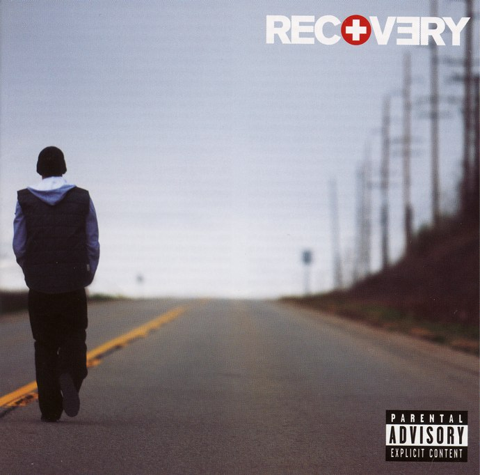
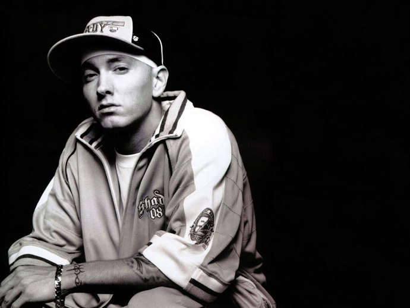

+++
type = "post"
titre = "Recovery, Eminem"
title = "Recovery, Eminem"
url = "/recovery-eminem"
date = "2010-07-07T00:01:45"
Lastmod = "2012-04-12T14:04:16"
cover = "recovery-eminem.jpg"
categorie = [ "Musique" ]
tag = [ "Mélancolie", "Rap", "Société" ]
annee = [ "2010" ]
weight = 2010
pays = [ "États-Unis" ]

+++

Après plusieurs années de silence, Eminem semble décidé à ne plus lâcher le devant de la scène. En un an et demi, il a publié deux albums plus que conséquents (1h20 chacun) et un EP. Une activité intense qui témoigne également de sa volonté de tourner la page d&rsquo;une époque marquée par la drogue. L&rsquo;an dernier, avec <em>Relapse</em>, le rappeur mettait en scène sa désintoxication. Cette année, avec <em>Recovery</em>, il passe à la convalescence et au retour à la normalité. Mais comme souvent dans la création artistique, l&rsquo;artiste est bon parce que torturé, ce qui s&rsquo;accompagne souvent d&rsquo;une forte dépendance aux drogues. Comme je l&rsquo;avais longuement évoqué dans un billet précédent sur <a href="http://voiretmanger.fr/2009/03/01/eminem-le-maitre/">le maître Eminem</a>, au sens presque des écoles picturales de la Renaissance, Eminem incarne le Mal, la perversion et un danger pour une partie de l&rsquo;opinion américaine. En trouvant la paix, il a perdu de sa vigueur artistique et ce nouvel album en est tristement la preuve. Slim Shady n&rsquo;est plus et Eminem s&rsquo;est rangé pour proposer un rap plus mainstream et beaucoup plus décevant. Restent néanmoins son flow si particulier et sa mythologie personnelle.

Un album d&rsquo;Eminem est beaucoup plus qu&rsquo;un assemblage de chansons plus ou moins réussies. C&rsquo;est une histoire que l&rsquo;on nous raconte, c&rsquo;est une pièce de théâtre qui se joue devant nous. Eminem n&rsquo;a pas son pareil pour se mettre en scène, et ce, depuis les premiers pas de Slim Shady, son double maléfique. Les morceaux chantés étaient ainsi le plus souvent entrecoupés de &laquo;&nbsp;Skit&nbsp;&raquo;, courts titres parlés, parfois avec plusieurs acteurs qui font avancer l&rsquo;intrigue de l&rsquo;album. Certains personnages récurrents offrent à l&rsquo;ensemble de sa discographie une unité jamais vue dans la musique, à ma connaissance, comme si chaque album était un chapitre supplémentaire dans la vie d&rsquo;Eminem/Shady. Symbole du changement en cours, <em>Recovery</em> ne contient aucun skit. Finies les interventions de Paul, Steve Berman ou évidemment Slim Shady, place à la musique seule. <em>Relapse</em> maintenait ce principe, si bien que cette absence est un élément fort : le rappeur indique par là que sa musique, seule, suffit encore. Sur le second titre de l&rsquo;album, Eminem l&rsquo;indique explicitement : &laquo;&nbsp;<em>My life is no longer a movie</em>&nbsp;&raquo; (&laquo;&nbsp;Ma vie n&rsquo;est plus un film&nbsp;&raquo;) qui sonne un peu comme un manifeste. Eminem a fait le ménage jusqu&rsquo;au personnage de Slim Shady qui n&rsquo;est plus présent que sous la forme de références régulières, dans les paroles.

La disparition des intermèdes parlés ne signifie pas pour autant la disparition de la narration et Eminem a toujours une vision très cinématographique de sa propre vie, quoiqu&rsquo;il puisse en dire. Chacun des 17 titres de l&rsquo;album raconte l&rsquo;histoire suivant immédiatement <em>Relapse</em> : le personnage est sorti de la cure de désintoxication et essaie de retrouver une vie normale. &laquo;&nbsp;<em>Cold Wind Blows</em>&nbsp;&raquo; qui ouvre l&rsquo;album évoque ainsi la sortie où il est &laquo;&nbsp;froid comme le vent qui souffle&nbsp;&raquo;, tandis que le second (&laquo;&nbsp;<em>Talkin&rsquo; 2 Myself</em>&laquo;&nbsp;) signale la solitude de l&rsquo;ancien drogué. Changer, voilà une idée centrale dans tout l&rsquo;album, comme l&rsquo;indique explicitement un des titres de <em>Recovery</em> (&laquo;&nbsp;<em>Going Through Changes</em>&laquo;&nbsp;). Même si le rappeur ne le dit pas, son dernier album est placé sous le signe des regrets, envers son ex-femme en partie (même chanson, vers la fin, il exprime des regrets sur la façon dont se sont déroulées sa relation puis sa séparation avec son ancienne femme ; sur &laquo;&nbsp;<em>Space Bound</em>&nbsp;&raquo; aussi ainsi que &laquo;&nbsp;<em>Love The Way You Lie</em>&nbsp;&raquo; même si la référence est implicite), mais surtout envers <a href="http://fr.wikipedia.org/wiki/Proof">Proof</a>. Une chanson entière (&laquo;&nbsp;<em>You&rsquo;re never over</em>&laquo;&nbsp;) est consacrée à ce rappeur de Detroit ami et mentor d&rsquo;Eminem qui a été assassiné en 2006 sur la fameuse route 8 Mile qui a donné son nom au film biographique sur Eminem. On savait que sa mort avait touché profondément le rappeur, mais c&rsquo;est la première fois qu&rsquo;il a l&rsquo;occasion de l&rsquo;exprimer vraiment et son hommage assez classique sur la forme (autour du thème du souvenir qui reste après la disparition physique) est toutefois très efficace, d&rsquo;autant qu&rsquo;il ferme l&rsquo;album. Comme on peut aisément le constater, l&rsquo;heure n&rsquo;est pas à la franche rigolade et <em>Recovery</em> est au contraire marqué par une certaine mélancolie plutôt rare chez Eminem et qui a remplacé, au moins en partie l&rsquo;ironie. En partie seulement, car si Slim Shady est absent, son influence n&rsquo;est jamais loin. La langue de vipère d&rsquo;Eminem peut alors ressortir, le temps d&rsquo;une vacherie au détour d&rsquo;une phrase ou alors pour une chanson entière comme avec &laquo;&nbsp;<em>25 to Life</em>&nbsp;&raquo; qui est une attaque en règle contre son ancienne femme où le rappeur la condamne de tous les maux tout en se présentant comme une victime de sa tyrannie<a href="#footnote_0_3610" id="identifier_0_3610" class="footnote-link footnote-identifier-link" title="Comme le signale tr&egrave;s justement Rakim69 dans les commentaires, je suis all&eacute; un peu fort sur l&rsquo;interpr&eacute;tation de cette chanson puisque Eminem dit explicitement &agrave; la fin qu&rsquo;il parle du hip-hop. Je persiste n&eacute;anmoins &agrave; penser que l&rsquo;on peut comprendre cette chanson dans les deux sens, comme critique du hip-hop et en m&ecirc;me temps comme ranc&oelig;ur persistant contre son ancienne femme.">1</a>.

Le flow si typique d&rsquo;Eminem est toujours présent et intact. Sur cet aspect, Eminem reste indéniablement le maître à mon avis : son rythme rapide, ses phrases construites comme autant de coups de poing, ses jeux sur les sonorités… tous les ingrédients sont encore réunis. Pourtant, quelque chose a changé. L&rsquo;urgence des débuts n&rsquo;est plus et les insultes ou mots grossiers qui ponctuent encore ses textes ont perdu de leur vigueur. Mais surtout, il manque l&rsquo;humour, le second degré qui faisait la force des textes d&rsquo;Eminem jusqu&rsquo;à Relapse encore où le rappeur mettait en scène de manière caustique les centres de désintoxication. C&rsquo;est ce second degré qui me permettait de <a href="http://voiretmanger.fr/2009/03/01/eminem-le-maitre/">défendre le rappeur</a> contre ses nombreuses critiques. Si Eminem est toujours violent contre ses critiques (&laquo;&nbsp;<em>On Fire</em>&laquo;&nbsp;), il est très sérieux quand il les attaque en retour : il a manifestement perdu toute capacité d&rsquo;auto-dérision et c&rsquo;est bien dommage. <em>Recovery</em> est parcouru d&rsquo;une très grande tristesse qui tend à la mélancolie ou à la colère froide. Quand Eminem s&rsquo;attaquait à Kim, sa première femme, c&rsquo;était d&rsquo;une violence extrême, mais c&rsquo;était aussi drôle et purement fantasmé. On a le sentiment qu&rsquo;il ne veut plus rire et qu&rsquo;il ne reste plus que la violence froide et l&rsquo;opposition brutale à la société (&laquo;&nbsp;<em>Won&rsquo;t Back Done</em>&laquo;&nbsp;). Par bien des aspects, je trouve ce dernier album bien plus fort et violent que ses deux premiers de l&rsquo;ère Slim Shady qui étaient violents par les mots, mais qui n&rsquo;étaient que second degré et auto-dérision. Le succès n&rsquo;a pas fait que du bien au rappeur, à moins qu&rsquo;il ait vraiment besoin d&rsquo;échecs sentimentaux et de drogue pour être artistiquement au meilleur. Je me trompe peut-être cela dit. Peut-être que <em>Recovery</em> n&rsquo;est aussi que second degré et que je me suis fait avoir de bout en bout. C&rsquo;est possible. Néanmoins, je ne vois pas bien l&rsquo;intérêt d&rsquo;un second degré qui ne donne jamais de signes de sa présence. Et si second degré il y a encore, il n&rsquo;est vraiment plus amusant alors que tous ses précédents albums, sans exception, étaient amusants quand ils n&rsquo;étaient pas drôles.

Un album n&rsquo;est pas composé que de paroles naturellement, et sur la musique, <em>Recovery</em> pose aussi problème. Dr. Dre, producteur de toujours pour Eminem, a apparemment perdu de son influence même s&rsquo;il est resté crédité comme producteur sur la pochette, et cela s&rsquo;entend. Si les albums d&rsquo;Eminem n&rsquo;ont jamais brillé par l&rsquo;originalité de leur musique, le dernier marque aussi une rupture assez nette avec les précédents. Au départ simple, pour ne pas dire dépouillée, la musique du rappeur s&rsquo;est enrichie au fil des albums. Les boites à rythmes ont cédé un peu de place à d&rsquo;autres instruments pour composer une musique plus riche, mais pas forcément plus forte. <em>Recovery</em> bénéficie de tous les systèmes modernes d&rsquo;enregistrement et d&rsquo;une production de luxe (après tout, Eminem reste un gros vendeur), même si l&rsquo;on entend encore quelques rythmes simples et centraux (&laquo;&nbsp;<em>Not Affraid</em>&laquo;&nbsp;). Mais le rappeur n&rsquo;a manifestement pas que de tes bons gouts et a fait appel sur une majorité de morceaux à des refrains dans une pop presque mielleuse, en tout cas on ne peut plus convenue, et qui tranchent singulièrement avec la voix d&rsquo;Eminem. On a même des &laquo;&nbsp;youhou&nbsp;&raquo; féminins ou des sons proches de l&rsquo;autotune indignes d&rsquo;un album de rap digne de ce nom tant ils font clichés. On aimerait argumenter, dire qu&rsquo;ils sont là pour dénoncer le rap mainstream, mais non, rien à faire, on ne peut y voir qu&rsquo;une regrettable faute de goût. Je ne suis pas dans une opposition de principe (j&rsquo;ai <a href="http://voiretmanger.fr/2008/12/25/808s-heartbreak-kanye-west-coup-de-coeur-du-moment/">beaucoup aimé</a> ce que Kanye West a fait avec l&rsquo;autotune notamment), mais là cela ne convient pas, tout simplement. On peut penser ce que l&rsquo;on veut du système Dre, il avait au moins la capacité de catalyser un peu le rappeur qui en a manifestement bien besoin.

Album du changement, des regrets et de la réconciliation, <em>Recovery</em> déçoit par son sérieux et ses choix artistiques douteux. Il semble qu&rsquo;Eminem ait besoin d&rsquo;être mal dans sa vie pour être artistiquement au mieux. La mélancolie domine cet album qui ajoute néanmoins une brique au mythe que construit le rappeur album après album. Si Slim Shady a disparu du devant de la scène, son influence reste présente. L&rsquo;ancienne femme d&rsquo;Eminem est aussi toujours présente et constitue toujours le thème de prédilection du rappeur depuis ses débuts. Rien que pour cela, <em>Recovery</em> vaut la peine d&rsquo;être écouté. La constitution d&rsquo;un univers par un ensemble d&rsquo;albums est fascinante, d&rsquo;autant que l&rsquo;ultime titre de <em>Recovery</em>, la chanson cachée &laquo;&nbsp;<em>Here we go</em>&nbsp;&raquo; sème le trouble. Brusquement, alors que le ton général était plutôt la mélancolie et le regret, Slim Shady fait un retour fracassant en retrouvant son ton habituel. Le titre, comme l&rsquo;album, se ferme sur une voix et des termes familiers : &laquo;&nbsp;<em>Thank you for coming out / Hope you enjoyed the show / Till next time</em>&laquo;&nbsp;. Que réserve ce &laquo;&nbsp;next time&nbsp;&raquo; ? Un retour du rappeur à l&rsquo;ironie mordante de ses débuts ? Attendons la prochaine brique du mythe pour en savoir plus… et en attendant, réécoutons les premiers albums du rappeur, de vrais bijoux dans le genre.

Même déception pour <a href="http://www.playlistsociety.fr/2010/06/eminem-recovery-410.html">Benjamin</a> qui évoque à juste titre &laquo;&nbsp;l’album de toutes les frustrations&nbsp;&raquo;, frustrations qui proviennent en grande partie des refrains globalement très mauvais sur cet album.

<h3>Vous voulez m&rsquo;aider ?<a href="#footnote_1_3610" id="identifier_1_3610" class="footnote-link footnote-identifier-link" title="&Agrave; propos de la publicit&eacute;&hellip;">2</a></h3>
<ul>
<li><a href="http://www.amazon.fr/gp/product/B003KUSUG8/ref=as_li_ss_tl?ie=UTF8&tag=leblogdenic07-21&linkCode=as2&camp=1642&creative=19458&creativeASIN=B003KUSUG8">Acheter l&rsquo;album en CD sur Amazon</a> (<a href="http://www.amazon.fr/gp/product/B003T080YQ/ref=as_li_ss_tl?ie=UTF8&tag=leblogdenic07-21&linkCode=as2&camp=1642&creative=19458&creativeASIN=B003T080YQ">téléchargement MP3</a>)</li>
<li><a href="http://itunes.apple.com/fr/album/recovery-deluxe-edition/id380937152">Acheter l&rsquo;album l&rsquo;iTunes Store</a></li>
</ul>

<ol class="footnotes"><li id="footnote_0_3610" class="footnote">Comme le signale très justement Rakim69 dans les <a href="http://voiretmanger.fr/2010/07/07/recovery-eminem/#comment-3025">commentaires</a>, je suis allé un peu fort sur l&rsquo;interprétation de cette chanson puisque Eminem dit explicitement à la fin qu&rsquo;il parle du hip-hop. Je persiste néanmoins à penser que l&rsquo;on peut comprendre cette chanson dans les deux sens, comme critique du hip-hop et en même temps comme rancœur persistant contre son ancienne femme. [<a href="#identifier_0_3610" class="footnote-link footnote-back-link">&#8617;</a>]</li><li id="footnote_1_3610" class="footnote"><a href="http://voiretmanger.fr/a-propos/publicite/">À propos de la publicité…</a> [<a href="#identifier_1_3610" class="footnote-link footnote-back-link">&#8617;</a>]</li></ol>
