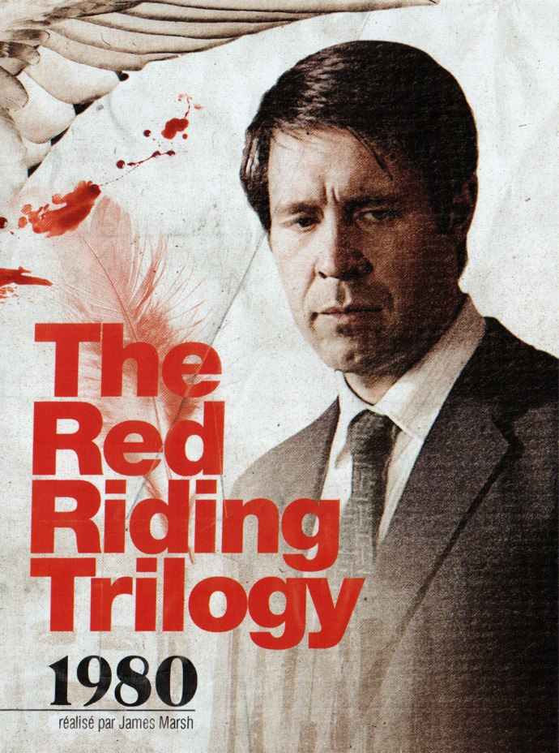
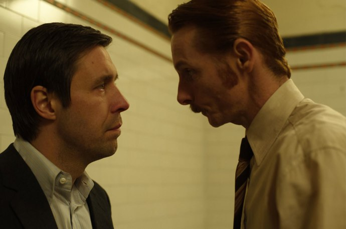
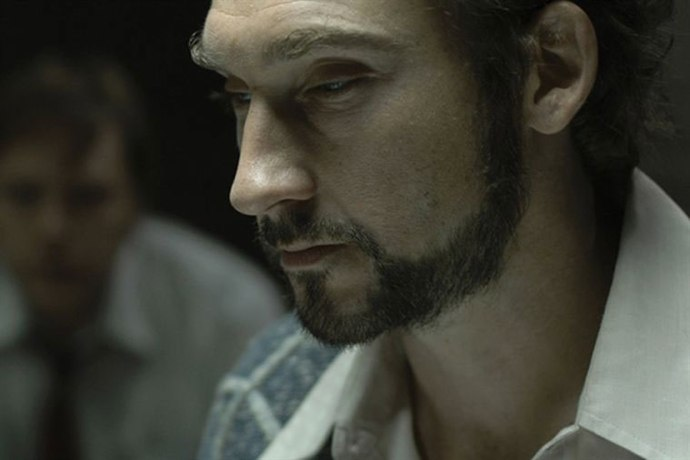

+++
type = "post"
titre = "<em>The Red Riding Trilogy : 1980</em>, James Marsh"
title = "The Red Riding Trilogy : 1980, James Marsh"
url = "/red-riding-trilogy-1980-marsh"
date = "2010-05-17T00:05:24"
Lastmod = "2015-01-20T23:29:58"
cover = "red-riding-1980-marsh.jpg"
categorie = [ "À voir" ]
tag = [ "Corruption", "Drame", "Mafia", "Serial-killer", "Thriller" ]
createur = [ "James Marsh" ]
acteur = [ "Andrew Garfield", "Eddie Marsan", "Paddy Considine", "Peter Mullan" ]
annee = [ "2009" ]
weight = 2009
pays = [ "Grande-Bretagne" ]

+++

Suite de <em>The Riding Trilogy</em>, après l&rsquo;introduction en <em><a href="http://voiretmanger.fr/2010/05/15/red-riding-trilogy-1974-jarrold/">1974</a></em>, l&rsquo;épisode <em>1980</em> éclaire de nombreuses zones d&rsquo;ombre tout en laissant encore plusieurs questions en suspens. Le film de James Marsh est moins fort que le précédent, certes, mais l&rsquo;intérêt pour l&rsquo;intrigue qui dévoile une corruption toujours plus importante et des enjeux que l&rsquo;on imagine énormes suffit à maintenir le suspense.

<strong>Note : difficile de ne rien révéler de l&rsquo;intrigue de la trilogie <em>Red Riding</em> sauf à ne rien dire. Si vous n&rsquo;avez pas pas vu <em>1974</em>, mieux vaut renoncer temporairement à la lecture de ce qui suit pour courir chez votre marchand préféré et acheter la trilogie.</strong>

Leurs titres ne laissent pas de place au doute, l&rsquo;action de <em>1980</em> se déroule six ans après les évènements de <em>1974</em>. Six ans et deux fois plus de meurtres qui agitent la région de Yorkshire. Un serial-killer frappe impunément des jeunes femmes et &laquo;&nbsp;l&rsquo;Éventreur&nbsp;&raquo; comme on l&rsquo;appelle soulève des vents de panique. Malin, le réalisateur commence par présenter des images d&rsquo;archives, ce tueur ayant vraiment <a href="http://en.wikipedia.org/wiki/Peter_Sutcliffe">existé</a>, l&rsquo;idéal pour bien camper le décor et surtout indiquer l&rsquo;ambiance de suspicion générale qui règne. La police est débordée et violemment critiquée tant par la presse que par les citoyens, tandis que l&rsquo;on affiche une lettre manuscrite supposée écrite par le tueur et que l&rsquo;on diffuse sa supposée voix pour permettre à quiconque de signaler un suspect.

C&rsquo;est dans ce climat difficile et alors qu&rsquo;une treizième jeune femme est retrouvée morte, violée et torturée, que débarque Peter Hunter, policier de Manchester débarqué au sein de la police de West Yorkshire sur ordre du ministre de l&rsquo;Intérieur en personne. Il ne découvre pas les lieux néanmoins, puisqu&rsquo;il a déjà participé à l&rsquo;enquête qui suit les incidents déroulés en 1974 et 1977. Son impopularité est légendaire et le moins que l&rsquo;on puisse dire, c&rsquo;est qu&rsquo;on lui réserve un accueil glacial. L&rsquo;animosité des policiers du Yorkshire est flagrante et devient même explicite quand on lui explique qu&rsquo;il n&rsquo;a aucune chance de trouver &laquo;&nbsp;leur Éventreur&nbsp;&raquo;. Ce policier fatigué s&rsquo;obstine pourtant envers et contre tout, et son obstination efficace cause sa perte puisqu&rsquo;il finit par être renvoyé quand il commence à remettre en cause des cadres de la police. <em>1980</em> met encore plus en lumière les dysfonctionnements de la police britannique en pleine période Thatcher et le film est d&rsquo;une noirceur absolue que les quelques rares moments de joie (on est en décembre, à l&rsquo;époque de Noël) contribuent à encore mieux mettre en valeur. Cette société gangrénée jusqu&rsquo;à l&rsquo;os est très bien filmée par la caméra de James Marsh.

<em>1980</em> opère plusieurs changements par rapport à <em>1974</em>. Six ans, les temps ont changé entre les deux et il fallait le montrer. Le film le traduit par la forme, moins austère que dans l&rsquo;opus précédent, plus conventionnelle sans doute aussi. L&rsquo;ambiance change, les vêtements, les voitures… et les personnages. Si l&rsquo;on découvre la majeure partie des personnages de <em>1980</em>, on retrouve aussi d&rsquo;autres déjà présents en <em>1974</em>. Ils ont vieilli, ont changé au point de devenir méconnaissables à l&rsquo;image du prostitué efféminé devenu homme en fuite depuis qu&rsquo;il a vu et entendu ce qu&rsquo;il n&rsquo;aurait pas dû. Suivre des personnages sur plusieurs années, voilà bien le privilège des séries, tant télévisées que cinématographiques<a href="#fn-3359-1" rel="footnote">1</a> et c&rsquo;est toujours aussi agréable, même si <em>The Red Riding Trilogy</em> n&rsquo;est pas tendre avec ses personnages et ne leur offre pas une longue et heureuse vie…

Avec <em>1980</em>, la trilogie suit un autre point de vue, un autre regard. En effet, le héros ici n&rsquo;est plus un journaliste naïf à la recherche de la vérité sur une affaire louche, mais un vieux policier fatigué qui dit chercher la vérité, mais dont on sent aussi qu&rsquo;il cherche à prendre sa revanche sur quelque chose, sans que l&rsquo;on sache très bien quoi. Ce changement de point de vue est intéressant, d&rsquo;autant que le film présente toujours la police du Yorkshire comme une menace : ce policier venu de Manchester est tout aussi mal venu qu&rsquo;un journaliste. <em>The Red Riding Trilogy</em> constitue un tout et suit la même intrigue, mais sous des angles différents à chaque fois. L&rsquo;intrigue est la même, mais le point de vue reste uniquement interne : Peter Hunter en sait plus que nous sur les conséquences des évènements de 1974, mais nous en savons quand même plus que lui, notamment sur les motifs. Ainsi, il est frappant de constater à quel point le monde politique est absent de <em>1980</em> alors qu&rsquo;il était très présent dans <em>1974</em>. Gageons que cette absence permettra à cette thématique de mieux revenir dans l&rsquo;épisode ultime qui se déroule trois ans après celui-ci<a href="#fn-3359-2" rel="footnote">2</a>. En tout cas, cette alternance des points de vue entre les deux films est bienvenue, tout comme l&rsquo;absence de films pour 1977 se révèle finalement un point fort. Je suppose que le fil narratif de <em>1980</em> a dû être modifié, mais le résultat est très intéressant puisque nous, spectateurs, ne savons pas ce qui s&rsquo;est passé et les évènements de 1977 gardent en grande partie leur mystère ce qui est, je trouve, une force de ce film.

<em>The Red Riding Trilogy</em> ne déçoit pas avec cet épisode de transition avant le final. <em>1980</em> n&rsquo;est peut-être pas techniquement aussi impressionnant que <em>1974</em>, mais son intrigue est toujours aussi captivante et nous emporte, pour notre plus grand bonheur. Cette trilogie était peut-être une série télévisée britannique à la base, mais on ne compte plus les films qui n&rsquo;atteignent pas la cheville de <em>Red Riding</em>…

<a href="http://www.toujoursraison.com/2009/11/red-riding-trilogy-1980.html">Rob Gordon</a> aime autant <em>1980</em> que <em>1974</em>, et il a bien raison (comme toujours, me direz-vous).

<h3>Vous voulez m&rsquo;aider ?</h3>
<ul>
<li><a href="http://www.amazon.fr/gp/product/B001TEKJZW/ref=as_li_ss_tl?ie=UTF8&tag=leblogdenic07-21&linkCode=as2&camp=1642&creative=19458&creativeASIN=B001TEKJZW">Acheter la trilogie en DVD sur Amazon</a></li>
</ul>

<ol>
<li id="fn-3359-1">
J&rsquo;évoquais, par exemple, ce sujet à propos du dernier <em><a href="http://voiretmanger.fr/harry-potter-et-le-prince-de-sang-mele-yates/">Harry Potter</a></em>…&#160;<a href="#fnref-3359-1" rev="footnote">&#8617;</a>
</li>
<li id="fn-3359-2">
J&rsquo;écris cette chronique sans avoir vu <a href="http://voiretmanger.fr/red-riding-trilogy-1983-tucker/" title="The Red Riding Trilogy : 1983, Anand Tucker"><em>1983</em></a>, donc je me trompe peut-être totalement…&#160;<a href="#fnref-3359-2" rev="footnote">&#8617;</a>
</li>
</ol>

